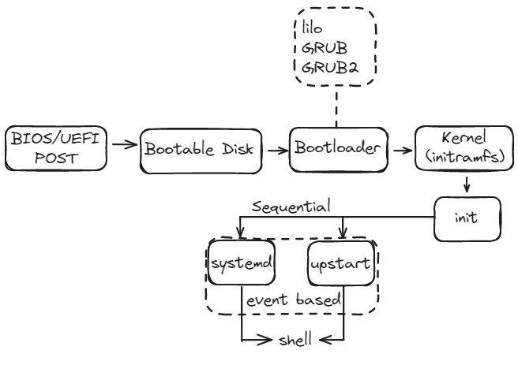
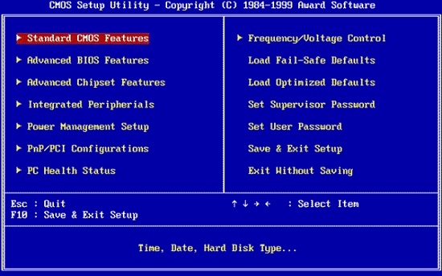
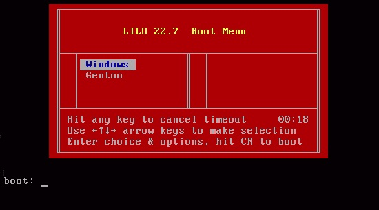
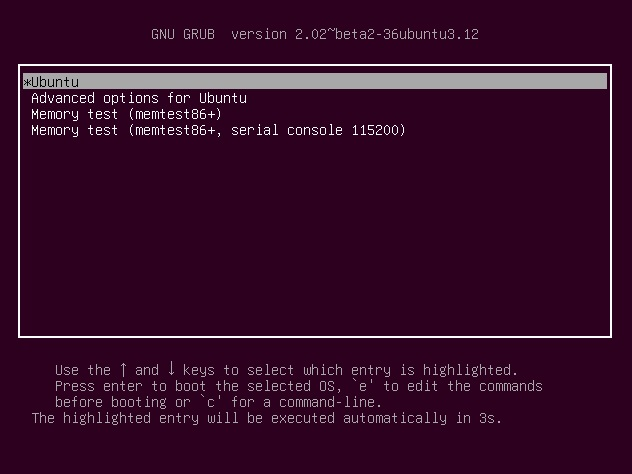
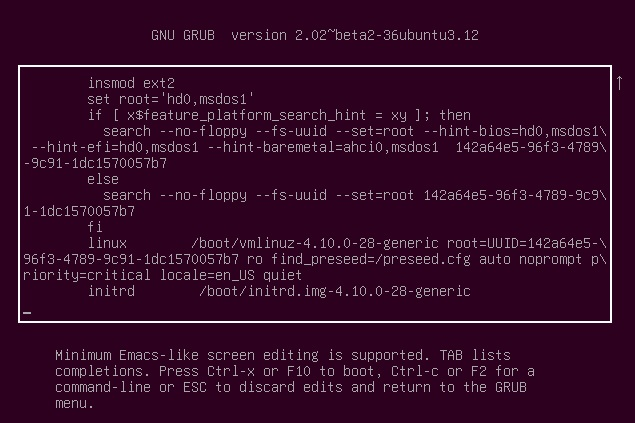
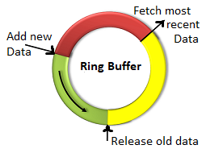

# 101.2. Boot the system

### 101.2.Boot the system

**Weight:**3

**Description:** Candidates should be able to guide the system through the booting process.

**Key Knowledge Areas:**

* Provide common commands to the boot loader and options to the kernel at boot time
* Demonstrate knowledge of the boot sequence from BIOS to boot completion
* Understanding of SysVinit and systemd
* Awareness of Upstart
* Check boot events in the log files

**Terms and Utilities:**

* dmesg
* BIOS
* bootloader
* kernel
* initramfs
* init
* SysVinit
* systemd

 Have you ever think what happens when you press power button on a pc or laptop? There is no jinni or ghost who starts dead metal heart and brings operating system up and running. Lets see how does is happen?

## Boot procedure

Lets draw a big picture to have an overview of generic boot procedure from BIOS to the shell



Now lets explain more each of these steps:

**1-**First system power on.

**2-**BIOS load (in modern systems it would be UEFI)

## BIOS

BIOS, which stands for Basic Input Output System, is software stored on a small memory chip on the motherboard. BIOS is responsible for POST. POST short for Power On Self Test, is the initial set of diagnostic tests performed by the computer right after it's powered on, with the intent to check for any hardware related issues.So BIOS makes POST the very first software to run when a computer is started.



**3-**BIOS scans and goes for the primary (or chosen) disk's "boot sector" .A boot sector is a region of a hard disk, floppy disk, optical disc, or other data storage device that contains machine code to be loaded into random-access memory (RAM) by a computer system's built-in firmware like BIOS.

What exist on boot sector? MBR

## MBR

A master boot record (often shortened as MBR) is a kind of boot sector stored on a hard disk drive or other storage device that contains the necessary computer code to start the boot process.

The master boot record is located on the first sector of a disk. The specific address on the disk is Cylinder: 0, Head: 0, Sector: 1 and it is 512 bytes.

What Master Boot Record includes and how it continues the boot sequence?


The master boot record itself holds two things : the boot loader program(or some of it) and the partition table

When the BIOS loads, it looks for data stored in the first sector of the hard drive, the MBR; using the data stored in the MBR, the BIOS activates the boot loader.


Whats magic Number? Located in the final two bytes of the **MBR** (511-512), this section must contain the hex value AA55, which officially classifies this as a valid **MBR**. An invalid **magic number** indicates a corrupt or missing **MBR**, therefore these bytes are critical to booting or using the disk.


**4-**Boot Loader is executed.

### Boot Loader

Most simply, a boot loader loads the operating system. Most boot loaders load in two stages.

**A-** In the first stage of the boot, the BIOS loads a part of the boot loader known as the **initial program loader**, or **IPL**. The **IPL** **interrogates the partition table and subsequently is able to load data wherever it may exist on the various media. **This action is used initially to locate the second stage boot loader, which holds the remainder of the loader.

**B-**The second stage boot loader is the real meat of the boot loader; many consider it the only real part of the boot loader. This contains the more **disk-intensive parts** of the loader, such as \[bootloader] user interfaces and kernel loaders. (These user interfaces can range from a simple command line to the modern GUIs.)

**5-**Lilo / Grub / Grub2 begins.

There have been different boot loaders . Lilo, Grub and Grub2:

## Lilo

LILO (Linux Loader) is a boot loader for Linux and was the default boot loader for most Linux distributions in the years after the popularity of loadlin. Today, many distributions use GRUB as the default boot loader, but LILO and its variant ELILO are still in wide use. Further development of LILO was discontinued in December 2015 along with a request by Joachim Wiedorn for potential developers.



The configuration file of lilo is located at “/etc/lilo.conf”. Lilo reads this configuration file and it tells Lilo where it should place the bootloader. The sample configuration file is specified below:

```
boot=/dev/hda              # This tells LILO where to install the bootloader.
map=/boot/map              # This file is automatically generated by LILO during bootup
install=/boot/boot.b       # This file contains the “bootstrap” code that starts your operating system and it holds both the primary and secondary parts of the bootloader.
prompt                     # This tells LILO to use the user interface. For example, to choose an operating system or enter parameters for the Linux kernel.
timeout=50                 # Tells LILO how long to wait at the prompt before booting the default operating system.
image=/boot/vmlinuz-2.0.36 # Name of a Linux kernel for LILO to boot.
label                      # specifies the default OS to boot.
root=/dev/hda2             # This option tells LILO where the OS file system actually lives.
read-only                  # This tells LILO to perform the initial boot to the file system read-only.
other=/dev/hda1            # It tells LILO to boot an operating system other than Linux.
label=win                  # same as all other label options.
```

lilo as a command has some options which might be help full:

```
 -c config-file: Specifies the alternative configuration file other than default file /etc/lilo.conf.
 -q: Lists the mapped files.
 -V: Prints the Lilo version number.
 -v: Specifies verbose output.
 -u device-name: Uninstalls LILO and restores the saved boot sector after validating timestamp. Device-name is the name of the device on which LILO is installed.
 -U device-name: This is the same as -u, but it does not check the timestamp.
 -R command-line: Sets the default command for the boot loader the next time it executes.
```

## Grub

GRUB (GRand Unified Bootloader) is a boot loader package developed to support multiple operating systems and allow the user to select among them during boot-up. It has been developed under the GNU project GNU GRUB.

## Grub2

GRUB 2 has now replaced the GRUB. And the name GRUB was renamed to GRUB Legacy and is not actively developed, however, it can be used for booting older systems since bug fixes are still on going.

On the surface the majority of users won't notice any difference but the new version has fairly major structural changes and should be more reliable. Also the new version stores its configuration files differently

GRUB 2's major improvements over the original GRUB include:

* Supports multiboot
* Supports multiple hardware architectures and operating systems such as Linux and Windows
* Offers a Bash-like interactive command line interface for users to run GRUB commands as well interact with configuration files
* Enables access to GRUB editor
* Supports setting of passwords with encryption for security
* Supports booting from a network combined with several other minor features

Regardless of the GRUB version, a boot loader allows the user to:

1. modify the way the system behaves by specifying different kernels to use,
2. choose between alternate operating systems to boot, and
3. add or edit configuration lines to change boot options, among other things.

## Kernel boot-time Options

Kernel command line parameters are parameters that we pass on the system during the boot process. They are also known as "boot options".

We** must be at console** to pass kernel boot time command because when the system is booting up there is no Networking service. So reboot the system and Press Esc key during boot:



Depending on the configuration the user may be able to choose from a menu of potential boot types or kernel versions or simple allow the default to proceed.Lets press 'e' to see some kernel parameters:



The Linux Kernel boot parameters are passed into a list of strings separated with white spaces:

```
name[=value_1] [,value_2]........[,value_10]
```

Where ‘**name=unique keyword**‘ it **defines the part of kernel** where the value is to be associated. (max 10)

`'linux'`defines the place of executable kernel (vmlinuz/vmlinux) to run ,and obviously kernel boot options come after it.

There are many parameters that help us configure and determine all aspects of our system's operation during the boot process. Some of them are:

```
root=UUID=... : This argument tells the kernel what device (hard disk, floppy disk) to be used as the root filesystem while booting.
ro : This argument tells the kernel to mount root file system as read-only.
```

One of famous Kernel boot options is pasword recovery using `single` kernel parameter option. The `single` parameter guides ‘init‘ to the start computer in single user mode and disable starting all the daemons.

`/proc/cmdline` This file shows the parameters passed to the kernel at the time it is started:

```
root@server2:~# cat /proc/cmdline 
BOOT_IMAGE=/boot/vmlinuz-4.10.0-28-generic root=UUID=e4a2c83b-fb68-46f5-a7ec-a83bbad6e3fd ro find_preseed=/preseed.cfg auto noprompt priority=critical locale=en_US quiet
```

**6-** Linux Kernel is read an executed. 


As soon as the Linux kernel has been booted and the root file system (/) mounted, programs can be run and further kernel modules can be integrated to provide additional functions. 

To mount the root file system, certain conditions must be met. The kernel needs the corresponding drivers to access the device on which the root file system is located (especially SCSI drivers). The kernel must also contain the code needed to read the file system (ext2, reiserfs, romfs, etc.). It is also conceivable that the root file system is already encrypted. In this case, a password is needed to mount the file system.

The initial ramdisk (also called initdisk or initrd) solves precisely the problems described above.


## initramfs

 The Linux kernel provides an option of having a small file system loaded to a RAM disk and running programs there before the actual root file system is mounted. 

The initrd contains a minimal set of directories and executables to achieve this, such as the `insmod` tool to install kernel modules into the kernel.

Its lifetime is short, only serving as a bridge to the real root file system. 

**7- **The 'init' program loads and become the first process ID.

### What is init?

In Linux, init is a abbreviation for Initialization. The init is a daemon process which starts as soon as the computer starts and continue running till, it is shutdown. In-fact init is the first process that starts when a computer boots, making it the parent of all other running processes directly or indirectly and hence typically it is assigned “pid=1“.\
'init' on previous linux distributions was a process with a name /sbin/int . Today 'init' is not 'init' any more, it can be any thing.

## init program solutions

In linux world we have three different types of init programs that lunch various daemons, applications and programs.

* SysV
* upstart
* Systemd

so /sbin/init can be linked to upstart or systemd.

**Sysv**

SysV is a much older system to manage service startup during the boot process in a Linux system. SysVinit has been around since basically forever.Traditionaly in SystemV, /sbin/init procedure was used to start services.

The way SysVinit does this is by setting a strict order for services to start in. Every service is assigned a priority number and init starts the services in sequence by priority.

The order in which this happens is essential, serial loading is required for dependencies, but some times parallel loading can be used to increase speed. The problem with SysVinit is that it takes careful tuning, both upstart and Systemd have been developed to make loading system configurations much more efficient.

```
### CentOS 5
```

**Upstart**

In an attempt to bring more features to the Linux initialization process, Canonical released Ubuntu 6.10 (Edgy Eft) in 2006 with Upstart. Upstart was designed with backward compatibility from the start. It could run daemons without any modification to the startup scripts. Because of this, many Linux distributions moved toward Upstart, but not all of them.

Upstart is an event-based replacement, it receives events and then runs jobs based on these events.

The problem with upstart is that it is using shell scripts and many features that existed in init already. So although it is backward compatible but it suffers from relaying on messy codes.

> if our system has /etc/init Directory, it is using upstart.

```
### Ubuntu 14
root@ubuntu:~# ls /etc/init
init/            init.d/          initramfs-tools/
```

**Systemd**


A systemd, may refer to all the packages, utilities and libraries around daemon.The goal of systemd project is to provide an operating system that runs on top of the linux kernel and taking control of almost every thing after kernel loading. Consequently it has been developed to overcome the shortcomings of init.


Systemd is designed to start processes in parallel, thus reducing the boot time and computational overhead. It has a lot other features as compared to init.

Systemd is rapidly taking over the way how linux systems are starting services and it is the current standard on all major linux distributions(even Ubuntu ). Systemd is not backward compatible how ever there are so mane scripts which convert sysv command into systemd command and lets you feel comfortable.

> if our system has a directory /usr/lib/systemd , we are on systemd

```
### Ubuntu 16 or CentOS 7
root@ubuntu16-1:~# ls /usr/lib/systemd
boot  catalog  network  user  user-generators
```

**8-** Sysv or upstart or systemd (what ever your system service manager is) starts every thing. Prerequisites, services, ... and shell. and one the shell is present the user can log in.

## dmesg

dmesg command is used to **display the kernel related messages** on Unix like systems. dmesg stands for “display message or display driver“. dmesg command retrieve its data by reading the kernel ring buffer.

The kernel ring buffer is a data structure that records messages related to the operation of the kernel. A ring buffer is a special kind of buffer that is always a constant size, removing the oldest messages when new messages come in.



dmesg can be very useful when troubleshooting or just trying to obtain information about the hardware on a system. Its basic syntax is dmesg \[options].

```
Options:
 -C, --clear                 clear the kernel ring buffer
 -c, --read-clear            read and clear all messages
 -D, --console-off           disable printing messages to console
 -E, --console-on            enable printing messages to console
 -F, --file <file>           use the file instead of the kernel log buffer
 -f, --facility <list>       restrict output to defined facilities
 -H, --human                 human readable output
 -k, --kernel                display kernel messages
 -L, --color[=<when>]        colorize messages (auto, always or never)
                               colors are enabled by default
 -l, --level <list>          restrict output to defined levels
 -n, --console-level <level> set level of messages printed to console
 -P, --nopager               do not pipe output into a pager
 -r, --raw                   print the raw message buffer
 -S, --syslog                force to use syslog(2) rather than /dev/kmsg
 -s, --buffer-size <size>    buffer size to query the kernel ring buffer
 -u, --userspace             display userspace messages
 -w, --follow                wait for new messages
 -x, --decode                decode facility and level to readable string
 -d, --show-delta            show time delta between printed messages
 -e, --reltime               show local time and time delta in readable format
 -T, --ctime                 show human readable timestamp (may be inaccurate!)
 -t, --notime                don't print messages timestamp
     --time-format <format>  show time stamp using format:
                               [delta|reltime|ctime|notime|iso]
```

Using dmesg without any of its options causes it to write all the kernel messages to standard output. 

```
root@ubuntu16-1:~# dmesg 

<Output has been truncated>

[    6.126297] audit: type=1400 audit(1541417236.033:9): apparmor="STATUS" operation="profile_load" profile="unconfined" name="/usr/bin/evince//sanitized_helper" pid=603 comm="apparmor_parser"
[    6.126298] audit: type=1400 audit(1541417236.033:10): apparmor="STATUS" operation="profile_load" profile="unconfined" name="/usr/bin/evince-previewer" pid=603 comm="apparmor_parser"
[    6.403014] shpchp: Standard Hot Plug PCI Controller Driver version: 0.4
[    6.403138] piix4_smbus 0000:00:07.3: SMBus Host Controller not enabled!
[    6.450506] vmw_vmci 0000:00:07.7: Found VMCI PCI device at 0x11080, irq 16
[    6.450585] vmw_vmci 0000:00:07.7: Using capabilities 0xc
[    6.481197] Guest personality initialized and is active
[    6.481237] VMCI host device registered (name=vmci, major=10, minor=55)
[    6.481238] Initialized host personality
[    6.861468] random: crng init done
[    6.870993] AVX2 version of gcm_enc/dec engaged.
[    6.870994] AES CTR mode by8 optimization enabled
[    7.412248] Adding 1045500k swap on /dev/sda5.  Priority:-1 extents:1 across:1045500k FS
[    9.011802] IPv6: ADDRCONF(NETDEV_UP): ens33: link is not ready
[    9.019995] e1000: ens33 NIC Link is Up 1000 Mbps Full Duplex, Flow Control: None
[    9.315344] floppy0: no floppy controllers found
[    9.315374] work still pending
[   10.229508] ip_tables: (C) 2000-2006 Netfilter Core Team
[   13.740999] NET: Registered protocol family 40
```

we can clear dmesg logs if required with `dmesg -c` command.

**/var/log/dmesg**

The `dmesg` command shows the current content of the kernel syslog ring buffer messages while the `/var/log/dmesg` file contains what was in that ring buffer when the boot process last completed. try `cat /var/log/dmesg`. 


.

.

.

Sources:

[https://www.lifewire.com](https://www.lifewire.com)

[https://www.tecmint.com/linux-boot-process/](https://www.tecmint.com/linux-boot-process/) & [https://www.tecmint.com/best-linux-boot-loaders/](https://www.tecmint.com/best-linux-boot-loaders/)

[https://whatis.techtarget.com/definition/boot-sector](https://whatis.techtarget.com/definition/boot-sector) & [https://whatis.techtarget.com/definition/Master-Boot-Record-MBR](https://whatis.techtarget.com/definition/Master-Boot-Record-MBR)

[https://www.ibm.com/developerworks/library/l-bootload/index.html](https://www.ibm.com/developerworks/library/l-bootload/index.html)

[https://www.interserver.net/tips/kb/what-is-lilo/](https://www.interserver.net/tips/kb/what-is-lilo/)

[https://www.linuxjournal.com/article/1166](https://www.linuxjournal.com/article/1166)

[https://www.oreilly.com/library/view/linux-in-a/0596000251/ch04s02.html](https://www.oreilly.com/library/view/linux-in-a/0596000251/ch04s02.html)

[https://www.cyberciti.biz/tips/10-boot-time-parameters-you-should-know-about-the-linux-kernel.html](https://www.cyberciti.biz/tips/10-boot-time-parameters-you-should-know-about-the-linux-kernel.html)

[https://unix.stackexchange.com/questions/89923/how-does-linux-load-the-initrd-image](https://unix.stackexchange.com/questions/89923/how-does-linux-load-the-initrd-image)

[https://developer.ibm.com/articles/l-initrd/](https://developer.ibm.com/articles/l-initrd/)[https://www.ibm.com/developerworks/community/blogs/mhhaque/entry/anatomy_of_the_initrd_and_vmlinuz?lang=en](https://www.ibm.com/developerworks/community/blogs/mhhaque/entry/anatomy_of_the_initrd_and_vmlinuz?lang=en)

[http://www.linuxfromscratch.org/blfs/view/svn/postlfs/initramfs.html](http://www.linuxfromscratch.org/blfs/view/svn/postlfs/initramfs.html)

[https://help.ubuntu.com/community/Grub2](https://help.ubuntu.com/community/Grub2)

[https://www.tecmint.com/systemd-replaces-init-in-linux/](https://www.tecmint.com/systemd-replaces-init-in-linux/)

[https://fossbytes.com/systemd-vs-sys-v-vs-upstart/](https://fossbytes.com/systemd-vs-sys-v-vs-upstart/)

[https://unix.stackexchange.com/questions/196166/how-to-find-out-if-a-system-uses-sysv-upstart-or-systemd-initsystem](https://unix.stackexchange.com/questions/196166/how-to-find-out-if-a-system-uses-sysv-upstart-or-systemd-initsystem)

[https://www.tecmint.com/dmesg-commands/](https://www.tecmint.com/dmesg-commands/) 

 [https://www.linuxtechi.com/10-tips-dmesg-command-linux-geeks/](https://www.linuxtechi.com/10-tips-dmesg-command-linux-geeks/)

[https://www.quora.com/What-is-a-ring-buffer-in-Linux](https://www.quora.com/What-is-a-ring-buffer-in-Linux)

[https://unix.stackexchange.com/questions/191560/difference-between-output-of-dmesg-and-content-of-var-log-dmesg](https://unix.stackexchange.com/questions/191560/difference-between-output-of-dmesg-and-content-of-var-log-dmesg)
