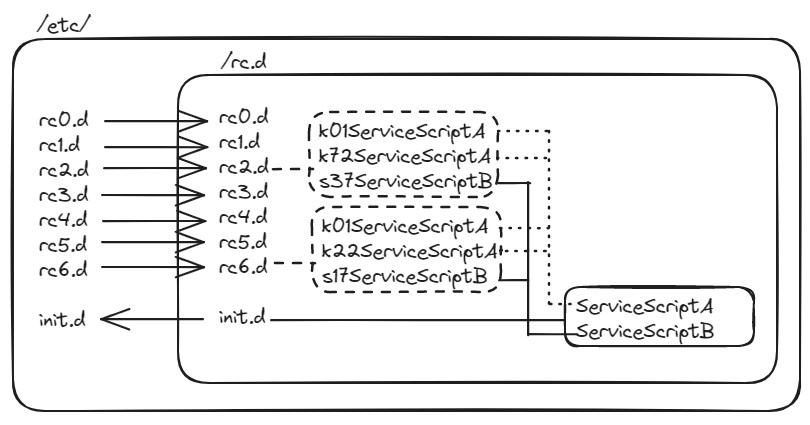

# 101.3. Change runlevels / boot targets and shutdown or reboot system

## **101.3 Change runlevels / boot targets and shutdown or reboot system**

**Weight:**3

**Description:** Candidates should be able to manage the SysVinit runlevel or systemd boot target of the system. This objective includes changing to single user mode, shutdown or rebooting the system. Candidates should be able to alert users before switching runlevels / boot targets and properly terminate processes. This objective also includes setting the default SysVinit runlevel or systemd boot target. It also includes awareness of Upstart as an alternative to SysVinit or systemd.

**Key Knowledge Areas:**

* Set the default runlevel or boot target
* Change between runlevels / boot targets including single user mode
* Shutdown and reboot from the command line
* Alert users before switching runlevels / boot targets or other major system events
* Properly terminate processes

**Terms and Utilities:**

* /etc/inittab
* shutdown
* init
* /etc/init.d/
* telinit
* systemd
* systemctl
* /etc/systemd/
* /usr/lib/systemd/
* wall

In previous lesson we explain the sequence of system boot in liunx, then we get introduced to Sysv, Upstart and system as different service managers in linux world. In this lesson we learn how to take control over our linux system services using these service managers.

Lets start with SysV. SysV is is nothing more than many executable scripts which are run after init process. How we can define which service should be run when computer starts ? I'm glad you asked. It seems that huge text configuration files would be needed, there is where **runlevels** come to play.

### runlevels

A runlevel is one of the modes that a Unix -based operating system will run in. Each runlevel has a certain number of services stopped or started, giving the user control over the behavior of the machine. runlevels avoid of having a few large files to edit by hand.

Conventionally, **seven** runlevels exist, numbered from zero to six. And there are some differences between Debian and RedHat based systems:

| Runlevel | Debian               | RedHat                       |
| -------- | -------------------- | ---------------------------- |
| **0**    | **Halt**             | **Halt**                     |
| **1**    | **Single User Mode** | **Single User Mode**         |
| **2**    | Full,Multi-User,GUI  | Multi-User, No Net           |
| **3**    | Nothing              | Multi-User, with Net, No GUI |
| **4**    | **Nothing**          | **Not used**                 |
| **5**    | Nothing              | Full,Multi-User,GUI          |
| **6**    | **Reboot**           | **Reboot**                   |

CentsOS 5 was the last version which used SysV and from CentOS 7 Systemd is used.

### runlevel

To find the current and previous runlevels , the runlevel command is used:

```
[root@centos5-1 ~]# runlevel
N 5
```

In the above output, the letter ‘N’ indicates that the runlevel has not been changed since the system was booted. And, 5 is the current runlevel.

Now that we now about runlevels, How we can switch between them? well just tell 'init' what runlevel you like.

## telinit

telinit is used to change the SysV system runlevel.

```
telinit  RUNLEVEL
```

Lets try it on a CentOS5 machine:

```
[root@centos5-1 ~]# runlevel
N 5
[root@centos5-1 ~]# telinit 3
```

and system goes to runlevel 3 lets go back to runlevel 5:

```
[root@centos5-1 ~]# telinit 5
```

## init

init (as a command) is a process control initialization like telinit.

```
[root@centos5-1 ~]# init 3
```


#### telinit vs init

telinit is a smaller tool that informs init when it needs to switch runlevels. So we can use "telinit" to "tell init" that it needs to switch runlevel. telinit is actually linked to init command and it is possible to use init command instead but it is not recommanded.

```
[root@centos5-1 ~]# ls -l /sbin/telinit 
lrwxrwxrwx 1 root root 4 Aug 26 23:20 /sbin/telinit -> init
```


There are several ways to change runlevels. To make a permanent change, we can edit **/etc/inittab** and change the default level that we just saw above.

### /etc/inttab

After the Linux kernel has booted, the init program reads the /etc/inittab file to determine the **behavior for each runlevel**. Unless the user specifies another value as a kernel boot parameter, the system will attempt to enter (start) the default runlevel.(CentOs5)

```
[root@centos5-1 ~]# cat /etc/inittab 
#
# inittab       This file describes how the INIT process should set up
#               the system in a certain run-level.
#
# Author:       Miquel van Smoorenburg, <miquels@drinkel.nl.mugnet.org>
#               Modified for RHS Linux by Marc Ewing and Donnie Barnes
#

# Default runlevel. The runlevels used by RHS are:
#   0 - halt (Do NOT set initdefault to this)
#   1 - Single user mode
#   2 - Multiuser, without NFS (The same as 3, if you do not have networking)
#   3 - Full multiuser mode
#   4 - unused
#   5 - X11
#   6 - reboot (Do NOT set initdefault to this)
# 
id:5:initdefault:

# System initialization.
si::sysinit:/etc/rc.d/rc.sysinit

l0:0:wait:/etc/rc.d/rc 0
l1:1:wait:/etc/rc.d/rc 1
l2:2:wait:/etc/rc.d/rc 2
l3:3:wait:/etc/rc.d/rc 3
l4:4:wait:/etc/rc.d/rc 4
l5:5:wait:/etc/rc.d/rc 5
l6:6:wait:/etc/rc.d/rc 6

# Trap CTRL-ALT-DELETE
ca::ctrlaltdel:/sbin/shutdown -t3 -r now

# When our UPS tells us power has failed, assume we have a few minutes
# of power left.  Schedule a shutdown for 2 minutes from now.
# This does, of course, assume you have powerd installed and your
# UPS connected and working correctly.  
pf::powerfail:/sbin/shutdown -f -h +2 "Power Failure; System Shutting Down"

# If power was restored before the shutdown kicked in, cancel it.
pr:12345:powerokwait:/sbin/shutdown -c "Power Restored; Shutdown Cancelled"


# Run gettys in standard runlevels
1:2345:respawn:/sbin/mingetty tty1
2:2345:respawn:/sbin/mingetty tty2
3:2345:respawn:/sbin/mingetty tty3
4:2345:respawn:/sbin/mingetty tty4
5:2345:respawn:/sbin/mingetty tty5
6:2345:respawn:/sbin/mingetty tty6

# Run xdm in runlevel 5
x:5:respawn:/etc/X11/prefdm -nodaemon
```

the **default runlevel** is determined from the`id:`entry in **/etc/inittab**. How run levels are set up by default and how they are configured depends in part on the particular distribution you are running.

The format of each line in inittab file is as follows:

`id:runlevel:action:process`

Here is a description of these fields:

* **id (identification code)** – consists of a sequence of one to four characters that identifies its function.
* **runlevels** – lists the run levels to which this entry applies.
* **action** – specific codes in this field tell init how to treat the process. Possible values include: initdefault, sysinit, boot, bootwait, wait, and respawn.
* **process** – defines the command or script to execute.

Now lets see how SysV implements the concept of run levels.

### /etc/init.d

/etc/init.d contains scripts used by the System V init tools (SysVinit).

```
[root@centos5-1 ~]# ls  /etc/init.d/
acpid               hidd           netconsole       rpcidmapd
anacron             httpd          netfs            rpcsvcgssd
atd                 ip6tables      netplugd         saslauthd
auditd              ipmi           network          sendmail
autofs              iptables       NetworkManager   single
avahi-daemon        irda           nfs              smartd
avahi-dnsconfd      irqbalance     nfslock          sshd
bluetooth           iscsi          nscd             svnserve
conman              iscsid         ntpd             syslog
cpuspeed            killall        oddjobd          vmware-tools
crond               krb524         pand             vmware-tools-thinprint
cups                kudzu          pcscd            vncserver
cups-config-daemon  ldap           portmap          wdaemon
dnsmasq             lvm2-monitor   psacct           wpa_supplicant
dund                mcstrans       rawdevices       xfs
firstboot           mdmonitor      rdisc            ypbind
functions           mdmpd          readahead_early  yum-updatesd
gpm                 messagebus     readahead_later
haldaemon           microcode_ctl  restorecond
halt                multipathd     rpcgssd
```

As we said, in SysV, init program is the first process that is run and consequently some infrastructure services are started. Files in /etc/init.d are shell scripts that respond to start, stop, restart, and (when supported) reload commands to manage a particular service. But how SysV determine which services inside /etc/init.d should be started or stopped depend on default runlevel ?Lets draw a picture:



### /etc/rc.d/

SysV uses grouping. **Scripts of each runlevel are grouped and placed in /etc/rc{runlevel}.d/** where runlevel is the runlevel. 

As many services might be existed in different runlevels, the real script files are hold in /etc/init.d and /etc/rc{runlevel}.d/just point to required ones.

```
[root@centos5-1 etc]# ls | grep rc.
rc0.d
rc1.d
rc2.d
rc3.d
rc4.d
rc5.d
rc6.d
rc.d
rc.local
rc.sysinit
```

Lets take a look at rc.5 for example:

```
[root@centos5-1 etc]# ls -l rc5.d/
total 288
lrwxrwxrwx 1 root root 17 Aug 26 23:21 K01dnsmasq -> ../init.d/dnsmasq
lrwxrwxrwx 1 root root 24 Aug 26 23:21 K02avahi-dnsconfd -> ../init.d/avahi-dnsconfd
lrwxrwxrwx 1 root root 24 Aug 26 23:23 K02NetworkManager -> ../init.d/NetworkManager
lrwxrwxrwx 1 root root 17 Aug 26 23:23 K02oddjobd -> ../init.d/oddjobd
lrwxrwxrwx 1 root root 16 Aug 26 23:20 K05conman -> ../init.d/conman
lrwxrwxrwx 1 root root 19 Aug 26 23:21 K05saslauthd -> ../init.d/saslauthd
lrwxrwxrwx 1 root root 17 Aug 26 23:20 K05wdaemon -> ../init.d/wdaemon
lrwxrwxrwx 1 root root 16 Aug 26 23:20 K10psacct -> ../init.d/psacct
lrwxrwxrwx 1 root root 15 Aug 26 23:21 K15httpd -> ../init.d/httpd
lrwxrwxrwx 1 root root 18 Aug 26 23:22 K15svnserve -> ../init.d/svnserve
lrwxrwxrwx 1 root root 13 Aug 26 23:23 K20nfs -> ../init.d/nfs
lrwxrwxrwx 1 root root 14 Aug 26 23:23 K24irda -> ../init.d/irda
<output has been truncated>
lrwxrwxrwx 1 root root 23 Aug 26 23:20 S00microcode_ctl -> ../init.d/microcode_ctl
lrwxrwxrwx 1 root root 22 Aug 26 23:28 S03vmware-tools -> ../init.d/vmware-tools
lrwxrwxrwx 1 root root 25 Aug 26 23:20 S04readahead_early -> ../init.d/readahead_early
lrwxrwxrwx 1 root root 15 Aug 26 23:23 S05kudzu -> ../init.d/kudzu
lrwxrwxrwx 1 root root 16 Aug 26 23:20 S07iscsid -> ../init.d/iscsid
lrwxrwxrwx 1 root root 19 Aug 26 23:19 S08ip6tables -> ../init.d/ip6tables
lrwxrwxrwx 1 root root 18 Aug 26 23:19 S08iptables -> ../init.d/iptables
lrwxrwxrwx 1 root root 18 Aug 26 23:21 S08mcstrans -> ../init.d/mcstrans
lrwxrwxrwx 1 root root 17 Aug 26 23:21 S10network -> ../init.d/network
lrwxrwxrwx 1 root root 16 Aug 26 23:20 S11auditd -> ../init.d/auditd
lrwxrwxrwx 1 root root 21 Aug 26 23:21 S12restorecond -> ../init.d/restorecond
lrwxrwxrwx 1 root root 16 Aug 26 23:21 S12syslog -> ../init.d/syslog
lrwxrwxrwx 1 root root 18 Aug 26 23:19 S13cpuspeed -> ../init.d/cpuspeed
lrwxrwxrwx 1 root root 20 Aug 26 23:21 S13irqbalance -> ../init.d/irqbalance
lrwxrwxrwx 1 root root 15 Aug 26 23:20 S13iscsi -> ../init.d/iscsi
lrwxrwxrwx 1 root root 17 Aug 26 23:21 S13portmap -> ../init.d/portmap
lrwxrwxrwx 1 root root 17 Aug 26 23:23 S14nfslock -> ../init.d/nfslock
lrwxrwxrwx 1 root root 19 Aug 26 23:21 S15mdmonitor -> ../init.d/mdmonitor
<output has been truncated>
```

Each script in each runlevel is run with its startup or shutdown functions depending on if that runlevel is going up or going down.** S** means **starting** script and **K** shows that it is a **killing** script .The sequence of actions is defined by the numbers. try cat command to see what is inside :

```
[root@centos5-1 rc5.d]# cat S55sshd
#!/bin/bash
#
# Init file for OpenSSH server daemon
#
# chkconfig: 2345 55 25
# description: OpenSSH server daemon
#
# processname: sshd
# config: /etc/ssh/ssh_host_key
# config: /etc/ssh/ssh_host_key.pub
# config: /etc/ssh/ssh_random_seed
# config: /etc/ssh/sshd_config
# pidfile: /var/run/sshd.pid

# source function library
. /etc/rc.d/init.d/functions

# pull in sysconfig settings
[ -f /etc/sysconfig/sshd ] && . /etc/sysconfig/sshd

RETVAL=0
prog="sshd"

# Some functions to make the below more readable
KEYGEN=/usr/bin/ssh-keygen
SSHD=/usr/sbin/sshd
RSA1_KEY=/etc/ssh/ssh_host_key
RSA_KEY=/etc/ssh/ssh_host_rsa_key
DSA_KEY=/etc/ssh/ssh_host_dsa_key
PID_FILE=/var/run/sshd.pid

runlevel=$(set -- $(runlevel); eval "echo \$$#" )

do_rsa1_keygen() {
        if [ ! -s $RSA1_KEY ]; then
                echo -n $"Generating SSH1 RSA host key: "
                rm -f $RSA1_KEY
                if $KEYGEN -q -t rsa1 -f $RSA1_KEY -C '' -N '' >&/dev/null; then
                        chmod 600 $RSA1_KEY
                        chmod 644 $RSA1_KEY.pub
                        if [ -x /sbin/restorecon ]; then
                            /sbin/restorecon $RSA1_KEY.pub
                        fi
                        success $"RSA1 key generation"
                        echo
                else
                        failure $"RSA1 key generation"
                        echo
                        exit 1
                fi
        fi
}

do_rsa_keygen() {
        if [ ! -s $RSA_KEY ]; then
                echo -n $"Generating SSH2 RSA host key: "
                rm -f $RSA_KEY
                if $KEYGEN -q -t rsa -f $RSA_KEY -C '' -N '' >&/dev/null; then
                        chmod 600 $RSA_KEY
                        chmod 644 $RSA_KEY.pub
                        if [ -x /sbin/restorecon ]; then
                            /sbin/restorecon $RSA_KEY.pub
                        fi
                        success $"RSA key generation"
                        echo
                else
                        failure $"RSA key generation"
                        echo
                        exit 1
                fi
        fi
}

do_dsa_keygen() {
        if [ ! -s $DSA_KEY ]; then
                echo -n $"Generating SSH2 DSA host key: "
                rm -f $DSA_KEY
                if $KEYGEN -q -t dsa -f $DSA_KEY -C '' -N '' >&/dev/null; then
                        chmod 600 $DSA_KEY
                        chmod 644 $DSA_KEY.pub
                        if [ -x /sbin/restorecon ]; then
                            /sbin/restorecon $DSA_KEY.pub
                        fi
                        success $"DSA key generation"
                        echo
                else
                        failure $"DSA key generation"
                        echo
                        exit 1
                fi
        fi
}

do_restart_sanity_check()
{
        $SSHD -t
        RETVAL=$?
        if [ ! "$RETVAL" = 0 ]; then
                failure $"Configuration file or keys are invalid"
                echo
        fi
}

start()
{
        # Create keys if necessary
        do_rsa1_keygen
        do_rsa_keygen
        do_dsa_keygen

        cp -af /etc/localtime /var/empty/sshd/etc

        echo -n $"Starting $prog: "
        $SSHD $OPTIONS && success || failure
        RETVAL=$?
        [ "$RETVAL" = 0 ] && touch /var/lock/subsys/sshd
        echo
}

stop()
{
        echo -n $"Stopping $prog: "
        if [ -n "`pidfileofproc $SSHD`" ] ; then
            killproc $SSHD
        else
            failure $"Stopping $prog"
        fi
        RETVAL=$?
        # if we are in halt or reboot runlevel kill all running sessions
        # so the TCP connections are closed cleanly
        if [ "x$runlevel" = x0 -o "x$runlevel" = x6 ] ; then
            killall $prog 2>/dev/null
        fi
        [ "$RETVAL" = 0 ] && rm -f /var/lock/subsys/sshd
        echo
}

reload()
{
        echo -n $"Reloading $prog: "
        if [ -n "`pidfileofproc $SSHD`" ] ; then
            killproc $SSHD -HUP
        else
            failure $"Reloading $prog"
        fi
        RETVAL=$?
        echo
}

case "$1" in
        start)
                start
                ;;
        stop)
                stop
                ;;
        restart)
                stop
                start
                ;;
        reload)
                reload
                ;;
        condrestart)
                if [ -f /var/lock/subsys/sshd ] ; then
                        do_restart_sanity_check
                        if [ "$RETVAL" = 0 ] ; then
                                stop
                                # avoid race
                                sleep 3
                                start
                        fi
                fi
                ;;
        status)
                status -p $PID_FILE openssh-daemon
                RETVAL=$?
                ;;
        *)
                echo $"Usage: $0 {start|stop|restart|reload|condrestart|status}"
                RETVAL=1
esac
exit $RETVAL
```

And all of these places were places that SysV uses to manage scripts and runlevels. In Sysv system we can manage services with `service`command and`chkconfig`command to define how and when services are started. We will talk about them later.


**rc.local**

But what about /etc/rc.local ? This file runs after all other init level scripts have run, so it's safe to put various commands that you want to have issued upon startup.This is also a good place to place "troubleshooting" scripts in. **But do not forget rc.local may not work properly in Upstart and Systemd.** Test it, search it and do required configuration before using in production environment.


Lets go back to our topic and get familiar with runlevels equivalent in systemd. Although /etc/inittab still exist in Systemd systems but that is not part of configuration, we have something called "Targets".

### systemd targets

Like runlevels there are some modes in systemd system that our system can run in, systemd runlevels are referred to as "**targets**". "**targets**" **are described as a collection of services**. Look at the equivalents:** **

```
   ┌─────────┬───────────────────┐
   │Runlevel │ Target            │
   ├─────────┼───────────────────┤
   │0        │ poweroff.target   │
   ├─────────┼───────────────────┤
   │1        │ rescue.target     │
   ├─────────┼───────────────────┤
   │2, 3, 4  │ multi-user.target │
   ├─────────┼───────────────────┤
   │5        │ graphical.target  │
   ├─────────┼───────────────────┤
   │6        │ reboot.target     │
   └─────────┴───────────────────┘
```

In order to switch between Boot Targets we use systemctl tool.

### systemctl

Systemctl is a systemd utility which is responsible for Controlling the systemd system and service manager. It can does lots of thing but what we need here and use it for is changing boot targets.

To see the current boot target use `systemctl get-default` command:

```
[root@centos7-1 ~]# systemctl get-default 
graphical.target
```

To change the target use `systemctl isolate xxxxx.target` , for example:

```
[root@centos7-1 ~]# systemctl isolate rescue.target
```

```
[root@centos7-1 ~]# systemctl isolate multi-user.target
```

To set the default target, run `systemctl set-default xxxxxx.target` command :

```
[root@centos7-1 ~]# systemctl set-default graphical.target 
Removed symlink /etc/systemd/system/default.target.
Created symlink from /etc/systemd/system/default.target to /usr/lib/systemd/system/graphical.target.
```

But how systemd knows what to do and how to do things ? We have something called "**Unit**". **The concept of "Unit Files" replaces the SysV init scripts for services.**

### systemd unit files

There are different types of unit files and the best way to describe unit files, is **'that is a thing which should be started'**.Yes that is a thing because there are different kinds of unit files. **Each unit file is a simple text file describing a unit, what it does, what needs to run before or afterward, and other details**

Unit files can be stored in a few different places on your system. systemd looks for system unit files in this order:

1. **/etc/systemd/system:**directory stores unit files that extend a service. This directory will take precedence over unit files located anywhere else in the system.
2. **/run/systemd/system:**directory is the runtime location for unit files.
3. **/usr/lib/systemd/system:**directory is the default location where unit files are installed by packages. Unit files in the default directory should not be altered.

**Unit files in the earlier directories override later ones.** Lets take a look at them:

### 1./etc/systemd/system

```
[root@centos7-1 ~]# ls -l /etc/systemd/system
total 4
drwxr-xr-x. 2 root root   31 Oct 28  2017 basic.target.wants
drwxr-xr-x. 2 root root   31 Oct 28  2017 bluetooth.target.wants
lrwxrwxrwx. 1 root root   41 Oct 28  2017 dbus-org.bluez.service -> /usr/lib/systemd/system/bluetooth.service
lrwxrwxrwx. 1 root root   41 Oct 28  2017 dbus-org.fedoraproject.FirewallD1.service -> /usr/lib/systemd/system/firewalld.service
lrwxrwxrwx. 1 root root   44 Oct 28  2017 dbus-org.freedesktop.Avahi.service -> /usr/lib/systemd/system/avahi-daemon.service
lrwxrwxrwx. 1 root root   44 Oct 28  2017 dbus-org.freedesktop.ModemManager1.service -> /usr/lib/systemd/system/ModemManager.service
lrwxrwxrwx. 1 root root   46 Oct 28  2017 dbus-org.freedesktop.NetworkManager.service -> /usr/lib/systemd/system/NetworkManager.service
lrwxrwxrwx. 1 root root   57 Oct 28  2017 dbus-org.freedesktop.nm-dispatcher.service -> /usr/lib/systemd/system/NetworkManager-dispatcher.service
lrwxrwxrwx. 1 root root   36 Oct 28  2017 default.target -> /lib/systemd/system/graphical.target
drwxr-xr-x. 2 root root   87 Oct 28  2017 default.target.wants
drwxr-xr-x. 2 root root   38 Oct 28  2017 dev-virtio\x2dports-org.qemu.guest_agent.0.device.wants
lrwxrwxrwx. 1 root root   35 Oct 28  2017 display-manager.service -> /usr/lib/systemd/system/gdm.service
drwxr-xr-x. 2 root root   32 Oct 28  2017 getty.target.wants
drwxr-xr-x. 2 root root   65 Oct 28  2017 graphical.target.wants
drwxr-xr-x. 2 root root 4096 Oct 28  2017 multi-user.target.wants
drwxr-xr-x. 2 root root   26 Oct 28  2017 printer.target.wants
drwxr-xr-x. 2 root root   31 Oct 28  2017 remote-fs.target.wants
drwxr-xr-x. 2 root root  188 Oct 28  2017 sockets.target.wants
drwxr-xr-x. 2 root root   36 Oct 28  2017 spice-vdagentd.target.wants
drwxr-xr-x. 2 root root   26 Oct 28  2017 sssd.service.d
drwxr-xr-x. 2 root root  169 Oct 28  2017 sysinit.target.wants
drwxr-xr-x. 2 root root   44 Oct 28  2017 system-update.target.wants
drwxr-xr-x. 2 root root   29 Oct 28  2017 vmtoolsd.service.requires
```

### 2./run/systemd/system 

```
[root@centos7-1 ~]# ls -l /run/systemd/system/
total 8
-rw-r--r-- 1 root root  17 Jan  2  2019 session-1.scope
drwxr-xr-x 2 root root 160 Jan  2  2019 session-1.scope.d
-rw-r--r-- 1 root root  17 Jan  2  2019 user-1000.slice
drwxr-xr-x 2 root root 120 Jan  2  2019 user-1000.slice.d
```

### 3./usr/lib/systemd/system

```
[root@centos7-1 ~]# ls  /usr/lib/systemd/system

<output has been trancuated>


cryptsetup-pre.target                    runlevel0.target
cryptsetup.target                        runlevel1.target
ctrl-alt-del.target                      runlevel1.target.wants
cups-browsed.service                     runlevel2.target
cups.path                                runlevel2.target.wants
cups.service                             runlevel3.target
cups.socket                              runlevel3.target.wants
dbus-org.freedesktop.hostname1.service   runlevel4.target
dbus-org.freedesktop.import1.service     runlevel4.target.wants
dbus-org.freedesktop.locale1.service     runlevel5.target
dbus-org.freedesktop.login1.service      runlevel5.target.wants
dbus-org.freedesktop.machine1.service    runlevel6.target

<output has been trancuated>

nfs-rquotad.service                      umount.target
nfs-secure.service                       upower.service
nfs-server.service                       usb_modeswitch@.service
nfs.service                              usbmuxd.service
nfs-utils.service                        user.slice
nss-lookup.target                        var-lib-nfs-rpc_pipefs.mount
nss-user-lookup.target                   vgauthd.service
ntpdate.service                          virt-guest-shutdown.target
ntpd.service                             virtlockd.service
numad.service                            virtlockd.socket
oddjobd.service                          virtlogd.service
packagekit-offline-update.service        virtlogd.socket
packagekit.service                       vmtoolsd.service
paths.target                             wacom-inputattach@.service
plymouth-halt.service                    wpa_supplicant.service
plymouth-kexec.service                   zram.service
plymouth-poweroff.service
```

lets follow one of target unit files.Try `ls -al *.target` to see all of target files. As an instance _default.target_:

```
[root@centos7-1 ~]# ls -al /usr/lib/systemd/system/default.target
lrwxrwxrwx. 1 root root 16 Oct 28  2017 /usr/lib/systemd/system/default.target -> graphical.target
```

Lets take a look at that _graphical.target_:

```
[root@centos7-1 ~]# cat  /usr/lib/systemd/system/graphical.target
#  This file is part of systemd.
#
#  systemd is free software; you can redistribute it and/or modify it
#  under the terms of the GNU Lesser General Public License as published by
#  the Free Software Foundation; either version 2.1 of the License, or
#  (at your option) any later version.

[Unit]
Description=Graphical Interface
Documentation=man:systemd.special(7)
Requires=multi-user.target
Wants=display-manager.service
Conflicts=rescue.service rescue.target
After=multi-user.target rescue.service rescue.target display-manager.service
AllowIsolate=yes
```

And what it requires is _multi-user.target_, lets see:

```
[root@centos7-1 ~]# cat  /usr/lib/systemd/system/multi-user.target
#  This file is part of systemd.
#
#  systemd is free software; you can redistribute it and/or modify it
#  under the terms of the GNU Lesser General Public License as published by
#  the Free Software Foundation; either version 2.1 of the License, or
#  (at your option) any later version.

[Unit]
Description=Multi-User System
Documentation=man:systemd.special(7)
Requires=basic.target
Conflicts=rescue.service rescue.target
After=basic.target rescue.service rescue.target
AllowIsolate=yes
```

and it requires _basic.target _:

```
[root@centos7-1 ~]# cat  /usr/lib/systemd/system/basic.target
#  This file is part of systemd.
#
#  systemd is free software; you can redistribute it and/or modify it
#  under the terms of the GNU Lesser General Public License as published by
#  the Free Software Foundation; either version 2.1 of the License, or
#  (at your option) any later version.

[Unit]
Description=Basic System
Documentation=man:systemd.special(7)

Requires=sysinit.target
After=sysinit.target
Wants=sockets.target timers.target paths.target slices.target
After=sockets.target paths.target slices.target
```

Finally _sysinit.target_ :

```
[root@centos7-1 ~]# cat  /usr/lib/systemd/system/sysinit.target
#  This file is part of systemd.
#
#  systemd is free software; you can redistribute it and/or modify it
#  under the terms of the GNU Lesser General Public License as published by
#  the Free Software Foundation; either version 2.1 of the License, or
#  (at your option) any later version.

[Unit]
Description=System Initialization
Documentation=man:systemd.special(7)
Conflicts=emergency.service emergency.target
Wants=local-fs.target swap.target
After=local-fs.target swap.target emergency.service emergency.target
```

And _sysint.target_ does not require any thing. It seems that we have reached top level target in our tree and we can go back.

Using unit files beside Targets concept make Systemd more flexible in comparison to SysV.

## wall

There are times when multiple users are logged in to a server computer, and we need to, say, restart the server to perform some maintenance task. Of course, the **correct way is to inform all **those who are logged in about the maintenance activity.

wall (an abbreviation of write to all) is a Unix command-line utility that displays the contents of a file or standard input to all logged-in users. It is typically used by root to send out shutting down message to all users just before poweroff.(Ubuntu16)

```
wall [-n] [-t timeout] [-g group] [message | file]
```

```
OPTIONS         
       -n, --nobanner
              Suppress the banner.

       -t, --timeout timeout
              Abandon the write attempt to the terminals after timeout
              seconds.  This timeout must be a positive integer.  The
              default value is 300 seconds, which is a legacy from the time
              when people ran terminals over modem lines.

       -g, --group group
              Limit printing message to members of group defined as a group
              argument.  The argument can be group name or GID.

       -V, --version
              Display version information and exit.

       -h, --help
              Display help text and exit.
```

Lets try sending out "we are going down" message:

```
[root@centos5-1 ~]# wall "we are going down"

Broadcast message from root@centos6-1 (pts/1) (Sun Nov 11 00:46:58 2018):

we are going down
```

and what will **user1** receive:

```
[user1@centos5-1 ~]$ 
Broadcast message from root@centos6-1 (pts/1) (Sun Nov 11 00:46:58 2018):

we are going down
```

options might not work is some old distributions.

## shutdown

shutdown - Halt, power-off or reboot the machine

```
shutdown [OPTIONS...] [TIME] [WALL...]
```

```
OPTIONS         
       The following options are understood:

       --help
           Print a short help text and exit.

       -H, --halt
           Halt the machine.

       -P, --poweroff
           Power-off the machine (the default).

       -r, --reboot
           Reboot the machine.

       -h
           Equivalent to --poweroff, unless --halt is specified.

       -k
           Do not halt, power-off, reboot, just write wall message.

       --no-wall
           Do not send wall message before halt, power-off, reboot.

       -c
           Cancel a pending shutdown. This may be used cancel the effect of
           an invocation of shutdown with a time argument that is not "+0"
           or "now".
       -t sec
           Tell init to wait sec seconds between sending processes the warning 
           and the kill signal, before changing to another runlevel.
[TIME]
           The time argument specifies when to perform the shutdown operation.

[WALL]        
           A message to be sent to all users, along with the standard shutdown notification.
```

shutdown does its job by signalling the init process, asking it to change the runlevel. According to previous title, runlevel 0 is used to halt the system, runlevel 6 is used to reboot the system, and runlevel 1 is used to put the system into a state where administrative tasks can be performed (single-user mode).

```
root@ubuntu16-1:~# shutdown -r -t 15 +5 "Server will restart in 5 minutes. Please save your work."
Shutdown scheduled for Sun 2018-11-11 03:19:56 PST, use 'shutdown -c' to cancel.
root@ubuntu16-1:~# shutdown -c
```

We may specify a time string (which is usually “now” or “hh:mm” for hour/minutes):

```
root@ubuntu16-1:~# shutdown -r 10:10 "Server will be rebooted at 10:10am"
Shutdown scheduled for Tue 2018-11-13 10:10:00 PST, use 'shutdown -c' to cancel.
root@ubuntu16-1:~# shutdown -c
```

####


#### halt vs poweroff ! it's a bit historical

* halt was used before ACPI (Advanced Configuration and Power Interface)which today will turn off the power for us. It would halt the system and then print a message to the effect of "it's ok to power off now". Back then there were physical on/off switches, rather than the combo ACPI controlled power button of modern computers.
* poweroff, naturally will halt the system and then call ACPI power off.

These days halt is smart enough to automatically call poweroff if ACPI is enabled. In fact, they are functionally equivalent now.


### reboot

reboot command can be used to shutdown or reboot linux.

```
[root@centos7-1 ~]# reboot --help
reboot [OPTIONS...] [ARG]

Reboot the system.

     --help      Show this help
     --halt      Halt the machine
  -p --poweroff  Switch off the machine
     --reboot    Reboot the machine
  -f --force     Force immediate halt/power-off/reboot
  -w --wtmp-only Don't halt/power-off/reboot, just write wtmp record
  -d --no-wtmp   Don't write wtmp record
     --no-wall   Don't send wall message before halt/power-off/reboot
```

To reboot linux just call the reboot command directly without any options.

```
[root@centos7-1 ~]# reboot
```

This will perform a graceful shutdown and restart of the machine. This is what happens when we click restart from your menu.

`-f` option will forcefully reboot the machine. This is similar to pressing the power button of the CPU. No shutdown takes place. The system will reset instantly.

### halt

The next command is the halt command. This can shutdown a system but has some other options:

```
[root@centos7-1 ~]# halt --help
halt [OPTIONS...]

Halt the system.

     --help      Show this help
     --halt      Halt the machine
  -p --poweroff  Switch off the machine
     --reboot    Reboot the machine
  -f --force     Force immediate halt/power-off/reboot
  -w --wtmp-only Don't halt/power-off/reboot, just write wtmp record
  -d --no-wtmp   Don't write wtmp record
     --no-wall   Don't send wall message before halt/power-off/reboot
```

the halt command also has force option but try not to use it, because it might put your system in an in consistant state.

### poweroff

There is another command exactly same as the halt command. It does the same things and takes the same options.

```
[root@centos7-1 ~]# poweroff --help
poweroff [OPTIONS...]

Power off the system.

     --help      Show this help
     --halt      Halt the machine
  -p --poweroff  Switch off the machine
     --reboot    Reboot the machine
  -f --force     Force immediate halt/power-off/reboot
  -w --wtmp-only Don't halt/power-off/reboot, just write wtmp record
  -d --no-wtmp   Don't write wtmp record
     --no-wall   Don't send wall message before halt/power-off/reboot
```

and we are done.

.

.

.


Sources:

[https://www.linuxjournal.com/article/1274](https://www.linuxjournal.com/article/1274)

[https://en.wikipedia.org/wiki/Runlevel](https://en.wikipedia.org/wiki/Runlevel)

[https://www.geeksforgeeks.org/run-levels-linux/](https://www.geeksforgeeks.org/run-levels-linux/)

[https://www.ostechnix.com/check-runlevel-linux/](https://www.ostechnix.com/check-runlevel-linux/)

[https://geek-university.com/linux/etc-inittab/](https://geek-university.com/linux/etc-inittab/)``[https://developer.ibm.com/tutorials/l-lpic1-101-3/](https://developer.ibm.com/tutorials/l-lpic1-101-3/)

[https://www.liquidweb.com/kb/linux-runlevels-explained/](https://www.liquidweb.com/kb/linux-runlevels-explained/)

[https://linux.die.net/man/8/telinit](https://linux.die.net/man/8/telinit)

[https://unix.stackexchange.com/questions/434560/what-differences-it-will-make-if-i-use-telinit-6-instead-of-reboot-command](https://unix.stackexchange.com/questions/434560/what-differences-it-will-make-if-i-use-telinit-6-instead-of-reboot-command)

[https://askubuntu.com/questions/5039/what-is-the-difference-between-etc-init-and-etc-init-d](https://askubuntu.com/questions/5039/what-is-the-difference-between-etc-init-and-etc-init-d)

[https://www.systutorials.com/239880/change-systemd-boot-target-linux/](https://www.systutorials.com/239880/change-systemd-boot-target-linux/)

[https://www.tecmint.com/change-runlevels-targets-in-systemd/](https://www.tecmint.com/change-runlevels-targets-in-systemd/)

[https://fedoramagazine.org/systemd-getting-a-grip-on-units/](https://fedoramagazine.org/systemd-getting-a-grip-on-units/)

[https://www.linode.com/docs/quick-answers/linux-essentials/what-is-systemd/](https://www.linode.com/docs/quick-answers/linux-essentials/what-is-systemd/)

[https://www.howtoforge.com/linux-wall-command/](https://www.howtoforge.com/linux-wall-command/)

[https://en.wikipedia.org/wiki/Wall\_(Unix)](https://en.wikipedia.org/wiki/Wall_\(Unix\))

[http://man7.org/linux/man-pages/man1/wall.1.html](http://man7.org/linux/man-pages/man1/wall.1.html)

[http://man7.org/linux/man-pages/man8/shutdown.8.html](https://legacy.gitbook.com/book/borosan/lpic1-exam-guide/edit#)

[https://www.computerhope.com/unix/ushutdow.htm](https://www.computerhope.com/unix/ushutdow.htm)

[https://unix.stackexchange.com/questions/42572/is-halt-the-same-as-shutdown-h-and-poweroff-the-same-as-shutdown-p/42581](https://unix.stackexchange.com/questions/42572/is-halt-the-same-as-shutdown-h-and-poweroff-the-same-as-shutdown-p/42581)

[https://www.tecmint.com/shutdown-poweroff-halt-and-reboot-commands-in-linux/](https://www.tecmint.com/shutdown-poweroff-halt-and-reboot-commands-in-linux/)

[https://www.binarytides.com/linux-command-shutdown-reboot-restart-system/](https://www.binarytides.com/linux-command-shutdown-reboot-restart-system/)
