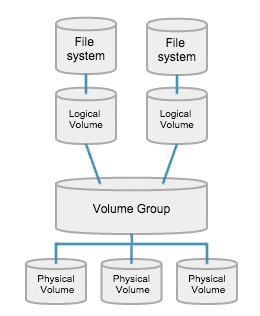
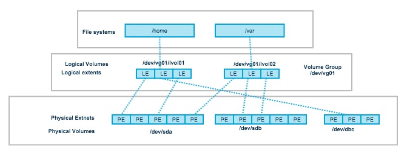
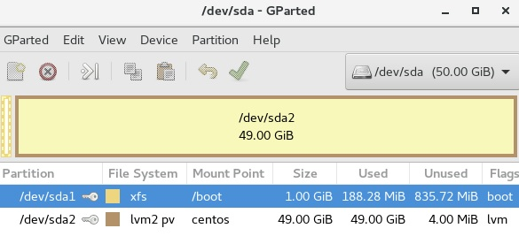

# 102.1. Design hard disk layout

## **102.1 Design hard disk layout**

**Weight:** 2

**Description:** Candidates should be able to design a disk partitioning scheme for a Linux system.

**Key Knowledge Areas:**

* Allocate filesystems and swap space to separate partitions or disks
* Tailor the design to the intended use of the system
* Ensure the /boot partition conforms to the hardware architecture requirements for booting
* Knowledge of basic features of LVM

**Terms and Utilities:**

* / (root) filesystem
* /var filesystem
* /home filesystem
* /boot filesystem
* swap space
* mount points
* partitions

In this light weight lesson first we will have a quick review over Hard Disks structure and how data are stored on them, next we will take a look at linux disk layout.

### Disk tracks, cylinders, and sectors

A disk is divided into tracks, cylinders, and sectors.


A **track** is that portion of a disk which passes under a single stationary head during a disk rotation, a ring 1 bit wide.

A **cylinder** is comprised of the set of tracks described by all the heads (on separate platters) at a single seek position. Each cylinder is equidistant from the center of the disk. A track is divided into segments of sectors, which is the basic unit of storage.

A **sector**, being the smallest physical storage unit on the disk, is almost always 512 bytes in size because 512 is a power of 2 (2 to the power of 9). The number 2 is used because there are two states in the most basic of computer languages — on and off.

### Partitions

Disk partitioning or disk slicing is the creation of one or more regions on a hard disk or other secondary storage, **so that an operating system can manage information in each region separately**. These regions are called partitions.

The disk stores the** information about the partitions' locations and sizes** in an area known as the **partition table** that the operating system reads before any other part of the disk. Each partition then appears in the operating system as a distinct "logical" disk that uses part of the actual disk.

```
[root@centos7-1 ~]# lsblk
NAME            MAJ:MIN RM  SIZE RO TYPE MOUNTPOINT
sda               8:0    0   50G  0 disk 
├─sda1            8:1    0    1G  0 part /boot
└─sda2            8:2    0   49G  0 part 
  ├─centos-root 253:0    0 45.1G  0 lvm  /
  └─centos-swap 253:1    0  3.9G  0 lvm  [SWAP]
sr0              11:0    1 55.7M  0 rom  /run/media/payam/VMware Tools
```

When doing an installation there is normally a minimum disk configuration of two partitions that needs to be created:

* **/ **(root): directory that contains the Linux distribution.
* **Swap space**

### **What is swap space?**

Swap space in Linux is used when the amount of physical memory (RAM) is full. If the system needs more memory resources and the RAM is full, inactive pages in memory are moved to the swap space. While swap space can help machines with a small amount of RAM, it should not be considered a replacement for more RAM. Swap space is located on hard drives, which have a slower access time than physical memory.

**Swap space can be** a **dedicated swap partition** (recommended), a **swap file**, or a **combination of swap partitions and swap files**.

Swap should equal 2x physical RAM for up to 2 GB of physical RAM, and about 1.5x physical RAM for more than 2 GB of physical RAM. How ever that an old recipe and it depends on what kind of system we are talking about.

### **mount points**

All **partitions are attached to the system via a mount point**. The mount point defines the place of a particular data set in the file system. Usually, all partitions are connected through the root partition. On this partition, which is indicated with the slash (/), directories are created. These empty directories will be the starting point of the partitions that are attached to them.

```
[root@centos7-1 ~]# df -h
Filesystem               Size  Used Avail Use% Mounted on
/dev/mapper/centos-root   46G  4.4G   41G  10% /
devtmpfs                 1.9G     0  1.9G   0% /dev
tmpfs                    1.9G     0  1.9G   0% /dev/shm
tmpfs                    1.9G   26M  1.9G   2% /run
tmpfs                    1.9G     0  1.9G   0% /sys/fs/cgroup
/dev/sda1               1014M  179M  836M  18% /boot
tmpfs                    378M   32K  378M   1% /run/user/1000
/dev/sr0                  56M   56M     0 100% /run/media/pabros/VMware Tools
tmpfs                    378M     0  378M   0% /run/user/0
```

During system startup, all the partitions are thus mounted, (will be described in the file /etc/fstab). Some partitions are not mounted by default, for instance if they are **not constantly connected to the system, such like the usb storage**. If well configured, the device will be mounted as soon as the system notices that it is connected, or it can be user-mountable.

### File Systems

**A filesystem is the methods and data structures that an operating system uses to keep track of files on a disk or partition**; that is, the way the files are organized on the disk. Without a file system, information placed in a storage medium would be one large body of data with no way to tell where one piece of information stops and the next begins.

Different filesystems have different organizing structures to determine where the data and indexing information will be stored:

* **FAT32**: FAT32 is an older Windows file system, but it’s still used on removable media devices — just the smaller ones, though. Larger external hard drives of 1 TB or so will likely come formatted with NTFS
* **NTFS**: Modern versions of Windows — since Windows XP — use the NTFS file system for their system partition. External drives can be formatted with either FAT32 or NTFS.
* **HFS**+: Macs use HFS+ for their internal partitions, and they like to format external drives with HFS+ too. 
* **Ext2/Ext3/Ext4**: You’ll often see the Ext2, Ext3, and Ext4 file systems on Linux.
* **Btrfs**: Btrfs — “better file system” — is a newer Linux file system that’s still in development. It isn’t the default on most Linux distributions at this point, but it will probably replace Ext4 one day. The goal is to provide additional features that allow Linux to scale to larger amounts of storage.
* **Swap**: On Linux, the “swap” file system isn’t really a file system. A partition formatted as “swap” can just be used as swap space by the operating system 

#### Linux Directory Structure

Linux uses a hierarchical file system structure, much like an upside-down tree, with root (/) at the base of the file system and all other directories spreading from there. The linux directory consists of many file systems that can be on many devices even on many servers.

```
[root@centos7-1 ~]# tree / -L 1
/
├── bin -> usr/bin
├── boot
├── dev
├── etc
├── home
├── lib -> usr/lib
├── lib64 -> usr/lib64
├── media
├── mnt
├── opt
├── proc
├── root
├── run
├── sbin -> usr/sbin
├── srv
├── sys
├── tmp
├── usr
└── var

19 directories, 0 files
```

Lets explain what they are for:

* **/** (root): the root filesystem, mounted before the kernel loads the first process. The bootloader tells the kernel what to use as the root filesystem (it's usually a disk partition but could be something over the network).
* **/bin** : All the executable binary programs (file) required during booting, repairing, files required to run into single-user-mode, and other important, basic commands.
* **/boot** : Holds important files during boot-up process, including Linux Kernel.
* **/dev** : an in-memory filesystem where device files are automatically created by udev based on available hardware.Contains device files for all the hardware devices on the machine e.g., cdrom, cpu, etc
* **/etc** : Contains Application’s configuration files, startup, shutdown, start, stop script for every individual program.
* **/home** : Home directory of the users. Every time a new user is created, a directory in the name of user is created within home directory which contains other directories like Desktop, Downloads, Documents, etc.
* **/lib** : The Lib directory contains kernel modules and shared library images required to boot the system and run commands in root file system.
* **/media **: Temporary mount directory is created for removable devices .
* **/mnt** : Temporary mount directory for mounting file system.
* **/opt** : Optional is abbreviated as opt. Contains third party application software.
* **/proc** : A virtual and pseudo file-system which contains information about running process with a particular Process-id aka pid.
* **/root **: This is the home directory of root user and should never be confused with ‘/‘
* **/run** : This directory is the only clean solution for early-runtime-dir problem.
* **/sbin** : Contains binary executable programs, required by System Administrator, for Maintenance.
* **/srv** : Service is abbreviated as ‘srv‘. This directory contains server specific and service related files.
* **/sys** : Modern Linux distributions include a /sys directory as a virtual filesystem, which stores and allows modification of the devices connected to the system.
* **/tmp **:System’s Temporary Directory, Accessible by users and root. Stores temporary files for user and system, till next boot.
* **/usr** : Contains executable binaries, documentation, source code, libraries for second level program.
* **/var** : Stands for variable. The contents of this file is expected to grow. This directory contains log, lock, spool, mail and temp files.


Almost all of linux directories can be a separated partition, except /etc directory because it contains scripts which are required during boot process so it can be mounted with / partition and accessible at the very beginning boot process.


### Designing Hard Disk Layout

Of course just because we can partition a disk doesn't mean we should! The more partitions we create, the more there is to manage. So we shouldn't make extra partitions unless we consider the extra work they create to be worth the additional protections they provide.

If the root partition runs out of space the system will crash. If some non-root partition runs out of space, the system will remain up and the System Administrator can login and fix things. Thus the directories such as /home, /tmp, and /var that users can easily fill with downloads, email, etc., are prime candidates for extra partitions. So are any other directories that might grow (directories for FTP uploads, database files, etc.).

If the partition containing the log files runs out of space, the system won't be able to write any log messages that could help an System Administrator to determine what went wrong. On the other hand some rapidly recurring error (or attack) can cause log files to grow very large very quickly, filling the partition containing them. So the directory containing log files, (usually /var/log), is a good choice for a separate partition.

All in all try to follow vendor-recommended standard disk layout if not, be smart and do partitioning based on the server type and behaviour of your application(s).


#### Blocks vs. Sectors

**A sector is a physical spot on a formatted disk that holds information.** When a disk is formatted, tracks are defined (concentric rings from inside to the outside of the disk platter). Each track is divided into a slice, which is a sector. On hard drives and floppies, each sector can hold 512 bytes of data.

**A block, on the other hand, is a group of sectors that the operating system can address (point to). **A block might be one sector, or it might be several sectors (2,4,8, or even 16). The bigger the drive, the more sectors that a block will hold.

**So why are there blocks? Why doesn't the operating system just point straight to the sectors?** Because there are limits to the number of blocks, or drive addresses, that an operating system can address. By defining a block as several sectors, an OS can work with bigger hard drives without increasing the number of block addresses.


up to now we have talked about partitions, partitions are cool but partitions are fixed sized and that is not easy to resize in some cases. On a server we even need **more flexibility**. That is why **LVM** was invented.

### LVM

Logical volume management (LVM) is a **form of storage virtualization** that offers system administrators a more **flexible** approach to managing disk storage space than traditional partitioning.

There are 3 concepts that LVM manages:

* **Logical Volumes (LV)**: A Logical Volume is the conceptual equivalent of a disk partition in a non-LVM system. Logical volumes **are block devices which are created from the physical extents present in the same volume group**. File systems are built on top of logical volumes.
* **Volume Groups (VG)**: A Volume Group **gathers together a collection of Logical Volumes and Physical Volumes into one administrative unit**. Volume group is divided into fixed size physical extents.
* **Physical Volumes (PV)**: Each Physical Volume can be a disk partition or whole disk.



Logical Volume Management (LVM) makes it easier to manage disk space. If a file system needs more space, it can be added to its logical volumes from the free spaces in its volume group and the file system can be re-sized as we wish. If a disk **starts to fail**, replacement disk can be registered as a physical volume with the volume group and the logical volumes extents can be migrated to the new disk without data loss.

**How LVM works?**

It works by chunking the physical volumes (PVs) into physical extents (PEs). The PEs are mapped onto logical extents (LEs) which are then pooled into volume groups (VGs). These groups are linked together into logical volumes (LVs) that act as virtual disk partitions and that can be managed as such by using LVM.




There is one thing that we should know about LVM, we can not put intire server in LVM! Because there is a /boot directory and /boot directory must be available at the moment of booting, so it must be seen from master boot record (or GUID partition).

And in order to see /boot directory at the moment of booting it should always be on a traditional partition.




That is all.

.

.

.

.

Sources:

[https://www.studytonight.com/operating-system/secondary-storage](https://www.studytonight.com/operating-system/secondary-storage)

[https://www2.cs.duke.edu/csl/docs/sysadmin_course/sysadm-30.html](https://www2.cs.duke.edu/csl/docs/sysadmin_course/sysadm-30.html)

[http://www.ntfs.com/hard-disk-basics.htm](http://www.ntfs.com/hard-disk-basics.htm)

[https://en.wikipedia.org/wiki/Disk_partitioning](https://legacy.gitbook.com/book/borosan/lpic1-exam-guide/edit#)

[https://www.tldp.org/LDP/sag/html/filesystems.html](https://www.tldp.org/LDP/sag/html/filesystems.html)

[https://en.wikipedia.org/wiki/File_system](https://legacy.gitbook.com/book/borosan/lpic1-exam-guide/edit#)

[https://searchstorage.techtarget.com/definition/file-system](https://searchstorage.techtarget.com/definition/file-system)

[https://www.howtogeek.com/196051/htg-explains-what-is-a-file-system-and-why-are-there-so-many-of-them/](https://www.howtogeek.com/196051/htg-explains-what-is-a-file-system-and-why-are-there-so-many-of-them/)

[https://www.centos.org/docs/5/html/5.2/Deployment_Guide/s1-swap-what-is.html](https://www.centos.org/docs/5/html/5.2/Deployment_Guide/s1-swap-what-is.html)

[https://www.linuxtopia.org/online_books/introduction_to_linux/linux_Mount_points.html](https://www.linuxtopia.org/online_books/introduction_to_linux/linux_Mount_points.html)

[https://unix.stackexchange.com/questions/12040/what-mount-points-exist-on-a-typical-linux-system](https://unix.stackexchange.com/questions/12040/what-mount-points-exist-on-a-typical-linux-system)

[https://www.tutorialspoint.com/unix/unix-file-system.htm](https://www.tutorialspoint.com/unix/unix-file-system.htm)

[https://www.howtogeek.com/117435/htg-explains-the-linux-directory-structure-explained/](https://www.howtogeek.com/117435/htg-explains-the-linux-directory-structure-explained/)

[https://wpollock.com/AUnix1/Partitioning.htm](https://wpollock.com/AUnix1/Partitioning.htm)

[http://www.alphaurax-computer.com/computer-tips/hard-drive-knowledge-blocks-vs-sectors](https://legacy.gitbook.com/book/borosan/lpic1-exam-guide/edit#)

[https://searchdatacenter.techtarget.com/definition/logical-volume-management-LVM](https://searchdatacenter.techtarget.com/definition/logical-volume-management-LVM)

[https://wiki.ubuntu.com/Lvm](https://wiki.ubuntu.com/Lvm)

[https://www.thegeekdiary.com/redhat-centos-a-beginners-guide-to-lvm-logical-volume-manager/](https://www.thegeekdiary.com/redhat-centos-a-beginners-guide-to-lvm-logical-volume-manager/)

[https://www.tecmint.com/create-lvm-storage-in-linux/](https://www.tecmint.com/create-lvm-storage-in-linux/)
