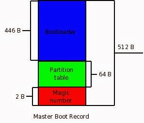
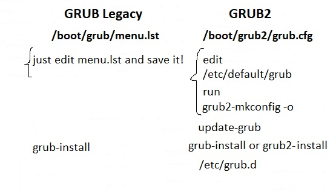
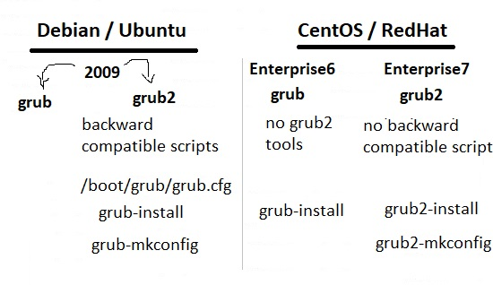
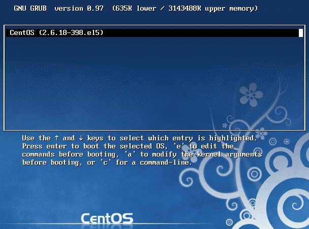
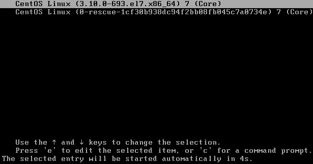
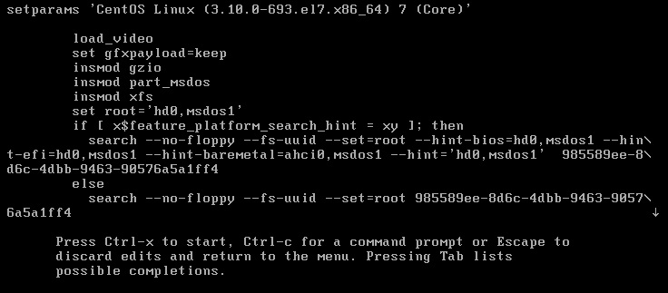
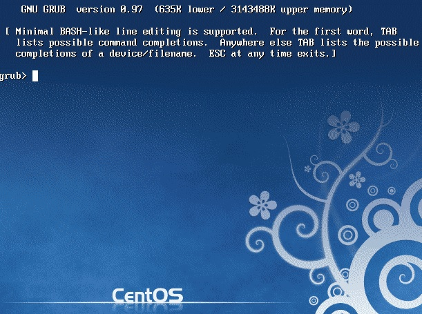
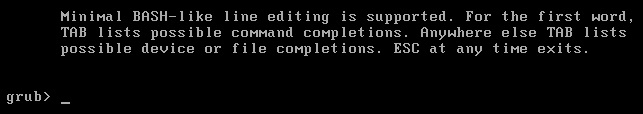

# 102.2. Install a boot manager

## **102.2 Install a boot manager**

**Weight:** 2

**Description:** Candidates should be able to select, install and configure a boot manager.

**Key Knowledge Areas:**

* Providing alternative boot locations and backup boot options
* Install and configure a boot loader such as GRUB Legacy
* Perform basic configuration changes for GRUB 2
* Interact with the boot loader

**The following is a partial list of the used files, terms and utilities:**

* menu.lst, grub.cfg and grub.conf
* grub-install
* grub-mkconfig
* MBR

We have talked about linux boot process and boot loaders. We got introduced to LILO as a very old boot loader which was replaced by GRUB in late 1990s. In this course we take a closer look at GRUB and GRUB2 boot loaders .

## GRUB


GRUB \(GRand Unified Bootloader\) is a boot loader package developed to support multiple operating systems and allow the user to select among them during boot-up.

#### GRUB versions

GRUB was created by Erich Stefan Boleyn and has been further developed under the GNU project as GNU GRUB. The original package is still available for download but no longer being developed.

**GRUB2** has replaced what was formerly known as GRUB \(i.e. version 0.9x\), which has, in turn, become **GRUB Legacy.** Enhancements to GRUB2 are still being made, but the current released versions are quite usable for normal operation.

### How does GRUB work?

When a computer boots, the BIOS transfers control to the first boot device, which can be a hard disk, a floppy disk, a CD-ROM, or any other BIOS-recognized device.

#### MBR

The first sector on a hard is called the Master Boot Record \(MBR\). This sector is only 512 bytes long and contains a small piece of code \(446 bytes\) called the primary boot loader and the partition table \(64 bytes\) describing the primary and extended partitions.



GRUB replaces the default MBR with its own code:

```text
[root@centos7-1 ~]# xxd -l 512 /dev/sda
0000000: eb63 9010 8ed0 bc00 b0b8 0000 8ed8 8ec0  .c..............
0000010: fbbe 007c bf00 06b9 0002 f3a4 ea21 0600  ...|.........!..
0000020: 00be be07 3804 750b 83c6 1081 fefe 0775  ....8.u........u
0000030: f3eb 16b4 02b0 01bb 007c b280 8a74 018b  .........|...t..
0000040: 4c02 cd13 ea00 7c00 00eb fe00 0000 0000  L.....|.........
0000050: 0000 0000 0000 0000 0000 0080 0100 0000  ................
0000060: 0000 0000 fffa 9090 f6c2 8074 05f6 c270  ...........t...p
0000070: 7402 b280 ea79 7c00 0031 c08e d88e d0bc  t....y|..1......
0000080: 0020 fba0 647c 3cff 7402 88c2 52be 057c  . ..d|<.t...R..|
0000090: b441 bbaa 55cd 135a 5272 3d81 fb55 aa75  .A..U..ZRr=..U.u
00000a0: 3783 e101 7432 31c0 8944 0440 8844 ff89  7...t21..D.@.D..
00000b0: 4402 c704 1000 668b 1e5c 7c66 895c 0866  D.....f..\|f.\.f
00000c0: 8b1e 607c 6689 5c0c c744 0600 70b4 42cd  ..`|f.\..D..p.B.
00000d0: 1372 05bb 0070 eb76 b408 cd13 730d 5a84  .r...p.v....s.Z.
00000e0: d20f 83de 00be 857d e982 0066 0fb6 c688  .......}...f....
00000f0: 64ff 4066 8944 040f b6d1 c1e2 0288 e888  d.@f.D..........
0000100: f440 8944 080f b6c2 c0e8 0266 8904 66a1  .@.D.......f..f.
0000110: 607c 6609 c075 4e66 a15c 7c66 31d2 66f7  `|f..uNf.\|f1.f.
0000120: 3488 d131 d266 f774 043b 4408 7d37 fec1  4..1.f.t.;D.}7..
0000130: 88c5 30c0 c1e8 0208 c188 d05a 88c6 bb00  ..0........Z....
0000140: 708e c331 dbb8 0102 cd13 721e 8cc3 601e  p..1......r...`.
0000150: b900 018e db31 f6bf 0080 8ec6 fcf3 a51f  .....1..........
0000160: 61ff 265a 7cbe 807d eb03 be8f 7de8 3400  a.&Z|..}....}.4.
0000170: be94 7de8 2e00 cd18 ebfe 4752 5542 2000  ..}.......GRUB .
0000180: 4765 6f6d 0048 6172 6420 4469 736b 0052  Geom.Hard Disk.R
0000190: 6561 6400 2045 7272 6f72 0d0a 00bb 0100  ead. Error......
00001a0: b40e cd10 ac3c 0075 f4c3 0000 0000 0000  .....<.u........
00001b0: 0000 0000 0000 0000 5f1a 0a00 0000 8020  ........_...... 
00001c0: 2100 83aa 2882 0008 0000 0000 2000 00aa  !...(....... ...
00001d0: 2982 8efe ffff 0008 2000 00f8 1f06 0000  )....... .......
00001e0: 0000 0000 0000 0000 0000 0000 0000 0000  ................
00001f0: 0000 0000 0000 0000 0000 0000 0000 55aa  ..............U.
```

By default, MBR code looks for the partition marked as active and once such a partition is found, it loads its boot sector into memory and passes control to it.

```text
[root@centos7-1 ~]# fdisk -l /dev/sda 

Disk /dev/sda: 53.7 GB, 53687091200 bytes, 104857600 sectors
Units = sectors of 1 * 512 = 512 bytes
Sector size (logical/physical): 512 bytes / 512 bytes
I/O size (minimum/optimal): 512 bytes / 512 bytes
Disk label type: dos
Disk identifier: 0x000a1a5f

   Device Boot      Start         End      Blocks   Id  System
/dev/sda1   *        2048     2099199     1048576   83  Linux
/dev/sda2         2099200   104857599    51379200   8e  Linux LVM
```

Furthermore, GRUB works in stages.

* **Stage 1** is located in the MBR and mainly points to Stage 2, since the MBR is too small to contain all of the needed data.
* **Stage 2** points to its configuration file, which contains all of the complex user interface and options we are normally familiar with when talking about GRUB. Stage 2 can be located anywhere on the disk. If Stage 2 cannot find its configuration table, GRUB will cease the boot sequence and present the user with a command line for manual configuration.

The Stage architecture allows GRUB to be large \(~20-30K\) and therefore fairly complex and highly configurable, compared to most bootloaders, which are sparse and simple to fit within the limitations of the Partition Table.

### GRUB Legacy vs GRUB2

Lets draw a big picture:



/boot/grub/menu.lst in GRUB Legacy has been replaced by /boot/grub/grub.cfg in GRUB2.

```text
### GRUB Legacy
[root@centos5-1 ~]# ls /boot
config-2.6.18-398.el5      message
grub                       symvers-2.6.18-398.el5.gz
initrd-2.6.18-398.el5.img  System.map-2.6.18-398.el5
lost+found                 vmlinuz-2.6.18-398.el5
[root@centos5-1 ~]# ls /boot/grub/
device.map     grub.conf         minix_stage1_5     stage2
e2fs_stage1_5  iso9660_stage1_5  reiserfs_stage1_5  ufs2_stage1_5
fat_stage1_5   jfs_stage1_5      splash.xpm.gz      vstafs_stage1_5
ffs_stage1_5   menu.lst          stage1             xfs_stage1_5

### GRUB2
[root@centos7-1 ~]# ls /boot/
config-3.10.0-693.el7.x86_64
efi
grub
grub2
initramfs-0-rescue-1cf30b938dc94f2bb08fb045c7a0734e.img
initramfs-3.10.0-693.el7.x86_64.img
initramfs-3.10.0-693.el7.x86_64kdump.img
initrd-plymouth.img
symvers-3.10.0-693.el7.x86_64.gz
System.map-3.10.0-693.el7.x86_64
vmlinuz-0-rescue-1cf30b938dc94f2bb08fb045c7a0734e
vmlinuz-3.10.0-693.el7.x86_64
[root@centos7-1 ~]# ls /boot/grub
splash.xpm.gz
[root@centos7-1 ~]# ls /boot/grub2
device.map  fonts  grub.cfg  grubenv  i386-pc  locale
```

Which version of linux use which grub ?



**Demonstration**

In order to show differences between GRUB Legacy and GRUB2, lets change `timeout` parameter in Two systems \(CentsOS5 and Centos7\) :

### menu.lst \(GRUB Legacy\)

```text
[root@centos5-1 ~]# cat /boot/grub/menu.lst 
# grub.conf generated by anaconda
#
# Note that you do not have to rerun grub after making changes to this file
# NOTICE:  You have a /boot partition.  This means that
#          all kernel and initrd paths are relative to /boot/, eg.
#          root (hd0,0)
#          kernel /vmlinuz-version ro root=/dev/sda2
#          initrd /initrd-version.img
#boot=/dev/sda
default=0
timeout=5
splashimage=(hd0,0)/grub/splash.xpm.gz
hiddenmenu
title CentOS (2.6.18-398.el5)
        root (hd0,0)
        kernel /vmlinuz-2.6.18-398.el5 ro root=LABEL=/ rhgb quiet
        initrd /initrd-2.6.18-398.el5.img
```

just make a change in menu.lst and save it and that is all.

### grub.cfg \(GRUB2\)

grub.cfg is overwritten by certain Grub 2 package updates, whenever a kernel is added or removed, or when the user runs update-grub.Do not edit grub.cfg directly!!

```text
[root@centos7-1 ~]# cat /boot/grub2/grub.cfg 
#
# DO NOT EDIT THIS FILE
#
# It is automatically generated by grub2-mkconfig using templates
# from /etc/grub.d and settings from /etc/default/grub
#

### BEGIN /etc/grub.d/00_header ###
set pager=1

if [ -s $prefix/grubenv ]; then
  load_env
fi
if [ "${next_entry}" ] ; then
   set default="${next_entry}"
   set next_entry=
   save_env next_entry
   set boot_once=true
else
   set default="${saved_entry}"
fi

if [ x"${feature_menuentry_id}" = xy ]; then
  menuentry_id_option="--id"
else
  menuentry_id_option=""
fi

export menuentry_id_option

if [ "${prev_saved_entry}" ]; then
  set saved_entry="${prev_saved_entry}"
  save_env saved_entry
  set prev_saved_entry=
  save_env prev_saved_entry
  set boot_once=true
fi

function savedefault {
  if [ -z "${boot_once}" ]; then
    saved_entry="${chosen}"
    save_env saved_entry
  fi
}

function load_video {
  if [ x$feature_all_video_module = xy ]; then
    insmod all_video
  else
    insmod efi_gop
    insmod efi_uga
    insmod ieee1275_fb
    insmod vbe
    insmod vga
    insmod video_bochs
    insmod video_cirrus
  fi
}

terminal_output console
if [ x$feature_timeout_style = xy ] ; then
  set timeout_style=menu
  set timeout=5
# Fallback normal timeout code in case the timeout_style feature is
# unavailable.
else
  set timeout=5
fi
### END /etc/grub.d/00_header ###

### BEGIN /etc/grub.d/00_tuned ###
set tuned_params=""
set tuned_initrd=""
### END /etc/grub.d/00_tuned ###

### BEGIN /etc/grub.d/01_users ###
if [ -f ${prefix}/user.cfg ]; then
  source ${prefix}/user.cfg
  if [ -n "${GRUB2_PASSWORD}" ]; then
    set superusers="root"
    export superusers
    password_pbkdf2 root ${GRUB2_PASSWORD}
  fi
fi
### END /etc/grub.d/01_users ###

### BEGIN /etc/grub.d/10_linux ###
menuentry 'CentOS Linux (3.10.0-693.el7.x86_64) 7 (Core)' --class centos --class gnu-linux --class gnu --class os --unrestricted $menuentry_id_option 'gnulinux-3.10.0-693.el7.x86_64-advanced-162b8754-3820-4229-9ab4-810de8ab8558' {
    load_video
    set gfxpayload=keep
    insmod gzio
    insmod part_msdos
    insmod xfs
    set root='hd0,msdos1'
    if [ x$feature_platform_search_hint = xy ]; then
      search --no-floppy --fs-uuid --set=root --hint-bios=hd0,msdos1 --hint-efi=hd0,msdos1 --hint-baremetal=ahci0,msdos1 --hint='hd0,msdos1'  985589ee-8d6c-4dbb-9463-90576a5a1ff4
    else
      search --no-floppy --fs-uuid --set=root 985589ee-8d6c-4dbb-9463-90576a5a1ff4
    fi
    linux16 /vmlinuz-3.10.0-693.el7.x86_64 root=/dev/mapper/centos-root ro crashkernel=auto rd.lvm.lv=centos/root rd.lvm.lv=centos/swap rhgb quiet LANG=en_US.UTF-8
    initrd16 /initramfs-3.10.0-693.el7.x86_64.img
}
menuentry 'CentOS Linux (0-rescue-1cf30b938dc94f2bb08fb045c7a0734e) 7 (Core)' --class centos --class gnu-linux --class gnu --class os --unrestricted $menuentry_id_option 'gnulinux-0-rescue-1cf30b938dc94f2bb08fb045c7a0734e-advanced-162b8754-3820-4229-9ab4-810de8ab8558' {
    load_video
    insmod gzio
    insmod part_msdos
    insmod xfs
    set root='hd0,msdos1'
    if [ x$feature_platform_search_hint = xy ]; then
      search --no-floppy --fs-uuid --set=root --hint-bios=hd0,msdos1 --hint-efi=hd0,msdos1 --hint-baremetal=ahci0,msdos1 --hint='hd0,msdos1'  985589ee-8d6c-4dbb-9463-90576a5a1ff4
    else
      search --no-floppy --fs-uuid --set=root 985589ee-8d6c-4dbb-9463-90576a5a1ff4
    fi
    linux16 /vmlinuz-0-rescue-1cf30b938dc94f2bb08fb045c7a0734e root=/dev/mapper/centos-root ro crashkernel=auto rd.lvm.lv=centos/root rd.lvm.lv=centos/swap rhgb quiet
    initrd16 /initramfs-0-rescue-1cf30b938dc94f2bb08fb045c7a0734e.img
}

### END /etc/grub.d/10_linux ###

### BEGIN /etc/grub.d/20_linux_xen ###
### END /etc/grub.d/20_linux_xen ###

### BEGIN /etc/grub.d/20_ppc_terminfo ###
### END /etc/grub.d/20_ppc_terminfo ###

### BEGIN /etc/grub.d/30_os-prober ###
### END /etc/grub.d/30_os-prober ###

### BEGIN /etc/grub.d/40_custom ###
# This file provides an easy way to add custom menu entries.  Simply type the
# menu entries you want to add after this comment.  Be careful not to change
# the 'exec tail' line above.
### END /etc/grub.d/40_custom ###

### BEGIN /etc/grub.d/41_custom ###
if [ -f  ${config_directory}/custom.cfg ]; then
  source ${config_directory}/custom.cfg
elif [ -z "${config_directory}" -a -f  $prefix/custom.cfg ]; then
  source $prefix/custom.cfg;
fi
### END /etc/grub.d/41_custom ###
```

In order to make any changes in grub.cfg two steps are required.

### 1-/etc/default/grub

first edit /etc/default/grub:

```text
[root@centos7-1 ~]# cat /etc/default/grub
GRUB_TIMEOUT=5
GRUB_DISTRIBUTOR="$(sed 's, release .*$,,g' /etc/system-release)"
GRUB_DEFAULT=saved
GRUB_DISABLE_SUBMENU=true
GRUB_TERMINAL_OUTPUT="console"
GRUB_CMDLINE_LINUX="crashkernel=auto rd.lvm.lv=centos/root rd.lvm.lv=centos/swap rhgb quiet"
GRUB_DISABLE_RECOVERY="true"
```

save chanages in /etc/default/grub. The configurations are written to /boot/grub2/grub.cfg using grub-mkconfig command

### 2- grub-mkconfig

grub-mkconfig Generate a GRUB configuration file.

```text
[root@centos7-1 ~]# grub2-mkconfig 
Generating grub configuration file ...
#
# DO NOT EDIT THIS FILE
#
# It is automatically generated by grub2-mkconfig using templates
# from /etc/grub.d and settings from /etc/default/grub
#

### BEGIN /etc/grub.d/00_header ###
set pager=1

if [ -s $prefix/grubenv ]; then
  load_env
fi
if [ "${next_entry}" ] ; then
   set default="${next_entry}"
   set next_entry=
   save_env next_entry
   set boot_once=true
else
   set default="${saved_entry}"
fi

if [ x"${feature_menuentry_id}" = xy ]; then
  menuentry_id_option="--id"
else
  menuentry_id_option=""
fi

export menuentry_id_option

if [ "${prev_saved_entry}" ]; then
  set saved_entry="${prev_saved_entry}"
  save_env saved_entry
  set prev_saved_entry=
  save_env prev_saved_entry
  set boot_once=true
fi

function savedefault {
  if [ -z "${boot_once}" ]; then
    saved_entry="${chosen}"
    save_env saved_entry
  fi
}

function load_video {
  if [ x$feature_all_video_module = xy ]; then
    insmod all_video
  else
    insmod efi_gop
    insmod efi_uga
    insmod ieee1275_fb
    insmod vbe
    insmod vga
    insmod video_bochs
    insmod video_cirrus
  fi
}

terminal_output console
if [ x$feature_timeout_style = xy ] ; then
  set timeout_style=menu
  set timeout=5
# Fallback normal timeout code in case the timeout_style feature is
# unavailable.
else
  set timeout=5
fi
### END /etc/grub.d/00_header ###

### BEGIN /etc/grub.d/00_tuned ###
set tuned_params=""
set tuned_initrd=""
### END /etc/grub.d/00_tuned ###

### BEGIN /etc/grub.d/01_users ###
if [ -f ${prefix}/user.cfg ]; then
  source ${prefix}/user.cfg
  if [ -n "${GRUB2_PASSWORD}" ]; then
    set superusers="root"
    export superusers
    password_pbkdf2 root ${GRUB2_PASSWORD}
  fi
fi
### END /etc/grub.d/01_users ###

### BEGIN /etc/grub.d/10_linux ###
Found linux image: /boot/vmlinuz-3.10.0-693.el7.x86_64
Found initrd image: /boot/initramfs-3.10.0-693.el7.x86_64.img
menuentry 'CentOS Linux (3.10.0-693.el7.x86_64) 7 (Core)' --class centos --class gnu-linux --class gnu --class os --unrestricted $menuentry_id_option 'gnulinux-3.10.0-693.el7.x86_64-advanced-162b8754-3820-4229-9ab4-810de8ab8558' {
    load_video
    set gfxpayload=keep
    insmod gzio
    insmod part_msdos
    insmod xfs
    set root='hd0,msdos1'
    if [ x$feature_platform_search_hint = xy ]; then
      search --no-floppy --fs-uuid --set=root --hint-bios=hd0,msdos1 --hint-efi=hd0,msdos1 --hint-baremetal=ahci0,msdos1 --hint='hd0,msdos1'  985589ee-8d6c-4dbb-9463-90576a5a1ff4
    else
      search --no-floppy --fs-uuid --set=root 985589ee-8d6c-4dbb-9463-90576a5a1ff4
    fi
    linux16 /vmlinuz-3.10.0-693.el7.x86_64 root=/dev/mapper/centos-root ro crashkernel=auto rd.lvm.lv=centos/root rd.lvm.lv=centos/swap rhgb quiet 
    initrd16 /initramfs-3.10.0-693.el7.x86_64.img
}
Found linux image: /boot/vmlinuz-0-rescue-1cf30b938dc94f2bb08fb045c7a0734e
Found initrd image: /boot/initramfs-0-rescue-1cf30b938dc94f2bb08fb045c7a0734e.img
menuentry 'CentOS Linux (0-rescue-1cf30b938dc94f2bb08fb045c7a0734e) 7 (Core)' --class centos --class gnu-linux --class gnu --class os --unrestricted $menuentry_id_option 'gnulinux-0-rescue-1cf30b938dc94f2bb08fb045c7a0734e-advanced-162b8754-3820-4229-9ab4-810de8ab8558' {
    load_video
    insmod gzio
    insmod part_msdos
    insmod xfs
    set root='hd0,msdos1'
    if [ x$feature_platform_search_hint = xy ]; then
      search --no-floppy --fs-uuid --set=root --hint-bios=hd0,msdos1 --hint-efi=hd0,msdos1 --hint-baremetal=ahci0,msdos1 --hint='hd0,msdos1'  985589ee-8d6c-4dbb-9463-90576a5a1ff4
    else
      search --no-floppy --fs-uuid --set=root 985589ee-8d6c-4dbb-9463-90576a5a1ff4
    fi
    linux16 /vmlinuz-0-rescue-1cf30b938dc94f2bb08fb045c7a0734e root=/dev/mapper/centos-root ro crashkernel=auto rd.lvm.lv=centos/root rd.lvm.lv=centos/swap rhgb quiet 
    initrd16 /initramfs-0-rescue-1cf30b938dc94f2bb08fb045c7a0734e.img
}
if [ "x$default" = 'CentOS Linux (3.10.0-693.el7.x86_64) 7 (Core)' ]; then default='Advanced options for CentOS Linux>CentOS Linux (3.10.0-693.el7.x86_64) 7 (Core)'; fi;
### END /etc/grub.d/10_linux ###

### BEGIN /etc/grub.d/20_linux_xen ###
### END /etc/grub.d/20_linux_xen ###

### BEGIN /etc/grub.d/20_ppc_terminfo ###
### END /etc/grub.d/20_ppc_terminfo ###

### BEGIN /etc/grub.d/30_os-prober ###
### END /etc/grub.d/30_os-prober ###

### BEGIN /etc/grub.d/40_custom ###
# This file provides an easy way to add custom menu entries.  Simply type the
# menu entries you want to add after this comment.  Be careful not to change
# the 'exec tail' line above.
### END /etc/grub.d/40_custom ###

### BEGIN /etc/grub.d/41_custom ###
if [ -f  ${config_directory}/custom.cfg ]; then
  source ${config_directory}/custom.cfg
elif [ -z "${config_directory}" -a -f  $prefix/custom.cfg ]; then
  source $prefix/custom.cfg;
fi
### END /etc/grub.d/41_custom ###
done
```

It reads main grub script files from /etc/grub.d and setting from /etc/default/grub and print out generated configuration.

```text
[root@centos7-1 ~]# ls /etc/grub.d/
00_header  01_users  20_linux_xen     30_os-prober  41_custom
00_tuned   10_linux  20_ppc_terminfo  40_custom     README
```

grub2-mkconfig options:

```text
[root@centos7-1 ~]# grub2-mkconfig --help
Usage: grub2-mkconfig [OPTION]
Generate a grub config file

  -o, --output=FILE       output generated config to FILE [default=stdout]
  -h, --help              print this message and exit
  -v, --version           print the version information and exit

Report bugs to <bug-grub@gnu.org>.
```

For saving generated configuration we use -o option \(it is recommanded to take a backup from `/boot/grub2/grub.cfg` file, how ever this is not touching Master Boot Record and just re touches GRUB menu\):

```text
[root@centos7-1 ~]# grub2-mkconfig -o /boot/grub2/grub.cfg 
Generating grub configuration file ...
Found linux image: /boot/vmlinuz-3.10.0-693.el7.x86_64
Found initrd image: /boot/initramfs-3.10.0-693.el7.x86_64.img
Found linux image: /boot/vmlinuz-0-rescue-1cf30b938dc94f2bb08fb045c7a0734e
Found initrd image: /boot/initramfs-0-rescue-1cf30b938dc94f2bb08fb045c7a0734e.img
done
```

We where able to use `grub2-mkconfig > /boot/grub2/grub.cfg` command too,and GRUB2 configuration steps finish here.

### GRUB Interfaces

There are three interfaces in GRUB which all provide different levels of functionality. The Linux kernel can be booted by the users with the help of these interfaces. Details about the interfaces are:

**1-Menu Interface**

The GRUB is configured by the installation program in the menu interface. It is the default interface available. It contains a list of the operating systems or kernels which is ordered by name. A specific operating system or kernel can be selected using the arrow keys and it can be booted using the enter key.

GRUB Legacy



GRUB2



Missing 'a' hah!

**2-Menu Entry Editor Interface**

The e key in the boot loader menu is used to access the menu entry editor. All the GRUB commands for the particular menu entry are displayed there and these commands may be altered before loading the operating system.

GRUB Legacy


GRUB2



**3-Command Line Interface**

This interface is the most basic GRUB interface but it grants the most control to the user. Using the command line interface, any command can be executed by typing it and then pressing enter. This interface also features some advanced shell features.

GRUB Legacy



It is possible to have GRUB Legacy command prompt after rebooting the system and gain information form there.

```text
[root@centos5-1 ~]# grub
Probing devices to guess BIOS drives. This may take a long time.


    GNU GRUB  version 0.97  (640K lower / 3072K upper memory)

 [ Minimal BASH-like line editing is supported.  For the first word, TAB
   lists possible command completions.  Anywhere else TAB lists the possible
   completions of a device/filename.]
```

GRUB2



Note: Partition numbering has changed in GRUB2. The first partition is 1 in GRUB2 rather than 0 \(GRUB Legacy\). The first device/drive is still hd0 by default \(no change\).

### GRUB Installation

Normally when we setup a system GRUB is installed for us but there are some cases which we might need to install GRUB ourselves. There are different ways to install GRUB.

If we are on old system with GRUB legacy we can run grub-install command or using setup command in GRUB shell.

```text
[root@centos5-1 ~]# grub-install /dev/sdb
```

If we are on GRUB2 we can use one of GRUB2 utilities.

```text
[root@centos7-1 ~]# grub2-
grub2-bios-setup           grub2-mkconfig             grub2-ofpathname
grub2-editenv              grub2-mkfont               grub2-probe
grub2-file                 grub2-mkimage              grub2-reboot
grub2-fstest               grub2-mklayout             grub2-rpm-sort
grub2-get-kernel-settings  grub2-mknetdir             grub2-script-check
grub2-glue-efi             grub2-mkpasswd-pbkdf2      grub2-set-default
grub2-install              grub2-mkrelpath            grub2-setpassword
grub2-kbdcomp              grub2-mkrescue             grub2-sparc64-setup
grub2-menulst2cfg          grub2-mkstandalone         grub2-syslinux2cfg
```

### grub2-install

grub-install installs GRUB onto a device. This includes copying GRUB images into the target directory \(generally /boot/grub\), and on some platforms may also include installing GRUB onto a boot sector.

```text
[root@centos7-1 ~]# grub2-install --help
Usage: grub2-install [OPTION...] [OPTION] [INSTALL_DEVICE]
Install GRUB on your drive.

      --compress[=no,xz,gz,lzo]   compress GRUB files [optional]
  -d, --directory=DIR        use images and modules under DIR
                             [default=/usr/lib/grub/<platform>]
      --fonts=FONTS          install FONTS [default=unicode]
      --install-modules=MODULES   install only MODULES and their dependencies
                             [default=all]
  -k, --pubkey=FILE          embed FILE as public key for signature checking
      --locale-directory=DIR use translations under DIR
                             [default=/usr/share/locale]
      --locales=LOCALES      install only LOCALES [default=all]
      --modules=MODULES      pre-load specified modules MODULES
      --themes=THEMES        install THEMES [default=starfield]
  -v, --verbose              print verbose messages.
      --allow-floppy         make the drive also bootable as floppy (default
                             for fdX devices). May break on some BIOSes.
      --boot-directory=DIR   install GRUB images under the directory DIR/grub2
                             instead of the boot/grub2 directory
      --bootloader-id=ID     the ID of bootloader. This option is only
                             available on EFI and Macs.
      --core-compress=xz|none|auto
                             choose the compression to use for core image
      --disk-module=MODULE   disk module to use (biosdisk or native). This
                             option is only available on BIOS target.
      --efi-directory=DIR    use DIR as the EFI System Partition root.
      --force                install even if problems are detected
      --force-file-id        use identifier file even if UUID is available
      --label-bgcolor=COLOR  use COLOR for label background
      --label-color=COLOR    use COLOR for label
      --label-font=FILE      use FILE as font for label
      --macppc-directory=DIR use DIR for PPC MAC install.
      --no-bootsector        do not install bootsector
      --no-nvram             don't update the `boot-device'/`Boot*' NVRAM
                             variables. This option is only available on EFI
                             and IEEE1275 targets.
      --no-rs-codes          Do not apply any reed-solomon codes when
                             embedding core.img. This option is only available
                             on x86 BIOS targets.
      --product-version=STRING   use STRING as product version
      --recheck              delete device map if it already exists
      --removable            the installation device is removable. This option
                             is only available on EFI.
  -s, --skip-fs-probe        do not probe for filesystems in DEVICE
      --target=TARGET        install GRUB for TARGET platform
                             [default=i386-pc]; available targets: arm-efi,
                             arm-uboot, arm64-efi, i386-coreboot, i386-efi,
                             i386-ieee1275, i386-multiboot, i386-pc,
                             i386-qemu, i386-xen, ia64-efi, mips-arc,
                             mips-qemu_mips, mipsel-arc, mipsel-loongson,
                             mipsel-qemu_mips, powerpc-ieee1275,
                             sparc64-ieee1275, x86_64-efi, x86_64-xen
  -?, --help                 give this help list
      --usage                give a short usage message
  -V, --version              print program version

Mandatory or optional arguments to long options are also mandatory or optional
for any corresponding short options.

INSTALL_DEVICE must be system device filename.
grub2-install copies GRUB images into boot/grub2.  On some platforms, it may
also install GRUB into the boot sector.

Report bugs to <bug-grub@gnu.org>.
```

as an example `grub2-install /dev/sdb` will install grub on sdb device, to the master boot record of my hard disk.

How ever instaling GRUB a from running system seems cool, but most of the time there is a problem during boot process and we can not get into our system any more, so we need to reinstall GRUB from GRUB shell. Unfortunately the setup command has been removed from GRUB2 shell and it would need more efforts. Wee need to bring up the system in rescue mode using a live cd and then install GRUB on our hard disk using current temporary root system file:

`grub2-install --boot-directory=/tmp/root/boot /dev/sda`

it was just an example and do not run it because you would mess up your current system.

.

.

.

Sources:

[https://en.wikipedia.org/wiki/GNU\_GRUB](https://en.wikipedia.org/wiki/GNU_GRUB)

[https://whatis.techtarget.com/definition/GRUB-GRand-Unified-Bootloader](https://whatis.techtarget.com/definition/GRUB-GRand-Unified-Bootloader)

[https://www.gnu.org/software/grub/](https://www.gnu.org/software/grub/)

[https://www.dedoimedo.com/computers/grub.html](https://www.dedoimedo.com/computers/grub.html)

[https://www.tutorialspoint.com/what-is-grub-in-linux](https://www.tutorialspoint.com/what-is-grub-in-linux)

[https://help.ubuntu.com/community/Grub2](https://help.ubuntu.com/community/Grub2)

[https://www.mankier.com/8/grub2-install](https://www.mankier.com/8/grub2-install)

.

