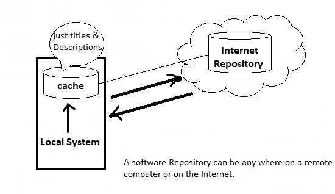
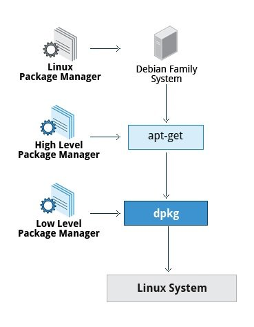
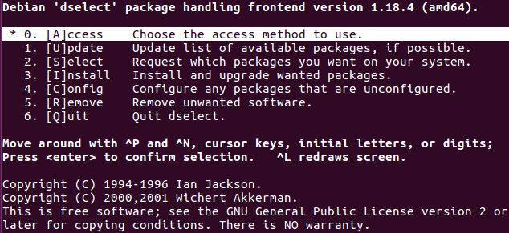
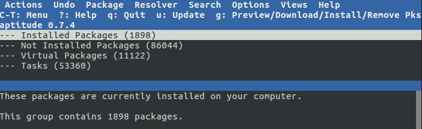

# 102.4. Use Debian package management

## **102.4 Use Debian package management**

**Weight:** 3

**Description:** Candidates should be able to perform package management using the Debian package tools.

**Key Knowledge Areas:**

* Install, upgrade and uninstall Debian binary packages
* Find packages containing specific files or libraries which may or may not be installed
* Obtain package information like version, content, dependencies, package integrity and installation status (whether or not the package is installed)

**Terms and Utilities:**

* /etc/apt/sources.list
* dpkg
* dpkg-reconfigure
* apt-get
* apt-cache
* aptitude

### What is a package?

A package is a piece of software that provides a piece of the system. Examples of packages:

* Linux Kernel
* The C compiler
* The Firefox web browser
* The USB library to interact with USB devices

A package contains the files and other instructions needed to make one Software component work on the system.

Packages have dependencies from other packages that must also be downloaded and installed before installing the package with dependencies.

In old days Linux administrators had to deal with dependency hell for installing a package which caused meta package handlers were born.

### What is a Package Manager?

The packet manager is the utility that handles the downloading, unpacking and putting the unpacked pieces in the right places.


The general workflow starts with the user requesting a package using the package manager available in the system. The Package manager then finds the requested package from a known location (called software repository) and downloads it. The Package Manager then installs the package and advises on any manual steps that it finds necessary.

Package management tools help System/Server Administrators in many ways such as:

* Downloading and installing software
* Compile software from source
* Keeping track of all software installed, their updates and upgrades
* Handling dependencies
* and also keeping other information about installed software and many more

#### What is a Software Repository?

A Linux repository **is a storage location from which our system retrieves and installs OS updates and applications.** Each repository is a collection of software hosted on a remote server and intended to be used for installing and updating software packages on Linux systems.



Package Manager consists of two entities:

* low-level tool
* high-level too


a **low-level** tool (such as **dpkg** or **rpm**), takes care of the details of unpacking individual packages, running scripts, getting the software installed correctly, while a** high-level** tool (such as **apt-get**, yum, or **zypper**) works with groups of packages, downloads packages from the vendor, and figures out dependencies

The core parts of a linux distro and most of its add-on Software are installed via a Package Management System.

In this course we will talk about package management in Debian based distributions.



### dpkg

dpkg is a package manager for Debian-based systems. It can install, remove, and build packages, but unlike other package management systems, **it cannot automatically download and install packages or their dependencies.**

The dpkg has database and its  is located under/var/lib/dpkg directory ;

```
root@ubuntu16-1:~# ls -l /var/lib/dpkg/
total 4416
drwxr-xr-x 2 root root    4096 Dec  2  2018 alternatives
-rw-r--r-- 1 root root      11 Nov 26  2017 arch
-rw-r--r-- 1 root root  170080 Aug  1  2017 available
-rw-r--r-- 1 root root       8 Aug  1  2017 cmethopt
-rw-r--r-- 1 root root    1214 Jul  1  2018 diversions
-rw-r--r-- 1 root root    1133 Jul  1  2018 diversions-old
drwxr-xr-x 2 root root  405504 Dec  2  2018 info
-rw-r----- 1 root root       0 Dec  2  2018 lock
-rw-r----- 1 root root       0 Dec  2  2018 lock-frontend
drwxr-xr-x 7 root root    4096 Dec  2  2018 methods
drwxr-xr-x 2 root root    4096 Jan 12  2016 parts
-rw-r--r-- 1 root root     228 Aug  1  2017 statoverride
-rw-r--r-- 1 root root 1948486 Dec  2  2018 status
-rw-r--r-- 1 root root 1948486 Dec  2  2018 status-old
drwxr-xr-x 2 root root    4096 Dec  1  2018 triggers
drwxr-xr-x 2 root root    4096 Dec  2  2018 updates
```

the "status" file contains the list of installed software on the current system.

**Lets take a look at most useful switches:**

\-l | --list list all packages installed on the system ( --get-selection does the same):

```
root@ubuntu16-1:~# dpkg -l
Desired=Unknown/Install/Remove/Purge/Hold
| Status=Not/Inst/Conf-files/Unpacked/halF-conf/Half-inst/trig-aWait/Trig-pend
|/ Err?=(none)/Reinst-required (Status,Err: uppercase=bad)
||/ Name           Version      Architecture Description
+++-==============-============-============-=================================
ii  a11y-profile-m 0.1.10-0ubun amd64        Accessibility Profile Manager - U
ii  account-plugin 0.12+16.04.2 all          GNOME Control Center account plug
ii  account-plugin 0.12+16.04.2 all          GNOME Control Center account plug
ii  account-plugin 0.12+16.04.2 all          GNOME Control Center account plug
...
<output has been truncated>
```

To view a specific package installed or not use the option “-l” along with package-name.

dpkg -i | --install ,install a local .deb file :


.deb is extension of the software package format for the Linux distribution Debian.


```
root@ubuntu16-1:~# dpkg -i zip_3.0-11_amd64.deb 
(Reading database ... 192789 files and directories currently installed.)
Preparing to unpack zip_3.0-11_amd64.deb ...
Unpacking zip (3.0-11) over (3.0-11) ...
Setting up zip (3.0-11) ...
Processing triggers for man-db (2.7.5-1) ...
```

And if a package requires any dependencies you would get into trouble:

```
root@ubuntu16-1:~# dpkg -i jcal_0.4.1-2_amd64.deb 
dpkg: warning: downgrading jcal from 0.4.1-2build1 to 0.4.1-2
(Reading database ... 192782 files and directories currently installed.)
Preparing to unpack jcal_0.4.1-2_amd64.deb ...
Unpacking jcal (0.4.1-2) over (0.4.1-2build1) ...
dpkg: dependency problems prevent configuration of jcal:
 jcal depends on libjalali0; however:
  Package libjalali0 is not installed.

dpkg: error processing package jcal (--install):
 dependency problems - leaving unconfigured
Processing triggers for man-db (2.7.5-1) ...
Errors were encountered while processing:
 jcal
```

dpkg does not handle dependencies so and we try to install a package one of two thing will happend:

* whether It will completely fail !
* or it will install the package but leave it unconfigured until all dependencies are installed and the apt tool is used to finish the configuration(`apt-get install -f`we will see it).

We can also use `dpkg --force-depends`to omit dependencies or `--force-conflicts` to close its eyes to any possible conflicts or `--force-reinstall`for reinstalling, but do not forget that any `--force` command can cause a problem and make the system **inconsistent** state.

dpkg -L | --listfiles ,To list the files installed by a package:

```
root@ubuntu16-1:~# dpkg -L zip 
/.
/usr
/usr/share
/usr/share/doc
/usr/share/doc/zip
/usr/share/doc/zip/WHATSNEW
/usr/share/doc/zip/TODO
/usr/share/doc/zip/copyright
/usr/share/doc/zip/changelog.Debian.gz
/usr/share/man
/usr/share/man/man1
/usr/share/man/man1/zipsplit.1.gz
/usr/share/man/man1/zipcloak.1.gz
/usr/share/man/man1/zip.1.gz
/usr/share/man/man1/zipnote.1.gz
/usr/bin
/usr/bin/zipnote
/usr/bin/zipcloak
/usr/bin/zip
/usr/bin/zipsplit
/usr/share/doc/zip/changelog.gz
```

dpkg -S | --serach ,If we are not sure which package installed a file, dpkg -S may be able to tell us :

```
root@ubuntu16-1:~# dpkg -S /usr/bin/zipcloak 
zip: /usr/bin/zipcloak
```

note:We can also use `dpkg -S string` and it would do use regular expression search in the file system to find any matches with the string we have types.

dpkg -s | --status ,Check a Package is installed or not:

```
root@ubuntu16-1:~# dpkg -s zip
Package: zip
Status: deinstall ok installed
Priority: optional
Section: utils
Installed-Size: 573
Maintainer: Ubuntu Developers <ubuntu-devel-discuss@lists.ubuntu.com>
Architecture: amd64
Multi-Arch: foreign
Version: 3.0-11
Depends: libbz2-1.0, libc6 (>= 2.14)
Recommends: unzip
Description: Archiver for .zip files
 This is InfoZIP's zip program. It produces files that are fully
 compatible with the popular PKZIP program; however, the command line
 options are not identical. In other words, the end result is the same,
 but the methods differ. :-)
 .
 This version supports encryption.
Original-Maintainer: Santiago Vila <sanvila@debian.org>
Homepage: http://www.info-zip.org/Zip.html
```

dpkg -c | --contents ,will display the contents of a “.deb” package in long-list format:

```
root@ubuntu16-1:~# dpkg -c zip_3.0-11_amd64.deb 
drwxr-xr-x root/root         0 2015-08-16 22:10 ./
drwxr-xr-x root/root         0 2015-08-16 22:10 ./usr/
drwxr-xr-x root/root         0 2015-08-16 22:10 ./usr/share/
drwxr-xr-x root/root         0 2015-08-16 22:10 ./usr/share/doc/
drwxr-xr-x root/root         0 2015-08-16 22:11 ./usr/share/doc/zip/
-rw-r--r-- root/root     15731 2008-07-01 20:27 ./usr/share/doc/zip/WHATSNEW
-rw-r--r-- root/root      6675 2008-06-12 19:03 ./usr/share/doc/zip/TODO
-rw-r--r-- root/root      3815 2015-08-16 14:25 ./usr/share/doc/zip/copyright
-rw-r--r-- root/root      1040 2015-08-16 22:11 ./usr/share/doc/zip/changelog.Debian.gz
drwxr-xr-x root/root         0 2015-08-16 22:10 ./usr/share/man/
drwxr-xr-x root/root         0 2015-08-16 22:10 ./usr/share/man/man1/
-rw-r--r-- root/root       596 2015-08-16 22:10 ./usr/share/man/man1/zipsplit.1.gz
-rw-r--r-- root/root       951 2015-08-16 22:10 ./usr/share/man/man1/zipcloak.1.gz
-rw-r--r-- root/root     28488 2015-08-16 22:10 ./usr/share/man/man1/zip.1.gz
-rw-r--r-- root/root       793 2015-08-16 22:10 ./usr/share/man/man1/zipnote.1.gz
drwxr-xr-x root/root         0 2015-08-16 22:10 ./usr/bin/
-rwxr-xr-x root/root     81840 2015-08-16 22:10 ./usr/bin/zipnote
-rwxr-xr-x root/root     86224 2015-08-16 22:10 ./usr/bin/zipcloak
-rwxr-xr-x root/root    192520 2015-08-16 22:10 ./usr/bin/zip
-rwxr-xr-x root/root     81840 2015-08-16 22:10 ./usr/bin/zipsplit
lrwxrwxrwx root/root         0 2015-08-16 22:10 ./usr/share/doc/zip/changelog.gz -> CHANGES.gz
```

Do not mess `-c` with -C, -C checks for partially installed packages.

> **What is debconf?**
>
> When packages are being installed, debconf asks the user questions which determine the contents of the system-wide configuration files associated with that package and stores the user/admin preferences in a database.
>
> Later as the packages are installing, their scripts use the configuration preferences in the database to generate configuration files and otherwise do administrative tasks.This saves the hassle of editing configuration files by hand, and also of waiting for each individual package to install before responding to certain configuration questions.

### dpkg-reconfigure

After package installation, it is possible to go back and change the configuration of a package by using the dpkg-reconfigure program (or another program such as Synaptic). For example try:

```
root@ubuntu16-1:~# dpkg-reconfigure tzdata
```

dpkg -r | --remove , remove a package using  its name :

```
root@ubuntu16-1:~# dpkg -r telnet
(Reading database ... 229441 files and directories currently installed.)
Removing telnet (0.17-40) ...
Processing triggers for man-db (2.7.5-1) ...
```

dpkg cares about dependencies by  and does not remove them by default,(which is why it doesn't get .deb file, instead it requires  package name inorder to explore dependencies), how ever we can force it with`dpkg -r --force-depends` command but is NOT recommended. It is better to use a package manager that handles dependencies to ensure that the system is in a consistent state.

note:dpkg -P | --purge purge a package! We can also use ‘P‘ option in place of ‘r’ which will remove the package along with configuration file. The ‘r‘ option will only remove the package and not configuration files.

```
root@ubuntu16-1:~# dpkg -P vsftpd
(Reading database ... 229487 files and directories currently installed.)
Removing vsftpd (3.0.3-3ubuntu2) ...
Purging configuration files for vsftpd (3.0.3-3ubuntu2) ...
Processing triggers for man-db (2.7.5-1) ...
```

Do not get confused -P with -p , -p will print information about package.

dpkg has lots of options and switches try dpkg --help for more information :

```
root@ubuntu16-1:~# dpkg --help
Usage: dpkg [<option> ...] <command>

Commands:
  -i|--install       <.deb file name> ... | -R|--recursive <directory> ...
  --unpack           <.deb file name> ... | -R|--recursive <directory> ...
  -A|--record-avail  <.deb file name> ... | -R|--recursive <directory> ...
  --configure        <package> ... | -a|--pending
  --triggers-only    <package> ... | -a|--pending
  -r|--remove        <package> ... | -a|--pending
  -P|--purge         <package> ... | -a|--pending
  -V|--verify <package> ...        Verify the integrity of package(s).
  --get-selections [<pattern> ...] Get list of selections to stdout.
  --set-selections                 Set package selections from stdin.
  --clear-selections               Deselect every non-essential package.
  --update-avail [<Packages-file>] Replace available packages info.
  --merge-avail [<Packages-file>]  Merge with info from file.
  --clear-avail                    Erase existing available info.
  --forget-old-unavail             Forget uninstalled unavailable pkgs.
  -s|--status <package> ...        Display package status details.
  -p|--print-avail <package> ...   Display available version details.
  -L|--listfiles <package> ...     List files 'owned' by package(s).
  -l|--list [<pattern> ...]        List packages concisely.
  -S|--search <pattern> ...        Find package(s) owning file(s).
  -C|--audit [<package> ...]       Check for broken package(s).
  --yet-to-unpack                  Print packages selected for installation.
  --predep-package                 Print pre-dependencies to unpack.
  --add-architecture <arch>        Add <arch> to the list of architectures.
  --remove-architecture <arch>     Remove <arch> from the list of architectures.
  --print-architecture             Print dpkg architecture.
  --print-foreign-architectures    Print allowed foreign architectures.
  --assert-<feature>               Assert support for the specified feature.
  --compare-versions <a> <op> <b>  Compare version numbers - see below.
  --force-help                     Show help on forcing.
  -Dh|--debug=help                 Show help on debugging.

  -?, --help                       Show this help message.
      --version                    Show the version.

Assertable features: support-predepends, working-epoch, long-filenames,
  multi-conrep, multi-arch, versioned-provides.

Use dpkg with -b, --build, -c, --contents, -e, --control, -I, --info,
  -f, --field, -x, --extract, -X, --vextract, --ctrl-tarfile, --fsys-tarfile
on archives (type dpkg-deb --help).

Options:
  --admindir=<directory>     Use <directory> instead of /var/lib/dpkg.
  --root=<directory>         Install on a different root directory.
  --instdir=<directory>      Change installation dir without changing admin dir.
  --path-exclude=<pattern>   Do not install paths which match a shell pattern.
  --path-include=<pattern>   Re-include a pattern after a previous exclusion.
  -O|--selected-only         Skip packages not selected for install/upgrade.
  -E|--skip-same-version     Skip packages whose same version is installed.
  -G|--refuse-downgrade      Skip packages with earlier version than installed.
  -B|--auto-deconfigure      Install even if it would break some other package.
  --[no-]triggers            Skip or force consequential trigger processing.
  --verify-format=<format>   Verify output format (supported: 'rpm').
  --no-debsig                Do not try to verify package signatures.
  --no-act|--dry-run|--simulate
                             Just say what we would do - don't do it.
  -D|--debug=<octal>         Enable debugging (see -Dhelp or --debug=help).
  --status-fd <n>            Send status change updates to file descriptor <n>.
  --status-logger=<command>  Send status change updates to <command>'s stdin.
  --log=<filename>           Log status changes and actions to <filename>.
  --ignore-depends=<package>,...
                             Ignore dependencies involving <package>.
  --force-...                Override problems (see --force-help).
  --no-force-...|--refuse-...
                             Stop when problems encountered.
  --abort-after <n>          Abort after encountering <n> errors.

Comparison operators for --compare-versions are:
  lt le eq ne ge gt       (treat empty version as earlier than any version);
  lt-nl le-nl ge-nl gt-nl (treat empty version as later than any version);
  < << <= = >= >> >       (only for compatibility with control file syntax).

Use 'apt' or 'aptitude' for user-friendly package management.
```

When we work with dpkg we have to have .deb package in hand in order to work with. But how about Package Manager?How package manager like apt find software repositories in Debian based systems?

### /etc/apt/sources.list

This file contains information about what repositories \[online / remote ] the system will use. This file contains lines in the following format:

```
deb location-of-resources distribution component(s)
```

```
root@ubuntu16-1:~# cat /etc/apt/sources.list
# deb cdrom:[Ubuntu 16.04.3 LTS _Xenial Xerus_ - Release amd64 (20170801)]/ xenial main restricted

# See http://help.ubuntu.com/community/UpgradeNotes for how to upgrade to
# newer versions of the distribution.
deb http://us.archive.ubuntu.com/ubuntu/ xenial main restricted
# deb-src http://us.archive.ubuntu.com/ubuntu/ xenial main restricted

## Major bug fix updates produced after the final release of the
## distribution.
deb http://us.archive.ubuntu.com/ubuntu/ xenial-updates main restricted
# deb-src http://us.archive.ubuntu.com/ubuntu/ xenial-updates main restricted

## N.B. software from this repository is ENTIRELY UNSUPPORTED by the Ubuntu
## team. Also, please note that software in universe WILL NOT receive any
## review or updates from the Ubuntu security team.
deb http://us.archive.ubuntu.com/ubuntu/ xenial universe
# deb-src http://us.archive.ubuntu.com/ubuntu/ xenial universe
deb http://us.archive.ubuntu.com/ubuntu/ xenial-updates universe
# deb-src http://us.archive.ubuntu.com/ubuntu/ xenial-updates universe

## N.B. software from this repository is ENTIRELY UNSUPPORTED by the Ubuntu 
## team, and may not be under a free licence. Please satisfy yourself as to 
## your rights to use the software. Also, please note that software in 
## multiverse WILL NOT receive any review or updates from the Ubuntu
## security team.
deb http://us.archive.ubuntu.com/ubuntu/ xenial multiverse
# deb-src http://us.archive.ubuntu.com/ubuntu/ xenial multiverse
deb http://us.archive.ubuntu.com/ubuntu/ xenial-updates multiverse
# deb-src http://us.archive.ubuntu.com/ubuntu/ xenial-updates multiverse

## N.B. software from this repository may not have been tested as
## extensively as that contained in the main release, although it includes
## newer versions of some applications which may provide useful features.
## Also, please note that software in backports WILL NOT receive any review
## or updates from the Ubuntu security team.
deb http://us.archive.ubuntu.com/ubuntu/ xenial-backports main restricted universe multiverse
# deb-src http://us.archive.ubuntu.com/ubuntu/ xenial-backports main restricted universe multiverse

## Uncomment the following two lines to add software from Canonical's
## 'partner' repository.
## This software is not part of Ubuntu, but is offered by Canonical and the
## respective vendors as a service to Ubuntu users.
# deb http://archive.canonical.com/ubuntu xenial partner
# deb-src http://archive.canonical.com/ubuntu xenial partner

deb http://security.ubuntu.com/ubuntu xenial-security main restricted
# deb-src http://security.ubuntu.com/ubuntu xenial-security main restricted
deb http://security.ubuntu.com/ubuntu xenial-security universe
# deb-src http://security.ubuntu.com/ubuntu xenial-security universe
deb http://security.ubuntu.com/ubuntu xenial-security multiverse
# deb-src http://security.ubuntu.com/ubuntu xenial-security multiverse
```

`deb` lines are relative to binary packages, that we can install with apt.\
`deb-src` lines are relative to source packages (as downloaded by apt-get source $package) and next compiled. Source packages are needed only if we want to compile some package ourselves, or inspect the source code for a bug. Ordinary users don't need to include such repositories.

The repository components are:

* Main - Officially supported software.
* Restricted - Supported software that is not available under a completely free license.
* Universe - Community maintained software, i.e. not officially supported software.
* Multiverse - Software that is not free.

Some distributions like Ubuntu also have `/etc/apt/sources.list.d` directory which provides a way to add sources.list entries in separate `.list` files.

```
root@ubuntu16-1:/# ls /etc/apt/sources.list.d
peek-developers-ubuntu-stable-xenial.list
root@ubuntu16-1:/# cat /etc/apt/sources.list.d/peek-developers-ubuntu-stable-xenial.list 
deb http://ppa.launchpad.net/peek-developers/stable/ubuntu xenial main
# deb-src http://ppa.launchpad.net/peek-developers/stable/ubuntu xenial main
```

All `.list` files are compiled and added to `/etc/apt/sources.list` file.

## APT (Advanced Packaging Tool)

It is a very popular, free, powerful and useful command line package management system that is a front end for dpkg package management system.Initially it was designed for Debian’s`.deb`packages

Apt is whole command line with no GUI. Whenever invoked from command line along with specifying the name of package to be installed, it finds that package in configured list of sources specified in ‘/etc/apt/sources.list’ along with the list of dependencies for that package and sorts them and automatically installs them along with the current package thus letting user not to worry of installing dependencies.

It is consist of two commands:

* **apt-get**
* **apt-cache**

### **What is apt-get?**

The apt-get is the command-line tool for working with APT software packages, that is used to work with Ubuntu’s APT (Advanced Packaging Tool) library to perform installation of new software packages, removing existing software packages, upgrading of existing software packages and even used to upgrading the entire operating system. **  **\
****

**apt-get update **

This will help us to download a **list of packages** from different repositories included on our system and updates them when there are new versions of packages and their dependencies. (After any modification in repositories we have to run apt-update manually other wise, system local cache from previous repositories will be used)

```
root@ubuntu16-1:/# apt-get update 
Hit:1 http://us.archive.ubuntu.com/ubuntu xenial InRelease                     
Hit:2 http://security.ubuntu.com/ubuntu xenial-security InRelease              
Hit:3 http://ppa.launchpad.net/peek-developers/stable/ubuntu xenial InRelease  
Hit:4 http://us.archive.ubuntu.com/ubuntu xenial-updates InRelease             
Hit:5 http://us.archive.ubuntu.com/ubuntu xenial-backports InRelease
Reading package lists... Done
Building dependency tree       
Reading state information... Done
287 packages can be upgraded. Run 'apt list --upgradable' to see them.
```

to see what packages can be upgraded:

```
root@ubuntu16-1:/# apt-get list --upgradable 
Listing... Done
appstream/xenial-updates 0.9.4-1ubuntu4 amd64 [upgradable from: 0.9.4-1ubuntu3]
apt/xenial-updates 1.2.29 amd64 [upgradable from: 1.2.24]
apt-transport-https/xenial-updates 1.2.29 amd64 [upgradable from: 1.2.24]
apt-utils/xenial-updates 1.2.29 amd64 [upgradable from: 1.2.24]
apturl/xenial-updates 0.5.2ubuntu11.2 amd64 [upgradable from: 0.5.2ubuntu11.1]
apturl-common/xenial-updates 0.5.2ubuntu11.2 amd64 [upgradable from: 0.5.2ubuntu11.1]
avahi-autoipd/xenial-updates 0.6.32~rc+dfsg-1ubuntu2.2 amd64 [upgradable from: 0.6.32~rc+dfsg-1ubuntu2]
...
<the output has been truncated>
```

**apt-get upgrade**

The ‘upgrade‘ command is used to upgrade all the currently installed software packages on the system. Under any circumstances currently installed packages are not removed or packages which are not already installed neither retrieved and installed to satisfy upgrade dependencies.

New versions of currently installed packages that cannot be upgraded without changing the install status of another package will be left at their current version.

An update must be performed first so that apt-get knows that new versions of packages are available.

```
root@ubuntu16-1:/# apt-get upgrade 
Reading package lists... Done
Building dependency tree       
Reading state information... Done
Calculating upgrade... Done
The following packages were automatically installed and are no longer required:
  libecap3 squid squid-common squid-langpack
Use 'apt autoremove' to remove them.
The following packages have been kept back:
  libdrm-amdgpu1 libdrm2 libegl1-mesa libgbm1 libgl1-mesa-dri libmm-glib0
  libqmi-proxy libwayland-egl1-mesa libxatracker2 linux-generic-hwe-16.04
  linux-headers-generic-hwe-16.04 linux-image-generic-hwe-16.04
  mesa-vdpau-drivers modemmanager ubuntu-minimal
The following packages will be upgraded:
  appstream apt apt-transport-https apt-utils apturl apturl-common
  avahi-autoipd avahi-daemon avahi-utils bamfdaemon base-files binutils
  bsdutils compiz compiz-core compiz-gnome compiz-plugins-default
  console-setup console-setup-linux cracklib-runtime desktop-file-utils dpkg
  dpkg-dev firefox firefox-locale-en fonts-opensymbol friendly-recovery fwupd
  fwupdate fwupdate-signed gettext gettext-base ghostscript ghostscript-x
  ...
  <the output has been truncated>
  ...
  update-notifier-common ure util-linux uuid-runtime va-driver-all
  wireless-regdb x11-common xdg-user-dirs xorg xserver-common
  xserver-xorg-video-amdgpu-hwe-16.04 xserver-xorg-video-ati-hwe-16.04
  xserver-xorg-video-intel-hwe-16.04 xserver-xorg-video-nouveau-hwe-16.04
  xserver-xorg-video-radeon-hwe-16.04
272 upgraded, 0 newly installed, 0 to remove and 15 not upgraded.
Need to get 276 MB of archives.
After this operation, 23.1 MB of additional disk space will be used.
Do you want to continue? [Y/n] y
Get:1 http://us.archive.ubuntu.com/ubuntu xenial-updates/main amd64 base-files amd64 9.4ubuntu4.7 [65.9 kB]
Get:2 http://ppa.launchpad.net/peek-developers/stable/ubuntu xenial/main amd64 peek amd64 1.3.1-0~ppa23~ubuntu16.04.1 [163 kB]
Get:3 http://us.archive.ubuntu.com/ubuntu xenial-updates/main amd64 bsdutils amd64 1:2.27.1-6ubuntu3.6 [51.2 kB]
...
<the output has been truncated>
...
Get:252 http://mirror.iranserver.com/ubuntu xenial-updates/main amd64 xserver-xorg-video-nouveau-hwe-16.04 amd64 1:1.0.15-2~16.04.1 [87.0 kB]
Fetched 270 MB in 4min 49s (933 kB/s)                                          
Extracting templates from packages: 100%
Preconfiguring packages ...
(Reading database ... 192776 files and directories currently installed.)
Preparing to unpack .../base-files_9.4ubuntu4.7_amd64.deb ...
Unpacking base-files (9.4ubuntu4.7) over (9.4ubuntu4.5) ...
Processing triggers for cracklib-runtime (2.9.2-1build2) ...
Processing triggers for man-db (2.7.5-1) ...
...
```

**apt-get dist-upgrade**

dist-upgrade in addition to performing the function of upgrade, also intelligently handles changing dependencies with new versions of packages (including the kernel)

If we want to upgrade, unconcerned of whether software packages will be added or removed to fulfill dependencies, use the ‘dist-upgrade‘ sub command.

apt-get has a "smart" conflict resolution system, and it will attempt to upgrade the most important packages at the expense of less important ones if necessary.

```
root@ubuntu16-1:~# apt-get dist-upgrade 
Reading package lists... Done
Building dependency tree       
Reading state information... Done
Calculating upgrade... Done
The following packages were automatically installed and are no longer required:
  libecap3 squid squid-common squid-langpack
Use 'apt autoremove' to remove them.
The following NEW packages will be installed:
  amd64-microcode intel-microcode iucode-tool libdrm-common libllvm6.0
  libqmi-glib5 linux-headers-4.15.0-39 linux-headers-4.15.0-39-generic
  linux-image-4.15.0-39-generic linux-modules-4.15.0-39-generic
  linux-modules-extra-4.15.0-39-generic ubuntu-advantage-tools
The following packages will be upgraded:
  libdrm-amdgpu1 libdrm2 libegl1-mesa libgbm1 libgl1-mesa-dri libmm-glib0
  libqmi-proxy libwayland-egl1-mesa libxatracker2 linux-generic-hwe-16.04
  linux-headers-generic-hwe-16.04 linux-image-generic-hwe-16.04
  mesa-vdpau-drivers modemmanager ubuntu-minimal
15 upgraded, 12 newly installed, 0 to remove and 0 not upgraded.
Need to get 91.8 MB of archives.
After this operation, 428 MB of additional disk space will be used.
Do you want to continue? [Y/n] 
...
Get:1 http://mirror.iranserver.com/ubuntu xenial-updates/main amd64 ubuntu-advantage-tools all 10ubuntu0.16.04.1 [11.5 kB]
Get:2 http://mirror.iranserver.com/ubuntu xenial-updates/main amd64 ubuntu-minimal amd64 1.361.2 [2,662 B]
Get:3 http://mirror.iranserver.com/ubuntu xenial-updates/main amd64 libdrm-common all 2.4.91-2~16.04.1 [4,764 B]
Get:4 http://mirror.iranserver.com/ubuntu xenial-updates/main amd64 libdrm2 amd64 2.4.91-2~16.04.1 [30.8 kB]
Get:5 http://mirror.iranserver.com/ubuntu xenial-updates/main amd64 iucode-tool amd64 1.5.1-1ubuntu0.1 [33.8 kB]
Get:6 http://mirror.iranserver.com/ubuntu xenial-updates/main amd64 libdrm-amdgpu1 amd64 2.4.91-2~16.04.1 [18.9 kB]
...
Fetched 91.8 MB in 53s (1,725 kB/s)                                            
Selecting previously unselected package ubuntu-advantage-tools.
(Reading database ... 192821 files and directories currently installed.)
Preparing to unpack .../ubuntu-advantage-tools_10ubuntu0.16.04.1_all.deb ...
Unpacking ubuntu-advantage-tools (10ubuntu0.16.04.1) ...
Preparing to unpack .../ubuntu-minimal_1.361.2_amd64.deb ...
Unpacking ubuntu-minimal (1.361.2) over (1.361) ...
Selecting previously unselected package libdrm-common.
Preparing to unpack .../libdrm-common_2.4.91-2~16.04.1_all.deb ...
Unpacking libdrm-common (2.4.91-2~16.04.1) ...
Preparing to unpack .../libdrm2_2.4.91-2~16.04.1_amd64.deb ...
Unpacking libdrm2:amd64 (2.4.91-2~16.04.1) over (2.4.76-1~ubuntu16.04.1) ...
Selecting previously unselected package iucode-tool.
Preparing to unpack .../iucode-tool_1.5.1-1ubuntu0.1_amd64.deb ...
Unpacking iucode-tool (1.5.1-1ubuntu0.1) ...
...
```

**apt-get autoremove**

The ‘autoremove‘ sub command is used to auto remove packages that were certainly installed to satisfy dependencies for other packages and but they were now no longer required. For example:

```
root@ubuntu16-1:~# apt-get autoremove
Reading package lists... Done
Building dependency tree       
Reading state information... Done
The following packages will be REMOVED:
  libecap3 squid squid-common squid-langpack
0 upgraded, 0 newly installed, 4 to remove and 0 not upgraded.
After this operation, 10.8 MB disk space will be freed.
Do you want to continue? [Y/n] y
(Reading database ... 228575 files and directories currently installed.)
Removing squid (3.5.12-1ubuntu7.6) ...
Removing libecap3:amd64 (1.0.1-3ubuntu3) ...
Removing squid-common (3.5.12-1ubuntu7.6) ...
Removing squid-langpack (20150704-1) ...
Processing triggers for man-db (2.7.5-1) ...
Processing triggers for libc-bin (2.23-0ubuntu10) ...
```

**apt-get install**

Install a package as follows by specify a single package name or install many packages at once by listing all their names:

```
root@ubuntu16-1:~# apt-get install vsftpd
Reading package lists... Done
Building dependency tree       
Reading state information... Done
The following packages were automatically installed and are no longer required:
  openbsd-inetd pure-ftpd-common
Use 'apt autoremove' to remove them.
The following packages will be REMOVED:
  pure-ftpd
The following NEW packages will be installed:
  vsftpd
0 upgraded, 1 newly installed, 1 to remove and 2 not upgraded.
Need to get 115 kB of archives.
After this operation, 213 kB disk space will be freed.
Do you want to continue? [Y/n] y
Get:1 http://mirror.hmc.edu/ubuntu xenial/main amd64 vsftpd amd64 3.0.3-3ubuntu2 [115 kB]
Fetched 115 kB in 7s (15.8 kB/s)                                               
Preconfiguring packages ...
(Reading database ... 229455 files and directories currently installed.)
Removing pure-ftpd (1.0.36-3.2build1) ...
Processing triggers for man-db (2.7.5-1) ...
Selecting previously unselected package vsftpd.
(Reading database ... 229443 files and directories currently installed.)
Preparing to unpack .../vsftpd_3.0.3-3ubuntu2_amd64.deb ...
Unpacking vsftpd (3.0.3-3ubuntu2) ...
Processing triggers for systemd (229-4ubuntu21.10) ...
Processing triggers for ureadahead (0.100.0-19) ...
Processing triggers for man-db (2.7.5-1) ...
Setting up vsftpd (3.0.3-3ubuntu2) ...
Installing new version of config file /etc/ftpusers ...
Processing triggers for systemd (229-4ubuntu21.10) ...
Processing triggers for ureadahead (0.100.0-19) ...
```

**apt-get remove**

Remove Packages without their Configuration Files:

```
root@ubuntu16-1:~# apt-get remove vsftpd 
Reading package lists... Done
Building dependency tree       
Reading state information... Done
The following packages were automatically installed and are no longer required:
  openbsd-inetd pure-ftpd-common
Use 'apt autoremove' to remove them.
The following packages will be REMOVED:
  vsftpd
0 upgraded, 0 newly installed, 1 to remove and 2 not upgraded.
After this operation, 336 kB disk space will be freed.
Do you want to continue? [Y/n] y
(Reading database ... 229498 files and directories currently installed.)
Removing vsftpd (3.0.3-3ubuntu2) ...
Processing triggers for man-db (2.7.5-1) ...
```

**apt-get purge**

apt with remove, it only removes the package files but configuration files remain on the system. Therefore to remove a package and it’s configuration files, we will have to use purge.

```
root@ubuntu16-1:~# apt-get purge vsftpd
Reading package lists... Done
Building dependency tree       
Reading state information... Done
The following packages were automatically installed and are no longer required:
  openbsd-inetd pure-ftpd-common
Use 'apt autoremove' to remove them.
The following packages will be REMOVED:
  vsftpd*
0 upgraded, 0 newly installed, 1 to remove and 2 not upgraded.
After this operation, 0 B of additional disk space will be used.
Do you want to continue? [Y/n] y
(Reading database ... 229446 files and directories currently installed.)
Removing vsftpd (3.0.3-3ubuntu2) ...
Purging configuration files for vsftpd (3.0.3-3ubuntu2) ...
```

#### apt-get clean

To delete downloaded packages (.deb) already installed (and no longer needed) and it would free up more space by cleaning the cache.

```
root@ubuntu16-1:~# apt-get clean
```

#### apt-get autoclean

To remove all stored archives in your cache for packages that can not be downloaded anymore (thus packages that are no longer in the repository or that have a newer version in the repository).

```
root@ubuntu16-1:~# apt-get autoclean 
Reading package lists... Done
Building dependency tree       
Reading state information... Done
```

#### apt-get check

Will check the the currently installed packages for any broken installation.

```
root@ubuntu16-1:~# apt-get check 
Reading package lists... Done
Building dependency tree       
Reading state information... Done
```

### **What is apt-cache?**

The apt-cache command line tool is used for searching apt software package cache. In simple words, this tool is used to search software packages, collects information of packages and also used to search for what available packages are ready for installation on Debian or Ubuntu based systems. APTs cached files are located in`/var/cache/apt/archives/`

Before start using apt-cache it is good to do apt-get check first:

```
root@ubuntu16-1:~# apt-get check 
Reading package lists... Done
Building dependency tree       
Reading state information... Done
```

Because this command builds new cache by comparing the current state with the state of packages as listed in repositories. One the apt-cache has been built we can query it.

**apt-cache search**

Find Out Package Name and Description of Software (doesn't require root access because it is querying the cache)

```
root@ubuntu16-1:~# apt-cache search netcat
netcat-openbsd - TCP/IP swiss army knife
corkscrew - tunnel TCP connections through HTTP proxies
cryptcat - A lightweight version netcat extended with twofish encryption
kafkacat - generic producer and consumer for Apache Kafka
libexpect-perl - Expect.pm - Perl Expect interface
netcat - TCP/IP swiss army knife -- transitional package
netcat-traditional - TCP/IP swiss army knife
netrw - netcat like tool with nice features to transport files over network
netsed - network packet-altering stream editor
socat - multipurpose relay for bidirectional data transfer
```

**apt-cache show**

Check information of package along with it short description say (version number, check sums, size, installed size, category etc).

```
root@ubuntu16-1:~# apt-cache show netcat
Package: netcat
Priority: optional
Section: universe/net
Installed-Size: 30
Maintainer: Ubuntu Developers <ubuntu-devel-discuss@lists.ubuntu.com>
Original-Maintainer: Ruben Molina <rmolina@udea.edu.co>
Architecture: all
Version: 1.10-41
Depends: netcat-traditional (>= 1.10-39)
Filename: pool/universe/n/netcat/netcat_1.10-41_all.deb
Size: 3438
MD5sum: ef404dcc16fdf7b7fc049e8499b5d6dd
SHA1: 6445cd6789821840978146ef1d33a2475e092c42
SHA256: 1865119bdf88c21df3c039f987492defac68668bf7293ba279e76943c0fd1785
Description-en: TCP/IP swiss army knife -- transitional package
 This is a "dummy" package that depends on lenny's default version of
 netcat, to ease upgrades. It may be safely removed.
Description-md5: 1353f8c1d079348417c2180319bdde09
Bugs: https://bugs.launchpad.net/ubuntu/+filebug
```

**apt-cache showpkg**

‘showpkg‘ sub command to check the dependencies for particular software packages. whether those dependencies packages are installed or not.

```
root@ubuntu16-1:~# apt-cache showpkg netcat
Package: netcat
Versions: 
1.10-41 (/var/lib/apt/lists/mirror.iranserver.com_ubuntu_dists_xenial_universe_binary-amd64_Packages) (/var/lib/apt/lists/mirror.iranserver.com_ubuntu_dists_xenial_universe_binary-i386_Packages) (/var/lib/dpkg/status)
 Description Language: 
                 File: /var/lib/apt/lists/mirror.iranserver.com_ubuntu_dists_xenial_universe_binary-amd64_Packages
                  MD5: 1353f8c1d079348417c2180319bdde09
 Description Language: en
                 File: /var/lib/apt/lists/mirror.iranserver.com_ubuntu_dists_xenial_universe_i18n_Translation-en
                  MD5: 1353f8c1d079348417c2180319bdde09


Reverse Depends: 
  netcat-openbsd,netcat 1.10-35
  playonlinux,netcat
  tomcat8-user,netcat
  tomcat7-user,netcat
  ltsp-client-core,netcat
  ltsp-client,netcat
 ...
Dependencies: 
1.10-41 - netcat-traditional (2 1.10-39) 
Provides: 
1.10-41 - 
Reverse Provides: 
netcat-traditional 1.10-41 (= )
netcat-openbsd 1.105-7ubuntu1 (= )
```

**apt-cache depends** and **apt-cache rdepends** allow us to query dependencies.

```
root@ubuntu16-1:~# apt-cache depends telnet
telnet
  Depends: netbase
  Depends: libc6
  Depends: libstdc++6
  Replaces: <netstd>
root@ubuntu16-1:~# apt-cache rdepends telnet
telnet
Reverse Depends:
  ubuntu-standard
  ubuntu-standard
 |zssh
  tucnak
  ser2net
  procserv
  mininet
 |matanza
  libtelnet-utils
  libtelnet-dev
  lavapdu-daemon
 |dish
 |coturn
  coldfire
```

See telnet dependencies and see which other packages depends on telnet.

use **apt-cache stat** to show statistics of installed packages on your computer.

> dselect
>
> dselect is a front-end to dpkg that is used to manage software packages in Debian and Debian-based Linux distributions. You can use dselect to install packages on your system from the APT archives defined in /etc/apt/sources.list, review the already installed packages, uninstall and upgrade packages.
>
> 

## aptitude

aptitude is another high-level package manager for Debian-based systems, and can be used to perform management tasks (installing, upgrading, and removing packages, also handling dependency resolution automatically) in a fast and easy way. It provides the same functionality as apt-get and additional ones, such as offering access to several versions of a package.

You might need to install aptitude first ( `apt-get install aptitude` )

```
root@ubuntu16-1:~#apt-get install aptitude

root@ubuntu16-1:~# aptitude --help
aptitude 0.7.4
Usage: aptitude [-S fname] [-u|-i]
       aptitude [options] <action> ...
  Actions (if none is specified, aptitude will enter interactive mode):

 install      - Install/upgrade packages.
 remove       - Remove packages.
 purge        - Remove packages and their configuration files.
 hold         - Place packages on hold.
 unhold       - Cancel a hold command for a package.
 markauto     - Mark packages as having been automatically installed.
 unmarkauto   - Mark packages as having been manually installed.
 forbid-version - Forbid aptitude from upgrading to a specific package version.
 update       - Download lists of new/upgradable packages.
 safe-upgrade - Perform a safe upgrade.
 full-upgrade - Perform an upgrade, possibly installing and removing packages.
 build-dep    - Install the build-dependencies of packages.
 forget-new   - Forget what packages are "new".
 search       - Search for a package by name and/or expression.
 show         - Display detailed information about a package.
 versions     - Displays the versions of specified packages.
 clean        - Erase downloaded package files.
 autoclean    - Erase old downloaded package files.
 changelog    - View a package's changelog.
 download     - Download the .deb file for a package.
 reinstall    - Download and (possibly) reinstall a currently installed package.
 why          - Show the manually installed packages that require a package, or
                why one or more packages would require the given package.
 why-not      - Show the manually installed packages that lead to a conflict
                with the given package, or why one or more packages would
                lead to a conflict with the given package if installed.

  Options:
 -h             This help text.
 --no-gui       Do not use the GTK GUI even if available.
 -s             Simulate actions, but do not actually perform them.
 -d             Only download packages, do not install or remove anything.
 -P             Always prompt for confirmation of actions.
 -y             Assume that the answer to simple yes/no questions is 'yes'.
 -F format      Specify a format for displaying search results; see the manual.
 -O order       Specify how search results should be sorted; see the manual.
 -w width       Specify the display width for formatting search results.
 -f             Aggressively try to fix broken packages.
 -V             Show which versions of packages are to be installed.
 -D             Show the dependencies of automatically changed packages.
 -Z             Show the change in installed size of each package.
 -v             Display extra information. (may be supplied multiple times).
 -t [release]   Set the release from which packages should be installed.
 -q             In command-line mode, suppress the incremental progress
                indicators.
 -o key=val     Directly set the configuration option named 'key'.
 --with(out)-recommends    Specify whether or not to treat recommends as
                strong dependencies.
 -S fname       Read the aptitude extended status info from fname.
 -u             Download new package lists on startup.
                  (terminal interface only)
 -i             Perform an install run on startup.
                  (terminal interface only)

                  This aptitude does not have Super Cow Powers.
```

As an example lets search and get info about netcat using aptitude:

```
root@ubuntu16-1:~# aptitude update
Hit http://mirror.iranserver.com/ubuntu xenial InRelease                  
Get: 1 http://mirror.iranserver.com/ubuntu xenial-updates InRelease [109 kB]
Hit http://ppa.launchpad.net/peek-developers/stable/ubuntu xenial InRelease 
Get: 2 http://mirror.iranserver.com/ubuntu xenial-backports InRelease [107 kB]
Get: 3 http://mirror.iranserver.com/ubuntu xenial-security InRelease [107 kB]
Fetched 323 kB in 1s (208 kB/s)                             

root@ubuntu16-1:~# aptitude search netcat
i   netcat                         - TCP/IP swiss army knife -- transitional p
v   netcat:i386                    -                                          
i   netcat-openbsd                 - TCP/IP swiss army knife                  
p   netcat-openbsd:i386            - TCP/IP swiss army knife                  
i A netcat-traditional             - TCP/IP swiss army knife                  
p   netcat-traditional:i386        - TCP/IP swiss army knife                  

root@ubuntu16-1:~# aptitude show netcat
[  0%] Reading package lists
Package: netcat                          
State: installed
Automatically installed: no
Version: 1.10-41
Priority: optional
Section: universe/net
Maintainer: Ubuntu Developers <ubuntu-devel-discuss@lists.ubuntu.com>
Architecture: all
Uncompressed Size: 30.7 k
Depends: netcat-traditional (>= 1.10-39)
Provided by: netcat-openbsd (1.105-7ubuntu1), netcat-traditional (1.10-41)
Description: TCP/IP swiss army knife -- transitional package
 This is a "dummy" package that depends on lenny's default version of netcat,
 to ease upgrades. It may be safely removed.
```

**Differences Between APT and Aptitude**

Apart from main difference being that Aptitude is a high-level package manager while APT is lower-level package manager which can be used by other higher-level package managers, other main highlights that separate these two package managers are:

* Aptitude is vaster in functionality than apt-get and integrates functionalities of apt-get and its other variants including apt-cache and apt-mark.
* While apt-get lacks UI, Aptitude has a text-only and interactive UI



* Aptitude has a better package management than apt-get:

1.While removing any installed package, Aptitude will automatically remove unused packages, while apt-get would need user to explicitly specify this by either adding additional option of ‘—auto-remove’ or specifying ‘apt-get autoremove’.

2.To investigate further as to why certain action is getting blocked or why or why-not a certain action should be taken, Aptitude offers 'why' and ‘why-not’ commands.

3.While apt-get would probably die-out in case of conflicting action regarding installation or removal of package with a message, Aptitude can suggest possible measures to remove that conflict.

### Summary

Debian Family System

**dpkg:  **\
****

* low-level or underlying packet manager
* Unpacks, installs, removes and build packages
* It can't download or resolve dependencies

**Advance Package Tool (apt) :**

* Build on top of dpkg (depends on it)
* works with groups of packages
* It can automatically download and install packages to figure out and resolve dependencies.
* Tts native user interface is through the apt-get and apt-cache commands
* Usually a user interface is created on top of it for an specific distro (SW update GUIs are an example of this)

.

.

.

sources:

[http://www.pepedocs.com/notes?tid=linux\&nid=lfs101x](http://www.pepedocs.com/notes?tid=linux\&nid=lfs101x)

[https://www.dennyzhang.com/linux_package_mgmt](https://www.dennyzhang.com/linux_package_mgmt)

[https://www.networkworld.com/article/3305810/linux/how-to-list-repositories-on-linux.html](https://www.networkworld.com/article/3305810/linux/how-to-list-repositories-on-linux.html)

[https://help.ubuntu.com/lts/serverguide/dpkg.html.en](https://help.ubuntu.com/lts/serverguide/dpkg.html.en)

[https://www.tecmint.com/dpkg-command-examples/](https://www.tecmint.com/dpkg-command-examples/)

[https://geek-university.com/linux/dselect/](https://geek-university.com/linux/dselect/)( like dpkg but has UI)

[https://unix.stackexchange.com/questions/20504/the-difference-between-deb-versus-deb-src-in-sources-list](https://unix.stackexchange.com/questions/20504/the-difference-between-deb-versus-deb-src-in-sources-list)

[https://askubuntu.com/questions/58364/whats-the-difference-between-multiverse-universe-restricted-and-main](https://askubuntu.com/questions/58364/whats-the-difference-between-multiverse-universe-restricted-and-main)

[https://www.tecmint.com/apt-advanced-package-command-examples-in-ubuntu/](https://www.tecmint.com/apt-advanced-package-command-examples-in-ubuntu/)

[https://wiki.debian.org/debconf](https://wiki.debian.org/debconf)

[https://www.tecmint.com/useful-basic-commands-of-apt-get-and-apt-cache-for-package-management/](https://www.tecmint.com/useful-basic-commands-of-apt-get-and-apt-cache-for-package-management/)

[https://www.tecmint.com/apt-advanced-package-command-examples-in-ubuntu/](https://www.tecmint.com/apt-advanced-package-command-examples-in-ubuntu/)

[https://askubuntu.com/questions/32191/how-do-i-remove-cached-deb-files](https://askubuntu.com/questions/32191/how-do-i-remove-cached-deb-files)

[https://askubuntu.com/questions/81585/what-is-dist-upgrade-and-why-does-it-upgrade-more-than-upgrade](https://askubuntu.com/questions/81585/what-is-dist-upgrade-and-why-does-it-upgrade-more-than-upgrade)

[https://askubuntu.com/questions/222348/what-does-sudo-apt-get-update-do](https://askubuntu.com/questions/222348/what-does-sudo-apt-get-update-do)

[https://www.tecmint.com/linux-package-management/](https://www.tecmint.com/linux-package-management/)

[https://www.tecmint.com/difference-between-apt-and-aptitude/](https://www.tecmint.com/difference-between-apt-and-aptitude/)
