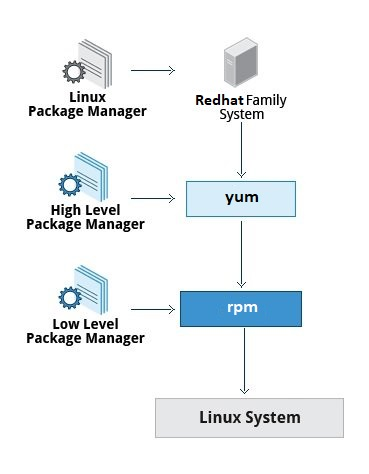
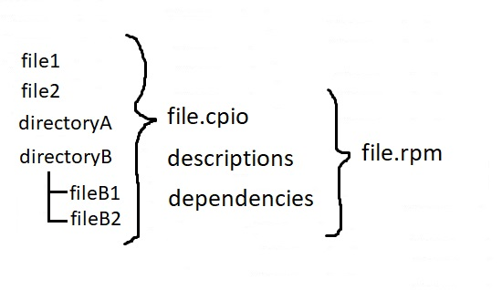

# 102.5. Use RPM and YUM package management

## **102.5 Use RPM and YUM package management**

**Weight:** 3

**Description:** Candidates should be able to perform package management using RPM and YUM tools.

**Key Knowledge Areas:**

* Install, re-install, upgrade and remove packages using RPM and YUM
* Obtain information on RPM packages such as version, status, dependencies, integrity and signatures
* Determine what files a package provides, as well as find which package a specific file comes from

**Terms and Utilities:**

* rpm
* rpm2cpio
* /etc/yum.conf
* /etc/yum.repos.d/
* yum
* yumdownloader

In this lesson we learn how to work with packages in RedHat Distributions. If you are not familiar with Package and package Manager concepts in linux please study first part of previous lesson.



## rpm

RPM (Red Hat Package Manager) is a powerful Package Manager, which can be used to build, install, query, verify, update, and erase individual software packages.

A package consists of an archive of files and meta-data used to install and erase the archive files. The meta-data includes helper scripts, file attributes, and descriptive information about the package.

Packages come in two varieties:** binary packages**, used to encapsulate software to be installed, and **source packages**, containing the source code and recipe necessary to produce binary packages. RPM is the only way to install packages under Linux systems, if you’ve installed packages using source code, then rpm won’t manage it.


RPM deals with .rpm files, which contains the actual information about the packages such as: what it is, from where it comes, dependencies info, version info etc.

### Where to find RPM packages

list of rpm sites, where we can find and download all RPM packages:

* [http://rpmfind.net](http://rpmfind.net)
* [http://www.redhat.com](http://www.redhat.com)
* [http://freshrpms.net/](http://freshrpms.net)
* [http://rpm.pbone.net/](http://rpm.pbone.net)

RPM keeps the information of all the installed packages under /var/lib/rpm database.

```
[root@centos7-1 ~]# ls -l /var/lib/rpm
total 86688
-rw-r--r--. 1 root root  3821568 Dec  5 10:02 Basenames
-rw-r--r--. 1 root root    16384 Dec  5 10:02 Conflictname
-rw-r--r--  1 root root   311296 Dec  8 11:26 __db.001
-rw-r--r--  1 root root    90112 Dec  8 11:26 __db.002
-rw-r--r--  1 root root  1318912 Dec  8 11:26 __db.003
-rw-r--r--. 1 root root  1134592 Dec  5 10:02 Dirnames
-rw-r--r--. 1 root root    32768 Dec  5 10:02 Group
-rw-r--r--. 1 root root    20480 Dec  5 10:02 Installtid
-rw-r--r--. 1 root root    69632 Dec  5 10:02 Name
-rw-r--r--. 1 root root    32768 Dec  5 10:02 Obsoletename
-rw-r--r--. 1 root root 78909440 Dec  5 10:02 Packages
-rw-r--r--. 1 root root  2404352 Dec  5 10:02 Providename
-rw-r--r--. 1 root root   520192 Dec  5 10:02 Requirename
-rw-r--r--. 1 root root   131072 Dec  5 10:02 Sha1header
-rw-r--r--. 1 root root    73728 Dec  5 10:02 Sigmd5
-rw-r--r--. 1 root root     8192 Dec  5 10:02 Triggername
```

They are all binary files, try `cat Basenames` to see.

There are five basic modes for RPM command:

* Install : It is used to install any RPM package.
* Remove : It is used to erase, remove or un-install any RPM package.
* Upgrade : It is used to update the existing RPM package.
* Verify : It is used to verify an RPM packages.
* Query : It is used query any RPM package.

#### Install an RPM Package

\-i is used for installing an rpm software package

```
[root@centos7-1 ~]# rpm -ivh zip-3.0-11.el7.x86_64.rpm 
Preparing...                          ################################# [100%]
Updating / installing...
   1:zip-3.0-11.el7                   ################################# [100%]
```

`-v` verbose for a nicer display\
,`-h` print hash marks as the package archive is unpacked.

#### Check an Installed RPM Package

`-q` option query a package:

```
[root@centos7-1 ~]# rpm -q zip
zip-3.0-11.el7.x86_64
```

#### List all files of an installed RPM package

Use `-ql` **(query list)** with rpm command:

```
[root@centos7-1 ~]# rpm -ql zip
/usr/bin/zip
/usr/bin/zipcloak
/usr/bin/zipnote
/usr/bin/zipsplit
/usr/share/doc/zip-3.0
/usr/share/doc/zip-3.0/CHANGES
/usr/share/doc/zip-3.0/LICENSE
/usr/share/doc/zip-3.0/README
/usr/share/doc/zip-3.0/README.CR
/usr/share/doc/zip-3.0/TODO
/usr/share/doc/zip-3.0/WHATSNEW
/usr/share/doc/zip-3.0/WHERE
/usr/share/doc/zip-3.0/algorith.txt
/usr/share/man/man1/zip.1.gz
/usr/share/man/man1/zipcloak.1.gz
/usr/share/man/man1/zipnote.1.gz
/usr/share/man/man1/zipsplit.1.gz
```

#### Query a file that belongs which RPM Package

`-qf` **(query file) **option help us to find out which package belongs to a file.

```
[root@centos7-1 ~]# rpm -qf /usr/bin/zipsplit 
zip-3.0-11.el7.x86_64
```

#### Query a Information of Installed RPM Package

`-qi` **(query info)** option will print the available information of the installed package.

```
[root@centos7-1 ~]# rpm -qi zip
Name        : zip
Version     : 3.0
Release     : 11.el7
Architecture: x86_64
Install Date: Mon 03 Dec 2018 06:05:54 AM EST
Group       : Applications/Archiving
Size        : 815173
License     : BSD
Signature   : RSA/SHA256, Sun 20 Nov 2016 04:04:58 PM EST, Key ID 24c6a8a7f4a80eb5
Source RPM  : zip-3.0-11.el7.src.rpm
Build Date  : Sat 05 Nov 2016 12:49:55 PM EDT
Build Host  : worker1.bsys.centos.org
Relocations : (not relocatable)
Packager    : CentOS BuildSystem <http://bugs.centos.org>
Vendor      : CentOS
URL         : http://www.info-zip.org/Zip.html
Summary     : A file compression and packaging utility compatible with PKZIP
Description :
The zip program is a compression and file packaging utility.  Zip is
analogous to a combination of the UNIX tar and compress commands and
is compatible with PKZIP (a compression and file packaging utility for
MS-DOS systems).

Install the zip package if you need to compress files using the zip
program.
```

#### Get the Information of RPM Package Before Installing

`-qip` **(query info package)** will print the information of a package , as the package has not been installed there is nothing to read by rpm in its data base, so we need to give full name of the package and it would provide required information directly from rpm package:

```
[root@centos7-1 ~]# rpm -qip htop-2.2.0-1.el7.x86_64.rpm 
Name        : htop
Version     : 2.2.0
Release     : 1.el7
Architecture: x86_64
Install Date: (not installed)
Group       : Unspecified
Size        : 222746
License     : GPLv2+
Signature   : RSA/SHA256, Wed 30 May 2018 06:30:22 PM EDT, Key ID 6a2faea2352c64e5
Source RPM  : htop-2.2.0-1.el7.src.rpm
Build Date  : Wed 30 May 2018 06:26:05 PM EDT
Build Host  : buildvm-31.phx2.fedoraproject.org
Relocations : (not relocatable)
Packager    : Fedora Project
Vendor      : Fedora Project
URL         : http://hisham.hm/htop/
Bug URL     : https://bugz.fedoraproject.org/htop
Summary     : Interactive process viewer
Description :
htop is an interactive text-mode process viewer for Linux, similar to
top(1).
```

`-p` is used to query information from rpm package. We can omit -p and use Package name instead `rpm -qi htop` .

#### check dependencies of RPM Package before Installing

Use `-qpR` options to do a dependency check before installing or upgrading a package

```
[root@centos7-1 ~]# rpm -qpR htop-2.2.0-1.el7.x86_64.rpm 
libc.so.6()(64bit)
libc.so.6(GLIBC_2.14)(64bit)
libc.so.6(GLIBC_2.15)(64bit)
libc.so.6(GLIBC_2.2.5)(64bit)
libc.so.6(GLIBC_2.3)(64bit)
libc.so.6(GLIBC_2.3.4)(64bit)
libc.so.6(GLIBC_2.4)(64bit)
libc.so.6(GLIBC_2.8)(64bit)
libgcc_s.so.1()(64bit)
libgcc_s.so.1(GCC_3.0)(64bit)
libgcc_s.so.1(GCC_3.3.1)(64bit)
libm.so.6()(64bit)
libm.so.6(GLIBC_2.2.5)(64bit)
libncursesw.so.5()(64bit)
libtinfo.so.5()(64bit)
rpmlib(CompressedFileNames) <= 3.0.4-1
rpmlib(FileDigests) <= 4.6.0-1
rpmlib(PayloadFilesHavePrefix) <= 4.0-1
rtld(GNU_HASH)
rpmlib(PayloadIsXz) <= 5.2-1
```

`-R` List capabilities on which this package depends. we can easily use `rpm -qR PackageName` to query an installed package.

**Query configuration file of Installed RPM Packae**

`-qc` **(query configuration file) **will query an installed package for its configuration files, if it has any:

```
[root@centos7-1 ~]# rpm -qc vsftpd
/etc/logrotate.d/vsftpd
/etc/pam.d/vsftpd
/etc/vsftpd/ftpusers
/etc/vsftpd/user_list
/etc/vsftpd/vsftpd.conf
```

If the package is not installed use `-qpc` instead to query a rpm package.

#### Query documentation of Installed RPM Package

`-qdf`**(query document file) **gives a list of available documentation of an installed package:

```
[root@centos7-1 ~]# which zip
/bin/zip
[root@centos7-1 ~]# rpm -qdf /bin/zip
/usr/share/doc/zip-3.0/CHANGES
/usr/share/doc/zip-3.0/LICENSE
/usr/share/doc/zip-3.0/README
/usr/share/doc/zip-3.0/README.CR
/usr/share/doc/zip-3.0/TODO
/usr/share/doc/zip-3.0/WHATSNEW
/usr/share/doc/zip-3.0/WHERE
/usr/share/doc/zip-3.0/algorith.txt
/usr/share/man/man1/zip.1.gz
/usr/share/man/man1/zipcloak.1.gz
/usr/share/man/man1/zipnote.1.gz
/usr/share/man/man1/zipsplit.1.gz
```

#### Verify a installed Package

`-V`**(verify) **verifies a package:

```
[root@centos7-1 ~]# rpm -V telnet
[root@centos7-1 ~]#
```

No news is good news.When verifying a package, RPM produces output only if there is a verification failure. When a file fails verification, the format of the output is a bit cryptic, but it packs all the information you need into one line per file. Here is the format: **`SM5DLUGT c <file>`**` . As an example:`

```
[root@centos7-1 ~]# rpm -V vsftpd 
S.5....T.  c /etc/vsftpd/ftpusers
```

Where:

* **S **is the file size.
* **M** is the file's mode.
* **5** is the MD5 checksum of the file.
* **D** is the file's major and minor numbers.
* **L** is the file's symbolic link contents.
* **U** is owner of the file.
* **G** is the file's group.
* **T** is the modification time of the file.
* **c** appears only if the file is a configuration file. This is handy for quickly identifying config files, as they are very likely to change, and therefore, very unlikely to verify successfully.
* **\<file>** is the file that failed verification. The complete path is listed to make it easy to find.

#### Verify all RPM Packages

Use `-Va`**(Verify all)** to verify all the installed rpm packages.

```
[root@centos7-1 ~]# rpm -Va
S.5....T.  c /etc/cgrules.conf
missing     /var/run/pluto
....L....  c /etc/pam.d/fingerprint-auth
....L....  c /etc/pam.d/password-auth
....L....  c /etc/pam.d/postlogin
....L....  c /etc/pam.d/smartcard-auth
....L....  c /etc/pam.d/system-auth
missing     /var/run/gluster
S.5....T.  c /etc/yum/pluginconf.d/langpacks.conf
S.5....T.  c /etc/plymouth/plymouthd.conf
S.5....T.  c /etc/cups/cups-browsed.conf
.M....G..    /var/log/gdm
missing     /var/run/pulse
S.5....T.  c /etc/sysconfig/authconfig
missing     /var/run/wpa_supplicant
```

use `rpm -Vac` to just verify configuration files.There would be some common system script which are routinely changed.

#### Verify a RPM Package

Verifying a package compares information of installed files of the package against the rpm database.

The`-Vp` **(verify package)** is used to verify a package.

```
[root@centos7-1 ~]# rpm -Vp zip-3.0-11.el7.x86_64.rpm 
[root@centos7-1 ~]# rpm -Vp htop-2.2.0-1.el7.x86_64.rpm 
missing     /usr/bin/htop
missing     /usr/share/applications/htop.desktop
missing     /usr/share/doc/htop-2.2.0
missing   d /usr/share/doc/htop-2.2.0/AUTHORS
missing   d /usr/share/doc/htop-2.2.0/ChangeLog
missing   d /usr/share/doc/htop-2.2.0/README
missing     /usr/share/licenses/htop-2.2.0
missing   l /usr/share/licenses/htop-2.2.0/COPYING
missing   d /usr/share/man/man1/htop.1.gz
missing     /usr/share/pixmaps/htop.png
```

#### List all Installed RPM Packages

`-qa` **(query all)** option, will list all the installed rpm packages.

```
[root@centos7-1 ~]# rpm -qa
NetworkManager-team-1.8.0-9.el7.x86_64
cdparanoia-libs-10.2-17.el7.x86_64
gtkmm30-3.22.0-1.el7.x86_64
python-configshell-1.1.fb23-3.el7.noarch
khmeros-base-fonts-5.0-17.el7.noarch
liberation-fonts-common-1.07.2-15.el7.noarch
kexec-tools-2.0.14-17.el7.x86_64
iptables-1.4.21-18.0.1.el7.centos.x86_64
gnome-dictionary-libs-3.20.0-1.el7.x86_64
gd-2.0.35-26.el7.x86_64
setserial-2.17-33.el7.x86_64
mozilla-filesystem-1.9-11.el7.x86_64
...
<the output has been truncated>
```

use `--last` option to list recently installed RPM Packages.

#### Upgrade a RPM Package

`-U` upgrades or installs the package currently installed to a newer version. This is the same as install, except all other version(s) of the package are removed after the new package is installed.

```
[root@centos7-1 ~]# rpm -Uvh telnet-0.17-64.el7.x86_64.rpm 
Preparing...                          ################################# [100%]
Updating / installing...
   1:telnet-1:0.17-64.el7             ################################# [100%]
```

One of the major advantages of using this option is that it will not only upgrade the latest version of any package, but it will also maintain the backup of the older package so that in case if the newer upgraded package does not run the previously installed package can be used again.(via rpm   --oldpackage switch  or using yum downgrade )

> **rpm -ivh vs rpm -Uvh**
>
> rpm -ivh just installs a package and if the package is already installed it won't do any things, but rpm -Uvh installs it, even if it exists.
>
> Also rpm -ivh might cause having multiple version of a package at the same time but by using rpm -Uvh we are sure that we just have the latest version.

\-F will upgrade packages, but only ones for which an earlier version is installed.( means upgrade if installed other wise do noting)

#### Remove a RPM Package

`-e`** (erase) **option is used to remove package (add `v` or `vv` for more verbosity):

```
[root@centos7-1 ~]# rpm -evv zip
D: loading keyring from pubkeys in /var/lib/rpm/pubkeys/*.key
D: couldn't find any keys in /var/lib/rpm/pubkeys/*.key
D: loading keyring from rpmdb
D: opening  db environment /var/lib/rpm cdb:0x401
D: opening  db index       /var/lib/rpm/Packages 0x400 mode=0x0
D: locked   db index       /var/lib/rpm/Packages
D: opening  db index       /var/lib/rpm/Name 0x400 mode=0x0
D:  read h#    1319 Header SHA1 digest: OK (489efff35e604042709daf46fb78611fe90a75aa)
D: added key gpg-pubkey-f4a80eb5-53a7ff4b to keyring
D:  read h#    1337 Header SHA1 digest: OK (dd737a402556b7653c2bc971f343532046e26384)
D: added key gpg-pubkey-352c64e5-52ae6884 to keyring
D: Using legacy gpg-pubkey(s) from rpmdb
D:  read h#    1341 Header V3 RSA/SHA256 Signature, key ID f4a80eb5: OK
D: opening  db index       /var/lib/rpm/Conflictname 0x400 mode=0x0
D: ========== --- zip-3.0-11.el7 x86_64/linux 0x2
D: opening  db index       /var/lib/rpm/Requirename 0x400 mode=0x0
D: ========== recording tsort relations
D: ========== tsorting packages (order, #predecessors, #succesors, depth)
D:     0    0    0    1   -zip-3.0-11.el7.x86_64
D: erasing packages
D: Selinux disabled.
D: closed   db index       /var/lib/rpm/Conflictname
D: closed   db index       /var/lib/rpm/Requirename
D: closed   db index       /var/lib/rpm/Name
D: closed   db index       /var/lib/rpm/Packages
D: closed   db environment /var/lib/rpm
D: opening  db environment /var/lib/rpm cdb:0x401
D: opening  db index       /var/lib/rpm/Packages (none) mode=0x42
D: sanity checking 1 elements
D: running pre-transaction scripts
D: computing 17 file fingerprints
D: opening  db index       /var/lib/rpm/Name (none) mode=0x42
D: opening  db index       /var/lib/rpm/Basenames (none) mode=0x42
D: opening  db index       /var/lib/rpm/Group (none) mode=0x42
D: opening  db index       /var/lib/rpm/Requirename (none) mode=0x42
D: opening  db index       /var/lib/rpm/Providename (none) mode=0x42
D: opening  db index       /var/lib/rpm/Conflictname (none) mode=0x42
D: opening  db index       /var/lib/rpm/Obsoletename (none) mode=0x42
D: opening  db index       /var/lib/rpm/Triggername (none) mode=0x42
D: opening  db index       /var/lib/rpm/Dirnames (none) mode=0x42
D: opening  db index       /var/lib/rpm/Installtid (none) mode=0x42
D: opening  db index       /var/lib/rpm/Sigmd5 (none) mode=0x42
D: opening  db index       /var/lib/rpm/Sha1header (none) mode=0x42
Preparing packages...
D: computing file dispositions
D: 0x0000fd00     4096     10667163     23530388 /
D: ========== +++ zip-3.0-11.el7 x86_64-linux 0x2
D:  read h#    1341 Header V3 RSA/SHA256 Signature, key ID f4a80eb5: OK
D:     erase: zip-3.0-11.el7 has 17 files
zip-3.0-11.el7.x86_64
D: erase      100644  1 (   0,   0)   619 /usr/share/man/man1/zipsplit.1.gz
D: erase      100644  1 (   0,   0)   819 /usr/share/man/man1/zipnote.1.gz
D: erase      100644  1 (   0,   0)   951 /usr/share/man/man1/zipcloak.1.gz
D: erase      100644  1 (   0,   0) 28496 /usr/share/man/man1/zip.1.gz
D: erase      100644  1 (   0,   0)  3395 /usr/share/doc/zip-3.0/algorith.txt
D: erase      100644  1 (   0,   0) 13167 /usr/share/doc/zip-3.0/WHERE
D: erase      100644  1 (   0,   0) 15731 /usr/share/doc/zip-3.0/WHATSNEW
D: erase      100644  1 (   0,   0)  6675 /usr/share/doc/zip-3.0/TODO
D: erase      100644  1 (   0,   0)  6430 /usr/share/doc/zip-3.0/README.CR
D: erase      100644  1 (   0,   0) 12748 /usr/share/doc/zip-3.0/README
D: erase      100644  1 (   0,   0)  3412 /usr/share/doc/zip-3.0/LICENSE
D: erase      100644  1 (   0,   0)210354 /usr/share/doc/zip-3.0/CHANGES
D: erase      040755  2 (   0,   0)     6 /usr/share/doc/zip-3.0
D: erase      100755  1 (   0,   0)100096 /usr/bin/zipsplit
D: erase      100755  1 (   0,   0) 95984 /usr/bin/zipnote
D: erase      100755  1 (   0,   0)100456 /usr/bin/zipcloak
D: erase      100755  1 (   0,   0)215840 /usr/bin/zip
D:   --- h#    1341 zip-3.0-11.el7.x86_64
D: removing "zip" from Name index.
D: removing 17 entries from Basenames index.
D: removing "Applications/Archiving" from Group index.
D: removing 13 entries from Requirename index.
D: removing 2 entries from Providename index.
D: removing 4 entries from Dirnames index.
D: removing 1 entries from Installtid index.
D: removing 1 entries from Sigmd5 index.
D: removing "ccee29b0ebdbefdec09bb543d7ef43882836c1da" from Sha1header index.
D: running post-transaction scripts
D: closed   db index       /var/lib/rpm/Sha1header
D: closed   db index       /var/lib/rpm/Sigmd5
D: closed   db index       /var/lib/rpm/Installtid
D: closed   db index       /var/lib/rpm/Dirnames
D: closed   db index       /var/lib/rpm/Triggername
D: closed   db index       /var/lib/rpm/Obsoletename
D: closed   db index       /var/lib/rpm/Conflictname
D: closed   db index       /var/lib/rpm/Providename
D: closed   db index       /var/lib/rpm/Requirename
D: closed   db index       /var/lib/rpm/Group
D: closed   db index       /var/lib/rpm/Basenames
D: closed   db index       /var/lib/rpm/Name
D: closed   db index       /var/lib/rpm/Packages
D: closed   db environment /var/lib/rpm
```

rpm take care of dependencies while removing a package and does not remove package dependencies. on the other hand if a package is required by other pacakage(d) rpm avoid removing that.The `–nodeps` **(Do not check dependencies)** option** forcefully** remove the rpm package from the system. But keep in mind removing particular package may break other working applications.

note:If you've made changes to a configuration file that was originally installed by RPM, your changes won't be lost if you erase the package. 

What you can do is just run "rpm -qc packageName" which will show you which configuration files were installed on your system by an rpm. When you have uninstalled the rpm, you can search on your system if any of the files or their backups remain on your system and remove them manually.

### rpm2cpio

From time to time, we might find it necessary to extract one or more files from a package file. One way to do this would be to:

1. Install the package
2. Make a copy of the file(s) you need
3. Erase the package

An easier way would be to use **rpm2cpio**.

**What Files Are In a RPM Package?**



A rpm package is consist of some of files and directories which has been archived in cpio format, in addition some descriptions and dependencies have been added to that.

**What does rpm2cpio do?**

As the name implies, rpm2cpio takes an RPM package file and converts it to a cpio archive. next we need to open cpio archive in order to have orginal file structure.


In this case, the cpio options`-i` Extract one or more files from an archive, `-v`verboe, list the files processed, and `-d`Create leading directories where needed.(We will talk about cpio in next courses)

rpm2cpio takes only only one argument, and even that's optional! The optional argument is the name of the package file to be converted. (If there is no filename specified on the command line, rpm2cpio will simply read from standard input and convert that to a cpio archive.)

```
[root@centos7-1 temp]# ls
zip-3.0-11.el7.x86_64.rpm

[root@centos7-1 temp]# rpm2cpio zip-3.0-11.el7.x86_64.rpm > zip.cpio

[root@centos7-1 temp]# ls
zip-3.0-11.el7.x86_64.rpm  zip.cpio

[root@centos7-1 temp]# cpio -idv < zip.cpio 
./usr/bin/zip
./usr/bin/zipcloak
./usr/bin/zipnote
./usr/bin/zipsplit
./usr/share/doc/zip-3.0
./usr/share/doc/zip-3.0/CHANGES
./usr/share/doc/zip-3.0/LICENSE
./usr/share/doc/zip-3.0/README
./usr/share/doc/zip-3.0/README.CR
./usr/share/doc/zip-3.0/TODO
./usr/share/doc/zip-3.0/WHATSNEW
./usr/share/doc/zip-3.0/WHERE
./usr/share/doc/zip-3.0/algorith.txt
./usr/share/man/man1/zip.1.gz
./usr/share/man/man1/zipcloak.1.gz
./usr/share/man/man1/zipnote.1.gz
./usr/share/man/man1/zipsplit.1.gz
1598 blocks

[root@centos7-1 temp]# ls
usr  zip-3.0-11.el7.x86_64.rpm  zip.cpio
[root@centos7-1 temp]# tree usr/
usr/
├── bin
│   ├── zip
│   ├── zipcloak
│   ├── zipnote
│   └── zipsplit
└── share
    ├── doc
    │   └── zip-3.0
    │       ├── algorith.txt
    │       ├── CHANGES
    │       ├── LICENSE
    │       ├── README
    │       ├── README.CR
    │       ├── TODO
    │       ├── WHATSNEW
    │       └── WHERE
    └── man
        └── man1
            ├── zip.1.gz
            ├── zipcloak.1.gz
            ├── zipnote.1.gz
            └── zipsplit.1.gz

6 directories, 16 files
```

While there's nothing wrong with using rpm2cpio to actually create a cpio archive file, it's takes a few more steps and uses a bit more disk space than is strictly necessary. A somewhat cleaner approach would be to pipe rpm2cpio's output directly into cpio:

```
[root@centos7-1 temp]# rm -rf usr/

[root@centos7-1 temp]# ls
zip-3.0-11.el7.x86_64.rpm  zip.cpio

[root@centos7-1 temp]# rpm2cpio zip-3.0-11.el7.x86_64.rpm | cpio -t
./usr/bin/zip
./usr/bin/zipcloak
./usr/bin/zipnote
./usr/bin/zipsplit
./usr/share/doc/zip-3.0
./usr/share/doc/zip-3.0/CHANGES
./usr/share/doc/zip-3.0/LICENSE
./usr/share/doc/zip-3.0/README
./usr/share/doc/zip-3.0/README.CR
./usr/share/doc/zip-3.0/TODO
./usr/share/doc/zip-3.0/WHATSNEW
./usr/share/doc/zip-3.0/WHERE
./usr/share/doc/zip-3.0/algorith.txt
./usr/share/man/man1/zip.1.gz
./usr/share/man/man1/zipcloak.1.gz
./usr/share/man/man1/zipnote.1.gz
./usr/share/man/man1/zipsplit.1.gz
1598 blocks
[root@centos7-1 temp]# ls
zip-3.0-11.el7.x86_64.rpm  zip.cpio
```

we used the`-t` option to direct cpio to produce a "table of contents" of the archive created by rpm2cpio. This can make it much easier to get the right filename and path when you want to extract a file. An easier way  to exctract would be `rpm2cpio package.rpm | cpio id .`


Warning! Becarefull when removing extracted package (usr vs /usr)


## YUM

The YUM (Yellowdog Updater Modified) is an open-source command-line package-management utility for Linux operating systems using the RPM Package Manager. Yum allows automatic updates, package and dependency management, on RPM-based distributions.

As a high-level tool,like the Advanced Packaging Tool (APT) from Debian, yum works with software repositories (collections of packages), which can be accessed locally or over a network connection.

Yum is implemented as libraries in the Python programming language, with a small set of programs that provide a command-line interface. GUI-based wrappers such as **yumex **also exist.

### /etc/yum.conf

The configuration file for yum and related utilities is located at /etc/yum.conf.

```
[root@centos7-1 ~]# cat /etc/yum.conf 
[main]
cachedir=/var/cache/yum/$basearch/$releasever
keepcache=0
debuglevel=2
logfile=/var/log/yum.log
exactarch=1
obsoletes=1
gpgcheck=1
plugins=1
installonly_limit=5
bugtracker_url=http://bugs.centos.org/set_project.php?project_id=23&ref=http://bugs.centos.org/bug_report_page.php?category=yum
distroverpkg=centos-release


#  This is the default, if you make this bigger yum won't see if the metadata
# is newer on the remote and so you'll "gain" the bandwidth of not having to
# download the new metadata and "pay" for it by yum not having correct
# information.
#  It is esp. important, to have correct metadata, for distributions like
# Fedora which don't keep old packages around. If you don't like this checking
# interupting your command line usage, it's much better to have something
# manually check the metadata once an hour (yum-updatesd will do this).
# metadata_expire=90m

# PUT YOUR REPOS HERE OR IN separate files named file.repo
# in /etc/yum.repos.d
```

This file contains one mandatory \[main] section, which allows us to set Yum options that have global effect, and can also contain one or more \[repository] sections, which allow us to set repository-specific options. However, it is recommended to define individual repositories in new or existing .repo files in the /etc/yum.repos.d/ directory.

### /etc/yum.repos.d

YUM Repository configuration files are stored in /etc/yum.repos.d directory. It contains several .repo files.

```
[root@centos7-1 ~]# ls /etc/yum.repos.d/
CentOS-Base.repo       CentOS-fasttrack.repo  CentOS-Vault.repo
CentOS-CR.repo         CentOS-Media.repo      epel.repo
CentOS-Debuginfo.repo  CentOS-Sources.repo    epel-testing.repo
```

Lets take a look at CentOS-Base.repo file:

```
[root@centos7-1 ~]# cat /etc/yum.repos.d/CentOS-Base.repo 
# CentOS-Base.repo
#
# The mirror system uses the connecting IP address of the client and the
# update status of each mirror to pick mirrors that are updated to and
# geographically close to the client.  You should use this for CentOS updates
# unless you are manually picking other mirrors.
#
# If the mirrorlist= does not work for you, as a fall back you can try the 
# remarked out baseurl= line instead.
#
#

[base]
name=CentOS-$releasever - Base
mirrorlist=http://mirrorlist.centos.org/?release=$releasever&arch=$basearch&repo=os&infra=$infra
#baseurl=http://mirror.centos.org/centos/$releasever/os/$basearch/
gpgcheck=1
gpgkey=file:///etc/pki/rpm-gpg/RPM-GPG-KEY-CentOS-7

#released updates 
[updates]
name=CentOS-$releasever - Updates
mirrorlist=http://mirrorlist.centos.org/?release=$releasever&arch=$basearch&repo=updates&infra=$infra
#baseurl=http://mirror.centos.org/centos/$releasever/updates/$basearch/
gpgcheck=1
gpgkey=file:///etc/pki/rpm-gpg/RPM-GPG-KEY-CentOS-7

#additional packages that may be useful
[extras]
name=CentOS-$releasever - Extras
mirrorlist=http://mirrorlist.centos.org/?release=$releasever&arch=$basearch&repo=extras&infra=$infra
#baseurl=http://mirror.centos.org/centos/$releasever/extras/$basearch/
gpgcheck=1
gpgkey=file:///etc/pki/rpm-gpg/RPM-GPG-KEY-CentOS-7

#additional packages that extend functionality of existing packages
[centosplus]
name=CentOS-$releasever - Plus
mirrorlist=http://mirrorlist.centos.org/?release=$releasever&arch=$basearch&repo=centosplus&infra=$infra
#baseurl=http://mirror.centos.org/centos/$releasever/centosplus/$basearch/
gpgcheck=1
enabled=0
gpgkey=file:///etc/pki/rpm-gpg/RPM-GPG-KEY-CentOS-7
```

Repository configuration files tell yum information about the actual repository (where package files are physically located). While there are a number of optional elements, each .repo file is required to have:

* **Repository ID** - A one word unique repository ID e.g. \[localrepo].
* **Name** - A human readable name for the repository e.g. name=Awesome Local Repo
* M**irrorList** : A mirror list is a list of URLs where Package repositories are stored/present.
* **Baseurl** - A URL to the repodata directory (where the actual files are kept). file://path, ftp://link, [http://link](http://link), and [https://link](https://link) addresses are all valid options.
* **Enabled** - Whether or not to enable the repository for use when performing updates and installs e.g. enabled=1 (1 means "use this repository", 0 defines "do not use this repository").
* **Gpgcheck **- Enable/disable GPG signature checking (example: gpgcheck=1)
* **Gpgkey **- URL to the GPG key (example: gpgkey=[http://mirror.cisp.com/CentOS/6/os/i386/RPM-GPG-KEY-CentOS-6\\](http://mirror.cisp.com/CentOS/6/os/i386/RPM-GPG-KEY-CentOS-6\)/)


GPG is a digital signature check , which is used to verify the package is modified in between your downloads or after making the package, It help to verify the that you are installing the correct package with out any modification from 3 party or a hacker.


YUM can use numerous third party repositories to install packages automatically by resolving their dependencies issues.

### List Enabled Yum Repositories

`yum repolist` list all enabled Yum repositories in your system:

```
[root@centos7-1 ~]# yum repolist 
Loaded plugins: fastestmirror, langpacks
Loading mirror speeds from cached hostfile
 * base: bay.uchicago.edu
 * epel: mirror.karneval.cz
 * extras: mirror.atlanticmetro.net
 * updates: mirror.atlanticmetro.net
repo id                  repo name                                               status
base/7/x86_64            CentOS-7 - Base                                          9,911
epel/x86_64              Extra Packages for Enterprise Linux 7 - x86_64          12,725
extras/7/x86_64          CentOS-7 - Extras                                          434
updates/7/x86_64         CentOS-7 - Updates                                       1,614
repolist: 24,684
```

To list all Enabled and Disabled Yum Repositories use `yum repolist all` command.

### Install a Package with YUM

We can install new software on Red Hat/CentOS Linux with `yum install packagename` command from console.

Running this command first checks for existing YUM Repository configuration files in /etc/yum.repos.d/ directory. It reads each YUM Repository configuration file to get the information required to download and install new software, resolves software dependencies and installs the required RPM package files.

```
[root@centos7-1 ~]# yum install zip
Loaded plugins: fastestmirror, langpacks
Loading mirror speeds from cached hostfile
 * base: bay.uchicago.edu
 * epel: epel.mirror.far.fi
 * extras: mirror.atlanticmetro.net
 * updates: mirror.atlanticmetro.net
Resolving Dependencies
--> Running transaction check
---> Package zip.x86_64 0:3.0-11.el7 will be installed
--> Finished Dependency Resolution

Dependencies Resolved

=======================================================================================
 Package          Arch                Version                  Repository         Size
=======================================================================================
Installing:
 zip              x86_64              3.0-11.el7               base              260 k

Transaction Summary
=======================================================================================
Install  1 Package

Total download size: 260 k
Installed size: 796 k
Is this ok [y/d/N]: y
Downloading packages:
zip-3.0-11.el7.x86_64.rpm                                       | 260 kB  00:00:46     
Running transaction check
Running transaction test
Transaction test succeeded
Running transaction
  Installing : zip-3.0-11.el7.x86_64                                               1/1 
  Verifying  : zip-3.0-11.el7.x86_64                                               1/1 

Installed:
  zip.x86_64 0:3.0-11.el7                                                              

Complete!
```

use `-y` option if you do not like to be asked for confimation. If you have a rpm package use `yum localinstall abc.rpm` .

### Removing a Package with YUM

`yum remove packagename` remove a package completely with their all dependencies.

```
[root@centos7-1 ~]# yum remove zip
Loaded plugins: fastestmirror, langpacks
Resolving Dependencies
--> Running transaction check
---> Package zip.x86_64 0:3.0-11.el7 will be erased
--> Finished Dependency Resolution

Dependencies Resolved

=======================================================================================
 Package          Arch                Version                 Repository          Size
=======================================================================================
Removing:
 zip              x86_64              3.0-11.el7              @base              796 k

Transaction Summary
=======================================================================================
Remove  1 Package

Installed size: 796 k
Is this ok [y/N]: y
Downloading packages:
Running transaction check
Running transaction test
Transaction test succeeded
Running transaction
  Erasing    : zip-3.0-11.el7.x86_64                                               1/1 
  Verifying  : zip-3.0-11.el7.x86_64                                               1/1 

Removed:
  zip.x86_64 0:3.0-11.el7                                                              

Complete!
```

Same way the remove command will ask confirmation before removing a package. To disable it just add option `-y` .

### Search for a Package using YUM

Use `yum search` function to search all the available packages to match the name of the package you specified.

```
[root@centos7-1 ~]# yum search firefox
Loaded plugins: fastestmirror, langpacks
Loading mirror speeds from cached hostfile
 * base: bay.uchicago.edu
 * epel: epel.mirror.far.fi
 * extras: mirror.atlanticmetro.net
 * updates: mirror.atlanticmetro.net
================================ N/S matched: firefox =================================
firefox.x86_64 : Mozilla Firefox Web browser
firefox.i686 : Mozilla Firefox Web browser
firefox-noscript.noarch : JavaScript white list extension for Mozilla Firefox
firefox-pkcs11-loader.x86_64 : Helper script for Firefox that sets up the browser for
                             : authentication with Estonian ID-card
mozilla-adblockplus.noarch : Adblocking extension for Mozilla Firefox, Thunderbird, and
                           : SeaMonkey
mozilla-https-everywhere.noarch : HTTPS enforcement extension for Mozilla Firefox
mozilla-noscript.noarch : JavaScript white list extension for Mozilla Firefox
mozilla-requestpolicy.noarch : Firefox and Seamonkey extension that gives you control
                             : over cross-site requests
mozilla-ublock-origin.noarch : An efficient blocker for Firefox
webextension-token-signing.x86_64 : Firefox extension for signing with your eID on the
                                  : web

  Name and summary matches only, use "search all" for everything.
```

### Get Information of a Package using YUM

With`yum info packagename` we can get information of a package before installing or an installed package:

```
[root@centos7-1 ~]# htop
bash: htop: command not found...
Similar command is: 'top'
[root@centos7-1 ~]# yum info htop
Loaded plugins: fastestmirror, langpacks
Loading mirror speeds from cached hostfile
 * base: bay.uchicago.edu
 * epel: epel.mirror.far.fi
 * extras: mirror.atlanticmetro.net
 * updates: mirror.atlanticmetro.net
Available Packages
Name        : htop
Arch        : x86_64
Version     : 2.2.0
Release     : 1.el7
Size        : 103 k
Repo        : epel/x86_64
Summary     : Interactive process viewer
URL         : http://hisham.hm/htop/
License     : GPLv2+
Description : htop is an interactive text-mode process viewer for Linux, similar to
            : top(1).
```

### Get information about dependencies of a package

Use yum deplist command to know about dependencies of a package which would be installed on our system:

```
[root@centos7-1 ~]# yum deplist htop
Loaded plugins: fastestmirror, langpacks
Loading mirror speeds from cached hostfile
 * base: bay.uchicago.edu
 * epel: mirror.23media.de
 * extras: mirror.atlanticmetro.net
 * updates: mirror.atlanticmetro.net
package: htop.x86_64 2.2.0-1.el7
  dependency: libc.so.6(GLIBC_2.15)(64bit)
   provider: glibc.x86_64 2.17-222.el7
  dependency: libgcc_s.so.1()(64bit)
   provider: libgcc.x86_64 4.8.5-28.el7_5.1
  dependency: libgcc_s.so.1(GCC_3.0)(64bit)
   provider: libgcc.x86_64 4.8.5-28.el7_5.1
  dependency: libgcc_s.so.1(GCC_3.3.1)(64bit)
   provider: libgcc.x86_64 4.8.5-28.el7_5.1
  dependency: libm.so.6()(64bit)
   provider: glibc.x86_64 2.17-222.el7
  dependency: libm.so.6(GLIBC_2.2.5)(64bit)
   provider: glibc.x86_64 2.17-222.el7
  dependency: libncursesw.so.5()(64bit)
   provider: ncurses-libs.x86_64 5.9-14.20130511.el7_4
  dependency: libtinfo.so.5()(64bit)
   provider: ncurses-libs.x86_64 5.9-14.20130511.el7_4
  dependency: rtld(GNU_HASH)
   provider: glibc.x86_64 2.17-222.el7
   provider: glibc.i686 2.17-222.el7
```

`yum install`automatically installs all of them.

### Yum Provides Function

`yum provide` finds packages that provide the queried file:

```
[root@centos7-1 ~]# yum provides /etc/updatedb.conf 
Loaded plugins: fastestmirror, langpacks
Loading mirror speeds from cached hostfile
 * base: bay.uchicago.edu
 * epel: epel.besthosting.ua
 * extras: mirror.atlanticmetro.net
 * updates: mirror.atlanticmetro.net
mlocate-0.26-8.el7.x86_64 : An utility for finding files by name
Repo        : base
Matched from:
Filename    : /etc/updatedb.conf


mlocate-0.26-6.el7.x86_64 : An utility for finding files by name
Repo        : @anaconda
Matched from:
Filename    : /etc/updatedb.conf
```

also we can use`yum whatprovide /*filename` instead.

### List all Available Packages

`yum list` list all the available packages in the Yum database.

```
[root@centos7-1 ~]# yum list
```

### List all Installed Packages using YUM

```
[root@centos7-1 ~]# yum list installed
```

### Working with yum** Cache**

By default, yum deletes downloaded data files when they are no longer needed after a successful operation. This minimizes the amount of storage space that yum uses. However, we can enable caching, so that the package files downloaded by yum stay in cache directories. By using cached data, you can carry out certain operations without a network connection, we can also copy packages stored in the caches and reuse them elsewhere.

Yum stores temporary files in the`/var/cache/yum/$basearch/$releasever/`directory,

```
[root@centos7-1 ~]# ls /var/cache/yum/x86_64/7/
base  epel  extras  timedhosts  timedhosts.txt  updates
```

Each configured repository has one subdirectory.T o change the default cache location, modify the **cachedir **option in the **\[main] **section of the `/etc/yum.conf`configuration file.

**Enabling the cache**

To retain the cache of packages after a successful installation, we can enable the cache** **editing **keppcache = 1** in the \[main] section of`/etc/yum.conf`.

To download and make usable all the metadata for the currently enabled yum repositories, use `yum makecache` command.It makes sure that the cache is fully up to date with all metadata.This make sure that the cache is fully up to date with all metadata. To set the time after which the metadata will expire, use the **metadata-expire** setting in`/etc/yum.conf`.

**Using yum in Cache-only Mode**

To carry out a yum command without a network connection, add the `-C` (not `-c` )or `--cacheonly` command-line option. With this option, yum proceeds without checking any network repositories, and uses only cached files. In this mode, yum may only install packages that have been downloaded and cached by a previous operation.

```
[root@centos7-1 ~]# yum -C install zip
Loaded plugins: fastestmirror, langpacks
Resolving Dependencies
--> Running transaction check
---> Package zip.x86_64 0:3.0-11.el7 will be installed
--> Finished Dependency Resolution

Dependencies Resolved

=======================================================================================
 Package          Arch                Version                  Repository         Size
=======================================================================================
Installing:
 zip              x86_64              3.0-11.el7               base              260 k

Transaction Summary
=======================================================================================
Install  1 Package

Total download size: 260 k
Installed size: 796 k
Is this ok [y/d/N]:
```

**clearing the yum caches**

It is often useful to remove entries accumulated in the `/var/cache/yum/` directory. If we remove a package from the cache, we do not affect the copy of the software installed on our system. To remove all entries for currently enabled repositories from the cache, run `yum clean all` as a root.

### Check for Available Updates using Yum

use `yum check-update` To find how many of installed packages on our system have updates available:

```
[root@centos7-1 ~]# yum check-update 
Loaded plugins: fastestmirror, langpacks
Loading mirror speeds from cached hostfile
 * base: bay.uchicago.edu
 * epel: epel.mirror.far.fi
 * extras: mirror.atlanticmetro.net
 * updates: mirror.atlanticmetro.net

ModemManager.x86_64                       1.6.10-1.el7                   base   
ModemManager-glib.x86_64                  1.6.10-1.el7                   base   
NetworkManager.x86_64                     1:1.10.2-16.el7_5              updates
NetworkManager-adsl.x86_64                1:1.10.2-16.el7_5              updates
NetworkManager-bluetooth.x86_64           1:1.10.2-16.el7_5              updates
NetworkManager-glib.x86_64                1:1.10.2-16.el7_5              updates
NetworkManager-libnm.x86_64               1:1.10.2-16.el7_5              updates
NetworkManager-ppp.x86_64                 1:1.10.2-16.el7_5              updates
NetworkManager-team.x86_64                1:1.10.2-16.el7_5              updates
NetworkManager-tui.x86_64                 1:1.10.2-16.el7_5              updates
NetworkManager-wifi.x86_64                1:1.10.2-16.el7_5              updates
...
<output has been truncated>
```

### Update System using Yum

yum update keep our system up-to-date with all security and binary package updates

```
[root@centos7-1 ~]# yum update 
Loaded plugins: fastestmirror, langpacks
Loading mirror speeds from cached hostfile
 * base: bay.uchicago.edu
 * epel: epel.mirror.far.fi
 * extras: mirror.atlanticmetro.net
 * updates: mirror.atlanticmetro.net
Resolving Dependencies
--> Running transaction check
---> Package ModemManager.x86_64 0:1.6.0-2.el7 will be updated
---> Package ModemManager.x86_64 0:1.6.10-1.el7 will be an update
...
--> Finished Dependency Resolution

Dependencies Resolved

=======================================================================================
 Package                           Arch   Version                        Repository
                                                                                  Size
=======================================================================================
Installing:
 grub2                             x86_64 1:2.02-0.65.el7.centos.2       base     29 k
     replacing  grub2.x86_64 1:2.02-0.64.el7.centos
 grub2-tools                       x86_64 1:2.02-0.65.el7.centos.2       base    1.8 M
     replacing  grub2-tools.x86_64 1:2.02-0.64.el7.centos
 grub2-tools-extra                 x86_64 1:2.02-0.65.el7.centos.2       base    993 k
     replacing  grub2-tools.x86_64 1:2.02-0.64.el7.centos
 grub2-tools-minimal               x86_64 1:2.02-0.65.el7.centos.2       base    170 k
     replacing  grub2-tools.x86_64 1:2.02-0.64.el7.centos
 kernel                            x86_64 3.10.0-862.14.4.el7            updates  46 M
Updating:
 ModemManager                      x86_64 1.6.10-1.el7                   base    735 k
 ModemManager-glib                 x86_64 1.6.10-1.el7                   base    231 k
 NetworkManager                    x86_64 1:1.10.2-16.el7_5              updates 1.7 M
 NetworkManager-adsl               x86_64 1:1.10.2-16.el7_5              updates 159 k
 NetworkManager-bluetooth          x86_64 1:1.10.2-16.el7_5              updates 179 k
...
mesa-libwayland-egl               x86_64 17.2.3-8.20171019.el7          base     17 k
 unbound-libs                      x86_64 1.6.6-1.el7                    base    405 k
 volume_key-libs                   x86_64 0.3.9-8.el7                    base    140 k

Transaction Summary
=======================================================================================
Install    5 Packages (+20 Dependent packages)
Upgrade  578 Packages

Total size: 552 M
Is this ok [y/d/N]: y
...
```

### Updating a Package using YUM

`yum update packagename`will update a package and automatically resolves all dependencies issues and install them.

```
[root@centos7-1 ~]# yum update firefox -y
Loaded plugins: fastestmirror, langpacks
Loading mirror speeds from cached hostfile
 * base: bay.uchicago.edu
 * epel: epel.mirror.far.fi
 * extras: mirror.atlanticmetro.net
 * updates: mirror.atlanticmetro.net
Resolving Dependencies
--> Running transaction check
---> Package firefox.x86_64 0:52.2.0-2.el7.centos will be updated
---> Package firefox.x86_64 0:60.3.0-1.el7.centos will be an update
--> Processing Dependency: nss >= 3.36.0 for package: firefox-60.3.0-1.el7.centos.x86_64
--> Processing Dependency: nspr >= 4.19.0 for package: firefox-60.3.0-1.el7.centos.x86_64
--> Processing Dependency: libdbus-1.so.3(LIBDBUS_1_3)(64bit) for package: firefox-60.3.0-1.el7.centos.x86_64
...
Dependencies Resolved
=======================================================================================
 Package                  Arch         Version                     Repository     Size
=======================================================================================
Updating:
 firefox                  x86_64       60.3.0-1.el7.centos         updates        91 M
Updating for dependencies:
 dbus                     x86_64       1:1.10.24-7.el7             base          245 k
 dbus-libs                x86_64       1:1.10.24-7.el7             base          169 k
 dbus-x11                 x86_64       1:1.10.24-7.el7             base           47 k
...
Transaction Summary
=======================================================================================
Upgrade  1 Package (+10 Dependent packages)

Total size: 93 M
Downloading packages:
Running transaction check
Running transaction test
Transaction test succeeded
Running transaction
  Updating   : nspr-4.19.0-1.el7_5.x86_64                                         1/22 
  Updating   : nss-util-3.36.0-1.el7_5.x86_64                                     2/22 
...
  Cleanup    : 1:dbus-libs-1.6.12-17.el7.x86_64                                  20/22 
  Cleanup    : nspr-4.13.1-1.0.el7_3.x86_64                                      21/22 
  Cleanup    : nss-softokn-freebl-3.28.3-6.el7.x86_64                            22/22 
  Verifying  : 1:dbus-x11-1.10.24-7.el7.x86_64                                    1/22 
  Verifying  : 1:dbus-libs-1.10.24-7.el7.x86_64                                   2/22 
  Verifying  : firefox-60.3.0-1.el7.centos.x86_64                                 3/22 
...
  Verifying  : firefox-52.2.0-2.el7.centos.x86_64                                21/22 
  Verifying  : nss-softokn-freebl-3.28.3-6.el7.x86_64                            22/22 

Updated:
  firefox.x86_64 0:60.3.0-1.el7.centos                                                 

Dependency Updated:
  dbus.x86_64 1:1.10.24-7.el7                   dbus-libs.x86_64 1:1.10.24-7.el7      
  dbus-x11.x86_64 1:1.10.24-7.el7               nspr.x86_64 0:4.19.0-1.el7_5          
  nss.x86_64 0:3.36.0-7.el7_5                   nss-softokn.x86_64 0:3.36.0-5.el7_5   
  nss-softokn-freebl.x86_64 0:3.36.0-5.el7_5    nss-sysinit.x86_64 0:3.36.0-7.el7_5   
  nss-tools.x86_64 0:3.36.0-7.el7_5             nss-util.x86_64 0:3.36.0-1.el7_5      

Complete!
```

If you have a rpm package you can use `yum localupdate abc.rpm` .

> ### YUM update vs YUM upgrade
>
> `yum upgrade` and `yum update` will perform the same function that update to the latest current version of package.
>
> `yum upgrade` **forces **the removal of obsolete packages, while `yum update` may or may not also do this. The removal of obsolete packages can be risky, as it may remove packages that you use.\
> This makes `yum update` the safer option.
>
> note: The behaviour might be different based on your distribution and version.

### Working with Group Packages

In Linux, number of packages are bundled to particular group , called** Group Packages**. Instead of working with individual packages with yum, we can work particular group that will install/remove/update all the related packages that belongs to the group.

```
# yum grouplist :
# yum groupinstall 'MySQL Database'
# yum groupupdate 'DNS Name Server'
# yum groupremove 'DNS Name Server'
```

## YUM Shell

Yum utility provides a custom shell where you can execute multiple commands.

```
[root@centos7-1 ~]# yum shell 
Loaded plugins: fastestmirror, langpacks
> list
list             list-sec         list-security    list-updateinfo  
> group
group         groupinfo     grouplist     groups        
grouperase    groupinstall  groupremove   groupupdate   
> quit
Leaving Shell
```

## yumdownloader

How do I use yum to download a package without installing it? There are multiple ways in which you can download a yum package without installing it. The 2 most commonly used methods are described here in the post.

1. using the “downloadonly” plugin for yum
2. using “yumdownloader” utility.

**Method 1** : using the “**downloadonly**” plugin for yum:

First install the package including “downloadonly” plugin:

```
(RHEL5)
# yum install yum-downloadonly

(RHEL6)
# yum install yum-plugin-downloadonly
```

syntax:

```
yum install --downloadonly --downloaddir=[directory] [package]
```

If you do not use `--downloaddir` option, it would be saved in `/var/cache/yum/ in rhel-{arch}-channel/packages directory`.

example:

```
 yum install --downloadonly --downloaddir=/tmp firefox
```

**Method 2 **: using the “**yumdownloader**” utility

First install the yum-utils package:

```
yum install yum-utils
```

syntax:

```
yumdownloader --destdir [directory] [package]
```

example:

```
yumdownloader --destdir /tmp firefox
```

try`yumdownloader --help` to see some of usefull switches such as :

```
--urls     Instead of downloading RPMs, list the URLs that would be downloaded.
--resolve  When downloading RPMs, resolve dependencies and also download the required packages.
--source   Instead of downloading the binary RPMs, download the source RPMs
...
```

 the `--resolve` switch is usefull inorder to download a package ant its dependencies and lets us to use them in other system.

### to view history of Yum commands (update, install, remove)

We can either use `yum history` command :

```
[root@centos7-1 ~]# yum history 
Loaded plugins: fastestmirror, langpacks
ID     | Login user               | Date and time    | Action(s)      | Altered
-------------------------------------------------------------------------------
    11 | payam  <payam>          | 2018-12-05 10:02 | Update         |   11   
    10 | payam  <payam>          | 2018-12-04 14:54 | Erase          |    1   
     9 | payam  <payam>          | 2018-12-04 14:45 | Install        |    1   
     8 | payam  <payam>          | 2018-12-04 14:44 | Erase          |    1  <
     7 | payam  <payam>          | 2018-12-03 06:03 | Erase          |    3 > 
     6 | payam  <payam>          | 2018-11-19 05:14 | I, U           |    3   
     5 | payam  <payam>          | 2018-11-18 03:46 | Install        |    1   
     4 | payam  <payam>          | 2018-10-20 13:01 | Install        |    1   
     3 | payam  <payam>          | 2018-10-13 03:38 | Install        |   12   
     2 | payam  <payam>          | 2018-08-26 04:48 | I, U           |    3   
     1 | System <unset>           | 2017-10-28 11:18 | Install        | 1318   
history list
```

or see yum log file in `/var/log/yum` directory:

```
[root@centos7-1 ~]# tail -5 /var/log/yum.log 
Dec 05 10:02:27 Updated: nss-sysinit-3.36.0-7.el7_5.x86_64
Dec 05 10:02:27 Updated: nss-3.36.0-7.el7_5.x86_64
Dec 05 10:02:37 Updated: firefox-60.3.0-1.el7.centos.x86_64
Dec 05 10:02:37 Updated: nss-tools-3.36.0-7.el7_5.x86_64
Dec 05 10:02:37 Updated: 1:dbus-x11-1.10.24-7.el7.x86_64
```

### Summary

Fedora Family System:

* **Red Hat Package Manager (rpm)**:
  * low-level or underlying packet manager
* **Yellowdog Updater (yum)**:
  * The high-level package manager differs between distribution but yum is commonly used
* **Dandified Yum (dnf)**:
  * It is the next-generation version of yum

.

.

.

sources:

[http://www.pepedocs.com/notes?tid=linux\&nid=lfs101x#ch6](http://www.pepedocs.com/notes?tid=linux\&nid=lfs101x#ch6)

[https://linux.die.net/man/8/rpm](https://linux.die.net/man/8/rpm)

[https://www.tecmint.com/20-practical-examples-of-rpm-commands-in-linux/](https://www.tecmint.com/20-practical-examples-of-rpm-commands-in-linux/)

[http://ftp.rpm.org/max-rpm/s1-rpm-verify-output.html](http://ftp.rpm.org/max-rpm/s1-rpm-verify-output.html)(rpm -V)

[https://serverfault.com/questions/747089/whats-the-diff-between-rpm-u-and-rpm-f?rq=1](https://serverfault.com/questions/747089/whats-the-diff-between-rpm-u-and-rpm-f?rq=1)

[http://ftp.rpm.org/max-rpm/s1-rpm-erase-and-config-files.html](http://ftp.rpm.org/max-rpm/s1-rpm-erase-and-config-files.html)

[https://www.linuxquestions.org/questions/linux-software-2/can-rpm-remove-config-files-during-uninstall-537423/](https://www.linuxquestions.org/questions/linux-software-2/can-rpm-remove-config-files-during-uninstall-537423/)

[http://ftp.rpm.org/max-rpm/s1-rpm-miscellania-rpm2cpio.html](http://ftp.rpm.org/max-rpm/s1-rpm-miscellania-rpm2cpio.html)

[https://blog.packagecloud.io/eng/2015/10/13/inspect-extract-contents-rpm-packages/](https://blog.packagecloud.io/eng/2015/10/13/inspect-extract-contents-rpm-packages/)(what is inside rmp)

[https://www.tecmint.com/20-linux-yum-yellowdog-updater-modified-commands-for-package-mangement/](https://www.tecmint.com/20-linux-yum-yellowdog-updater-modified-commands-for-package-mangement/)

[https://access.redhat.com/documentation/en-us/red_hat_enterprise_linux/6/html/deployment_guide/sec-configuring_yum_and_yum_repositories](https://access.redhat.com/documentation/en-us/red_hat_enterprise_linux/6/html/deployment_guide/sec-configuring_yum_and_yum_repositories)(yum.conf)

[https://www.quora.com/What-is-gpgcheck-in-a-yum-configuration-file-in-Rhel](https://www.quora.com/What-is-gpgcheck-in-a-yum-configuration-file-in-Rhel)

[https://www.digitalocean.com/community/tutorials/how-to-set-up-and-use-yum-repositories-on-a-centos-6-vps](https://www.digitalocean.com/community/tutorials/how-to-set-up-and-use-yum-repositories-on-a-centos-6-vps)

[https://superuser.com/questions/1252958/explanation-of-the-contents-inside-folder-etc-yum-repos-d](https://superuser.com/questions/1252958/explanation-of-the-contents-inside-folder-etc-yum-repos-d)

[https://access.redhat.com/documentation/en-us/red_hat_enterprise_linux/6/html/deployment_guide/sec-working_with_yum_cache](https://access.redhat.com/documentation/en-us/red_hat_enterprise_linux/6/html/deployment_guide/sec-working_with_yum_cache)( working with yum cache)

[https://www.hivelocity.net/kb/how-to-clear-the-yum-cache/](https://www.hivelocity.net/kb/how-to-clear-the-yum-cache/) (clear cache)

[https://access.redhat.com/solutions/10154](https://access.redhat.com/solutions/10154)

[https://www.thegeekdiary.com/how-to-use-yum-downloadonly-to-download-a-package-without-installing-it/](https://www.thegeekdiary.com/how-to-use-yum-downloadonly-to-download-a-package-without-installing-it/)

.
