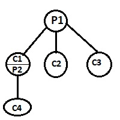
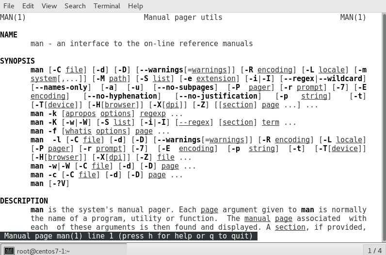

# 103.1. Work on the command line

### **103.1 Work on the command line**

**Weight**: 4

**Description:**Candidates should be able to interact with shells and commands using the command line. The objective assumes the Bash shell.

**Key Knowledge Areas:**

* Use single shell commands and one line command sequences to perform basic tasks on the command line
* Use and modify the shell environment including defining, referencing and exporting environment variables
* Use and edit command history
* Invoke commands inside and outside the defined path

**Terms and Utilities:**

* bash
* echo
* env
* export
* pwd
* set
* unset
* man
* uname
* history
* .bash_history

**What's A "Terminal?"**

It's a program called a terminal emulator. This is a program that opens a window and lets you interact with the **shell**. There are a bunch of different terminal emulators we can use. Most Linux distributions supply several, such as: gnome-terminal, konsole, xterm, **... ,** It is also called Console.

**What is "The Shell"?**

Simply put, the shell is a program that takes commands from the keyboard and gives them to the operating system to perform. In the old days, it was the only user interface available on a Unix-like system such as Linux. Nowadays, we have graphical user interfaces (GUIs) in addition to command line interfaces (CLIs) such as the shell.


**What is The "bash"?**

On most Linux systems a program called **bash acts as the shell** program. bash stands for **Bourne Again SHell**, an enhanced version of the original Unix shell program, sh, written by Steve Bourne

Besides, There are other shell programs that can be installed in a Linux system. These include: ksh, tcsh and zsh.

```
[root@centos7-1 ~]# ls -ls /bin/sh
0 lrwxrwxrwx. 1 root root 4 Oct 28  2017 /bin/sh -> bash
```

note: Historically the original /bin/sh Bourne shell would use **$** as the normal prompt and **# **for the root user prompt This made it pretty easy to tell if you were running as superuser or not.

```
[root@centos7-1 ~]# 
[root@centos7-1 ~]# su - user1
Last login: Mon Dec 10 11:44:47 EST 2018 on pts/0
[user1@centos7-1 ~]$ 
[user1@centos7-1 ~]$ su - root
Password: 
Last login: Wed Dec 12 14:34:32 EST 2018 on pts/0
[root@centos7-1 ~]# 
```

**Standard Input, Standard Output and Standard Error**

In general, a command (a program):

* Gets data to process from standard input or **stdin **(default: keyboard).
* Returns processed data to standard output or **stdout **(default: screen).
* If program execution causes errors, error messages are sent to standard error or **stderr **(default: screen).


### echo

echo is one of the most commonly and widely used built-in command for Linux bash and C shells, that typically used in scripting language and batch files to display a line of text/string on standard output or a file.

The syntax for echo is: `echo [option(s)] [string(s)]`

example : Input a line of text and display on standard output:

```
[root@centos7-1 ~]# echo  Lets start learning Linux
Lets start learning Linux
```

The echo command has a couple of options. Normally, echo will append a trailing new line character to the output. Use the`-n`option to suppress this:

```
[root@centos7-1 ~]# echo -n Lets start learning Linux
Lets start learning Linux[root@centos7-1 ~]# 
```

#### Special Characters or Meta Characters

What makes a character special? If it has a meaning beyond its literal meaning, a meta-meaning, then we refer to it as a special character or metacharacters  like : **``| & ; ( ) < > [ ] { } * ! ? ` ' " $ \ / # ``**

**pound sign (#)**

Everything written after a pound sign (#) is ignored by the shell. This is useful to write a shell comment, but has no influence on the command execution or shell expansion.

```
[root@centos7-1 temp]# ls # ls /etc
zip-3.0-11.el7.x86_64.rpm  zip.cpio
```

**end of line backslash \\**

Lines ending in a backslash are continued on the next line. The shell does not interpret the newline character and will wait on shell expansion and execution of the command line until a newline without backslash is encountered.

```
[root@centos7-1 ~]# echo first line second line \
> 2nd line \
> 3rd line
first line second line 2nd line 3rd line
```

**escaping special characters  **

The backslash  character enables the use of control characters, but without the shell interpreting it, this is called **escaping characters**.

```
[root@centos7-1 ~]# echo hello | by
bash: by: command not found...
[root@centos7-1 ~]# echo hello \| by
hello | by
[root@centos7-1 ~]# echo hello ; by
hello
bash: by: command not found...
[root@centos7-1 ~]# echo hello \; by
hello ; by
```


 **Double quotes " " **

Enclosing characters in double quotes (`"`) preserves the literal value of all characters within the quotes, \[_with the exception of `$`, `` ` ``, `\`, and, when history expansion is enabled, `! `_ ._The characters `$` and `` ` `` retain their special meaning within double quotes_`].`

```
[root@centos7-1 ~]# echo "hello | by"
hello | by 
[root@centos7-1 ~]# echo "hello ; by" 
hello ; by
```


Lets take a look at other options of echo command:

```
       -n     do not output the trailing newline
       -e     enable interpretation of backslash escapes
       -E     disable interpretation of backslash escapes (default)
       --help display this help and exit
       --version
              output version information and exit

       If -e is in effect, the following sequences are recognized:
               \b     backspace
               \\     backslash
               \n     new line
               \r     carriage return
               \t     horizontal tab
               \v     vertical tab
```

Use the`-e`option to enable certain backslash **escaped characters** to have special meaning.

| Escape sequence | Function                                               |
| --------------- | ------------------------------------------------------ |
| \a              | Alert (bell)                                           |
| \b              | Backspace                                              |
| \c              | Suppress trailing newline (same function as -n option) |
| \f              | Form feed (clear the screen on a video display)        |
| \n              | New line                                               |
| \r              | Carriage return                                        |
| \t              | Horizontal tab                                         |
| \v              | vertical tab                                           |

Some examples:

```
[root@centos7-1 ~]# echo -e "Lets \vstart \vlearning \vLinux"
Lets 
     start 
           learning 
                    Linux
[root@centos7-1 ~]# echo -e "Lets \tstart \tlearning \tLinux"
Lets     start     learning     Linux
```

One of echo command usage is getting variable values with `echo $VARIABLENAME` command. We will see that.

```
[root@centos7-1 ~]# echo $LD_LIBRARY_PATH

```

### **Control Operators**

Certain metacharacters or pairs of metacharacters also serve as control operators:** `|| && & ; ;; | ()`**

Some of these control operators allow you to create sequences or lists of commands.

#### Linux command chaining

Sometimes we would want to run multiple commands in succession or simultaneously. This allows us to automate a process that include several commands that may or may not depend on the result of the previous command.

**Linux command chaining** is the method of combining several different commands such that each of them can execute in succession based on the operator that separate them. The important part of chaining is the operators that we use to combine them. These operators determine how the commands execute.

Lets take a look at some of operators that are used mostly to combine different commands :

**Semi-Colon** (**;**) : The succeeding commands will execute regardless of the exit status of the command that precedes it.

```
[root@centos7-1 ~]# ls /root/ ; ls /home/
anaconda-ks.cfg              mydb.ldif                      usr
htop-2.2.0-1.el7.x86_64.rpm  set.txt                        zip-3.0-11.el7.x86_64.rpm
initial-setup-ks.cfg         telnet-0.17-64.el7.x86_64.rpm  zip.cpio
managersou.ldif              temp
ldapadm  pabros  payam  user1  user2
```

**Logical AND** (**&&**) : This command that follows this operator will execute only if the preceding command executes successfully.

```
[root@centos7-1 ~]# true && ls /home/
ldapadm  pabros  payam  user1  user2
```

**Logical OR** (**||**) : The command that follows will execute only if the preceding command fails.

```
[root@centos7-1 ~]# false || ls /home/
ldapadm  pabros  payam  user1  user2
```

## Environment Variables

Environment Variables are some special variables that are defined in shell and are needed by programs while execution. They can be system defined or user defined.

System defined variables are those which are set by system and are used by system level programs. 

The whole concept of setting and un-setting environment variables revolves around some set of files and few commands and different shells.

an environment variable can be in three types:

**1. Local Environment Variable** :One defined for the current session. These environment variables last only till the current session, be it remote login session, or local terminal session. These variables are not specified in any configuration files and are created, and removed by using a special set of commands.

**2. User Environment Variable** : These are the variables which are defined for a particular user and are loaded every time a user logs in using a local terminal session or that user is logged in using remote login session. These variables are typically set in and loaded from some configuration files which are present in user’s home directory.

**3. System wide Environment Variables** :These are the environment variables which are available system-wide, i.e. for all the users present on that system. These variables are present in system-wide configuration files present in /etc directories and files.These variables are loaded every time system is powered on and logged in either locally or remotely by any user.

### env

By default, "env" command lists all the current environment variables.

```
[root@centos7-1 ~]# env
XDG_VTNR=1
XDG_SESSION_ID=1
HOSTNAME=centos7-1
SHELL=/bin/bash
TERM=xterm-256color
HISTSIZE=1000
USER=root
LS_COLORS=rs=0:di=38;5;27:ln=38;5;51:mh=44;38;5;15:pi=40;38;5;11:so=38;5;13:do=38;5;5:bd=48;5;232;38;5;11:cd=48;5;232;38;5;3:or=48;5;232;38;5;9:mi=05;48;5;232;38;5;15:su=48;5;196;38;5;15:sg=48;5;11;38;5;16:ca=48;5;196;38;5;226:tw=48;5;10;38;5;16:ow=48;5;10;38;5;21:st=48;5;21;38;5;15:ex=38;5;34:*.tar=38;5;9:*.tgz=38;5;9:*.arc=38;5;9:*.arj=38;5;9:*.taz=38;5;9:*.lha=38;5;9:*.lz4=38;5;9:*.lzh=38;5;9:*.lzma=38;5;9:*.tlz=38;5;9:*.txz=38;5;9:*.tzo=38;5;9:*.t7z=38;5;9:*.zip=38;5;9:*.z=38;5;9:*.Z=38;5;9:*.dz=38;5;9:*.gz=38;5;9:*.lrz=38;5;9:*.lz=38;5;9:*.lzo=38;5;9:*.xz=38;5;9:*.bz2=38;5;9:*.bz=38;5;9:*.tbz=38;5;9:*.tbz2=38;5;9:*.tz=38;5;9:*.deb=38;5;9:*.rpm=38;5;9:*.jar=38;5;9:*.war=38;5;9:*.ear=38;5;9:*.sar=38;5;9:*.rar=38;5;9:*.alz=38;5;9:*.ace=38;5;9:*.zoo=38;5;9:*.cpio=38;5;9:*.7z=38;5;9:*.rz=38;5;9:*.cab=38;5;9:*.jpg=38;5;13:*.jpeg=38;5;13:*.gif=38;5;13:*.bmp=38;5;13:*.pbm=38;5;13:*.pgm=38;5;13:*.ppm=38;5;13:*.tga=38;5;13:*.xbm=38;5;13:*.xpm=38;5;13:*.tif=38;5;13:*.tiff=38;5;13:*.png=38;5;13:*.svg=38;5;13:*.svgz=38;5;13:*.mng=38;5;13:*.pcx=38;5;13:*.mov=38;5;13:*.mpg=38;5;13:*.mpeg=38;5;13:*.m2v=38;5;13:*.mkv=38;5;13:*.webm=38;5;13:*.ogm=38;5;13:*.mp4=38;5;13:*.m4v=38;5;13:*.mp4v=38;5;13:*.vob=38;5;13:*.qt=38;5;13:*.nuv=38;5;13:*.wmv=38;5;13:*.asf=38;5;13:*.rm=38;5;13:*.rmvb=38;5;13:*.flc=38;5;13:*.avi=38;5;13:*.fli=38;5;13:*.flv=38;5;13:*.gl=38;5;13:*.dl=38;5;13:*.xcf=38;5;13:*.xwd=38;5;13:*.yuv=38;5;13:*.cgm=38;5;13:*.emf=38;5;13:*.axv=38;5;13:*.anx=38;5;13:*.ogv=38;5;13:*.ogx=38;5;13:*.aac=38;5;45:*.au=38;5;45:*.flac=38;5;45:*.mid=38;5;45:*.midi=38;5;45:*.mka=38;5;45:*.mp3=38;5;45:*.mpc=38;5;45:*.ogg=38;5;45:*.ra=38;5;45:*.wav=38;5;45:*.axa=38;5;45:*.oga=38;5;45:*.spx=38;5;45:*.xspf=38;5;45:
MAIL=/var/spool/mail/root
PATH=/usr/local/sbin:/usr/local/bin:/sbin:/bin:/usr/sbin:/usr/bin:/root/bin
PWD=/root
LANG=en_US.UTF-8
HISTCONTROL=ignoredups
SHLVL=1
XDG_SEAT=seat0
HOME=/root
LOGNAME=root
XDG_DATA_DIRS=/root/.local/share/flatpak/exports/share/:/var/lib/flatpak/exports/share/:/usr/local/share/:/usr/share/
LESSOPEN=||/usr/bin/lesspipe.sh %s
_=/bin/env
OLDPWD=/etc
```

These varibales make working with shell easier. Some of most important ones are:

* **HOSTNAME**:The name of the your computer.
* **SHELL**: This describes the shell that will be interpreting any commands you type in. In most cases, this will be bash by default, but other values can be set if you prefer other options.
* **TERM**: This specifies the type of terminal to emulate when running the shell. Different hardware terminals can be emulated for different operating requirements. We usually won't need to worry about this though.
* **USER**: The current logged in user.
* **LS_COLORS**: This defines color codes that are used to optionally add colored output to the ls command. This is used to distinguish different file types and provide more info to the user at a glance.
* **MAIL**: The path to the current user's mailbox.
* **PATH**: A list of directories that the system will check when looking for commands. When a user types in a command, the system will check directories in this order for the executable.

```
[root@centos7-1 ~]# echo $PATH
/usr/local/sbin:/usr/local/bin:/sbin:/bin:/usr/sbin:/usr/bin:/root/bin
[root@centos7-1 ~]# which firefox
/bin/firefox
[root@centos7-1 ~]# type firefox
firefox is /bin/firefox
[root@centos7-1 ~]# whereis firefox
firefox: /usr/bin/firefox /usr/lib64/firefox /etc/firefox /usr/share/man/man1/firefox.1.gz
```

> For running other scripts or commands we can add them to path, or use full path or relative path (. and ..)** **
>
> PATH=$PATH:/tmp/mybin

* **PWD**: The current working directory.

> We use pwd command to see that:
>
> ```
> [root@centos7-1 ~]# pwd
> /root
> [root@centos7-1 ~]# cd /etc/
> [root@centos7-1 etc]# pwd
> /etc
> ```

* **LANG**: The current language and localization settings, including character encoding.
* **HOME**: The current user's home directory.
* **\_**: The most recent previously executed command.
* **OLDPWD**: The previous working directory. This is kept by the shell in order to switch back to your previous directory by running cd -.


The exit code of the previous command is stored in the shell variable $?. Actually $? is a shell parameter and not a variable, since you cannot assign a value to $?.

`[root@centos7-1 ~]# touch my.txt `

`[root@centos7-1 ~]# echo $?`

` 0`


To see the value of a variable use `echo $VARIABLENAME` :

```
[root@centos7-1 ~]# echo $MAIL
/var/spool/mail/root
[root@centos7-1 ~]# echo $USER
root
[root@centos7-1 ~]# echo $PATH
/usr/local/sbin:/usr/local/bin:/sbin:/bin:/usr/sbin:/usr/bin:/root/bin
```

To set a Local Variable we create a local variable VAR1 and set it to any value( Historically it is recommended to use upper case for variables but you are free to use what ever case you want):

```
[root@centos7-1 ~]# VAR1="Lets Learn Linux"
[root@centos7-1 ~]# echo $VAR1
Lets Learn Linux
```

By default variables are local, so What will happen to our Variable if we start a new sub shell ?

```
[root@centos7-1 ~]# VAR1="Lets learn Linux"
[root@centos7-1 ~]# echo $VAR1
Lets learn Linux
[root@centos7-1 ~]# bash
[root@centos7-1 ~]# echo $VAR1
```

It shows nothing. Why?

**Child vs Parent process**

Any process can be a parent and child process at the same time. The only exception is the init process, which is always marked with PID ( process ID ) 1. Therefore, init is a parent of all processes running on your Linux system.



Any process created will normally have a parent process from which it was created and will be considered as a child of this parent process.\
`echo $$` print a PID for a current shell

```
[root@centos7-1 ~]# echo $$
24370
[root@centos7-1 ~]# bash
[root@centos7-1 ~]# echo $$
24652
[root@centos7-1 ~]# exit
exit
[root@centos7-1 ~]# echo $$
24370
```

When creating a new child process (a sub shell in our example) an export command simply ensures that any exported variables in the parent process are available in the child process.

We can terminate a shell using the exit command or simply press ctrl+d keys.


**( )** : parentheses really put the command in a subshell. try(exit)


### export

export command is one of the bash shell builtin commands, marks an environment variable to be exported to child-processes, so that the child inherits them.

```
[root@centos7-1 ~]# VAR2="Linux is Fun"
[root@centos7-1 ~]# echo $VAR2
Linux is Fun
[root@centos7-1 ~]# export VAR2
[root@centos7-1 ~]# echo $$
24328
[root@centos7-1 ~]# bash
[root@centos7-1 ~]# echo $$
24722
[root@centos7-1 ~]# echo $VAR2
Linux is Fun
```

Syntax:`export [-fn] [name[=value] ...] or export -p`

The export command is fairly simple to use as it has straightforward syntax with only three available command options.

```
-p    List of all names that are exported in the current shell
-n    Remove names from export list
-f    Names are exported as functions
```

Following our example:

```
[root@centos7-1 ~]# export -p | grep -i var2
declare -x VAR2="Linux is Fun"
[root@centos7-1 ~]# export -n VAR2
[root@centos7-1 ~]# export -p | grep -i var2
[root@centos7-1 ~]#
```

### set

`set`is a shell built-in that (If no options or arguments are supplied) displays all shell variables, not only the environment ones, and also shell functions, which is what you are seeing at the end of the list.

```
[root@centos7-1 ~]# set
ABRT_DEBUG_LOG=/dev/null
BASH=/bin/bash
BASHOPTS=checkwinsize:cmdhist:expand_aliases:extglob:extquote:force_fignore:histappend:interactive_comments:login_shell:progcomp:promptvars:sourcepath
BASH_ALIASES=()
BASH_ARGC=()
BASH_ARGV=()
BASH_CMDS=()
BASH_COMPLETION_COMPAT_DIR=/etc/bash_completion.d
BASH_LINENO=()
BASH_SOURCE=()
BASH_VERSINFO=([0]="4" [1]="2" [2]="46" [3]="2" [4]="release" [5]="x86_64-redhat-linux-gnu")
BASH_VERSION='4.2.46(2)-release'
COLUMNS=87
DIRSTACK=()
DISPLAY=:0
EUID=0
FINAL_LIST=
GLUSTER_BARRIER_OPTIONS=$'\n        {enable},\n        {disable}\n'
GLUSTER_COMMAND_TREE=$'\n{gluster [\n        \n        {volume [\n                {add-brick\n                        {__VOLNAME}\n                },\n                {barrier\n                        {__VOLNAME\n                                [ \n        {enable},\n        {disable}\n ]\n                        }\n                },\n                {clear-locks\n                        {__VOLNAME}\n                },\n                {create},\n                {delete\n                        {__VOLNAME}\n                },\n                {geo-replication\n                        [ \n        {__VOLNAME [\n                {__SLAVEURL [\n                        {create [\n                                {push-pem\n                                        {force}\n                                },\n                                {force}\n                                ]\n                        },\n                        {start {force} },\n                        {status {detail} },\n                        {config},\n                        {pause {force} },\n                        {resume {force} },\n                        {stop {force} },\n                        {delete {force} }\n                            ]\n                },\n                {status}\n                   ]\n        },\n        {status}\n ]\n                },\n                {heal\n                        {__VOLNAME}\n                },\n                {help},\n                {info\n                        {__VOLNAME}\n                },\n                {list},\n                {log\n                        {__VOLNAME}\n                },\n                {profile\n                        {__VOLNAME\n                                [ \n        {start},\n        {info [\n                {peek},\n                {incremental\n                        {peek}\n                },\n                {cumulative},\n                {clear},\n              ]\n        },\n        {stop}\n ]\n                        }\n                },\n                {quota\n                        {__VOLNAME\n                                [ \n        {enable},\n        {disable},\n        {list},\n        {remove},\n        {default-soft-limit},\n        {limit-usage},\n        {alert-time},\n        {soft-timeout},\n        {hard-timeout}\n ]\n                        }\n                },\n                {rebalance\n                        {__VOLNAME}\n                },\n                {remove-brick\n                        {__VOLNAME}\n                },\n                {replace-brick\n                        {__VOLNAME}\n                },\n                {reset\n                        {__VOLNAME\n                                [  ]\n                        }\n                },\n                {set\n                        {__VOLNAME\n                                [  ]\n                        }\n                },\n                {start\n                        {__VOLNAME\n                                {force}\n                        }\n                },\n                {statedump\n                        {__VOLNAME}\n                },\n                {status\n                        {__VOLNAME}\n                },\n                {stop\n                        {__VOLNAME\n                                {force}\n                        }\n                },\n                {sync\n                        {__HOSTNAME}\n                },\n                {top\n                        {__VOLNAME\n                                [ \n        {open\n                [  ]\n        },\n        {read\n                [  ]\n        },\n        {write\n                [  ]\n        },\n        {opendir\n                [  ]\n        },\n        {readdir\n                [  ]\n        },\n        {clear\n                [  ]\n        },\n        {read-perf\n                [  ]\n        },\n        {write-perf\n                [  ]\n        }\n ]\n                        }\n                }\n                ]\n        }\n ,\n        {peer [\n              {probe\n                      {__HOSTNAME}\n              },\n              {detach\n                      {__HOSTNAME\n                                {force}\n                      }\n              },\n              {status}\n              ]\n        },\n        {pool\n                {list}\n        },\n        {help}\n        ]\n}'
GLUSTER_GEO_REPLICATION_OPTIONS=$'\n        {__VOLNAME [\n                {__SLAVEURL [\n                        {create [\n                                {push-pem\n                                        {force}\n                                },\n                                {force}\n                                ]\n                        },\n                        {start {force} },\n                        {status {detail} },\n                        {config},\n                        {pause {force} },\n                        {resume {force} },\n                        {stop {force} },\n                        {delete {force} }\n                            ]\n                },\n                {status}\n                   ]\n        },\n        {status}\n'
GLUSTER_GEO_REPLICATION_SUBOPTIONS=$'\n'
GLUSTER_PROFILE_OPTIONS=$'\n        {start},\n        {info [\n                {peek},\n                {incremental\n                        {peek}\n                },\n                {cumulative},\n                {clear},\n              ]\n        },\n        {stop}\n'
GLUSTER_QUOTA_OPTIONS=$'\n        {enable},\n        {disable},\n        {list},\n        {remove},\n        {default-soft-limit},\n        {limit-usage},\n        {alert-time},\n        {soft-timeout},\n        {hard-timeout}\n'
GLUSTER_TOP_OPTIONS=$'\n        {open\n                [  ]\n        },\n        {read\n                [  ]\n        },\n        {write\n                [  ]\n        },\n        {opendir\n                [  ]\n        },\n        {readdir\n                [  ]\n        },\n        {clear\n                [  ]\n        },\n        {read-perf\n                [  ]\n        },\n        {write-perf\n                [  ]\n        }\n'
GLUSTER_TOP_SUBOPTIONS1=$'\n        {nfs},\n        {brick},\n        {list-cnt}\n'
GLUSTER_TOP_SUBOPTIONS2=$'\n        {bs\n                {__SIZE\n                        {count}\n                }\n        },\n        {brick},\n        {list-cnt}\n'
GLUSTER_VOLUME_OPTIONS=$'\n        {volume [\n                {add-brick\n                        {__VOLNAME}\n                },\n                {barrier\n                        {__VOLNAME\n                                [ \n        {enable},\n        {disable}\n ]\n                        }\n                },\n                {clear-locks\n                        {__VOLNAME}\n                },\n                {create},\n                {delete\n                        {__VOLNAME}\n                },\n                {geo-replication\n                        [ \n        {__VOLNAME [\n                {__SLAVEURL [\n                        {create [\n                                {push-pem\n                                        {force}\n                                },\n                                {force}\n                                ]\n                        },\n                        {start {force} },\n                        {status {detail} },\n                        {config},\n                        {pause {force} },\n                        {resume {force} },\n                        {stop {force} },\n                        {delete {force} }\n                            ]\n                },\n                {status}\n                   ]\n        },\n        {status}\n ]\n                },\n                {heal\n                        {__VOLNAME}\n                },\n                {help},\n                {info\n                        {__VOLNAME}\n                },\n                {list},\n                {log\n                        {__VOLNAME}\n                },\n                {profile\n                        {__VOLNAME\n                                [ \n        {start},\n        {info [\n                {peek},\n                {incremental\n                        {peek}\n                },\n                {cumulative},\n                {clear},\n              ]\n        },\n        {stop}\n ]\n                        }\n                },\n                {quota\n                        {__VOLNAME\n                                [ \n        {enable},\n        {disable},\n        {list},\n        {remove},\n        {default-soft-limit},\n        {limit-usage},\n        {alert-time},\n        {soft-timeout},\n        {hard-timeout}\n ]\n                        }\n                },\n                {rebalance\n                        {__VOLNAME}\n                },\n                {remove-brick\n                        {__VOLNAME}\n                },\n                {replace-brick\n                        {__VOLNAME}\n                },\n                {reset\n                        {__VOLNAME\n                                [  ]\n                        }\n                },\n                {set\n                        {__VOLNAME\n                                [  ]\n                        }\n                },\n                {start\n                        {__VOLNAME\n                                {force}\n                        }\n                },\n                {statedump\n                        {__VOLNAME}\n                },\n                {status\n                        {__VOLNAME}\n                },\n                {stop\n                        {__VOLNAME\n                                {force}\n                        }\n                },\n                {sync\n                        {__HOSTNAME}\n                },\n                {top\n                        {__VOLNAME\n                                [ \n        {open\n                [  ]\n        },\n        {read\n                [  ]\n        },\n        {write\n                [  ]\n        },\n        {opendir\n                [  ]\n        },\n        {readdir\n                [  ]\n        },\n        {clear\n                [  ]\n        },\n        {read-perf\n                [  ]\n        },\n        {write-perf\n                [  ]\n        }\n ]\n                        }\n                }\n                ]\n        }\n'
GROUPS=()
HISTCONTROL=ignoredups
HISTFILE=/root/.bash_history
HISTFILESIZE=1000
HISTSIZE=1000
HOME=/root
HOSTNAME=centos7-1
HOSTTYPE=x86_64
ID=0
IFS=$' \t\n'
LANG=en_US.UTF-8
LESSOPEN='||/usr/bin/lesspipe.sh %s'
LINES=23
LIST=
LOGNAME=root
LPATHDIR=/root/.cache/abrt
LS_COLORS='rs=0:di=38;5;27:ln=38;5;51:mh=44;38;5;15:pi=40;38;5;11:so=38;5;13:do=38;5;5:bd=48;5;232;38;5;11:cd=48;5;232;38;5;3:or=48;5;232;38;5;9:mi=05;48;5;232;38;5;15:su=48;5;196;38;5;15:sg=48;5;11;38;5;16:ca=48;5;196;38;5;226:tw=48;5;10;38;5;16:ow=48;5;10;38;5;21:st=48;5;21;38;5;15:ex=38;5;34:*.tar=38;5;9:*.tgz=38;5;9:*.arc=38;5;9:*.arj=38;5;9:*.taz=38;5;9:*.lha=38;5;9:*.lz4=38;5;9:*.lzh=38;5;9:*.lzma=38;5;9:*.tlz=38;5;9:*.txz=38;5;9:*.tzo=38;5;9:*.t7z=38;5;9:*.zip=38;5;9:*.z=38;5;9:*.Z=38;5;9:*.dz=38;5;9:*.gz=38;5;9:*.lrz=38;5;9:*.lz=38;5;9:*.lzo=38;5;9:*.xz=38;5;9:*.bz2=38;5;9:*.bz=38;5;9:*.tbz=38;5;9:*.tbz2=38;5;9:*.tz=38;5;9:*.deb=38;5;9:*.rpm=38;5;9:*.jar=38;5;9:*.war=38;5;9:*.ear=38;5;9:*.sar=38;5;9:*.rar=38;5;9:*.alz=38;5;9:*.ace=38;5;9:*.zoo=38;5;9:*.cpio=38;5;9:*.7z=38;5;9:*.rz=38;5;9:*.cab=38;5;9:*.jpg=38;5;13:*.jpeg=38;5;13:*.gif=38;5;13:*.bmp=38;5;13:*.pbm=38;5;13:*.pgm=38;5;13:*.ppm=38;5;13:*.tga=38;5;13:*.xbm=38;5;13:*.xpm=38;5;13:*.tif=38;5;13:*.tiff=38;5;13:*.png=38;5;13:*.svg=38;5;13:*.svgz=38;5;13:*.mng=38;5;13:*.pcx=38;5;13:*.mov=38;5;13:*.mpg=38;5;13:*.mpeg=38;5;13:*.m2v=38;5;13:*.mkv=38;5;13:*.webm=38;5;13:*.ogm=38;5;13:*.mp4=38;5;13:*.m4v=38;5;13:*.mp4v=38;5;13:*.vob=38;5;13:*.qt=38;5;13:*.nuv=38;5;13:*.wmv=38;5;13:*.asf=38;5;13:*.rm=38;5;13:*.rmvb=38;5;13:*.flc=38;5;13:*.avi=38;5;13:*.fli=38;5;13:*.flv=38;5;13:*.gl=38;5;13:*.dl=38;5;13:*.xcf=38;5;13:*.xwd=38;5;13:*.yuv=38;5;13:*.cgm=38;5;13:*.emf=38;5;13:*.axv=38;5;13:*.anx=38;5;13:*.ogv=38;5;13:*.ogx=38;5;13:*.aac=38;5;45:*.au=38;5;45:*.flac=38;5;45:*.mid=38;5;45:*.midi=38;5;45:*.mka=38;5;45:*.mp3=38;5;45:*.mpc=38;5;45:*.ogg=38;5;45:*.ra=38;5;45:*.wav=38;5;45:*.axa=38;5;45:*.oga=38;5;45:*.spx=38;5;45:*.xspf=38;5;45:'
MACHTYPE=x86_64-redhat-linux-gnu
MAIL=/var/spool/mail/root
MAILCHECK=60
OPTERR=1
OPTIND=1
OSTYPE=linux-gnu
PATH=/usr/local/sbin:/usr/local/bin:/sbin:/bin:/usr/sbin:/usr/bin:/root/bin
PIPESTATUS=([0]="0")
PPID=23050
PROMPT_COMMAND='printf "\033]0;%s@%s:%s\007" "${USER}" "${HOSTNAME%%.*}" "${PWD/#$HOME/~}"'
PS1='[\u@\h \W]\$ '
PS2='> '
PS4='+ '
PWD=/root
SHELL=/bin/bash
SHELLOPTS=braceexpand:emacs:hashall:histexpand:history:interactive-comments:monitor
SHLVL=1
SINCE=1544460722
SINCEFILE=/root/.cache/abrt/lastnotification
TERM=xterm-256color
TMPPATH=/root/.cache/abrt/lastnotification.QPDZ45se
TOP=0
UID=0
USER=root
XAUTHORITY=/root/.xauthTthXrM
XDG_DATA_DIRS=/root/.local/share/flatpak/exports/share/:/var/lib/flatpak/exports/share/:/usr/local/share/:/usr/share/
XDG_SEAT=seat0
XDG_SESSION_ID=1
XDG_VTNR=1
_=PATH
_backup_glob='@(#*#|*@(~|.@(bak|orig|rej|swp|dpkg*|rpm@(orig|new|save))))'
_xspecs=([freeamp]="!*.@(mp3|ogg|pls|m3u)" [cdiff]="!*.@(dif?(f)|?(d)patch)?(.@([gx]z|bz2|lzma))" [bibtex]="!*.aux" [rgview]="*.@(o|so|so.!(conf|*/*)|a|[rs]pm|gif|jp?(e)g|mp3|mp?(e)g|avi|asf|ogg|class)" [oowriter]="!*.@(sxw|stw|sxg|sgl|doc?([mx])|dot?([mx])|rtf|txt|htm|html|?(f)odt|ott|odm)" [chromium-browser]="!*.@(?([xX]|[sS])[hH][tT][mM]?([lL]))" [tex]="!*.@(?(la)tex|texi|dtx|ins|ltx|dbj)" [zathura]="!*.@(cb[rz7t]|djv?(u)|?(e)ps|pdf)" [netscape]="!*.@(?([xX]|[sS])[hH][tT][mM]?([lL]))" [acroread]="!*.[pf]df" [makeinfo]="!*.texi*" [kwrite]="*.@(o|so|so.!(conf|*/*)|a|[rs]pm|gif|jp?(e)g|mp3|mp?(e)g|avi|asf|ogg|class)" [gview]="*.@(o|so|so.!(conf|*/*)|a|[rs]pm|gif|jp?(e)g|mp3|mp?(e)g|avi|asf|ogg|class)" [qiv]="!*.@(gif|jp?(e)g|tif?(f)|png|p[bgp]m|bmp|x[bp]m|rle|rgb|pcx|fits|pm|svg)" [lrunzip]="!*.lrz" [bzcat]="!*.?(t)bz?(2)" [amaya]="!*.@(?([xX]|[sS])[hH][tT][mM]?([lL]))" [pdftex]="!*.@(?(la)tex|texi|dtx|ins|ltx|dbj)" [hbpp]="!*.@([Pp][Rr][Gg]|[Cc][Ll][Pp])" [rpm2cpio]="!*.[rs]pm" [view]="*.@(o|so|so.!(conf|*/*)|a|[rs]pm|gif|jp?(e)g|mp3|mp?(e)g|avi|asf|ogg|class)" [unxz]="!*.@(?(t)xz|tlz|lzma)" [ly2dvi]="!*.ly" [mozilla]="!*.@(?([xX]|[sS])[hH][tT][mM]?([lL]))" [modplugplay]="!*.@(669|abc|am[fs]|d[bs]m|dmf|far|it|mdl|m[eo]d|mid?(i)|mt[2m]|okta|p[st]m|s[3t]m|ult|umx|wav|xm)" [lzgrep]="!*.@(tlz|lzma)" [pyflakes]="!*.py" [dillo]="!*.@(?([xX]|[sS])[hH][tT][mM]?([lL]))" [aaxine]="!*@(.@(mp?(e)g|MP?(E)G|wma|avi|AVI|asf|vob|VOB|bin|dat|divx|DIVX|vcd|ps|pes|fli|flv|FLV|fxm|FXM|viv|rm|ram|yuv|mov|MOV|qt|QT|wmv|mp[234]|MP[234]|m4[pv]|M4[PV]|mkv|MKV|og[gmv]|OG[GMV]|t[ps]|T[PS]|m2t?(s)|M2T?(S)|wav|WAV|flac|FLAC|asx|ASX|mng|MNG|srt|m[eo]d|M[EO]D|s[3t]m|S[3T]M|it|IT|xm|XM)|+([0-9]).@(vdr|VDR))?(.part)" [dvipdfmx]="!*.dvi" [advi]="!*.dvi" [ggv]="!*.@(@(?(e)ps|?(E)PS|pdf|PDF)?(.gz|.GZ|.bz2|.BZ2|.Z))" [lzmore]="!*.@(tlz|lzma)" [lzless]="!*.@(tlz|lzma)" [kdvi]="!*.@(dvi|DVI)?(.@(gz|Z|bz2))" [poedit]="!*.po" [firefox]="!*.@(?([xX]|[sS])[hH][tT][mM]?([lL]))" [gv]="!*.@(@(?(e)ps|?(E)PS|pdf|PDF)?(.gz|.GZ|.bz2|.BZ2|.Z))" [madplay]="!*.mp3" [lbzcat]="!*.?(t)bz?(2)" [lilypond]="!*.ly" [gtranslator]="!*.po" [jadetex]="!*.@(?(la)tex|texi|dtx|ins|ltx|dbj)" [sxemacs]="*.@(o|so|so.!(conf|*/*)|a|[rs]pm|gif|jp?(e)g|mp3|mp?(e)g|avi|asf|ogg|class)" [epdfview]="!*.pdf" [gpdf]="!*.[pf]df" [kghostview]="!*.@(@(?(e)ps|?(E)PS|pdf|PDF)?(.gz|.GZ|.bz2|.BZ2|.Z))" [pbzcat]="!*.?(t)bz?(2)" [texi2dvi]="!*.@(?(la)tex|texi|dtx|ins|ltx|dbj)" [ps2pdf12]="!*.@(?(e)ps|pdf)" [ee]="!*.@(gif|jp?(e)g|miff|tif?(f)|pn[gm]|p[bgp]m|bmp|xpm|ico|xwd|tga|pcx)" [lzcat]="!*.@(tlz|lzma)" [lbunzip2]="!*.?(t)bz?(2)" [ps2pdf13]="!*.@(?(e)ps|pdf)" [vim]="*.@(o|so|so.!(conf|*/*)|a|[rs]pm|gif|jp?(e)g|mp3|mp?(e)g|avi|asf|ogg|class)" [ps2pdf14]="!*.@(?(e)ps|pdf)" [dvips]="!*.dvi" [lzfgrep]="!*.@(tlz|lzma)" [hbrun]="!*.[Hh][Rr][Bb]" [kbabel]="!*.po" [rview]="*.@(o|so|so.!(conf|*/*)|a|[rs]pm|gif|jp?(e)g|mp3|mp?(e)g|avi|asf|ogg|class)" [kaffeine]="!*@(.@(mp?(e)g|MP?(E)G|wma|avi|AVI|asf|vob|VOB|bin|dat|divx|DIVX|vcd|ps|pes|fli|flv|FLV|fxm|FXM|viv|rm|ram|yuv|mov|MOV|qt|QT|wmv|mp[234]|MP[234]|m4[pv]|M4[PV]|mkv|MKV|og[gmv]|OG[GMV]|t[ps]|T[PS]|m2t?(s)|M2T?(S)|wav|WAV|flac|FLAC|asx|ASX|mng|MNG|srt|m[eo]d|M[EO]D|s[3t]m|S[3T]M|it|IT|xm|XM|iso|ISO)|+([0-9]).@(vdr|VDR))?(.part)" [xv]="!*.@(gif|jp?(e)g|tif?(f)|png|p[bgp]m|bmp|x[bp]m|rle|rgb|pcx|fits|pm|?(e)ps)" [rgvim]="*.@(o|so|so.!(conf|*/*)|a|[rs]pm|gif|jp?(e)g|mp3|mp?(e)g|avi|asf|ogg|class)" [dvitype]="!*.dvi" [oodraw]="!*.@(sxd|std|sda|sdd|?(f)odg|otg)" [elinks]="!*.@(?([xX]|[sS])[hH][tT][mM]?([lL]))" [playmidi]="!*.@(mid?(i)|cmf)" [realplay]="!*.@(rm?(j)|ra?(m)|smi?(l))" [xine]="!*@(.@(mp?(e)g|MP?(E)G|wma|avi|AVI|asf|vob|VOB|bin|dat|divx|DIVX|vcd|ps|pes|fli|flv|FLV|fxm|FXM|viv|rm|ram|yuv|mov|MOV|qt|QT|wmv|mp[234]|MP[234]|m4[pv]|M4[PV]|mkv|MKV|og[gmv]|OG[GMV]|t[ps]|T[PS]|m2t?(s)|M2T?(S)|wav|WAV|flac|FLAC|asx|ASX|mng|MNG|srt|m[eo]d|M[EO]D|s[3t]m|S[3T]M|it|IT|xm|XM)|+([0-9]).@(vdr|VDR))?(.part)" [xpdf]="!*.[pf]df" [gqmpeg]="!*.@(mp3|ogg|pls|m3u)" [lzegrep]="!*.@(tlz|lzma)" [aviplay]="!*.@(avi|asf|wmv)" [latex]="!*.@(?(la)tex|texi|dtx|ins|ltx|dbj)" [rvim]="*.@(o|so|so.!(conf|*/*)|a|[rs]pm|gif|jp?(e)g|mp3|mp?(e)g|avi|asf|ogg|class)" [bunzip2]="!*.?(t)bz?(2)" [ogg123]="!*.@(ogg|m3u|flac|spx)" [ps2pdfwr]="!*.@(?(e)ps|pdf)" [znew]="*.Z" [harbour]="!*.@([Pp][Rr][Gg]|[Cc][Ll][Pp])" [lokalize]="!*.po" [kate]="*.@(o|so|so.!(conf|*/*)|a|[rs]pm|gif|jp?(e)g|mp3|mp?(e)g|avi|asf|ogg|class)" [xemacs]="*.@(o|so|so.!(conf|*/*)|a|[rs]pm|gif|jp?(e)g|mp3|mp?(e)g|avi|asf|ogg|class)" [dragon]="!*@(.@(mp?(e)g|MP?(E)G|wma|avi|AVI|asf|vob|VOB|bin|dat|divx|DIVX|vcd|ps|pes|fli|flv|FLV|fxm|FXM|viv|rm|ram|yuv|mov|MOV|qt|QT|wmv|mp[234]|MP[234]|m4[pv]|M4[PV]|mkv|MKV|og[gmv]|OG[GMV]|t[ps]|T[PS]|m2t?(s)|M2T?(S)|wav|WAV|flac|FLAC|asx|ASX|mng|MNG|srt|m[eo]d|M[EO]D|s[3t]m|S[3T]M|it|IT|xm|XM|iso|ISO)|+([0-9]).@(vdr|VDR))?(.part)" [unlzma]="!*.@(tlz|lzma)" [pdflatex]="!*.@(?(la)tex|texi|dtx|ins|ltx|dbj)" [vi]="*.@(o|so|so.!(conf|*/*)|a|[rs]pm|gif|jp?(e)g|mp3|mp?(e)g|avi|asf|ogg|class)" [mozilla-firefox]="!*.@(?([xX]|[sS])[hH][tT][mM]?([lL]))" [ooimpress]="!*.@(sxi|sti|pps?(x)|ppt?([mx])|pot?([mx])|?(f)odp|otp)" [gvim]="*.@(o|so|so.!(conf|*/*)|a|[rs]pm|gif|jp?(e)g|mp3|mp?(e)g|avi|asf|ogg|class)" [uncompress]="!*.Z" [kid3-qt]="!*.@(mp[234c]|og[ag]|@(fl|a)ac|m4[abp]|spx|tta|w?(a)v|wma|aif?(f)|asf|ape)" [xanim]="!*.@(mpg|mpeg|avi|mov|qt)" [unpigz]="!*.@(Z|[gGd]z|t[ag]z)" [portecle]="!@(*.@(ks|jks|jceks|p12|pfx|bks|ubr|gkr|cer|crt|cert|p7b|pkipath|pem|p10|csr|crl)|cacerts)" [oocalc]="!*.@(sxc|stc|xls?([bmx])|xlw|xlt?([mx])|[ct]sv|?(f)ods|ots)" [emacs]="*.@(o|so|so.!(conf|*/*)|a|[rs]pm|gif|jp?(e)g|mp3|mp?(e)g|avi|asf|ogg|class)" [fbxine]="!*@(.@(mp?(e)g|MP?(E)G|wma|avi|AVI|asf|vob|VOB|bin|dat|divx|DIVX|vcd|ps|pes|fli|flv|FLV|fxm|FXM|viv|rm|ram|yuv|mov|MOV|qt|QT|wmv|mp[234]|MP[234]|m4[pv]|M4[PV]|mkv|MKV|og[gmv]|OG[GMV]|t[ps]|T[PS]|m2t?(s)|M2T?(S)|wav|WAV|flac|FLAC|asx|ASX|mng|MNG|srt|m[eo]d|M[EO]D|s[3t]m|S[3T]M|it|IT|xm|XM)|+([0-9]).@(vdr|VDR))?(.part)" [lynx]="!*.@(?([xX]|[sS])[hH][tT][mM]?([lL]))" [ps2pdf]="!*.@(?(e)ps|pdf)" [kpdf]="!*.@(?(e)ps|pdf)" [oomath]="!*.@(sxm|smf|mml|odf)" [compress]="*.Z" [iceweasel]="!*.@(?([xX]|[sS])[hH][tT][mM]?([lL]))" [mpg321]="!*.mp3" [mpg123]="!*.mp3" [zcat]="!*.@(Z|[gGd]z|t[ag]z)" [unzip]="!*.@(zip|[ejsw]ar|exe|pk3|wsz|zargo|xpi|s[tx][cdiw]|sx[gm]|o[dt][tspgfc]|od[bm]|oxt|epub|apk|do[ct][xm]|p[op]t[mx]|xl[st][xm])" [pbunzip2]="!*.?(t)bz?(2)" [kid3]="!*.@(mp[234c]|og[ag]|@(fl|a)ac|m4[abp]|spx|tta|w?(a)v|wma|aif?(f)|asf|ape)" [pdfjadetex]="!*.@(?(la)tex|texi|dtx|ins|ltx|dbj)" [dvipdf]="!*.dvi" [gharbour]="!*.@([Pp][Rr][Gg]|[Cc][Ll][Pp])" [modplug123]="!*.@(669|abc|am[fs]|d[bs]m|dmf|far|it|mdl|m[eo]d|mid?(i)|mt[2m]|okta|p[st]m|s[3t]m|ult|umx|wav|xm)" [dvipdfm]="!*.dvi" [oobase]="!*.odb" [texi2html]="!*.texi*" [zipinfo]="!*.@(zip|[ejsw]ar|exe|pk3|wsz|zargo|xpi|s[tx][cdiw]|sx[gm]|o[dt][tspgfc]|od[bm]|oxt|epub|apk|do[ct][xm]|p[op]t[mx]|xl[st][xm])" [epiphany]="!*.@(?([xX]|[sS])[hH][tT][mM]?([lL]))" [gunzip]="!*.@(Z|[gGd]z|t[ag]z)" [google-chrome]="!*.@(?([xX]|[sS])[hH][tT][mM]?([lL]))" [okular]="!*.@(okular|@(?(e|x)ps|?(E|X)PS|[pf]df|[PF]DF|dvi|DVI|cb[rz]|CB[RZ]|djv?(u)|DJV?(U)|dvi|DVI|gif|jp?(e)g|miff|tif?(f)|pn[gm]|p[bgp]m|bmp|xpm|ico|xwd|tga|pcx|GIF|JP?(E)G|MIFF|TIF?(F)|PN[GM]|P[BGP]M|BMP|XPM|ICO|XWD|TGA|PCX|epub|EPUB|odt|ODT|fb?(2)|FB?(2)|mobi|MOBI|g3|G3|chm|CHM)?(.?(gz|GZ|bz2|BZ2)))" [slitex]="!*.@(?(la)tex|texi|dtx|ins|ltx|dbj)" [galeon]="!*.@(?([xX]|[sS])[hH][tT][mM]?([lL]))" [bzme]="!*.@(zip|z|gz|tgz)" [xfig]="!*.fig" [xzcat]="!*.@(?(t)xz|tlz|lzma)" [timidity]="!*.@(mid?(i)|rmi|rcp|[gr]36|g18|mod|xm|it|x3m|s[3t]m|kar)" [dviselect]="!*.dvi" [xdvi]="!*.@(dvi|DVI)?(.@(gz|Z|bz2))" )
colors=/root/.dircolors
flatpak_dirs=/root/.local/share/flatpak/exports/share/:/var/lib/flatpak/exports/share/
__HOSTNAME () 
{ 
    local zero=0;
    local ret=0;
    local cur_word="$2";
    if [ "$1" == "X" ]; then
        return;
    else
        if [ "$1" == "match" ]; then
            return 0;
        else
            if [ "$1" == "complete" ]; then
                COMPREPLY=($(compgen -A hostname -- $cur_word));
            fi;
        fi;
    fi;
    return 0
}
...
<output has been truncated>
```

> **set vs env**
>
> Long story short: set can see shell-local variables, env cannot.
>
> As we have mentioned, shells can have variables of 2 types: locals, which are only accessible from the current shell, and (exported) environment variables, which are passed on to every executed program.
>
> Since set is a built-in shell command, it also sees sees shell-local variables (including shell functions). env on the other hand is an independent executable; it only sees the variables that the shell passes to it, or environment variables

In bash like in any Bourne-like shell, set is the command to set options (shell configuration settings like -f, -C, -o noclobber...) and positional parameters ($1, $2...).

```
set [--abefhkmnptuvxBCEHPT] [-o option-name] [argument …]
set [+abefhkmnptuvxBCEHPT] [+o option-name] [argument …]
```

 Use  - and + signs for enabling and disbaling options.Try`help set | less`  .

To see the current shell options use `echo $-` :

```
[root@centos7-1 ~]# echo $-
himuBH
```

 For example -u treat unset variables as an error when substituting:

```
root@ubuntu16-1:~# echo $-
himBH
root@ubuntu16-1:~# echo $VAR1

root@ubuntu16-1:~# set -u
root@ubuntu16-1:~# echo $-
himuBH
root@ubuntu16-1:~# echo $VAR1
-su: VAR1: unbound variable
root@ubuntu16-1:~# set +u
root@ubuntu16-1:~# echo $-
himBH
```

We can use `set -o` without any option to get the current state of shell options :

```
 [root@centos7-1 ~]# set -o
allexport          off
braceexpand        on
emacs              on
errexit            off
errtrace           off
functrace          off
hashall            on
histexpand         on
history            on
ignoreeof          off
interactive-comments    on
keyword            off
monitor            on
noclobber          off
noexec             off
noglob             off
nolog              off
notify             off
nounset            off
onecmd             off
physical           off
pipefail           off
posix              off
privileged         off
verbose            off
vi                 off
xtrace             off
```

set +o turns off specified option and set -o turns it on .For example lets disable and enable History Storing with -o option:

```
[root@centos7-1 ~]# set +o history
[root@centos7-1 ~]# set -o | grep history
history            off
[root@centos7-1 ~]# set -o history
[root@centos7-1 ~]# set -o | grep history
history            on
```

One of important options you might be asked for in the exam is noclobber, The noclobber option prevents you from overwriting existing files with the > operator (Discussed in next courses).

set is not for setting variables. Do not make mistake!

```
[root@centos7-1 ~]# set VAR4="My Forth Variable"
[root@centos7-1 ~]# echo $VAR4

[root@centos7-1 ~]#
```

Set has lots of options which are used to change bash behaviour.

### unset

unset command is used to unset any local environment variable temporarily:

```
[root@centos7-1 ~]# VAR5="Linux Linux Linux"
[root@centos7-1 ~]# echo $VAR5
Linux Linux Linux
[root@centos7-1 ~]# unset VAR5
[root@centos7-1 ~]# echo $VAR5
bash: VAR5: unbound variable
[root@centos7-1 ~]# unset PATH
[root@centos7-1 ~]# ls
bash: ls: No such file or directory
```


So `set` is not set, but `unset` is unset.



We can also use `env VARNAME=VALUE`  and `env -u VARNAME`    to set and unset a variable.


## Understanding Bash History

History of all commands which are executed by all users are stored.History is maintained both in ram and in a file_.bash_history._ History which is maintained in ram, manipulated with the command`history`and environment variables. It is important to note that the history contained in ram is only written after a user logs out of his or her session.

### history

history shows the current content of Bash's history list in memory for the current session.

```
[root@centos7-1 ~]# history 
    1  dhclient -r
    2  dhclient
    3  seastatus
    4  sestatus 
    5  vim /etc/sysconfig/selinux 
    6  setenforce 0
    7  sestatus 
    8  reboot
    9  cd /var/lib/ldap/
   10  ls
   11  ls -la
   12  ls -lrth
   13  ping 8.8.8.8
   14  dhclient -r
   15  shcli
   16  dhclient
   17  ping 8.8.8.8
   18  sestatus 
   19  yum install openldap openldap-servers openldap-clients.x86_64
   20  systemctl status slapd.service
<output has been trancuated>
```

How many lines are stored in RAM version of History list? It is defined by HISTSIZE variable.

* **HISTSIZE** : This variable contains the maximum number of lines that be contained in the in-ram version of history.

```
[root@centos7-1 ~]# env | grep -i histsize
HISTSIZE=1000
```

and that would be 1000 lines! to see just 5 lines for example use`history 5` .

**Repeat previous command quickly(3 methods)**

1. Use the **up arrow** to view the previous command and press enter to execute it.
2. **Type !! and press enter **from the command line.(or** !!number** )
3. **Press Control+P** will display the previous command, press enter to execute it

**Search the history(3 methods)**

1. **Control+R: **Press Control+R and type the keyword.
2. **!string** Refers to the most recent command starting with string.
3. **!?string?** Refers to the most recent command containing string (the ending ? is optional).

**Clear all the previous history : **Use history -c option.

### **\~/.bash_history**

When user closes shell , Bash will save its history list to the disk by appending the contained entries to his/her **\~/.bash_history** hidden file. **\~/.bash_history **is controlled by some variables:

* **HISTFILE    **This variable contains the location of the history file. When bash is logged out of, the contents of the history command will be written to this file.
*   **HISTFILESIZE    **The variable contains the maximum number of lines that may be in the history file. When bash writes to the history file, the oldest commands that go over this maximum number will be deleted.

     it acts the same as HISTSIZE.
* **HISTCONTROL    **This variable contains instructions for what should be ignored when added to the history file. has four settings:

```
Setting Name    Setting Effect
Ignorespace    When this setting is used, any line that begins with one or more spaces will not be added to the history.
Ignoredups    When this setting is used lines that match the previous entry in the history are not saved.
Ignoreboth    When this setting is used it implies the conditions of both ignoredups and ignorespace.
Not Defined    If HISTCONTROL is not defined no conditions will be applied before the line is entered into the history
```

To see the **.bash_history** hidden file we should use ls with `-a` switch:

```
[root@centos7-1 ~]# ls -la | grep  .bash_history
-rw-------.  1 root root   9779 Dec  9 14:29 .bash_history
```

What about other users?

```
[root@centos7-1 ~]# find /home/ -iname .bash_history
/home/payam/.bash_history
/home/ldapadm/.bash_history
/home/user1/.bash_history
/home/user2/.bash_history
```

As an instance lets find out what user1 has done:

```
[root@centos7-1 ~]# cat /home/user1/.bash_history
ls
exit
```

He/she has done nothing:). **.bash_history** by default keeps 500 or 1000 of command which has been used.So we can go back to some thing we have done long time ago. history -c does not clear that and it remains after user log off, so if you don't like it you should remove it.

### uname

uname command without any switch will print system information :

```
[root@centos7-1 ~]# uname
Linux
```

Its syntax is like `uname [OPTION] ...` .For example`-a, --all`Prints all information:

```
[root@centos7-1 ~]# uname -a
Linux centos7-1 3.10.0-693.el7.x86_64 #1 SMP Tue Aug 22 21:09:27 UTC 2017 x86_64 x86_64 x86_64 GNU/Linux
```

If -a (--all) is specified, the information is printed in the following order of individual options:

```
-s, --kernel-name    Print the kernel name.
-n, --nodename    Print the network node hostname.
-r, --kernel-release    Print the kernel release.
-v, --kernel-version    Print the kernel version.
-m, --machine    Print the machine hardware name.
-p, --processor    Print the processor type, or "unknown".
-i, --hardware-platform    Print the hardware platform, or "unknown".
-o, --operating-system    Print the operating system.
--help    Display a help message, and exit.
--version    Display version information, and exit.
```

Processor information (-p) and Hardware-Platform(-i) are omitted if they are unknown.

### man

In Unix-like operating systems, a man page (in full manual page) is a documentation for a terminal-based program/tool/utility (commonly known as a command). It contains:

* ** the name of the command**
* **syntax for using it**
* **a description**
* **options available**
* **author**
* **copyright**
* **related commands and ... .**

To read a manual page for a Unix command, a user can type:

```
man <command_name>
```

For example try `man man` :



By default, man typically uses a terminal pager program such as **more** or **less **to display its output.

The manual is generally split into eight or nine numbered sections, organized as follows :

1. **Executable programs or shell commands**
2. **System calls** (functions provided by the kernel)
3. **Library calls** (functions within program libraries)
4. **Special files** (usually found in /dev)
5. **File formats and conventions** eg /etc/passwd
6. **Games**
7. **Miscellaneous **(including macro packages and conventions), e.g. man(7), groff(7)
8. **System administration commands** (usually only for root)
9. **Kernel routines** \[Non standard]

To make man display manual page from specific sections use `man [section-num] [command/tool name]` :

```
man 1 echo
```

man will search for the desired manual pages within the index database caches. So there is no need to remember section numbers for manual entries .

#### mandb

mandb is used to initialise or manually update index database caches\
that are usually maintained by man. The caches contain information\
relevant to the current state of the manual page system and the\
information stored within them is used by the man-db utilities to\
enhance their speed and functionality.

the cache consistency check can be slow on systems with many manual pages installed, so mandb is not performed by default, and system administrators may wish to run mandb every week or so to keep the database caches fresh.

```
[root@centos7-1 ~]# mandb
Purging old database entries in /usr/share/man...
mandb: warning: /usr/share/man/man8/fsck.fat.8.manpage-fix.gz: ignoring bogus filename
Processing manual pages under /usr/share/man...
Purging old database entries in /usr/share/man/hu...
Processing manual pages under /usr/share/man/hu...
Purging old database entries in /usr/share/man/de...
Processing manual pages under /usr/share/man/de...
Purging old database entries in /usr/share/man/ja...

...

0 man subdirectories contained newer manual pages.
0 manual pages were added.
0 stray cats were added.
0 old database entries were purged.
```

**Most useful man command options:**

`-f, --whatis`Display a short description from the manual page

```
[root@centos7-1 ~]# man -f ls
ls (1)               - list directory contents
ls (1p)              - list directory contents
```

`-w, --where, --location` Don't actually display the manual pages, but do print of the source off files

```
[root@centos7-1 ~]# man -w ls
/usr/share/man/man1/ls.1.gz
```

`-k, --apropos` Equivalent to apropos. Search the short manual page descriptions for keywords and display any matches.

```
[root@centos7-1 ~]# man -k echo
echo (1)             - display a line of text
echo (1p)            - write arguments to standard output
fcping (8)           - Fibre Channel Ping (ELS ECHO) tool
l2ping (1)           - Send L2CAP echo request and receive answer
lessecho (1)         - expand metacharacters
pam_echo (8)         - PAM module for printing text messages
ping (8)             - send ICMP ECHO_REQUEST to network hosts
ping6 (8)            - send ICMP ECHO_REQUEST to network hosts
```

### apropos

apropos command is used to search and display a short man page description of a command/program as follows.

```
[root@centos7-1 ~]# apropos echo
echo (1)             - display a line of text
echo (1p)            - write arguments to standard output
fcping (8)           - Fibre Channel Ping (ELS ECHO) tool
l2ping (1)           - Send L2CAP echo request and receive answer
lessecho (1)         - expand metacharacters
pam_echo (8)         - PAM module for printing text messages
ping (8)             - send ICMP ECHO_REQUEST to network hosts
ping6 (8)            - send ICMP ECHO_REQUEST to network hosts
```

That is all!

.

.

.

sources:

[http://linuxcommand.org/lc3\_lts0010.php](http://linuxcommand.org/lc3\_lts0010.php)

[https://stackoverflow.com/questions/6697753/difference-between-single-and-double-quotes-in-bash](https://stackoverflow.com/questions/6697753/difference-between-single-and-double-quotes-in-bash)

[https://www.w3resource.com/linux-system-administration/control-operators.php](https://www.w3resource.com/linux-system-administration/control-operators.php)

[https://www.tecmint.com/set-unset-environment-variables-in-linux/](https://www.tecmint.com/set-unset-environment-variables-in-linux/)

[https://unix.stackexchange.com/questions/291729/why-is-the-default-symbol-for-a-user-shell-and-the-default-symbol-for-a-root](https://unix.stackexchange.com/questions/291729/why-is-the-default-symbol-for-a-user-shell-and-the-default-symbol-for-a-root)

[http://labor-liber.org/en/gnu-linux/introduction/index.php?diapo=input_output](http://labor-liber.org/en/gnu-linux/introduction/index.php?diapo=input_output)

[http://www.lostsaloon.com/technology/how-to-chain-commands-in-linux-command-line-with-examples/](http://www.lostsaloon.com/technology/how-to-chain-commands-in-linux-command-line-with-examples/)

[https://www.tecmint.com/chaining-operators-in-linux-with-practical-examples/](https://www.tecmint.com/chaining-operators-in-linux-with-practical-examples/)

[https://www.tecmint.com/echo-command-in-linux/](https://www.tecmint.com/echo-command-in-linux/)

[https://developer.ibm.com/tutorials/l-lpic1-103-1/](https://legacy.gitbook.com/book/borosan/lpic1-exam-guide/edit#)

[https://ss64.com/bash/syntax-quoting.html](https://ss64.com/bash/syntax-quoting.html)

[https://linuxconfig.org/learning-linux-commands-export](https://linuxconfig.org/learning-linux-commands-export)

[https://www.digitalocean.com/community/tutorials/how-to-read-and-set-environmental-and-shell-variables-on-a-linux-vps](https://www.digitalocean.com/community/tutorials/how-to-read-and-set-environmental-and-shell-variables-on-a-linux-vps)

[http://www.symkat.com/understanding-bash-history](http://www.symkat.com/understanding-bash-history)

[https://www.tecmint.com/history-command-examples/](https://www.tecmint.com/history-command-examples/)

[https://www.thegeekstuff.com/2008/08/15-examples-to-master-linux-command-line-history](https://www.thegeekstuff.com/2008/08/15-examples-to-master-linux-command-line-history)

[https://www.computerhope.com/unix/uuname.htm](https://www.computerhope.com/unix/uuname.htm)

[https://en.wikipedia.org/wiki/Man_page](https://en.wikipedia.org/wiki/Man_page)

[https://www.tecmint.com/view-colored-man-pages-in-linux/](https://www.tecmint.com/view-colored-man-pages-in-linux/)

[https://www.techonthenet.com/linux/commands/man.php](https://www.techonthenet.com/linux/commands/man.php)

[http://man7.org/linux/man-pages/man8/mandb.8.html](http://man7.org/linux/man-pages/man8/mandb.8.html)

[https://bash.cyberciti.biz/guide/Shopt](https://bash.cyberciti.biz/guide/Shopt)

.
