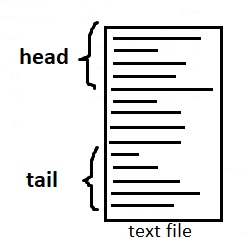
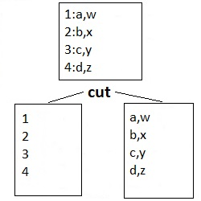
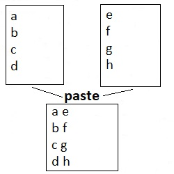
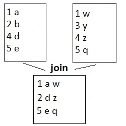

# 103.2. Process text streams using filters

## **103.2 Process text streams using filters**

**Weight:**3

**Description:** Candidates should be able to apply filters to text streams.

**Key Knowledge Areas:**

Send text files and output streams through text utility filters to modify the output using standard UNIX commands found in the GNU textutils package

**Terms and Utilities:**

* cat
* cut
* expand
* fmt
* head
* join
* less
* nl
* od
* paste
* pr
* sed
* sort
* split
* tail
* tr
* unexpand
* uniq
* wc

Everything in Linux revolves around streams of data—particularly text streams.

### streams

A stream is nothing more than a sequence of bytes that is passed from one file, device, or program to another.

Input and output in the Linux environment is distributed across three streams (which are in fact special files).

These streams are:

* **standard input stream (stdin)**, which provides input to commands.
* **standard output stream (stdout)**, which displays output from commands.
* **standard error stream (stderr)**, which displays error output from commands.

The streams are also numbered: **stdin (0)** ,**stdout (1)**, **stderr (2)**.


### piping with |

Piping is a mechanism for sending data from one program to another. The operator we use is ( | ) (found above the backslash `\` key on most keyboards). What this operator does is feed the output from the program on the left as input to the program on the right.

```
command1 | command2
```

Either command can have options or arguments. We can also use | to redirect the output of the second command in the pipeline to a third command, and so on.

```
command 1 | command 2 | command3 | command 4 | ...
```

Constructing long pipelines of commands that each have limited capability is a common Linux and UNIX way of accomplishing tasks.

```
[root@centos7-1 ~]# dmesg | less
```

### Redirection 

Linux includes redirection commands for each stream.We can use `>` in order to redirect output stream (mostly to a file).

```
[root@centos7-1 temp]# ls -1
test.txt
unexpanded.txt
zip-3.0-11.el7.x86_64.rpm
zip.cpio

[root@centos7-1 temp]# ls -1 > list.txt

[root@centos7-1 temp]# cat list.txt 
list.txt
test.txt
unexpanded.txt
zip-3.0-11.el7.x86_64.rpm
zip.cpio
```

> "|" vs ">"
>
> The difference between > (redirection operator) and | (pipeline operator) is that while the >  connects a command with a file, the | connects the output of a command with another command.

### Text filtering

Text filtering is the process of taking an input stream of text and performing some conversion on the text before sending it to an output stream.

## cat

The **cat **(short for “**concatenate**“) command is one of the most frequently used command in Linux/Unix like operating systems. cat command allows us to create single or multiple files, view contain of file, concatenate files and redirect output in terminal or files.

```
cat [OPTION] [FILE]...
```

Simplest usage of cat is displaying the content of a file:

```
[root@centos7-1 ~]# cat file1
This is 1st line of file1.

This is 3rd line of file1.
```

is can show contents of Multiple Files :

```
[root@centos7-1 ~]# cat file1 file2
This is 1st line of file1.

This is 3rd line of file1.
This is 1st line of file1.
This is 2nd line of file2.

This is 4th line of file2.
```

The cat command also used to concatenate number of files together:

```
[root@centos7-1 ~]# cat file1 file2 > newfile
[root@centos7-1 ~]# cat newfile 
This is 1st line of file1.

This is 3rd line of file1.
This is 1st line of file2.
This is 2nd line of file2.

This is 4th line of file2.
```

create a new file with cat:

```
[root@centos7-1 ~]# cat > newfile2
This is my second new file with input redirection
Ctrl+d
[root@centos7-1 ~]# cat newfile2
This is my second new file with input redirection
```

> "-" A hyphen (used alone) generally signifies that input will be taken from stdin as opposed to a named file:
>
> ```
> [root@centos7-1 ~]# cat file1 - file2
> This is 1st line of file1.
>
> This is 3rd line of file1.
> THIS IS MY INPUT 
> Ctrl+d
> This is 1st line of file2.
> This is 2nd line of file2.
>
> This is 4th line of file2.
> ```

List of cat command options:

```
  -A, --show-all           equivalent to -vET
  -b, --number-nonblank    number nonempty output lines, overrides -n
  -e                       equivalent to -vE
  -E, --show-ends          display $ at end of each line
  -n, --number             number all output lines
  -s, --squeeze-blank      suppress repeated empty output lines
  -t                       equivalent to -vT
  -T, --show-tabs          display TAB characters as ^I
  -u                       (ignored)
  -v, --show-nonprinting   use
```

Now what’s the opposite of cat? Yeah it’s ‘tac‘. `tac` is a command under Linux, try it for yourself.

## od

od (Octal dump) command in Linux is used to output the contents of a file in different formats with the octal format being the default.\
This command is especially useful when debugging Linux scripts for unwanted changes or characters.

```
od [OPTION]... [FILE]...
```

as and example:

```
[root@centos7-1 ~]# cat testod.txt 
1
2
3
4
5
[root@centos7-1 ~]# od testod.txt 
0000000 005061 005062 005063 005064 005065
0000012
```

With `-t` option we can select output format and display it. (Traditional format specifications may be intermixed):

```
-a same as -t a, select named characters, ignoring high-order bit
-b same as -t o1, select octal bytes
-c same as -t c, select printable characters or backslash escapes
-d same as -t u2, select unsigned decimal 2-byte units
-f same as -t fF, select floats
-i same as -t dI, select decimal ints
-l same as -t dL, select decimal longs
-o same as -t o2, select octal 2-byte units
-s same as -t d2, select decimal 2-byte units
-x same as -t x2, select hexadecimal 2-byte units
```

example:

```
[root@centos7-1 ~]# od -ta testod.txt 
0000000   1  nl   2  nl   3  nl   4  nl   5  nl
0000012
[root@centos7-1 ~]# od -tc testod.txt 
0000000   1  \n   2  \n   3  \n   4  \n   5  \n
0000012
```

`-A` Option displays the contents of input in different format by concatenation some special character (offsets).

* **Hexadecimal (using -x along with -A)**
* **Octal (using -o along with -A)**
* **Decimal (using -d along with -A)**

```
[root@centos7-1 ~]# od -Ax -c testod.txt 
000000   1  \n   2  \n   3  \n   4  \n   5  \n
00000a
[root@centos7-1 ~]# od -Ao -c testod.txt 
0000000   1  \n   2  \n   3  \n   4  \n   5  \n
0000012
[root@centos7-1 ~]# od -Ad -c testod.txt 
0000000   1  \n   2  \n   3  \n   4  \n   5  \n
0000010
```

`-An` Option displays the contents of input in character format but with no offset information:

```
[root@centos7-1 ~]# od -An -c testod.txt 
   1  \n   2  \n   3  \n   4  \n   5  \n
```

## expand and unexpand

The **expand **command is used to convert tabs in files to spaces.

```
 expand [OPTION]... [FILE]...
```

lets try it :

```
[root@centos7-1 ~]# cat test.txt 
this    is    my    test    file.
[root@centos7-1 ~]# od -tc -An test.txt 
   t   h   i   s  \t   i   s  \t   m   y  \t   t   e   s   t  \t
   f   i   l   e   .  \n
[root@centos7-1 ~]# expand test.txt > expanded.txt
[root@centos7-1 ~]# od -tc -An expanded.txt 
   t   h   i   s                   i   s                        
   m   y                           t   e   s   t                
   f   i   l   e   .  \n
```

By default, expand converts tabs into the corresponding number of spaces. But it is possible to tweak the number of spaces using the -t (– – tabs=N) command line option. This option requires us to enter the new number of spaces(N) we want the tabs to get converted.

```
[root@centos7-1 ~]# expand -t1 test.txt > expanded2.txt
[root@centos7-1 ~]# od -tc -An expanded2.txt 
   t   h   i   s       i   s       m   y       t   e   s   t    
   f   i   l   e   .  \n
```

expand command options:

```
  -i, --initial       do not convert tabs after non blanks
  -t, --tabs=NUMBER   have tabs NUMBER characters apart, not 8
  -t, --tabs=LIST     use comma separated list of explicit tab positions
      --help     display this help and exit
      --version  output version information and exit
```

The **unexpand **command is used to convert space characters (blanks) into tabs in each file(unexpand needs at least two spaces).

```
unexpand [OPTION]... [FILE]...
```

Lets do reverse:

```
[root@centos7-1 ~]# unexpand expanded.txt > unexpanded.txt
[root@centos7-1 ~]# od -tc -An unexpanded.txt 
   t   h   i   s                   i   s                        
   m   y                           t   e   s   t                
   f   i   l   e   .  \n
```

unexpand with no options just initial blanks!!! `-a` option convert all blanks, instead of just initial blanks:

> unexpand only convert double spaces and more to tab, it doesn't convert single spaces!

```
[root@centos7-1 ~]# unexpand -a expanded.txt > unexpanded2.txt
[root@centos7-1 ~]# od -tc -An unexpanded2.txt 
   t   h   i   s  \t   i   s  \t   m   y  \t   t   e   s   t  \t
   f   i   l   e   .  \n
```

the unexpand command options:

```
  -a, --all        convert all blanks, instead of just initial blanks
      --first-only  convert only leading sequences of blanks (overrides -a)
  -t, --tabs=N     have tabs N characters apart instead of 8 (enables -a)
  -t, --tabs=LIST  use comma separated LIST of tab positions (enables -a)
      --help     display this help and exit
      --version  output version information and exit
```

## tr command

tr stands for** translate**. The tr utility copies the standard input to the standard output with substitution or deletion of selected characters. The syntax of tr command is:

```
tr [option] set1 [set2]
```

Lets convert lower case to upper case:

```
[root@centos7-1 ~]# echo "this is  for   test 123" | tr abcdefghijklmnopqrstuvwxyz ABCDEFGHIJKLMNOPQRSTUVWXYZ
THIS IS  FOR   TEST 123
```

The following command will also convert lower case to upper case:

```
[root@centos7-1 ~]# echo "this is  for   test 123" | tr [:lower:] [:upper:]
THIS IS  FOR   TEST 123
```

Translate white-space to tabs:

```
[root@centos7-1 ~]# echo "this is  for   test 123" | tr [:space:] '\t'
this    is        for            test    123
```

if there are two are more spaces present continuously, then the previous command will translate each spaces to a tab. We can use `-s` option to squeeze repetition of characters :

```
[root@centos7-1 ~]# echo "this is  for   test 123" | tr -s [:space:] '\t'
this    is    for    test    123
```

`-d `option can be used to delete specified characters :

```
[root@centos7-1 ~]# echo "this is  for   test 123" | tr -d 't'
his is  for   es 123
[root@centos7-1 ~]# echo "this is  for   test 123" | tr -d [:digit:]
this is  for   test
```

We complement the sets using `-c `option For example, to remove all characters except digits, you can use the following.:

```
[root@centos7-1 ~]# echo "this is  for   test 123" | tr -dc [:digit:]
123
```

tr has many options and sets try tr --help for more information.

## pr

The pr command is used to format files for printing. The default header includes the filename and file creation date and time, along with a page number and two lines of blank footer.

```
[root@centos7-1 ~]# cat note.txt 
hi 
this is my note file.
linux is an operating system.
learn linux.

[root@centos7-1 ~]# pr note.txt 


2018-12-19 11:25                     note.txt                     Page 1


hi 
this is my note file.
linux is an operating system.
learn linux.
```

**Note:** When output is created from multiple files or the standard input stream, the current date and time are used instead of the filename and creation date.

We can print files side-by-side in columns and control many aspects of formatting through options.

```
[root@centos7-1 ~]# rpm -qa | pr --columns=2 -l 15
2018-12-19 11:35                                                  Page 1


NetworkManager-team-1.8.0-9.el7.x86 setserial-2.17-33.el7.x86_64
cdparanoia-libs-10.2-17.el7.x86_64  mozilla-filesystem-1.9-11.el7.x86_6
gtkmm30-3.22.0-1.el7.x86_64         hypervkvpd-0-0.30.20161211git.el7.x
python-configshell-1.1.fb23-3.el7.n less-458-9.el7.x86_64
khmeros-base-fonts-5.0-17.el7.noarc libgsf-1.14.26-7.el7.x86_64
liberation-fonts-common-1.07.2-15.e mariadb-libs-5.5.56-2.el7.x86_64
kexec-tools-2.0.14-17.el7.x86_64    rootfiles-8.1-11.el7.noarch
iptables-1.4.21-18.0.1.el7.centos.x langtable-data-0.0.31-3.el7.noarch
gnome-dictionary-libs-3.20.0-1.el7. libcgroup-tools-0.41-13.el7.x86_64
gd-2.0.35-26.el7.x86_64             perl-Pod-Usage-1.63-3.el7.noarch
```

`--column` defines number of columns created in the output.`-l`specifies page length (default is 66 lines).As usual, refer to the **man** page for details.

## nl

nl is a linux command to number lines of the files, it copies its files to standard output, prepending line numbers.

```
nl [OPTION]... [FILE]...
```

```
[root@centos7-1 ~]# nl note.txt 
     1    hi 
     2    this is my note file.
     3    linux is an operating system.
```

`-n Format`Uses the value of the Format variable as the line numbering format. Recognized formats are:

* ln :Left-justified, leading zeros suppressed
* rn :Right-justified, leading zeros suppressed (default)
* rz: Right-justified, leading zeros kept

```
[root@centos7-1 ~]# nl -nln note.txt 
1         hi 
2         this is my note file.
3         linux is an operating system.

[root@centos7-1 ~]# nl -nrn note.txt       #default
     1    hi 
     2    this is my note file.
     3    linux is an operating system.

[root@centos7-1 ~]# nl -nrz note.txt 
000001    hi 
000002    this is my note file.
000003    linux is an operating system.
```

> By default nl skip over blank lines and does not give a number to them, use -ba switch to assign them numbers.

other ln options:

```
  -b, --body-numbering=STYLE      use STYLE for numbering body lines
  -d, --section-delimiter=CC      use CC for separating logical pages
  -f, --footer-numbering=STYLE    use STYLE for numbering footer lines
  -h, --header-numbering=STYLE    use STYLE for numbering header lines
  -i, --line-increment=NUMBER     line number increment at each line
  -l, --join-blank-lines=NUMBER   group of NUMBER empty lines counted as one
  -n, --number-format=FORMAT      insert line numbers according to FORMAT
  -p, --no-renumber               do not reset line numbers at logical pages
  -s, --number-separator=STRING   add STRING after (possible) line number
  -v, --starting-line-number=NUMBER  first line number on each logical page
  -w, --number-width=NUMBER       use NUMBER columns for line numbers
      --help     display this help and exit
      --version  output version information and exit
```

`cat -n filename` does the same thing that`  nl  `command do.

## fmt

fmt simple optimal text formatter, it reformats paragraphs in specified file and prints results to the standard output.

```
fmt [-WIDTH] [OPTION]... [FILE]...
```

```
[root@centos7-1 ~]# cat note.txt 
hi 
this is my note file.
linux is an operating system.
learn linux.

[root@centos7-1 ~]# fmt note.txt 
hi this is my note file.  linux is an operating system.  learn linux.
```

By default fmt sets the column width at 75. This can be changed with the -w , --width=WIDTHoption.

```
[root@centos7-1 ~]# fmt -w 12  note.txt 
hi this
is my
note file.
linux is an
operating
system.
learn
linux.
```

fmt command options:

```
  -c, --crown-margin        preserve indentation of first two lines
  -p, --prefix=STRING       reformat only lines beginning with STRING,
                              reattaching the prefix to reformatted lines
  -s, --split-only          split long lines, but do not refill
  -t, --tagged-paragraph    indentation of first line different from second
  -u, --uniform-spacing     one space between words, two after sentences
  -w, --width=WIDTH         maximum line width (default of 75 columns)
  -g, --goal=WIDTH          goal width (default of 93% of width)
      --help     display this help and exit
      --version  output version information and exit
```

## sort and uniq

**Sort **is a Linux program used for printing lines of input text files and concatenation of all files in sorted order. Sort command takes blank space as field separator and entire Input file as sort key. It is important to notice that sort command don’t actually sort the files but only print the sorted output, until your redirect the output.

```
sort [OPTION]... [FILE]...
```

```
[root@centos7-1 ~]# cat 1.txt 
D 1
d 1
c 2
C 2
A 3
B 4
f 14
[root@centos7-1 ~]# sort 1.txt 
A 3
B 4
c 2
C 2
d 1
D 1
f 14
```

If a file has words/lines beginning with both upper case and lower case characters, then sort displays those with upper case at top. However, we can change this behavior using the -f command line option:

```
[root@centos7-1 ~]# sort -f 1.txt 
A 3
B 4
C 2
c 2
D 1
d 1
f 14
```

The`  -n  `option sort the contents numerically. Also we can sort a file base on "`n"`**th** column with `-k`n option:

```
[root@centos7-1 ~]# sort  -n -k2 1.txt 
d 1
D 1
c 2
C 2
A 3
B 4
f 14
```

user `-r `to reverse the result of comparisons. Other options of sort command:

```
  -b, --ignore-leading-blanks  ignore leading blanks
  -d, --dictionary-order      consider only blanks and alphanumeric characters
  -f, --ignore-case           fold lower case to upper case characters
  -g, --general-numeric-sort  compare according to general numerical value
  -i, --ignore-nonprinting    consider only printable characters
  -M, --month-sort            compare (unknown) < 'JAN' < ... < 'DEC'
  -h, --human-numeric-sort    compare human readable numbers (e.g., 2K 1G)
  -n, --numeric-sort          compare according to string numerical value
  -R, --random-sort           sort by random hash of keys
      --random-source=FILE    get random bytes from FILE
  -r, --reverse               reverse the result of comparisons
      --sort=WORD             sort according to WORD:
                                general-numeric -g, human-numeric -h, month -M,
                                numeric -n, random -R, version -V
  -V, --version-sort          natural sort of (version) numbers within text
```

Sort can sort the contents of two files on standard output in one go! `sort 1.txt 2.txt`

**uniq **command is used to report or omit repeated lines, it filters lines from standard input and writes the outcome to standard output.

```
[root@centos7-1 ~]# cat assets.txt 
motherboard
motherboard
cpu
cpu
ram
ram
ram
ram
monitor
monitor
hdd
ssd
mouse
keyboard
keyboard
[root@centos7-1 ~]# uniq assets.txt 
motherboard
cpu
ram
monitor
hdd
ssd
mouse
keyboard
```

use -c to display number of repetitions for each line:

```
[root@centos7-1 ~]# uniq -c assets.txt 
      2 motherboard
      2 cpu
      4 ram
      2 monitor
      1 hdd
      1 ssd
      1 mouse
      2 keyboard
```

\-d displays only the repeated lines and visa versa -u just shows uniq ones:

```
[root@centos7-1 ~]# uniq -d assets.txt 
motherboard
cpu
ram
monitor
keyboard
[root@centos7-1 ~]# uniq -u assets.txt 
hdd
ssd
mouse
```

try `-D` to see all duplicated lines. other options from uniq --help :

```
  -c, --count           prefix lines by the number of occurrences
  -d, --repeated        only print duplicate lines, one for each group
  -D, --all-repeated[=METHOD]  print all duplicate lines
                          groups can be delimited with an empty line
                          METHOD={none(default),prepend,separate}
  -f, --skip-fields=N   avoid comparing the first N fields
      --group[=METHOD]  show all items, separating groups with an empty line
                          METHOD={separate(default),prepend,append,both}
  -i, --ignore-case     ignore differences in case when comparing
  -s, --skip-chars=N    avoid comparing the first N characters
  -u, --unique          only print unique lines
  -z, --zero-terminated  end lines with 0 byte, not newline
  -w, --check-chars=N   compare no more than N characters in lines
      --help     display this help and exit
      --version  output version information and exit
```

## split

split command is used to split or break a file into the pieces.

```
 split [options] filename prefix
```

* Replace filename with the name of the large file you wish to split.
* Replace prefix with the name you wish to give the small output files.
* We can exclude \[options], or replace it with either of the following:
* `-l linenumber`
* `-b bytes`

If we use the -l (a lowercase L) option, replace line number with the number of lines we'd like in each of the smaller files (the default is 1,000).

```
[root@centos7-1 split]# ls
my7lines.txt
[root@centos7-1 split]# cat my7lines.txt 
this is 1st line.
this is 2nd line.
this is 3rd line.
this is 4th line
this is 5th line.
this is 6th line.
this is 7th line.

[root@centos7-1 split]# split -l 2 my7lines.txt 

[root@centos7-1 split]# ls
my7lines.txt  xaa  xab  xac  xad

[root@centos7-1 split]# echo "xaa";cat xaa;echo "xab";cat  xab;echo "xac";cat xac;echo "xad"; cat  xad
xaa
this is 1st line.
this is 2nd line.
xab
this is 3rd line.
this is 4th line
xac
this is 5th line.
this is 6th line.
xad
this is 7th line.
```

The split command will give each output file it creates the name prefix with an extension tacked to the end that indicates its order. By default, the split command adds aa to the first output file, proceeding through the alphabet to zz for subsequent files. If you do not specify a prefix, most systems use x.

If we use the -b option, replace bytes with the number of bytes you'd like in each of the smaller files.

```
[root@centos7-1 split2]# du -ah
51M    ./dsl-4.11.rc2.iso
51M    .

[root@centos7-1 split2]# split -b 10MB dsl-4.11.rc2.iso 
[root@centos7-1 split2]# ls 
dsl-4.11.rc2.iso  xaa  xab  xac  xad  xae  xaf
[root@centos7-1 split2]# du -ah
51M    ./dsl-4.11.rc2.iso
9.6M    ./xaa
9.6M    ./xab
9.6M    ./xac
9.6M    ./xad
9.6M    ./xae
2.7M    ./xaf
101M    .
```

Some other options are:

```
  -a, --suffix-length=N   generate suffixes of length N (default 2)
      --additional-suffix=SUFFIX  append an additional SUFFIX to file names
  -b, --bytes=SIZE        put SIZE bytes per output file
  -C, --line-bytes=SIZE   put at most SIZE bytes of lines per output file
  -d, --numeric-suffixes[=FROM]  use numeric suffixes instead of alphabetic;
                                   FROM changes the start value (default 0)
  -e, --elide-empty-files  do not generate empty output files with '-n'
      --filter=COMMAND    write to shell COMMAND; file name is $FILE
  -l, --lines=NUMBER      put NUMBER lines per output file
  -n, --number=CHUNKS     generate CHUNKS output files; see explanation below
  -u, --unbuffered        immediately copy input to output with '-n r/...'
      --verbose           print a diagnostic just before each
                            output file is opened
      --help     display this help and exit
      --version  output version information and exit

SIZE is an integer and optional unit (example: 10M is 10*1024*1024).  Units
are K, M, G, T, P, E, Z, Y (powers of 1024) or KB, MB, ... (powers of 1000).
```

For joining the splitted files use `cat x* > orginalfile` .

## wc

The wc (word count) command is used to find out number of newline count, word count, byte and characters count in a file.

```
wc [options] filenames
```

A Basic Example of WC Command

```
[root@centos7-1 ~]# wc /etc/inittab 
 17  80 511 /etc/inittab
```

Three numbers shown below are **17** (number of **lines**), **80** (number of **words**_\[by default space delimited]_) and **511**(number of **bytes**) of the file.

options:

```
  -c, --bytes            print the byte counts
  -m, --chars            print the character counts
  -l, --lines            print the newline counts
      --files0-from=F    read input from the files specified by
                           NUL-terminated names in file F;
                           If F is - then read names from standard input
  -L, --max-line-length  print the length of the longest line
  -w, --words            print the word counts
      --help     display this help and exit
      --version  output version information and exit
```

## head and tail  commands:

## 

## head

The head command reads the first ten lines of a any given file name.

```
head [options] [file(s)]
```

For example lets take a look at /var/log/yum.log file:

```
[root@centos7-1 ~]# head /var/log/yum.log 
Aug 26 04:48:25 Updated: openldap-2.4.44-15.el7_5.x86_64
Aug 26 04:48:25 Installed: openldap-clients-2.4.44-15.el7_5.x86_64
Aug 26 04:48:27 Installed: openldap-servers-2.4.44-15.el7_5.x86_64
Oct 13 03:38:41 Installed: perl-Data-Dumper-2.145-3.el7.x86_64
Oct 13 03:38:41 Installed: perl-Net-Daemon-0.48-5.el7.noarch
Oct 13 03:38:41 Installed: perl-Digest-1.17-245.el7.noarch
Oct 13 03:38:41 Installed: perl-Digest-MD5-2.52-3.el7.x86_64
Oct 13 03:38:41 Installed: 7:squid-migration-script-3.5.20-12.el7.x86_64
Oct 13 03:38:41 Installed: 1:perl-Compress-Raw-Zlib-2.061-4.el7.x86_64
Oct 13 03:38:42 Installed: libecap-1.0.0-1.el7.x86_64
```

For retrieving desired number of lines use -n\<number> or simple -\<number> options:

```
[root@centos7-1 ~]# head -n 2 /var/log/yum.log 
Aug 26 04:48:25 Updated: openldap-2.4.44-15.el7_5.x86_64
Aug 26 04:48:25 Installed: openldap-clients-2.4.44-15.el7_5.x86_64
[root@centos7-1 ~]# head -2 /var/log/yum.log 
Aug 26 04:48:25 Updated: openldap-2.4.44-15.el7_5.x86_64
Aug 26 04:48:25 Installed: openldap-clients-2.4.44-15.el7_5.x86_64
```

Options from`head --help` :

```
  -c, --bytes=[-]K         print the first K bytes of each file;
                             with the leading '-', print all but the last
                             K bytes of each file
  -n, --lines=[-]K         print the first K lines instead of the first 10;
                             with the leading '-', print all but the last
                             K lines of each file
  -q, --quiet, --silent    never print headers giving file names
  -v, --verbose            always print headers giving file names
      --help     display this help and exit
      --version  output version information and exit

K may have a multiplier suffix:
b 512, kB 1000, K 1024, MB 1000*1000, M 1024*1024,
GB 1000*1000*1000, G 1024*1024*1024, and so on for T, P, E, Z, Y.
```

## tail

tail command displays last ten lines of any text file.

```
tail [options] [filenames]
```

Similar to the head command above, tail command also support options -n number of lines and n number of characters.

```
[root@centos7-1 ~]# tail -n 5 /var/log/yum.log 
Dec 05 10:02:37 Updated: firefox-60.3.0-1.el7.centos.x86_64
Dec 05 10:02:37 Updated: nss-tools-3.36.0-7.el7_5.x86_64
Dec 05 10:02:37 Updated: 1:dbus-x11-1.10.24-7.el7.x86_64
Dec 08 11:54:14 Installed: zip-3.0-11.el7.x86_64
Dec 08 13:10:52 Installed: vsftpd-3.0.2-22.el7.x86_64
```

\-f option will cause tail will loop forever, checking for new data at the end of the file(s). When new data appears, it will be printed. It works great with log files and lets us see what is going on:

```
[root@centos7-1 ~]# tail -f /var/log/dmesg
[   19.126805] AES CTR mode by8 optimization enabled
[   19.129902] ppdev: user-space parallel port driver
[   19.155269] alg: No test for __gcm-aes-aesni (__driver-gcm-aes-aesni)
[   19.160414] Adding 4063228k swap on /dev/mapper/centos-swap.  Priority:-1 extents:1 across:4063228k FS
[   19.176446] alg: No test for crc32 (crc32-pclmul)
[   19.220329] XFS (sda1): Mounting V5 Filesystem
[   19.288818] XFS (sda1): Ending clean mount
[   21.853831] floppy0: no floppy controllers found
[   21.854029] work still pending
[   22.082648] type=1305 audit(1543863215.542:3): audit_pid=681 old=0 auid=4294967295 ses=4294967295 res=1
```

options:

```
  -c, --bytes=K            output the last K bytes; or use -c +K to output
                             bytes starting with the Kth of each file
  -f, --follow[={name|descriptor}]
                           output appended data as the file grows;
                             an absent option argument means 'descriptor'
  -F                       same as --follow=name --retry
  -n, --lines=K            output the last K lines, instead of the last 10;
                             or use -n +K to output starting with the Kth
      --max-unchanged-stats=N
                           with --follow=name, reopen a FILE which has not
                             changed size after N (default 5) iterations
                             to see if it has been unlinked or renamed
                             (this is the usual case of rotated log files);
                             with inotify, this option is rarely useful
      --pid=PID            with -f, terminate after process ID, PID dies
  -q, --quiet, --silent    never output headers giving file names
      --retry              keep trying to open a file if it is inaccessible
  -s, --sleep-interval=N   with -f, sleep for approximately N seconds
                             (default 1.0) between iterations;
                             with inotify and --pid=P, check process P at
                             least once every N seconds
  -v, --verbose            always output headers giving file names
      --help     display this help and exit
      --version  output version information and exit
```

## less

less command allows you to view the contents of a file and navigate through file.

```
[root@centos7-1 ~]# dmesg |less
```

```
[    0.000000] BIOS-e820: [mem 0x00000000bfeff000-0x00000000bfefffff] ACPI NVS
[    0.000000] BIOS-e820: [mem 0x00000000bff00000-0x00000000bfffffff] usable
[    0.000000] BIOS-e820: [mem 0x00000000f0000000-0x00000000f7ffffff] reserved
[    0.000000] BIOS-e820: [mem 0x00000000fec00000-0x00000000fec0ffff] reserved
[    0.000000] BIOS-e820: [mem 0x00000000fee00000-0x00000000fee00fff] reserved
[    0.000000] BIOS-e820: [mem 0x00000000fffe0000-0x00000000ffffffff] reserved
[    0.000000] BIOS-e820: [mem 0x0000000100000000-0x000000013fffffff] usable
:
```

By default the only way to exit less command is to hit q key. To change this behavior and automatically exit file when reaching the end of file use the `-e` or `-E` option. `less -e /var/log/auth.log` or `less -E /var/log/auth.log`

* To open a file at the first occurrence of a pattern use the following syntax:

`less +/sshd /var/log/auth.log`

* In order to automatically append the content of a file opened in less command use the Shift+f keys combination or run less with the following syntax:

`less +F /var/log/messages`

This makes less to run in interactive mode (live) and display new content on-fly while waiting for new data to be written to file. This behavior is similar to tail -f command. To exit live mode just press`Ctrl+c`keys.

**Tip**: In combination with a pattern you can watch the log file interactively with`Shift+f`key stroke while matching a keyword.

> **less vs more**
>
> less command is similar to more, he main difference between more and less is that less command is faster because it does not load the entire file at once and allows navigation though file using page up/down keys.
>
> Whether you decide to use more or less, which is a personal choice, remember that less is more with more features.

## cut

The cut command in UNIX is a command line utility for cutting sections from each line of files and writing the result to standard output. It can be used to cut parts of a line by byte **position**, **character **and **delimiter**.

```
cut OPTION... [FILE]...
```

**cut by byte position:**

```
[root@centos7-1 ~]# echo "linux" | cut -b 1
l
[root@centos7-1 ~]# echo "linux" | cut -b 1,5
lx
[root@centos7-1 ~]# echo "linux" | cut -b 1-4
linu
```

**cut by character:**

```
[root@centos7-1 ~]# echo '♣foobar' | cut -c 1,7
♣r
[root@centos7-1 ~]# echo '♣foobar' | cut -c 5-7
bar
```

**cut based on a delimiter:**



To cut using a delimiter use the -d option. This is normally used in conjunction with the -f option to specify the field that should be cut. examples:

```
[root@centos7-1 ~]# cut 1.txt -d: -f1
1
2
3
4
[root@centos7-1 ~]# cut 1.txt -d: -f2
a,w
b,x
c,y
d,z
[root@centos7-1 ~]# cut 1.txt -d, -f1
1:a
2:b
3:c
4:d
[root@centos7-1 ~]# cut 1.txt -d, -f2
w
x
y
z
```

cut has lots of options:

```
  -b, --bytes=LIST        select only these bytes
  -c, --characters=LIST   select only these characters
  -d, --delimiter=DELIM   use DELIM instead of TAB for field delimiter
  -f, --fields=LIST       select only these fields;  also print any line
                            that contains no delimiter character, unless
                            the -s option is specified
  -n                      with -b: don't split multibyte characters
      --complement        complement the set of selected bytes, characters
                            or fields
  -s, --only-delimited    do not print lines not containing delimiters
      --output-delimiter=STRING  use STRING as the output delimiter
                            the default is to use the input delimiter
      --help     display this help and exit
      --version  output version information and exit
```

## paste

The paste command displays the corresponding lines of multiple files side-by-side.

```
paste [OPTION]... [FILE]...
```



```
[root@centos7-1 ~]# paste 1.txt 2.txt 
a    e
b    f
c    g
d    h
```

paste writes lines consisting of the sequentially corresponding lines from each FILE, separated by tabs.To apply a colon (:) as a delimiting character instead of tabs, use -d option:

```
[root@centos7-1 ~]# paste -d: 1.txt 2.txt 
a:e
b:f
c:g
d:h
```

paste command options:

```
  -d, --delimiters=LIST   reuse characters from LIST instead of TABs
  -s, --serial            paste one file at a time instead of in parallel
      --help     display this help and exit
      --version  output version information and exit
```

## join

Joins the lines of two files which share a common field of data.

>  When **using `join`**, the **input files must be sorted **_**by the join field ONLY**_, otherwise you may see the warning

```
join [OPTION]... FILE1 FILE2
```



```
[root@centos7-1 ~]# join 1.txt 2.txt 
1 a w
4 d z
5 e q
```

By default, the join command only prints pairable lines. unpairable lines are left out in the output. However, if we want, we can still have them in the output using the -a command line option. This option requires you to pass a file number so that the tool knows which file you are talking about.

```
[root@centos7-1 ~]# join 1.txt 2.txt -a 1
1 a w
2 b
4 d z
5 e q
[root@centos7-1 ~]# join 1.txt 2.txt -a 2
1 a w
3 y
4 d z
5 e q
```

Inorder to print unpaired lines (meaning, suppress the paired lines in output),use the -v command line option. This options works exactly the way -a works.

```
[root@centos7-1 ~]# join 1.txt 2.txt -v 1
2 b
[root@centos7-1 ~]# join 1.txt 2.txt -v 2
3 y
```

join combines lines of files on a common field, which is the first field by default. However, if we want, we can specify a different field for each file using -1 and -2 command line options. for example `join -1 2 -2 2 file1 file2` uses second field of each line. join command options:

```
  -a FILENUM        also print unpairable lines from file FILENUM, where
                      FILENUM is 1 or 2, corresponding to FILE1 or FILE2
  -e EMPTY          replace missing input fields with EMPTY
  -i, --ignore-case  ignore differences in case when comparing fields
  -j FIELD          equivalent to '-1 FIELD -2 FIELD'
  -o FORMAT         obey FORMAT while constructing output line
  -t CHAR           use CHAR as input and output field separator
  -v FILENUM        like -a FILENUM, but suppress joined output lines
  -1 FIELD          join on this FIELD of file 1
  -2 FIELD          join on this FIELD of file 2
  --check-order     check that the input is correctly sorted, even
                      if all input lines are pairable
  --nocheck-order   do not check that the input is correctly sorted
  --header          treat the first line in each file as field headers,
                      print them without trying to pair them
  -z, --zero-terminated     end lines with 0 byte, not newline
      --help     display this help and exit
      --version  output version information and exit
```

## sed

The name **Sed **is short for **\_s_tream \_ed_itor**.\
**S** stream editor is used to perform basic text transformations on an input stream (a file or input from a pipeline). sed uses regular expressions and the most basic (and popular) usage of sed is the substitution of characters.

As an example lets replace 'l' with "L" in a sample text file:

```
[root@centos7-1 ~]# cat sample.txt 
there are different operating systems in our planet.
one of them is linux.
almost six hundred linux distributions exist.

[root@centos7-1 ~]# sed 's/l/L/' sample.txt 
there are different operating systems in our pLanet.
one of them is Linux.
aLmost six hundred linux distributions exist.
```

By default sed just perform the substitution just once for first instance of term, use -g flag to perform the substitution for all instances of term on every line of file.


```
[root@centos7-1 ~]# sed 's/l/L/g' sample.txt 
there are different operating systems in our pLanet.
one of them is Linux.
aLmost six hundred Linux distributions exist.
```

Additionally, we can gi instead of g in order to ignore character case:

```
[root@centos7-1 ~]# sed 's/linux/LINUX/gi' sample.txt 
there are different operating systems in our planet.
one of them is LINUX.
almost six hundred LINUX distributions exist.
```

Another example is replacing blank spaces with tab :

```
[root@centos7-1 ~]# cat sample.txt 
there are different operating systems in our planet.
one of them is linux.
almost six hundred linux distributions exist.

[root@centos7-1 ~]# sed 's/ /\t/g' sample.txt  | cat 
there    are    different    operating    systems    in    our    planet.
one    of    them    is    linux.
almost    six    hundred    linux    distributions    exist.
```

sed is extremely powerful, and the tasks it can accomplish are limited only by your imagination.

.

.

.

sources:

[https://developer.ibm.com/tutorials/l-lpic1-103-2/](https://developer.ibm.com/tutorials/l-lpic1-103-2/)

[https://ryanstutorials.net/linuxtutorial/piping.php#piping](https://ryanstutorials.net/linuxtutorial/piping.php#piping)

[https://www.tecmint.com/linux-io-input-output-redirection-operators/](https://www.tecmint.com/linux-io-input-output-redirection-operators/)

[https://www.digitalocean.com/community/tutorials/an-introduction-to-linux-i-o-redirection](https://www.digitalocean.com/community/tutorials/an-introduction-to-linux-i-o-redirection)

[https://www.tecmint.com/13-basic-cat-command-examples-in-linux/](https://www.tecmint.com/13-basic-cat-command-examples-in-linux/)

[https://kb.iu.edu/d/afar](https://kb.iu.edu/d/afar)

[https://www.tecmint.com/wc-command-examples/](https://www.tecmint.com/wc-command-examples/)

[https://www.tecmint.com/view-contents-of-file-in-linux/](https://www.tecmint.com/view-contents-of-file-in-linux/)

[http://landoflinux.com/linux_expand_unexpand_command.html](http://landoflinux.com/linux_expand_unexpand_command.html)

[https://www.geeksforgeeks.org/expand-command-in-linux-with-examples/](https://www.geeksforgeeks.org/expand-command-in-linux-with-examples/)

[https://www.thegeekstuff.com/2012/12/linux-tr-command](https://www.thegeekstuff.com/2012/12/linux-tr-command)

[https://www.howtoforge.com/linux-uniq-command/](https://www.howtoforge.com/linux-uniq-command/)

[https://www.tecmint.com/linux-file-operations-commands/](https://www.tecmint.com/linux-file-operations-commands/)

[https://www.tecmint.com/20-advanced-commands-for-linux-experts/](https://www.tecmint.com/20-advanced-commands-for-linux-experts/)

[https://www.ibm.com/support/knowledgecenter/en/ssw_aix\_72/com.ibm.aix.cmds4/nl.htm](https://www.ibm.com/support/knowledgecenter/en/ssw_aix\_72/com.ibm.aix.cmds4/nl.htm)

[https://shapeshed.com/unix-fmt/](https://shapeshed.com/unix-fmt/)

[https://www.tecmint.com/linux-more-command-and-less-command-examples/](https://www.tecmint.com/linux-more-command-and-less-command-examples/)

[https://www.tecmint.com/linux-file-operations-commands/](https://www.tecmint.com/linux-file-operations-commands/)

[https://shapeshed.com/unix-cut/](https://shapeshed.com/unix-cut/)

[https://www.computerhope.com/unix/upaste.htm](https://www.computerhope.com/unix/upaste.htm)

[https://www.howtoforge.com/tutorial/linux-join-command/](https://www.howtoforge.com/tutorial/linux-join-command/)

[https://www.tecmint.com/sed-command-to-create-edit-and-manipulate-files-in-linux/](https://www.tecmint.com/sed-command-to-create-edit-and-manipulate-files-in-linux/)

[https://www.tecmint.com/linux-sed-command-tips-tricks/](https://www.tecmint.com/linux-sed-command-tips-tricks/)

.
