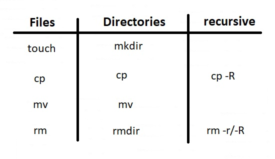
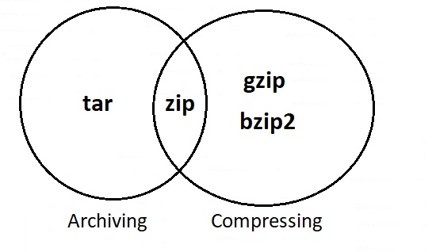
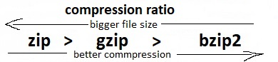
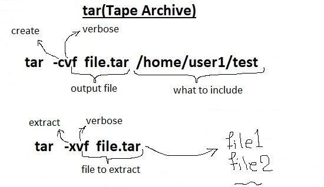
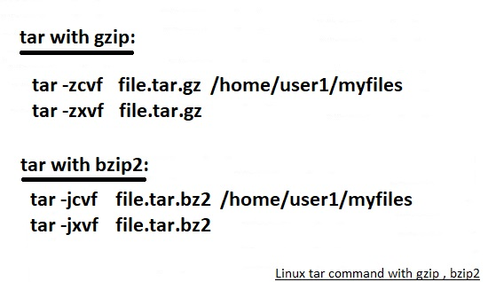
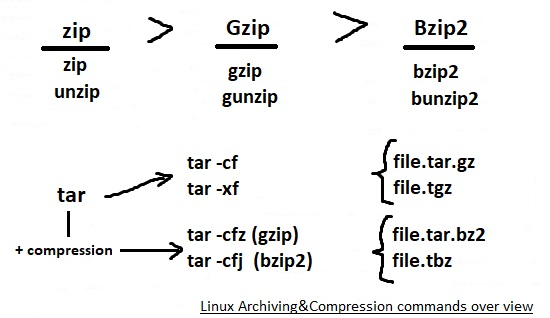
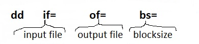
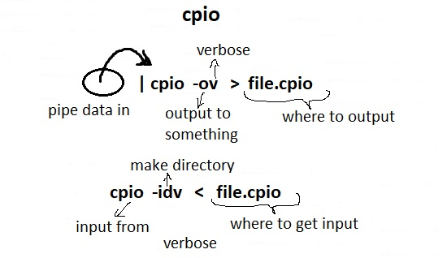

# 103.3. Perform basic file management

### **103.3 Perform basic file management**

**Weight:** 4

**Description: **Candidates should be able to use the basic Linux commands to manage files and directories.

**Key Knowledge Areas:**

* Copy, move and remove files and directories individually
* Copy multiple files and directories recursively
* Remove files and directories recursively
* Use simple and advanced wildcard specifications in commands
* Using find to locate and act on files based on type, size, or time
* Usage of tar, cpio and dd

**Terms and Utilities:**

* cp
* find
* mkdir
* mv
* ls
* rm
* rmdir
* touch
* tar
* cpio
* dd
* file
* gzip
* gunzip
* bzip2
* xz
* file globbing

As we said Linux is the world of processes and files, in this section we start talking about file management in linux and we will talk about both files and directories (folders). Tools are pretty basic and their names are abstraction of what they really do.

### ls

ls **lists files and directories**, and their associated metadata, such as file size, ownership, and modification time.

```
ls [options] [file|dir]
```

We can use **absolute paths** (ex:`user1@ubuntu16-1:~$ ls /home/user1/Music`) or** relative paths** (ex: `user1@ubuntu16-1:~$ ls Music/`) with ls.

With no options, ls lists the files contained in the current directory, sorting them alphabetically.

```
user1@ubuntu16-1:~$ ls
Desktop    Downloads         Music     Public     Videos
Documents  examples.desktop  Pictures  Templates
```

` -1` prints outs each result in 1 line:

```
user1@ubuntu16-1:~$ ls -1
Desktop
Documents
Downloads
examples.desktop
Music
Pictures
Public
Templates
Videos
```

The default output of the ls command shows only the names of the files, which is not very informative. So lets use ls with `-l` for long listing format :

```
user1@ubuntu16-1:~$ ls -l
total 44
drwxr-xr-x 2 user1 user1 4096 Nov  4  2018 Desktop
drwxr-xr-x 2 user1 user1 4096 Nov  4  2018 Documents
drwxr-xr-x 2 user1 user1 4096 Nov  4  2018 Downloads
-rw-r--r-- 1 user1 user1 8980 Apr 20  2016 examples.desktop
drwxr-xr-x 2 user1 user1 4096 Nov  4  2018 Music
drwxr-xr-x 2 user1 user1 4096 Nov  4  2018 Pictures
drwxr-xr-x 2 user1 user1 4096 Nov  4  2018 Public
drwxr-xr-x 2 user1 user1 4096 Nov  4  2018 Templates
drwxr-xr-x 2 user1 user1 4096 Nov  4  2018 Videos
```

The first character represents the file type: "-" for a regular file, "d" for a directory, "l" for a symbolic link(we will see them).

When the long listing format is used the ls command will display the following file information:

1. The file type
2. The file permissions
3. Number of hard links to the file
4. File owner
5. File group
6. File size
7. Date and Time
8. File name

**Show Hidden Files**

By default, the ls command will not show hidden files._ In Linux, a hidden file is any file that begins with a dot (.)_.To display all files including the hidden files use the` -a` option:

```
user1@ubuntu16-1:~$ ls -a
.              .config           .gconf         Pictures   .Xauthority
..             Desktop           .gnupg         .profile   .xsession-errors
.bash_history  .dmrc             .ICEauthority  Public     .xsession-errors.old
.bash_logout   Documents         .local         .ssh
.bashrc        Downloads         .mozilla       Templates
.cache         examples.desktop  Music          Videos
```

Some other usefull options:

| ls command options | description                                              |
| ------------------ | -------------------------------------------------------- |
| -l                 | list with long format - show permissions                 |
| -r                 | list in reverse order                                    |
| -t                 | sort by time & date                                      |
| -lh                | List Files with Human Readable Format                    |
| -F                 | List Files and Directories with ‘/’ Character at the end |
| -R                 | Recursively list Sub-Directories                         |
| -a                 | list all files including hidden file starting with '.'   |

## Copying, Moving & Deleting <a href="copying-moving--deleting" id="copying-moving--deleting"></a>

To make it easier lets classfied them in some groups:



Before going into how to use the touch command, let’s start by reviewing the file timestamps in Linux.

#### Linux Files Timestamps

In Linux every single file is associated with timestamps, and every file stores the information of** last access time**, **last modification time** and **last change time**. So, whenever we create new file, access or modify an existing file, the timestamps of that file automatically updated.

A file in Linux has three timestamps:

* **atime** (access time) - The last time the file was accessed/opened by some command or application such as cat, vim or grep.
* **mtime** (modify time) - The last time the file’s content was modified.
* **ctime** (change time) - The last time the file’s attribute or content was changed. The attribute includes file permissions, file ownership or file location.

To display the file status including the timestamps you can use the `stat` command.(we use ubuntu 16.04 here)

```
root@ubuntu16-1:~# stat /etc/hosts
  File: '/etc/hosts'
  Size: 247           Blocks: 8          IO Block: 4096   regular file
Device: 801h/2049d    Inode: 1200795     Links: 1
Access: (0644/-rw-r--r--)  Uid: (    0/    root)   Gid: (    0/    root)
Access: 2019-09-08 02:34:44.962514623 -0700
Modify: 2018-07-01 23:15:30.140815060 -0700
Change: 2018-07-01 23:15:30.144817112 -0700
 Birth: -
```

### touch

The touch command is a standard command used in UNIX/Linux operating system which is used to create, change and modify timestamps of a file.

* touch command (with no option) create an empty file if file does not exist.
* if file exists touch command would change its time stamps .

**creating an empty file:**

touch command is used to create a file without any content. The file created using touch command is empty. This command can be used when the user doesn’t have data to store at the time of file creation.

```
touch file_name
```

example:

```
root@ubuntu16-1:~/test-space# touch file1
root@ubuntu16-1:~/test-space# ls -l
total 0
-rw-r--r-- 1 root root 0 Sep  8 02:37 file1
```

**creating multiple empty files:**

```
touch File1_name File2_name File3_name
```

for example:

```
root@ubuntu16-1:~/test-space# ls -l
total 0
-rw-r--r-- 1 root root 0 Sep  8 02:37 file1
root@ubuntu16-1:~/test-space# touch file1 file2 file3
root@ubuntu16-1:~/test-space# ls -l
total 0
-rw-r--r-- 1 root root 0 Sep  8 02:44 file1
-rw-r--r-- 1 root root 0 Sep  8 02:44 file2
-rw-r--r-- 1 root root 0 Sep  8 02:44 file3
```

** avoids creating new files:**

```
root@ubuntu16-1:~/test-space# touch -c file4
root@ubuntu16-1:~/test-space# ls -l
total 0
-rw-r--r-- 1 root root 0 Sep  8 02:44 file1
-rw-r--r-- 1 root root 0 Sep  8 02:44 file2
-rw-r--r-- 1 root root 0 Sep  8 02:44 file3
```

`-c`option tells that if the file does not exist, do not create it:

#### touch command timestamp options:

* `-a`: change the **access time** only
* `-d`: update the **access and modification times**
* `-m`: change the **modification time only**
* `-r`: **use the access and modification times of other file as reference.**
* `-t`: **creates a file using a specified time**

Lets do some timestamp modifications.

Create a file using a specified time:`touch -t YYMMDDHHMM fileName`

```
root@ubuntu16-1:~/test-space# touch -t 9812010510 myfile
root@ubuntu16-1:~/test-space# ls -l | grep myfile
-rw-r--r-- 1 root root 0 Dec  1  1998 myfile
root@ubuntu16-1:~/test-space# stat myfile
  File: 'myfile'
  Size: 0             Blocks: 0          IO Block: 4096   regular empty file
Device: 801h/2049d    Inode: 2228284     Links: 1
Access: (0644/-rw-r--r--)  Uid: (    0/    root)   Gid: (    0/    root)
Access: 1998-12-01 05:10:00.000000000 -0800
Modify: 1998-12-01 05:10:00.000000000 -0800
Change: 2019-09-08 03:19:28.410459835 -0700
 Birth: -
```

Change the access time:`touch -a fileName`

```
root@ubuntu16-1:~/test-space# touch -a  myfile
```

It only updates last access time.

```
root@ubuntu16-1:~/test-space# stat myfile
  File: 'myfile'
  Size: 0             Blocks: 0          IO Block: 4096   regular empty file
Device: 801h/2049d    Inode: 2228284     Links: 1
Access: (0644/-rw-r--r--)  Uid: (    0/    root)   Gid: (    0/    root)
Access: 2019-09-08 03:26:42.378185145 -0700
Modify: 1998-12-01 05:10:00.000000000 -0800
Change: 2019-09-08 03:26:42.378185145 -0700
```

Change the modification time:`touch -m fileName`

```
root@ubuntu16-1:~/test-space# touch -m myfile
```

It only updates last modification time.

```
root@ubuntu16-1:~/test-space# stat myfile 
  File: 'myfile'
  Size: 0             Blocks: 0          IO Block: 4096   regular empty file
Device: 801h/2049d    Inode: 2228284     Links: 1
Access: (0644/-rw-r--r--)  Uid: (    0/    root)   Gid: (    0/    root)
Access: 2019-09-08 03:26:42.378185145 -0700
Modify: 2019-09-08 03:28:06.314537292 -0700
Change: 2019-09-08 03:28:06.314537292 -0700
 Birth: -
```

Explicitly Set the Access and Modification times: `touch -c -t YYDDHHMM filename`

Update access and modification time:`touch -c -d fileName`

We use the timestamp of another file with -r option: `touch -r refrence_file_name file_name`

```
root@ubuntu16-1:~/test-space# stat file1
  File: 'file1'
  Size: 0             Blocks: 0          IO Block: 4096   regular empty file
Device: 801h/2049d    Inode: 2228281     Links: 1
Access: (0644/-rw-r--r--)  Uid: (    0/    root)   Gid: (    0/    root)
Access: 2019-09-08 02:44:27.744736670 -0700
Modify: 2019-09-08 02:44:27.744736670 -0700
Change: 2019-09-08 02:44:27.744736670 -0700
 Birth: -
root@ubuntu16-1:~/test-space# touch -r file1 myfile 
root@ubuntu16-1:~/test-space# stat myfile 
  File: 'myfile'
  Size: 0             Blocks: 0          IO Block: 4096   regular empty file
Device: 801h/2049d    Inode: 2228284     Links: 1
Access: (0644/-rw-r--r--)  Uid: (    0/    root)   Gid: (    0/    root)
Access: 2019-09-08 02:44:27.744736670 -0700
Modify: 2019-09-08 02:44:27.744736670 -0700
Change: 2019-09-08 03:34:14.724762374 -0700
 Birth: -
```

and many more examples.

### mkdir

mkdir command in Linux allows the user to create directories (also referred to as folders in some operating systems )

```
mkdir [options...] [directories ...]
```

```
root@ubuntu16-1:~/test-space# mkdir dir1
root@ubuntu16-1:~/test-space# ls -l
total 4
drwxr-xr-x 2 root root 4096 Sep  8 03:44 dir1
```

This command can create multiple directories at once as well as set the permissions for the directories. It is important to note that the user executing this command must have enough permissions to create a directory in the parent directory, or he/she may recieve a ‘permission denied’ error.

```
root@ubuntu16-1:~/test-space# mkdir --help
Usage: mkdir [OPTION]... DIRECTORY...
Create the DIRECTORY(ies), if they do not already exist.

Mandatory arguments to long options are mandatory for short options too.
  -m, --mode=MODE   set file mode (as in chmod), not a=rwx - umask
  -p, --parents     no error if existing, make parent directories as needed
  -v, --verbose     print a message for each created directory
  -Z                   set SELinux security context of each created directory
                         to the default type
      --context[=CTX]  like -Z, or if CTX is specified then set the SELinux
                         or SMACK security context to CTX
      --help     display this help and exit
      --version  output version information and exit

GNU coreutils online help: <http://www.gnu.org/software/coreutils/>
Full documentation at: <http://www.gnu.org/software/coreutils/mkdir>
or available locally via: info '(coreutils) mkdir invocation'
```

Lets try some of the most useful switches, `-p`enables the command to create parent directories as necessary. If the directories exist, no error is specified:

```
root@ubuntu16-1:~/test-space# mkdir -p dir1/floor1/floor2
root@ubuntu16-1:~/test-space# tree
.
└── dir1
    └── floor1
        └── floor2

3 directories, 0 files
```

We can create a directory and set the permissions(will be discussed later) for that directory at the same time using -m option:

```
root@ubuntu16-1:~/test-space# mkdir -m777 dir2 
root@ubuntu16-1:~/test-space# ls -l
total 8
drwxr-xr-x 3 root root 4096 Sep  8 03:57 dir1
drwxrwxrwx 2 root root 4096 Sep  8 04:09 dir2
```

The syntax of the mode is the same as the chmod command (will be discussed later).

```
root@ubuntu16-1:~/test-space# mkdir -v -m o=--- dir3
mkdir: created directory 'dir3'
root@ubuntu16-1:~/test-space# ls -l
total 12
drwxr-xr-x 3 root root 4096 Sep  8 03:57 dir1
drwxrwxrwx 2 root root 4096 Sep  8 04:09 dir2
drwxr-x--- 2 root root 4096 Sep  8 04:14 dir3
```

with `-v`option, it prints a message for each created directory.

### cp

The `cp` command is a command-line utility for copying files and directories.  \[Copies of files are independent of the original file( unlike the `mv` command)  ].The basic syntax of the cp command is:

```
cp [options….] source(s) destination
```

> cp can take 1 or more sources(s) but just one destination.

It supports copying one or more files or directories with options for taking backups and preserving attributes.

Do not forget to consider source and destination types (files or directory) when using cp command.

* If the target is an existing directory, then all sources are copied into the target. 
* If the target is a directory that does not exist, then the (single) source must also be a directory and a copy of the source directory and its contents is made with the target name as the new name. 
* If the target is a file, then the (single) source must also be a file and a copy of the source file is made with the target name as the new name, replacing any existing file of the same name.

lets do some examples:

```
root@ubuntu16-1:~/test-space# tree
.
├── dir1
│   └── floor1
│       └── floor2
├── dir2
├── dir3
└── file1

5 directories, 1 file
```

**copy a file:**

```
root@ubuntu16-1:~/test-space# cp file1 file2
root@ubuntu16-1:~/test-space# ls
dir1  dir2  dir3  file1  file2
```

**take a backup when copying a file**

If a copy operation will overwrite a file the `-b` flag may be used to create a back up of the file. This copies the file into place and writes a backup file.

```
root@ubuntu16-1:~/test-space# ls
dir1  dir2  dir3   file1  file2  
root@ubuntu16-1:~/test-space# echo "this is file2 content" > file2
root@ubuntu16-1:~/test-space# echo "ehis is file1 content" > file1
root@ubuntu16-1:~/test-space# cp -b file1 file2
root@ubuntu16-1:~/test-space# ls
dir1  dir2  dir3   file1  file2  file2~ 
root@ubuntu16-1:~/test-space# cat file2
ehis is file1 content
root@ubuntu16-1:~/test-space# cat file2~
this is file2 content
```

specify the name of the backup file use the `-S` option. try `cp -S .file2bak file1 file2`

**copy multiple files (into a directory)**

```
root@ubuntu16-1:~/test-space# cp file1 file2 dir2/
root@ubuntu16-1:~/test-space# tree
.
├── dir1
│   └── floor1
│       └── floor2
├── dir2
│   ├── file1
│   └── file2
├── dir3
├── file1
├── file2
└── file2~


5 directories, 4 files
```

**Copying files recursively**

We can use cp to copy entire directory structures from one place to another using the `-R `option to perform a recursive copy.

 Let's say you are the user root and you have a directory, /home/test-space, which contains many files and subdirectories. You want to copy all those files, and all the subdirectories (and the files and subdirectories they contain), to a new location, /root/files-backup. You can copy all of them using the command:

`cp -R ~/test-space ~/files-backup`

* If the directory files-backup already exists, the directory files will be placed inside.
* If files-backup does not already exist, it will be created and the contents of the files directory will be placed inside it.

**copy a directory**

By default the cp command will not copy directories. Attempting to copy a directory results in an error.

```
root@ubuntu16-1:~/test-space# cp dir2 dir4
cp: omitting directory 'dir2'
```

To copy a directory pass the `-R` flag. This will recursively copy a folder and create a copy.

```
root@ubuntu16-1:~/test-space# cp -R dir1 NewDirectoryA
root@ubuntu16-1:~/test-space# tree
.
├── dir1
│   └── floor1
│       └── floor2
├── dir2
│   ├── file1
│   └── file2
├── dir3
├── file1
├── file2
├── file2~
└── NewDirectoryA
    └── floor1
        └── floor2

8 directories, 5 files
```

**copy multiple directories**

To copy multiple directories pass the path of the directories to be copied followed by the destination directory.

```
root@ubuntu16-1:~/test-space# cp -R dir1 dir2 NewDirectoryB
cp: target 'NewDirectoryB' is not a directory
root@ubuntu16-1:~/test-space# mkdir NewDirectoryB
root@ubuntu16-1:~/test-space# cp -R dir1 dir2 NewDirectoryB
root@ubuntu16-1:~/test-space# tree
.
├── dir1
│   └── floor1
│       └── floor2
├── dir2
│   ├── file1
│   └── file2
├── dir3
├── file1
├── file2
├── file2~
├── NewDirectoryA
│   └── floor1
│       └── floor2
└── NewDirectoryB
    ├── dir1
    │   └── floor1
    │       └── floor2
    └── dir2
        ├── file1
        └── file2

13 directories, 7 files
```

Now lets take a look at some cp command options:

| cp command useful options: | Description                                                                                                                                                                                                                                        |
| -------------------------- | -------------------------------------------------------------------------------------------------------------------------------------------------------------------------------------------------------------------------------------------------- |
| -v,--verbose               | Verbose mode; explain what is being done.                                                                                                                                                                                                          |
| --preserve                 | preserve file attributes (permissions, group and user owernship).By default mode, ownership and timestamps will be preserved.                                                                                                                      |
| -i , --interactive         | Prompt before overwrite (overrides a previous -n option).                                                                                                                                                                                          |
| -n , --no-clobber          | Do not overwrite an existing file. If -i/--interactive was previously specified, this option overrides it. This option cannot be specified with -b/--backup, because backups are only created when a file would have been overwritten.             |
| -f,--force                 | If an existing destination file cannot be opened, remove it and try again. This option has no effect if the -n/--no-clobber option is used. However, it applies independently of -i/--interactive; neither option cancels the effect of the other. |

cp command has lots of options.Try `man cp` command for more information.

### mv

`mv` is used to **move or rename one or more files or directories**. In general, the names we can use follow the same rules as for copying with cp; \[If you are moving a file on the same file system, the inode wont change]. 

* Rename a file( or directory) name source to destination:

```
mv [options]  source destination
```

* Move source file(s) or directory(s) to a directory named destination:

```
mv [options] source [source2 ...] destination
```

Same as the previous syntax, but specifying the directory first, and the source file(s)(or directory(s)) last

```
mv [options] -t destination source [source2 ...]
```

Lets try mv command:

```
root@ubuntu16-1:~/test-space# tree -F
.
├── dir1/
├── dir2/
├── file1
```

**Renaming a File or a directory:**

```
root@ubuntu16-1:~/test-space# mv file1 NewFile1
root@ubuntu16-1:~/test-space# mv dir1 dirA
root@ubuntu16-1:~/test-space# tree -F
.
├── dir2/
├── dirA/
├── file2
└── NewFile1
```

**Moving Files into a directory:**

```
root@ubuntu16-1:~/test-space# mv NewFile1 file2 dir3
mv: target 'dir3' is not a directory
root@ubuntu16-1:~/test-space# mkdir dir3
root@ubuntu16-1:~/test-space# mv NewFile1 file2 dir3
root@ubuntu16-1:~/test-space# tree -F
.
├── dir2/
├── dir3/
│   ├── file2
│   └── NewFile1
└── dirA/

3 directories, 2 files
```

**Moving a directory into another :**

```
root@ubuntu16-1:~/test-space# mv dir3 dirA
root@ubuntu16-1:~/test-space# tree -F
.
├── dir2/
└── dirA/
    └── dir3/
        ├── file2
        └── NewFile1

3 directories, 2 files
```

we could use`mv -t dirA dir3` command as well. `-t, --target-directory`Move all sources into the directory destination.

usefull mv command options:

| mv command options | description                                               |
| ------------------ | --------------------------------------------------------- |
| -v                 | verbose - print source and destination files              |
| -i                 | interactive prompt before overwrite                       |
| -u                 | update - move when source is newer than destination       |
| -f                 | force move by overwriting destination file without prompt |

> #### cp vs mv :
>
> Normally, the cp command will copy a file over an existing copy, if the existing file is writable. On the other hand, the mv will not move or rename a file if the target exists. We can overcome this using the`-f`switch.

### rm

`rm` stands for **remove** here. `rm` removes files or directories.

```
rm [OPTION]... FILE...
```

Lets try:

```
root@ubuntu16-1:~/test-space# tree -F
.
├── dir1/
├── dir2/
│   └── MyFile
└── file1

2 directories, 2 files
```

**Removing Files**

```
root@ubuntu16-1:~/test-space# rm file1
root@ubuntu16-1:~/test-space# tree -F
.
├── dir1/
└── dir2/
    └── MyFile

2 directories, 1 file
```


**File names starting with a dash, How to remove it?**

To remove a file whose name begins with a dash ("-"), you can specify a double dash ("--") separately before the file name. This extra dash is necessary so that rm does not misinterpret the file name as an option: `rm -- -file.txt`Or, we can delete it by referring to it with a pathname : `rm /home/hope/-file.txt`


some other options of rm command:

| mv options | description                                                  |
| ---------- | ------------------------------------------------------------ |
| -v         | Verbose mode; explain at all times what is being done.       |
| -i         | prompt before every removal                                  |
| -f,--force | Ignore none existant files,and never prompt before removing. |
| -d,--dir   | Remove empty directories.                                    |

#### Removing directories

```
root@ubuntu16-1:~/test-space# rm dir1
rm: cannot remove 'dir1': Is a directory
```

By default, `rm` does not remove directories.

If the specified directory is empty, it may be removed with the -d/--dir option, instead.

```
root@ubuntu16-1:~/test-space# rm -d dir1
root@ubuntu16-1:~/test-space# tree -F
.
└── dir2/
    └── MyFile

1 directory, 1 file
```

What if desired directory contains some files? If the **-r/-R/--recursive** option is specified, we can remove that directory however rm will remove any matching directories and their contents!

```
root@ubuntu16-1:~/test-space# rm -rf dir2
root@ubuntu16-1:~/test-space# tree -F
.

0 directories, 0 files
```

`rm -d`lets us to remove a directory without specifying **-r/-R/--recursive**, provided that the directory is **empty**. In other words, **rm -d **is equivalent to using **rmdir**.

### rmdir

Removing directories using the rmdir command is the opposite of creating them. We can remove a directory with `rmdir` only if it is **empty** as there is** no option to force removal**.

```
rmdir [options] directory ...
```

Again, there is a`-p` option to remove parents as well. Let try it:

```
root@ubuntu16-1:~/test-space# tree -F
.
├── dir1/
│   └── file1
├── dir2/
└── dir3/
    └── dirA/
        └── dirB/

5 directories, 1 file
root@ubuntu16-1:~/test-space# rmdir dir1
rmdir: failed to remove 'dir1': Directory not empty
root@ubuntu16-1:~/test-space# rmdir dir2
root@ubuntu16-1:~/test-space# tree -F
.
├── dir1/
│   └── file1
└── dir3/
    └── dirA/
        └── dirB/

4 directories, 1 file
root@ubuntu16-1:~/test-space# rmdir -p dir3/dirA/
root@ubuntu16-1:~/test-space# rmdir -p dir3/dirA/dirB/
root@ubuntu16-1:~/test-space# tree -F
.
└── dir1/
    └── file1

1 directory, 1 file
```

Normally, when`rmdir` is instructed to remove a non-empty directory, it reports an error. With `--ignore-fail-on-non-empty`option suppresses those error messages.

## Handling multiple files and directories

Some time we need to work on more than one files, Now we try to have review over some recursive commands

### Recursive manipulation

**Recursive listing**

The ls command has a -R (note uppercase “R”) option for listing a directory and all its subdirectories. The recursive option applies only to directory names, for example, in a directory tree.

```
root@ubuntu16-1:~/test-space# tree
.
├── dir1
│   └── text1
├── dir2
├── file1
└── file2

2 directories, 3 files
root@ubuntu16-1:~/test-space# ls -R
.:
dir1  dir2  file1  file2

./dir1:
text1

./dir2:
```

**Recursive copy**

We can use the -r (or -R or --recursive) option to cause the cp command to descend into source directories and copy the contents recursively. To prevent an infinite recursion, we cannot copy the source directory itself!

```
root@ubuntu16-1:~# cp -R test-space NewCopy
root@ubuntu16-1:~# tree NewCopy/
NewCopy/
├── dir1
│   └── text1
├── dir2
├── file1
└── file2

2 directories, 3 files
```

**Recursive deletion**

I mentioned earlier that _rmdir only removes **empty** directories_. We can use the `-r` (or -R or --recursive) option to cause the rm command to remove both files and directories:

```
root@ubuntu16-1:~# ls
client.conf             NewCopy      unzip_6.0-20ubuntu1_amd64.deb
files-backup            openvpn.key  zip_3.0-11_amd64.deb
jcal_0.4.1-2_amd64.deb  test-space
root@ubuntu16-1:~# rm -rf NewCopy/
root@ubuntu16-1:~# ls
client.conf             openvpn.key                    zip_3.0-11_amd64.deb
files-backup            test-space
jcal_0.4.1-2_amd64.deb  unzip_6.0-20ubuntu1_amd64.deb
```

## Wildcards and Globbing

**File globbing is a feature provided by the UNIX/Linux shell to represent multiple filenames by using special characters called wildcards with a single file name.** A wildcard is essentially a symbol which may be used to substitute for one or more characters. Therefore, we can use wildcards for generating the appropriate combination of file names as per our requirement.

```
root@ubuntu16-1:~/test-space# ls -l
total 0
-rw-r--r-- 1 root root 0 Sep 28 00:26 aaa.txt
-rw-r--r-- 1 root root 0 Sep 28 00:27 ababa.txt
-rw-r--r-- 1 root root 0 Sep 28 00:26 bbbb.txt
-rw-r--r-- 1 root root 0 Sep 27 23:33 file1
-rw-r--r-- 1 root root 0 Sep 27 23:33 file2
```

* `?` **is used to match any single character. **We can use ‘?’ for multiple times for matching multiple characters.

```
root@ubuntu16-1:~/test-space# ls ???.txt
aaa.txt
```

* `*`** is used to match zero or more characters.** If we have less information to search any file or information then we can use ‘\*’ in globbing pattern.

```
root@ubuntu16-1:~/test-space# ls *.txt
aaa.txt  ababa.txt  bbbb.txt
```

* `[ ]`**is used to match the character from the range. Some of the mostly used range declarations are mentioned below:**

`[A-Z]` : All uppercase alphabets

`[a-z]` : All lowercase alphabets

`[a-zA-Z0-9]` : All uppercase alphabets, lowercase alphabet and digits

> The`-`character between two others represents a range that includes the two other characters and all characters between them in the collating sequence.

```
root@ubuntu16-1:~/test-space# ls [e-z]*
file1  file2
```

* **The**`!`** character means NOT so  it matches any character except the remaining characters**.

```
root@ubuntu16-1:~/test-space# ls [!e-z]*
aaa.txt  ababa.txt  bbbb.txt
```

* `{ }`**can be used to match filenames with more than one globbing patterns. Each pattern is separated by ‘,’ in curly bracket without any space.**

```
root@ubuntu16-1:~/test-space# ls {???.txt,????.txt}
aaa.txt  bbbb.txt
```

`rm {*.doc,*.docx}` : delete all files whose extensions are ‘doc’ or ‘docx’.

* **and finally `\ `is used as an "escape" character**, we have used it to protect a subsequent special character. example: "\\\” searches for a backslash

> We can disable globbing using `set -f` command.


**Wildcard patterns vs Regular Expressions**

Wildcard patterns and regular expression patterns share some characteristics, but they are not the same. Pay careful attention.


Now that we’ve covered the file and directory topic with the big recursive hammer that hits everything, and the globbing hammer that hits more selectively, let’s look at the find command, which can be more like a surgeon’s knife.

### Finding Files

 The find command is used to find files in one or more directory trees, based on criteria such as name, time stamp, or size.

### find

The find command searches for files or directories using all or part of the name, or by other search criteria, such as size, type, file owner, creation date, or last access date.

```
find starting/path options  expression
```

1. The `starting/path` attribute will define the top level directory where find begins filtering.
2. The `options`attribute will control the behavior and optimization method of the find process.
3.  The `expression` attribute controls the tests that search the directory hierarchy to produce output.

    The most basic find is a search by name or part of a name:

```
root@ubuntu16-1:~/test-space# find /etc/ -iname "[y-z]*"
/etc/xdg/autostart/zeitgeist-datahub.desktop
/etc/zsh_command_not_found
/etc/vmware-tools/messages/zh_TW
/etc/vmware-tools/messages/zh_CN
/etc/dhcp/dhclient-exit-hooks.d/zzz_avahi-autoipd
/etc/kernel/postrm.d/zz-update-grub
/etc/kernel/postinst.d/zz-update-grub
/etc/brltty/Contraction/zu.ctb
/etc/brltty/Contraction/zh-tw-ucb.ctb
/etc/brltty/Contraction/zh-tw.ctb
```

`-name` option used for searching for files based on their name. `-i`makes it case insensitive. In the first example above, we found both files and a directory (/etc). 


**finding hidden files : **If you want to find a file or directory whose name begins with a dot, such as .bashrc or the current directory (.), then you must specify a leading dot as part of the pattern. Otherwise, name searches ignore these files or directories. `find . -name ".*"`


note: If you want to chain different results together, you can use the “-and” or “-or” commands. The “-and” is assumed if omitted. `find . -name file1 -or -name file9`

**Finding files by type**

We can specify the type of files you want to find with the “-type” parameter. It works like this:

```
find -type type_descriptor query
```

* `-type f`will search for a regular file
* `-type d` will search for a directory
* `-type l` will search for a symbolic link

```
root@ubuntu16-1:~/test-space# find /etc/ -type f -iname "[y-z]*"
/etc/xdg/autostart/zeitgeist-datahub.desktop
/etc/zsh_command_not_found
/etc/dhcp/dhclient-exit-hooks.d/zzz_avahi-autoipd
/etc/kernel/postrm.d/zz-update-grub
/etc/kernel/postinst.d/zz-update-grub
/etc/brltty/Contraction/zu.ctb
/etc/brltty/Contraction/zh-tw-ucb.ctb
/etc/brltty/Contraction/zh-tw.ctb
```

**Finding files by size**

We can also search by file size, either for a specific size (n) or for files that are either larger (+n) or smaller than a given value (-n). By using both upper and lower size bounds, we can find files whose size is within a given range. By default, the -size option of find assumes a unit of ‘b’ for 512-byte blocks.

* `-size  +/- [b] [c] [w] [k] [M} [G]`

```
b     for 512-byte blocks (this is the default if no suffix is used)
c     for bytes
w     for two-byte words
k     for Kilobytes (units of 1024 bytes)
M     for Megabytes (units of 1048576 bytes)
G     for Gigabytes (units of 1073741824 bytes)
```

as an example lets find files smaller than 1 kilobytes:

```
root@ubuntu16-1:~/test-space# find /etc/ -type f -size -1k
/etc/dictionaries-common/ispell-default
/etc/cups/printers.conf
/etc/vmware-caf/pme/config/_previous_/cafenv.config
/etc/.pwd.lock
/etc/apt/trusted.gpg.d/peek-developers_ubuntu_stable.gpg~
/etc/security/opasswd
/etc/gconf/gconf.xml.defaults/%gconf-tree.xml
/etc/gconf/gconf.xml.mandatory/%gconf-tree.xml
/etc/sensors.d/.placeholder
/etc/newt/palette.original
```

We can find all empty files using `find . -size 0b` or `find . -empty` .

**Finding files based on their time:**

Linux stores time data about access times, modification times, and change times.

* **Access Time**: Last time a file was read or written to.
* **Modification Time**: Last time the contents of the file were modified.
* **Change Time**: Last time the file’s inode meta-data was changed.

We can use the time stamps described with the touch command to locate files having particular time stamps.

```
-amin n: The file was last accessed n minutes ago
-anewer: The file was last accessed more recently than it was modified
-atime n: The file was last accessed more n days ago
-cmin n: The file was last changed n minutes ago
-cnewer: The file was last changed more recently than the file was modified
-ctime n: The file was last changed more than n days ago
-mmin n: File's data was last modified n minutes ago
-mtime n: File's data was last modified n days ago
```

again (+/-) signs can be used to give it a range.

Find Changed Files in Last 2 Hours:

```
root@ubuntu16-1:~/test-space# find /home -cmin -120
/home/user1/.cache/upstart
/home/user1/.cache/upstart/indicator-printers.log
/home/user1/.cache/upstart/unity-panel-service.log
```

note : Adding the `-daystart` option to `-mtime` or `-atime` means that we want to consider days as calendar days, starting at midnight. So to list the regular files in your home directory that were modified yesterday we can use `find ~/ -daystart -type f -mtime 1` .

> We can also find files by owner and permissions and use filter result by depth (will be discussed in later sections"104-7")

Acting on files with two other switches:

| find command switch | meaning                                                 |
| ------------------- | ------------------------------------------------------- |
| -ls                 | list current file in ls -dils format on standard output |
| -print              | print the full file name on the standard output         |

As you can see find command has tons of options, get into more details using man page files.

#### Executing and Combining Find Commands (-exec)

We can execute an arbitrary helper command on everything that find matches by using the “-exec” parameter. This is called like this:

```
find find_parameters -exec command_and_params {} \;
```

The `{}` is used as a placeholder for the files that find matches. The “\\;” is used so that find knows where the command ends.

As an instance this will remove all empty files:

```
find . -empty -exec rm {} \;
```

We could remove all empty files in this directory and its subdirectories:

```
find . -empty -exec rm '{}' \;
```

We could then change the directory permissions like this:

```
find . -name "*.deb" -exec cp {} /tmp/packages \;
```

## Identifying files <a href="identifying-files" id="identifying-files"></a>

File names often have a suffix such as gif, jpeg, or html that gives a hint of what the file might contain. Linux does not require such suffixes and generally does not use them to identify a file type. Knowing what type of file you are dealing with helps you know what program to use to display or manipulate it.

### file

The file command tells us something about the type of data in one or more files.

```
file [option] [filename]
```

```
root@ubuntu16-1:~/test-space# ls -l
total 10880
-rwxrw-rw- 1 user1 user1 10819475 Mar 29  2015 01 - Intro.mp4
-rw------- 1 user1 user1   221941 Sep  1 00:24 zabbix-cli-manual-1.7.0.pdf
-rw------- 1 user1 user1    91087 Aug 31 00:40 zabbix-cli-rpm-2.1.1-1.tar.gz

root@ubuntu16-1:~/test-space# file 01\ -\ Intro.mp4 
01 - Intro.mp4: ISO Media, MP4 Base Media v1 [IS0 14496-12:2003]
```

`-b, –brief`** :** This is used to display just file type in brief mode.

```
root@ubuntu16-1:~/test-space# file  -b zabbix-cli-manual-1.7.0.pdf 
PDF document, version 1.4
```

`-z`**:** Try to look inside compressed files.

```
root@ubuntu16-1:~/test-space# file -z zabbix-cli-rpm-2.1.1-1.tar.gz zabbix-cli-rpm-2.1.1-1.tar.gz:
POSIX tar archive (gzip compressed data, from Unix)
```

and `-i`option** ** To view mime type of file.


A MIME type is a label used to identify a type of data. It is used so software can know how to handle the data. It serves the same purpose on the Internet that file extensions do on Microsoft Windows.


### Archiving and Compressing files

Archiving and compressing are two different things



* tar just archive files and does not do any compression by default.
* zip does both archiving and compresion.
* gzip and bzip2 are used just for compression.



### zip

`Zip` is one of the most popular archive file format out there. With zip, you can compress multiple files into one file. This not only saves disk space, it also saves network bandwidth. This is why you’ll encounter zip files almost all the time.

```
zip options archive inpath inpath ...
```

Lets take a look a look:

```
root@ubuntu16-1:~/test-space/myfiles# tree -F
.
├── dir1/
│   └── myvideo.mp4*
├── dir2/
│   ├── zabbix-cli-manual-1.7.0.pdf
│   └── zabbix-cli-rpm-2.1.1-1.tar.gz
├── myconf.txt
└── mylog.txt

2 directories, 5 files

root@ubuntu16-1:~/test-space/myfiles# zip myconf.zip myconf.txt 
  adding: myconf.txt (deflated 60%)

root@ubuntu16-1:~/test-space/myfiles# tree -F
.
├── dir1/
│   └── myvideo.mp4*
├── dir2/
│   ├── zabbix-cli-manual-1.7.0.pdf
│   └── zabbix-cli-rpm-2.1.1-1.tar.gz
├── myconf.txt
├── myconf.zip
└── mylog.txt

2 directories, 6 files
```

use the `-r` option with the zip command and it will recursively zips the files in a directory. This option helps you to zip all the files present in the specified directory:

```
root@ubuntu16-1:~/test-space/myfiles# cd ..
root@ubuntu16-1:~/test-space# zip -r myfiles.zip myfiles/
  adding: myfiles/ (stored 0%)
  adding: myfiles/dir1/ (stored 0%)
  adding: myfiles/dir1/myvideo.mp4 (deflated 71%)
  adding: myfiles/etc/ (stored 0%)
  adding: myfiles/dir2/ (stored 0%)
  adding: myfiles/dir2/zabbix-cli-rpm-2.1.1-1.tar.gz (deflated 0%)
  adding: myfiles/dir2/zabbix-cli-manual-1.7.0.pdf (deflated 88%)
  adding: myfiles/mylog.txt (deflated 89%)
  adding: myfiles/myconf.txt (deflated 60%)
  adding: myfiles/myconf.zip (stored 0%)
```

### uzip

A separate companion program, unzip, unpacks and uncompresses zip archives.

```
root@ubuntu16-1:~/test-space# rm -rf myfiles
root@ubuntu16-1:~/test-space# unzip myfiles.zip 
Archive:  myfiles.zip
   creating: myfiles/
   creating: myfiles/dir1/
  inflating: myfiles/dir1/myvideo.mp4  
   creating: myfiles/etc/
   creating: myfiles/dir2/
  inflating: myfiles/dir2/zabbix-cli-rpm-2.1.1-1.tar.gz  
  inflating: myfiles/dir2/zabbix-cli-manual-1.7.0.pdf  
  inflating: myfiles/mylog.txt       
  inflating: myfiles/myconf.txt      
 extracting: myfiles/myconf.zip   
```

| zip command example                     | Description                                     |
| --------------------------------------- | ----------------------------------------------- |
| zip –v filename.zip file1.txt           |  Verbose mode or print diagnostic version info. |
| zip –d filename.zip file.txt            |  Removes the file from the zip archive.         |
| zip –u filename.zip file.txt            | Updates the file in the zip archive.            |
| zip –m filename.zip file.txt            | Deletes the original files after zipping.       |
| zip –x filename.zip file_to_be_excluded | Exclude the files in creating the zip.          |

### Compressing files

### gzip

Gzip (GNU zip) is a compressing tool, which is used to truncate the file size. 

```
gzip [OPTION]... [FILE]...
```

**By default** original file will be replaced by the compressed file ending with extension (.gz) and gzip removes the original files after creating the compressed file. gzip keeps the original file mode, ownership, and timestamp.

```
root@ubuntu16-1:~/test-space/myfiles# tree -F
.
├── dir1/
│   └── myvideo.mp4*
├── dir2/
│   ├── zabbix-cli-manual-1.7.0.pdf
│   └── zabbix-cli-rpm-2.1.1-1.tar.gz
├── myconf.txt
└── mylog.txt

2 directories, 5 files
root@ubuntu16-1:~/test-space/myfiles# gzip mylog.txt 
root@ubuntu16-1:~/test-space/myfiles# tree -F
.
├── dir1/
│   └── myvideo.mp4*
├── dir2/
│   ├── zabbix-cli-manual-1.7.0.pdf
│   └── zabbix-cli-rpm-2.1.1-1.tar.gz
├── myconf.txt
└── mylog.txt.gz

2 directories, 5 files
```

### gunzip

To decompress a file we can use gunzip command and your original file will be back.

```
root@ubuntu16-1:~/test-space/myfiles# ls -l
total 136
drwxr-xr-x 2 root root   4096 Sep 30 05:42 dir1
drwxr-xr-x 2 root root   4096 Oct  5 05:25 dir2
-rw-r--r-- 1 root root   2084 Sep 30 05:44 myconf.txt
-rw-r----- 1 root root 123925 Sep 30 05:41 mylog.txt.gz
root@ubuntu16-1:~/test-space/myfiles# gunzip mylog.txt.gz 
root@ubuntu16-1:~/test-space/myfiles# ls -l
total 1144
drwxr-xr-x 2 root root    4096 Sep 30 05:42 dir1
drwxr-xr-x 2 root root    4096 Oct  5 05:25 dir2
-rw-r--r-- 1 root root    2084 Sep 30 05:44 myconf.txt
-rw-r----- 1 root root 1156369 Sep 30 05:41 mylog.txt
```

also we can use -d option to decompress a file using the “gzip” command.ex : `gzip -d mydoc.gz`

| gzip command example | Description                                                                                                                                                                    |
| -------------------- | ------------------------------------------------------------------------------------------------------------------------------------------------------------------------------ |
| gzip -r testfolder   | compress every file in a folder and its subfolders                                                                                                                             |
| gzip -k mydoc.txt    | compress the file and keep the original file                                                                                                                                   |
| gzip -f myfile1.txt  | fore to compress already compressed file                                                                                                                                       |
| gzip -v mydoc.txt    | displays the name and percentage reduction for each file compressed or decompressed. we can use -l with compressed files.                                                      |
| gzip -L filename.gz  | displays the gzip license                                                                                                                                                      |
| gzip -9 mydoc.txt    | <p>-[1-9] option : It allows to change the compression level.</p><p>1 : fastest compression speed but lower ratio</p><p>9 : highest compression ratio but at a lower speed</p> |

### bzip2

Like gzip, bzip2  command in Linux is used to compress and decompress the files. It uses different compression algorithm so it compress files better than gzip, but  It has a slower decompression time and higher memory use.

```
bzip2 [OPTIONS] filenames ...
```

```
root@ubuntu16-1:~/test-space/myfiles# tree -F
.
├── dir1/
│   └── myvideo.mp4*
├── dir2/
│   ├── zabbix-cli-manual-1.7.0.pdf
│   └── zabbix-cli-rpm-2.1.1-1.tar.gz
├── myconf.txt
└── mylog.txt

2 directories, 5 files
root@ubuntu16-1:~/test-space/myfiles# bzip2 mylog.txt 
root@ubuntu16-1:~/test-space/myfiles# tree -F
.
├── dir1/
│   └── myvideo.mp4*
├── dir2/
│   ├── zabbix-cli-manual-1.7.0.pdf
│   └── zabbix-cli-rpm-2.1.1-1.tar.gz
├── myconf.txt
└── mylog.txt.bz2

2 directories, 5 files
```

### bunzip2

bunzip2 is used for decompression bzip2 files:

```
root@ubuntu16-1:~/test-space/myfiles# ls -l
total 92
drwxr-xr-x 2 root root  4096 Sep 30 05:42 dir1
drwxr-xr-x 2 root root  4096 Oct  5 05:25 dir2
-rw-r--r-- 1 root root  2084 Sep 30 05:44 myconf.txt
-rw-r----- 1 root root 79421 Sep 30 05:41 mylog.txt.bz2
root@ubuntu16-1:~/test-space/myfiles# bunzip2 mylog.txt.bz2 
root@ubuntu16-1:~/test-space/myfiles# ls -l
total 1144
drwxr-xr-x 2 root root    4096 Sep 30 05:42 dir1
drwxr-xr-x 2 root root    4096 Oct  5 05:25 dir2
-rw-r--r-- 1 root root    2084 Sep 30 05:44 myconf.txt
-rw-r----- 1 root root 1156369 Sep 30 05:41 mylog.txt
```

also  **-d ** option is used for decompression of compressed files.

| bzip2 command example | Description                                                    |
| --------------------- | -------------------------------------------------------------- |
| bzip2 -k input.txt    | does compression but does not deletes the original file        |
| bzip2 -z input.txt    | forces compression. It is an opposite command of decompression |
| bzip2 -v input.txt    | show the compression ratio for each file processed             |
| bzip2 -L filename.gz  | -V , -L used to display the software version, license terms    |
| bzip2 -q input.txt    |  It will suppress non-essential warning messages.              |

bzip2 doesn't any options for compressing a directory, so use tar with that. How? read tar section.

### xz

xz is a new general-purpose, command line data compression utility, similar to gzip and bzip2. It can be used to compress or decompress a file according to the selected operation mode. It supports various formats to compress or decompress files.

Selecting a compression utility to use will depend mainly on two factors, the compression speed and rate of a given tool. Unlike its counterparts, xz is not commonly used but offers the best compression.

```
root@ubuntu16-1:~/test-space/myfiles# ls
dir1  dir2  myconf.txt  mylog.txt
root@ubuntu16-1:~/test-space/myfiles# xz mylog.txt 
```

or we could use xz `-x` file to compress that. `-d` is used for decompression:

```
root@ubuntu16-1:~/test-space/myfiles# xz -d mylog.txt.xz 
root@ubuntu16-1:~/test-space/myfiles# ls -l
total 1144
drwxr-xr-x 2 root root    4096 Sep 30 05:42 dir1
drwxr-xr-x 2 root root    4096 Oct  5 05:25 dir2
-rw-r--r-- 1 root root    2084 Sep 30 05:44 myconf.txt
-rw-r----- 1 root root 1156369 Sep 30 05:41 mylog.txt
```

| xz command example | Description                                                                                                       |
| ------------------ | ----------------------------------------------------------------------------------------------------------------- |
| xz -k file.txt     | prevent deleting of the input file(s)                                                                             |
| xz -f file.txt.xz  | use the -f option to force the process(ex: compressed file already exist)                                         |
| xz -9 file.txt     | different compression preset levels (0 to 9, with default being 6) --fast equals  -0 and --best is the same as -9 |
| xz -q file.txt     | run it in quiet mode or enable verbose mode with the -v                                                           |

### Archiving files

What is an Archive file?

An Archive file is a file that is composed of one or more files along with metadata. Archive files are used to collect multiple data files together into a single file for easier portability and storage, or simply to compress files to use less storage space.

### tar

The Linux ‘tar’ stands for tape archive, is used to create Archive and extract the Archive files. tar command in Linux is one of the important command which provides archiving functionality in Linux.

Here a few common use cases of the tar command:

* Backup of Servers and Desktops.
* Document archiving.
* Software Distribution.



lets start:

```
root@ubuntu16-1:~/test-space# tree -F
.
└── myfiles/
    ├── dir1/
    │   └── myvideo.mp4*
    ├── dir2/
    │   ├── zabbix-cli-manual-1.7.0.pdf
    │   └── zabbix-cli-rpm-2.1.1-1.tar.gz
    ├── myconf.txt
    └── mylog.txt

3 directories, 5 files
```

**Create tar Archive File**

```
root@ubuntu16-1:~/test-space# tar -cvf myarch.tar myfiles
myfiles/
myfiles/dir1/
myfiles/dir1/myvideo.mp4
myfiles/dir2/
myfiles/dir2/zabbix-cli-rpm-2.1.1-1.tar.gz
myfiles/dir2/zabbix-cli-manual-1.7.0.pdf
myfiles/mylog.txt
myfiles/myconf.txt

root@ubuntu16-1:~/test-space# ls
myarch.tar  myfiles
```

We can include more than one directory, also it is possible to exclude with`  --exclude  `option.

note: by default tar uncompress file in your current directory and it can make some problems(overwriting ,...), for avoiding that use `tar -xvf backupfile  -C  /restoreDir` command.`  -C  `means change the directory before extracting the backup.

**Untar tar Archive File**

```
root@ubuntu16-1:~/test-space# tar -xvf myarch.tar 
myfiles/
myfiles/dir1/
myfiles/dir1/myvideo.mp4
myfiles/dir2/
myfiles/dir2/zabbix-cli-rpm-2.1.1-1.tar.gz
myfiles/dir2/zabbix-cli-manual-1.7.0.pdf
myfiles/mylog.txt
myfiles/myconf.txt
```

We can use Linux tar command to create compressed or uncompressed Archive files and also maintain and modify them.



```
root@ubuntu16-1:~/test-space# tar -cvzf myfiles.tar.gz myfiles/
myfiles/
myfiles/dir1/
myfiles/dir1/myvideo.mp4
myfiles/dir2/
myfiles/dir2/zabbix-cli-rpm-2.1.1-1.tar.gz
myfiles/dir2/zabbix-cli-manual-1.7.0.pdf
myfiles/mylog.txt
myfiles/myconf.txt

root@ubuntu16-1:~/test-space# tar -cvjf myfiles.tar.bz2 myfiles/
myfiles/
myfiles/dir1/
myfiles/dir1/myvideo.mp4
myfiles/dir2/
myfiles/dir2/zabbix-cli-rpm-2.1.1-1.tar.gz
myfiles/dir2/zabbix-cli-manual-1.7.0.pdf
myfiles/mylog.txt
myfiles/myconf.txt

root@ubuntu16-1:~/test-space# ls -lh
total 6.4M
drwxr-xr-x 4 root root 4.0K Oct  5 23:51 myfiles
-rw-r--r-- 1 root root 3.2M Oct  6 01:59 myfiles.tar.bz2
-rw-r--r-- 1 root root 3.3M Oct  6 01:58 myfiles.tar.gz
```

for decompressing tar.gzip use  ` tar -xzvf file.tar.gz`  and `tar -xjvf file.tar.bz2` for bzip2 files.

```
tar command Options:
-c : Creates Archive
-x : Extract the archive
-f : creates archive with given filename
-v : Displays Verbose Information
-t : displays or lists files in archived file
-u : archives and adds to an existing archive file
-A : Concatenates the archive files
-z : zip, tells tar command that create tar file using gzip
-j : filter archive tar file using tbzip
-W : Verify a archive file
-r : update or add file or directory in already existed .tar file
wildcards – Specify patterns in unix tar command
```

note: `-r` option can not append any files to a **compressed file**.  

we usually use mixture of tar options to gain what we want:

| tar command example                   | Description                                                |
| ------------------------------------- | ---------------------------------------------------------- |
| tar tf file.tar                       | list the contents and specify the tarfile                  |
| tar tvf file.tar                      | Viewing the Archive                                        |
| tar tvf file.tar filename             | We can pass a file name as an argument to search a tarfile |
| tar tvf file.tar --wildcards '\*.png' | Using wildcards with tar                                   |
| tar -tvfW file.tar                    | Verify tar  Archive File                                   |
| tar -rvf file.tar newfile.txt         | Add a file to .tar File                                    |
| tar -uvf file.tar newdir              | Add a directory to an existing .tar file                   |



use` tar -cJf file.tar.xz` to create xz compressed file and`    tar -xJf file.tar.xz` for extracting.

### dd

dd stands for Convert & Copy but why it is not cc? because the name cc is already used by c compiler.  Many people call it  Disk Destroyer because dd doesn't care at all about file system and strickly works with Block Devices!

```
dd [OPERAND]...
dd OPTION
```

 The command line syntax of dd differs from many other Unix programs, in that it uses the syntax _option=value_ for its command line options, rather than the more-standard _-option value_ or _–option=value_ formats. By default, dd reads from stdin and writes to stdout, but these can be changed by using the if (input file) and of (output file) options.



dd takes an input file line (ex:/dev/sda) and it writes it to the out put file (ex:/dev/sdb) we specify, bs is block size, how big we want to write blocks and it is not neseccary and can be omitted.

 Backup the entire harddisk:

```
dd if = /dev/sda of = /dev/sdb
```

We can even use dd to copy any kind of block devices and as dd works on block devices itself it doesn't matter if partion ups.

* If there are any errors, the above command will fail. If you give the parameter _“conv=noerror”_ then it will continue to copy if there are read errors.`dd if = /dev/sda of = /dev/sdb conv=noerror`
* Input and output should be mentioned very carefully. Just in case, you mention source device in the target and vice versa, you might loss all your data.
* To copy, hard drive to hard drive using dd command given below, sync option allows you to copy everything using synchronized I/O.`dd if = /dev/sda of = /dev/sdb conv=noerror, sync`

| dd comand examples                                 | Description                                            |
| -------------------------------------------------- | ------------------------------------------------------ |
| dd if = /dev/sda of = /dev/sdb                     | backup entire Disk                                     |
| dd if=/dev/hda1 of=\~/partition.img                | backup a partition                                     |
| dd if = /dev/hda of = \~/hdadisk.img               | create an image of a Hard Disk                         |
| dd if = hdadisk.img of = /dev/hdb                  | restore using  Hard Disk image                         |
| dd if = /dev/cdrom of = tgsservice.iso bs = 2048   | create CD-Rom backup                                   |
| dd if=/path/to/ubuntu.iso of=/dev/sdb bs=1M        | create bootable usb drive from  image                  |
| dd if=textfile.ebcdic of=textfile.ascii conv=ascii | Convert the data format of a file from EBCDIC to ASCII |

conv can do many thing such as Converting a file to uppercase or visa versa.

### cpio

`cpio` stands for “**C**o**p**y **i**n, copy **o**ut“. It is used for processing the archive files like _.cpio or _.tar. This command can copy files to and from archives.

* **Copy-out Mode:** Copy files named in name-list to the archive` command | cpio -o  > archive`
* **Copy-in Mode:** Extract files from the archive` cpio -i < archive`
* **Copy-pass Mode:** Copy files named in name-list to destination-directory` cpio -p destination-directory < name-list`



```
Policy options:
    -i, –extract: Extract files from an archive and it runs only in copy-in mode.
    -o, –create: Create the archive and it runs only in copy-out mode.
    -p, –pass-through: Run in copy-pass mode.
    -t, –list: Print a table of contents of all the inputs present.
```

| cpio command example           | Description                           |
| ------------------------------ | ------------------------------------- |
| ls /etc \| cpio -ov file.cpio  | create a cpio file                    |
| cpio -iv <  file.cpio          | extract a cpio file                   |
| ls \| cpio -ov -H tar file.tar | create a tar file using cpio          |
| cpio -iv -F file.tar           | extract a tar file using cpio         |
| cpio -it -F < file.tar         | only view tar archive file using cpio |

.

.

.

.


#### Linux Devices (beyond the scop of LPIC1 exam)

 In Linux various special files can be found under the directory `/dev`. These files are called device files and behave unlike ordinary files.

```
root@ubuntu16-1:~/test-space# ls -l /dev/
total 0
...
brw-rw----  1 root disk      8,   0 Dec  2  2018 sda
brw-rw----  1 root disk      8,   1 Dec  2  2018 sda1
brw-rw----  1 root disk      8,   2 Dec  2  2018 sda2
brw-rw----  1 root disk      8,   5 Dec  2  2018 sda5
crw-rw----  1 root disk     21,   0 Dec  2  2018 sg0
crw-rw----+ 1 root cdrom    21,   1 Dec  2  2018 sg1
...
```

The columns are as follows from left to right:

* Permissions
* Owner
* Group
* Major Device Number
* Minor Device Number
* Timestamp
* Device Name

Remember in the ls command you can see the type of file with the first bit on each line. Device files are denoted as the following:

```
c - character
b - block
p - pipe
s - socket
```

 The most common types of device files are for block devices and character devices. These files are an interface to the actual driver (part of the Linux kernel) which in turn accesses the hardware. Another, less common, type of device file is the named _pipe:_

 **Character Device:**These devices transfer data, but one a character at a time. You'll see a lot of pseudo devices (/dev/null) as character devices, these devices aren't really physically connected to the machine, but they allow the operating system greater functionality.

 **Block Device:**These devices transfer data, but in large fixed-sized blocks. We'll most commonly see devices that utilize data blocks as block devices, such as harddrives, filesystems, etc.

**Pipe Device:**Named pipes allow two or more processes to communicate with each other, these are similar to character devices, but instead of having output sent to a device, it's sent to another process.

**Socket Device:**Socket devices facilitate communication between processes, similar to pipe devices but they can communicate with many processes at once.

 **Device Characterization (Major Device Number & Minor Device Number)**

Devices are characterized using two numbers, major device number and minor device number. **We** can see these numbers in the above ls example, they are separated by a comma. For example, let's say a device had the device numbers: 8, 0:

The major device number represents the device driver that is used, in this case 8, which is often the major number for sd block devices. The minor number tells the kernel which unique device it is in this driver class, in this case 0 is used to represent the first device (a).



.

.

[https://www.computerhope.com/unix/uls.htm](https://www.computerhope.com/unix/uls.htm)

[https://linuxize.com/post/how-to-list-files-in-linux-using-the-ls-command/](https://linuxize.com/post/how-to-list-files-in-linux-using-the-ls-command/)

[https://www.rapidtables.com/code/linux/ls.html](https://www.rapidtables.com/code/linux/ls.html)

[https://www.tecmint.com/8-pratical-examples-of-linux-touch-command/](https://www.tecmint.com/8-pratical-examples-of-linux-touch-command/)

[https://www.geeksforgeeks.org/touch-command-in-linux-with-examples/](https://www.geeksforgeeks.org/touch-command-in-linux-with-examples/)

[https://linuxize.com/post/linux-touch-command/](https://linuxize.com/post/linux-touch-command/)

[https://www.geeksforgeeks.org/mkdir-command-in-linux-with-examples/](https://www.geeksforgeeks.org/mkdir-command-in-linux-with-examples/)

[https://www.lifewire.com/create-directories-linux-mkdir-command-3991847](https://www.lifewire.com/create-directories-linux-mkdir-command-3991847)

[https://developer.ibm.com/tutorials/l-lpic1-103-3/](https://developer.ibm.com/tutorials/l-lpic1-103-3/)

[https://shapeshed.com/unix-cp/](https://shapeshed.com/unix-cp/)

[https://www.rapidtables.com/code/linux/cp.html](https://www.rapidtables.com/code/linux/cp.html)

[https://www.computerhope.com/unix/ucp.htm](https://www.computerhope.com/unix/ucp.htm)

[https://www.rapidtables.com/code/linux/mv.html](https://www.rapidtables.com/code/linux/mv.html)

[https://www.computerhope.com/unix/umv.htm](https://www.computerhope.com/unix/umv.htm)

[https://jadi.gitbooks.io/lpic1/content/1033\_perform_basic_file_management.html](https://jadi.gitbooks.io/lpic1/content/1033\_perform_basic_file_management.html)

[https://www.computerhope.com/unix/urm.htm](https://www.computerhope.com/unix/urm.htm)

[https://www.computerhope.com/unix/urmdir.htm](https://www.computerhope.com/unix/urmdir.htm)

[https://www.linuxnix.com/10-file-globbing-examples-linux-unix/](https://www.linuxnix.com/10-file-globbing-examples-linux-unix/)

[https://linuxhint.com/bash_globbing_tutorial/](https://linuxhint.com/bash_globbing_tutorial/)

[https://www.linode.com/docs/tools-reference/tools/find-files-in-linux-using-the-command-line/](https://www.linode.com/docs/tools-reference/tools/find-files-in-linux-using-the-command-line/)

[https://www.lifewire.com/uses-of-linux-command-find-2201100](https://www.lifewire.com/uses-of-linux-command-find-2201100)

[https://www.digitalocean.com/community/tutorials/how-to-use-find-and-locate-to-search-for-files-on-a-linux-vps](https://www.digitalocean.com/community/tutorials/how-to-use-find-and-locate-to-search-for-files-on-a-linux-vps)

[https://www.geeksforgeeks.org/tar-command-linux-examples/](https://www.geeksforgeeks.org/tar-command-linux-examples/)

[https://itsfoss.com/linux-zip-folder/](https://itsfoss.com/linux-zip-folder/)

[https://www.geeksforgeeks.org/zip-command-in-linux-with-examples/](https://www.geeksforgeeks.org/zip-command-in-linux-with-examples/)

[https://www.geeksforgeeks.org/gzip-command-linux/](https://www.geeksforgeeks.org/gzip-command-linux/)

[https://www.geeksforgeeks.org/bzip2-command-in-linux-with-examples/](https://www.geeksforgeeks.org/bzip2-command-in-linux-with-examples/)

[https://www.tecmint.com/xz-command-examples-in-linux/](https://www.tecmint.com/xz-command-examples-in-linux/)

[https://www.debian.org/releases/wheezy/amd64/apds01.html.en](https://www.debian.org/releases/wheezy/amd64/apds01.html.en)

[https://linuxjourney.com/lesson/device-types](https://linuxjourney.com/lesson/device-types)

[https://www.geeksforgeeks.org/dd-command-linux/](https://www.geeksforgeeks.org/dd-command-linux/)

[https://linoxide.com/linux-command/linux-dd-command-create-1gb-file/](https://linoxide.com/linux-command/linux-dd-command-create-1gb-file/)

``[`https://www.geeksforgeeks.org/cpio-command-in-linux-with-examples/`](https://www.geeksforgeeks.org/cpio-command-in-linux-with-examples/)``

and whith the special thanks from shawn powers.
