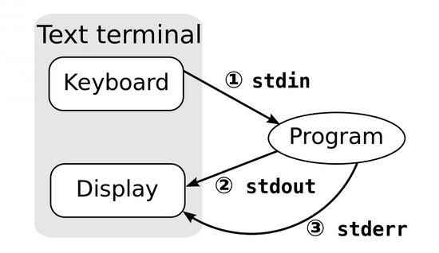

# 103.4. Use streams, pipes and redirects

**Weight:** 4

**Description:** Candidates should be able to redirect streams and connect them in order to efficiently process textual data. Tasks include redirecting standard input, standard output and standard error, piping the output of one command to the input of another command, using the output of one command as arguments to another command and sending output to both stdout and a file.

**Key Knowledge Areas:**

* Redirecting standard input, standard output and standard error
* Pipe the output of one command to the input of another command
* Use the output of one command as arguments to another command
* Send output to both stdout and a file

**Terms and Utilities:**

* tee
* xargs

We have talked about basics of piping and redirecting in previous sections and in this tutorial we take a closer look at Linux techniques for redirecting standard IO streams.

### Input, output, and streams <a id="input-output-and-streams"></a>

A Linux shell, such as Bash, receives input and sends output as sequences or streams of characters. Stream of characters comes from or goes to a file, a keyboard, a window on a display, or some other IO device. 

stdin, stdout, and stederr are three standard streams that are established when a Linux command is executed. 



Linux shells use three standard I/O **streams ,** each of which is associated with **file descriptor**:**:**

* **stdout** is the standard output stream, which displays output from commands\(**file descriptor** **1**\)
* **stderr** is the standard error stream, which displays error output from commands\(**file descriptor** **2**\)
* **stdin** is the standard input stream, which provides input to commands\(**file** **descriptor** **0**\)

 So you can see that there are two output streams, `stdout` and `stderr`, and one input stream, `stdin`

**What are file descriptors?**

Streams Are Handled Like Files.Streams in Linux—like almost everything else—are treated as though they were files. We can read text from a file, and we can write text into a file. Both of these actions involve a stream of data. So the concept of handling a stream of data as a file isn’t that much of a stretch.

Each file associated with a process is allocated a unique number to identify it. This is known as the **file descriptor**. Whenever an action is required to be performed on a file, the file descriptor is used to identify the file.  These values are always used for `stdin`, `stdout,` and `stderr`:

```text
    0: stdin
    1: stdout
    2: stderr
```

### Redirecting standard IO <a id="redirecting-standard-io"></a>

In computing, a stream is something that can transfer data. Data streams, like water streams, have two ends. They have a source and an outflow. Whichever Linux command we’re using provides one end of each stream. The other end is determined by the shell that launched the command. That end will be connected to the terminal window, connected to a pipe, or redirected to a file or other command, according to the command line that launched the command.

* **&gt;** - standard output
* **&lt;** - standard input
* **2&gt;** - standard error

**Redirect to/from files**

"&gt;" redirects stdout

```text
root@ubuntu16-1:~/test-space/myfiles# ls -l
total 1144
drwxr-xr-x 2 root root    4096 Sep 30 05:42 dir1
drwxr-xr-x 2 root root    4096 Oct  5 05:25 dir2
-rw-r--r-- 1 root root    2084 Sep 30 05:44 myconf.txt
-rw-r----- 1 root root 1156369 Sep 30 05:41 mylog.txt
root@ubuntu16-1:~/test-space/myfiles# ls -l > list
root@ubuntu16-1:~/test-space/myfiles# cat list 
total 1144
drwxr-xr-x 2 root root    4096 Sep 30 05:42 dir1
drwxr-xr-x 2 root root    4096 Oct  5 05:25 dir2
-rw-r--r-- 1 root root       0 Oct  9 01:42 list
-rw-r--r-- 1 root root    2084 Sep 30 05:44 myconf.txt
-rw-r----- 1 root root 1156369 Sep 30 05:41 mylog.txt
```

"2&gt;" redirects stderr

```text
root@ubuntu16-1:~/test-space/myfiles# ls -l BlahBlah
ls: cannot access 'BlahBlah': No such file or directory
root@ubuntu16-1:~/test-space/myfiles# ls -l BlahBlah 2> error
root@ubuntu16-1:~/test-space/myfiles# ls -l
total 1152
drwxr-xr-x 2 root root    4096 Sep 30 05:42 dir1
drwxr-xr-x 2 root root    4096 Oct  5 05:25 dir2
-rw-r--r-- 1 root root      56 Oct  9 01:43 error
-rw-r--r-- 1 root root     267 Oct  9 01:42 list
-rw-r--r-- 1 root root    2084 Sep 30 05:44 myconf.txt
-rw-r----- 1 root root 1156369 Sep 30 05:41 mylog.txt
root@ubuntu16-1:~/test-space/myfiles# cat error 
ls: cannot access 'BlahBlah': No such file or directory

```

"&lt;" redirects stdin 

```text
root@ubuntu16-1:~/test-space/myfiles# cat list 
total 1144
drwxr-xr-x 2 root root    4096 Sep 30 05:42 dir1
drwxr-xr-x 2 root root    4096 Oct  5 05:25 dir2
-rw-r--r-- 1 root root       0 Oct  9 01:42 list
-rw-r--r-- 1 root root    2084 Sep 30 05:44 myconf.txt
-rw-r----- 1 root root 1156369 Sep 30 05:41 mylog.txt
root@ubuntu16-1:~/test-space/myfiles# wc < list 
  6  47 267
```

 Commands with a double bracket _do not_ overwrite the destination’s existing contents.

**Append**

* **&gt;&gt;** - standard output
* **&lt;&lt;** - standard input
* **2&gt;&gt;** - standard error

example:

```text
root@ubuntu16-1:~/test-space/myfiles# ls > list
root@ubuntu16-1:~/test-space/myfiles# cat list
dir1
dir2
error
list
myconf.txt
mylog.txt
root@ubuntu16-1:~/test-space/myfiles# cat >> list
this is 1st line.
this is 2nd line.
this is last line.
root@ubuntu16-1:~/test-space/myfiles# cat list 
dir1
dir2
error
list
myconf.txt
mylog.txt
this is 1st line.
this is 2nd line.
this is last line.
```

read

read takes input from the standard input and put it inside a variable.

.

.

.

[https://developer.ibm.com/tutorials/l-lpic1-103-4/](https://developer.ibm.com/tutorials/l-lpic1-103-4/)

[https://www.gnu.org/software/libc/manual/html\_node/Streams-and-File-Descriptors.html](https://www.gnu.org/software/libc/manual/html_node/Streams-and-File-Descriptors.html)

[https://geek-university.com/linux/streams/](https://geek-university.com/linux/streams/)

[https://www.howtogeek.com/435903/what-are-stdin-stdout-and-stderr-on-linux/](https://www.howtogeek.com/435903/what-are-stdin-stdout-and-stderr-on-linux/)

[https://www.digitalocean.com/community/tutorials/an-introduction-to-linux-i-o-redirection](https://www.digitalocean.com/community/tutorials/an-introduction-to-linux-i-o-redirection)

.

