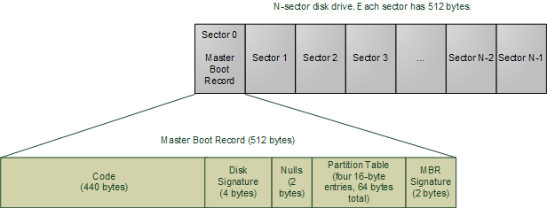

# 104.1. Create partitions and filesystems

## [https://github.com/Borosan/lpic1book](https://github.com/Borosan/lpic1book)**104.1 Create partitions and filesystems**

**Weight:** 2

**Description:** Candidates should be able to configure disk partitions and then create filesystems on media such as hard disks. This includes the handling of swap partitions.

**Key Knowledge Areas:**

* Manage MBR partition tables
* Use various mkfs commands to create various filesystems such as:
* ext2/ext3/ext4
* XFS
* VFAT
* Awareness of ReiserFS and Btrfs
* Basic knowledge of gdisk and parted with GPT

**Terms and Utilities:**

* fdisk
* gdisk
* parted
* mkfs
* mkswap

### BIOS

 The Basic Input/Output System \(BIOS\), \(also known as System BIOS, ROM BIOS \) is a  standard for defining a firmware interface. The BIOS software is built into the PC, and is the first software run by a PC when powered on.

The fundamental purposes of the BIOS are to initialize and test the system hardware components, and to load a bootloader or an operating system from a mass memory device. The BIOS additionally provides abstraction layer for the hardware, i.e. a consistent way for application programs and operating systems to interact with the keyboard, display, and other input/output devices. Variations in the system hardware are hidden by the BIOS from programs that use BIOS services instead of directly accessing the hardware. Modern operating systems ignore the abstraction layer provided by the BIOS and access the hardware components directly. 

### UEFI

The Unified Extensible Firmware Interface \(UEFI\) is a specification that defines a software interface between an operating system and platform firmware. UEFI is meant to replace the Basic Input/Output System \(BIOS\) firmware interface. In practice, most UEFI images provide legacy support for BIOS services. UEFI can support remote diagnostics and repair of computers, even without another operating system.

> The original EFI \(Extensible Firmware Interface\) specification was developed by Intel.

### MBR

A master boot record \(MBR\) is a special type of boot sector at the very beginning of partitioned computer mass storage devices like fixed disks or removable drives. The concept of MBRs was publicly introduced in 1983 with PC DOS 2.0.

The MBR holds the information on how the logical partitions, containing file systems, are organized on that medium. Besides that, the MBR also contains executable code to function as a loader for the installed operating system—usually by passing control over to the loader's second stage. This MBR code is usually referred to as a boot loader.



The organization of the partition table in the MBR limits the maximum addressable storage space of a disk to 2 TB \(232 × 512 bytes\). Therefore, the MBR-based partitioning scheme is in the process of being superseded by the GUID Partition Table \(GPT\) scheme in new computers. A GPT can coexist with an MBR in order to provide some limited form of a backwards compatibility for older systems. try `xxd -l 512 /dev/sda`

### GPT

GUID Partition Table \(GPT\) is a standard for the layout of the partition table on a physical hard disk, using globally unique identifiers \(GUID\).

 Although it forms a part of the Unified Extensible Firmware Interface \(UEFI\) standard, it is also used on some BIOS systems because of the limitations of master boot record \(MBR\) partition tables.

### MBR vs GPT & BIOS vs UEFI

Usually, MBR and BIOS \(MBR + BIOS\), and GPT and UEFI \(GPT + UEFI\) go hand in hand. This is compulsory for some systems \(eg Windows\), while optional for others \(eg Linux\).

### BIOS vs UEFI

* UEFI enables better use of bigger hard drives.Though UEFI is capable of working with the GUID Partition Table \(GPT\) it also supports the traditional master boot record \(MBR\) method of hard drive partitioning.
* UEFI may be faster than the BIOS. Various tweaks and optimizations in the UEFI may help your system boot more quickly it could before.
*  UEFI has room for more useful and usable features than  the BIOS. Among these are cryptography, network authentication, ..., and even a shell environment for running other EFI applications such as diagnostic utilities or flash updates. 
* In addition, both the architecture and the drivers are CPU-independent, which opens the door to a wider variety of processors \(including those using the ARM architecture, for example\).

> UEFI is still not widespread and  major hardware companies have switched over almost exclusively to UEFI use. Many older and less expensive motherboards also still use the BIOS system.

### MBR vs GPT

* Compared with MBR disk, A GPT disk can support larger than 2 TB volumes where MBR cannot. 
* A GPT disk can be basic or dynamic, just like an MBR disk can be basic or dynamic. 
* GPT disks also support up to 128 partitions rather than the 4 primary partitions limited to MBR. 
* Also, GPT keeps a backup of the partition table at the end of the disk. Furthermore, GPT disk provides greater reliability due to replication and cyclical redundancy check \(CRC\) protection of the partition table.
* The GUID partition table \(GPT\) disk partitioning style supports volumes up to 18 exabytes in size and up to 128 partitions per disk, compared to the master boot record \(MBR\) disk partitioning style, which supports volumes up to 2 terabytes in size and up to 4 primary partitions per disk \(or three primary partitions, one extended partition, and unlimited logical drives\). 
* Unlike MBR partitioned disks, data critical to platform operation is located in partitions instead of unpartitioned or hidden sectors. 
* In addition, GPT partitioned disks have redundant primary and backup partition tables for improved partition data structure integrity. 

### Block devices

A block device is an abstraction layer for any storage device that can be formatted in fixed-size blocks; individual blocks may be accessed independently of access to other blocks. Such access is often called _random access_. 

The abstraction layer of randomly accessible fixed-size blocks allows programs to use these block devices without worrying about whether the underlying device is a hard drive, floppy, CD, solid-state drive, network drive, or some type of virtual device such as an in-memory file system.

 Examples of block devices include the first IDE or SATA hard drive on our system \(/dev/sda or /dev/hda\) or the second SCSI, IDE, or USB drive \(/dev/sdb\). Use the `ls -l` command to display /dev entries.

```text
root@ubuntu16-1:~# ls -l  /dev/null /dev/sd[a-z] /dev/sr0 /dev/tty0
crw-rw-rw-  1 root root   1, 3 Dec  2  2018 /dev/null
brw-rw----  1 root disk   8, 0 Dec  2  2018 /dev/sda
brw-rw----+ 1 root cdrom 11, 0 Dec  2  2018 /dev/sr0
crw--w----  1 root tty    4, 0 Dec  2  2018 /dev/tty0
```

 The first character on each output line is **b** for a **block** device, such as floppy, CD drive, IDE hard drive, or SCSI hard drive; and **c** for a **character** device, such as a or terminal \(tty\) or the null device.


What is File?

A file is a collection of related information that is recorded on secondary storage. Or file is a collection of logically related entities. From user’s perspective a file is the smallest part of logical secondary storage.



 Whats is partition?

a **disk partition** or **partition** is a logical section of the hard drive that is separated from other segments. Partitions enable users to divide a physical disk into logical section\(s\).


Now that we are introduced you to hard drive layouts \(MBR & GPT\) , lets learn how to create MBR partitions using fdisk and GPT partitions using gdisk:

### fdisk

**fdisk** also known as format disk is a dialog-driven command in Linux used for creating and manipulating disk partition table. It is used for the view, create, delete, change, resize, copy and move partitions on a hard drive using the dialog-driven interface.  
 fdisk allows us to create a maximum of four primary partitions and the number of logical partition depends on the size of the hard disk you are using. It allows the user:

* To Create space for new partitions.
* Organizing space for new drives.
* Re-organizing old drives.
* Copying or Moving data to new disks\(partitions\)

```text
fdsik [options] device
or
fdisk -l [device...]
```

The first thing to do before doing any thing with the disks and partition is to view basic details about all available partition in the system using `-l` option\(ubuntu 16.04\):

```text
root@ubuntu16-1:~# fdisk -l
Disk /dev/sda: 50 GiB, 53687091200 bytes, 104857600 sectors
Units: sectors of 1 * 512 = 512 bytes
Sector size (logical/physical): 512 bytes / 512 bytes
I/O size (minimum/optimal): 512 bytes / 512 bytes
Disklabel type: dos
Disk identifier: 0x101c66bb

Device     Boot     Start       End   Sectors  Size Id Type
/dev/sda1  *         2048 102762495 102760448   49G 83 Linux
/dev/sda2       102764542 104855551   2091010 1021M  5 Extended
/dev/sda5       102764544 104855551   2091008 1021M 82 Linux swap / Solaris


Disk /dev/sdb: 20 GiB, 21474836480 bytes, 41943040 sectors
Units: sectors of 1 * 512 = 512 bytes
Sector size (logical/physical): 512 bytes / 512 bytes
I/O size (minimum/optimal): 512 bytes / 512 bytes
```

as you can see we have two disk drives \(sda,sdb\) sda has some partitions on it but sdb is row.

*  **Boot** : The Boot column shows that the first partition, /dev/sda1, has an asterisk **\(\*\)** indicating that this partition contains the files required by the boot loader to boot the system.
*  **Start and End** : The start and end columns list the starting and ending sectors of each partition.
*  **Blocks** : The blocks column lists the number of blocks allocated to the partition.
*  **Id and System** : These columns identify the partition type.

Viewing  Partition\(s\) on a Specific Disk \(sda\) :

```text
root@ubuntu16-1:~# fdisk -l /dev/sda
Disk /dev/sda: 50 GiB, 53687091200 bytes, 104857600 sectors
Units: sectors of 1 * 512 = 512 bytes
Sector size (logical/physical): 512 bytes / 512 bytes
I/O size (minimum/optimal): 512 bytes / 512 bytes
Disklabel type: dos
Disk identifier: 0x101c66bb

Device     Boot     Start       End   Sectors  Size Id Type
/dev/sda1  *         2048 102762495 102760448   49G 83 Linux
/dev/sda2       102764542 104855551   2091010 1021M  5 Extended
/dev/sda5       102764544 104855551   2091008 1021M 82 Linux swap / Solaris
```

Lets start interactive mode and see all available commands \(sdb\):

```text
root@ubuntu16-1:~# fdisk /dev/sdb

Welcome to fdisk (util-linux 2.27.1).
Changes will remain in memory only, until you decide to write them.
Be careful before using the write command.

Device does not contain a recognized partition table.
Created a new DOS disklabel with disk identifier 0xbd67d3c2.

Command (m for help): m

Help:

  DOS (MBR)
   a   toggle a bootable flag
   b   edit nested BSD disklabel
   c   toggle the dos compatibility flag

  Generic
   d   delete a partition
   F   list free unpartitioned space
   l   list known partition types
   n   add a new partition
   p   print the partition table
   t   change a partition type
   v   verify the partition table
   i   print information about a partition

  Misc
   m   print this menu
   u   change display/entry units
   x   extra functionality (experts only)

  Script
   I   load disk layout from sfdisk script file
   O   dump disk layout to sfdisk script file

  Save & Exit
   w   write table to disk and exit
   q   quit without saving changes

  Create a new label
   g   create a new empty GPT partition table
   G   create a new empty SGI (IRIX) partition table
   o   create a new empty DOS partition table
   s   create a new empty Sun partition table


Command (m for help): 
```

 okey creating partion:

```text
Command (m for help): n
Partition type
   p   primary (0 primary, 0 extended, 4 free)
   e   extended (container for logical partitions)
Select (default p): p
Partition number (1-4, default 1): 1
First sector (2048-41943039, default 2048): 
Last sector, +sectors or +size{K,M,G,T,P} (2048-41943039, default 41943039): 

Created a new partition 1 of type 'Linux' and of size 20 GiB.

Command (m for help): 
```

next we need to specify partition type based on the future use we have considerd for:

```text
Command (m for help): l

 0  Empty           24  NEC DOS         81  Minix / old Lin bf  Solaris        
 1  FAT12           27  Hidden NTFS Win 82  Linux swap / So c1  DRDOS/sec (FAT-
 2  XENIX root      39  Plan 9          83  Linux           c4  DRDOS/sec (FAT-
 3  XENIX usr       3c  PartitionMagic  84  OS/2 hidden or  c6  DRDOS/sec (FAT-
 4  FAT16 <32M      40  Venix 80286     85  Linux extended  c7  Syrinx         
 5  Extended        41  PPC PReP Boot   86  NTFS volume set da  Non-FS data    
 6  FAT16           42  SFS             87  NTFS volume set db  CP/M / CTOS / .
 7  HPFS/NTFS/exFAT 4d  QNX4.x          88  Linux plaintext de  Dell Utility   
 8  AIX             4e  QNX4.x 2nd part 8e  Linux LVM       df  BootIt         
 9  AIX bootable    4f  QNX4.x 3rd part 93  Amoeba          e1  DOS access     
 a  OS/2 Boot Manag 50  OnTrack DM      94  Amoeba BBT      e3  DOS R/O        
 b  W95 FAT32       51  OnTrack DM6 Aux 9f  BSD/OS          e4  SpeedStor      
 c  W95 FAT32 (LBA) 52  CP/M            a0  IBM Thinkpad hi ea  Rufus alignment
 e  W95 FAT16 (LBA) 53  OnTrack DM6 Aux a5  FreeBSD         eb  BeOS fs        
 f  W95 Ext'd (LBA) 54  OnTrackDM6      a6  OpenBSD         ee  GPT            
10  OPUS            55  EZ-Drive        a7  NeXTSTEP        ef  EFI (FAT-12/16/
11  Hidden FAT12    56  Golden Bow      a8  Darwin UFS      f0  Linux/PA-RISC b
12  Compaq diagnost 5c  Priam Edisk     a9  NetBSD          f1  SpeedStor      
14  Hidden FAT16 <3 61  SpeedStor       ab  Darwin boot     f4  SpeedStor      
16  Hidden FAT16    63  GNU HURD or Sys af  HFS / HFS+      f2  DOS secondary  
17  Hidden HPFS/NTF 64  Novell Netware  b7  BSDI fs         fb  VMware VMFS    
18  AST SmartSleep  65  Novell Netware  b8  BSDI swap       fc  VMware VMKCORE 
1b  Hidden W95 FAT3 70  DiskSecure Mult bb  Boot Wizard hid fd  Linux raid auto
1c  Hidden W95 FAT3 75  PC/IX           bc  Acronis FAT32 L fe  LANstep        
1e  Hidden W95 FAT1 80  Old Minix       be  Solaris boot    ff  BBT   
```

**Partition Types**

The partition types can be displayed and changed by using the fdisk utility. A partial list \(most commonly used\) of partition types are:  
 **83: Linux  
 82: Linux swap  
 5: Extended  
 8e: Linux LVM**

```text
Command (m for help): t

Selected partition 1
Partition type (type L to list all types): 83
Changed type of partition 'Linux' to 'Linux'.
```

and use -p option inorder to print partition table:

```text
Command (m for help): p
Disk /dev/sdb: 20 GiB, 21474836480 bytes, 41943040 sectors
Units: sectors of 1 * 512 = 512 bytes
Sector size (logical/physical): 512 bytes / 512 bytes
I/O size (minimum/optimal): 512 bytes / 512 bytes
Disklabel type: dos
Disk identifier: 0xbd67d3c2

Device     Boot Start      End  Sectors Size Id Type
/dev/sdb1        2048 41943039 41940992  20G 83 Linux

Command (m for help): 
```

fdisk does not write any changes on hard disk until we ask it using -w switch, if you are not sure use -q to quit and hard disk stays untouched! 

```text
Command (m for help): v

Command (m for help): w
The partition table has been altered.
Calling ioctl() to re-read partition table.
Syncing disks.
```

use -d for delete a partition bu be carefull!

> To see the help message and listing of all options, use fdisk -h command.

### gdisk

We can Manage  GPT Partitions with gdisk. like fdisk, gdisk is a text-mode menu-driven program for creation and manipulation of partition tables. It will automatically convert an old-style Master Boot Record \(MBR\) partition table or BSD disklabel stored without an MBR carrier partition to the newer Globally Unique Identifier \(GUID\) Partition Table \(GPT\) format, or will load a GUID partition table.

```text
root@ubuntu16-1:~# gdisk /dev/sdb
GPT fdisk (gdisk) version 1.0.1

Partition table scan:
  MBR: MBR only
  BSD: not present
  APM: not present
  GPT: not present


***************************************************************
Found invalid GPT and valid MBR; converting MBR to GPT format
in memory. THIS OPERATION IS POTENTIALLY DESTRUCTIVE! Exit by
typing 'q' if you don't want to convert your MBR partitions
to GPT format!
***************************************************************


Warning! Secondary partition table overlaps the last partition by
33 blocks!
You will need to delete this partition or resize it in another utility.

Command (? for help): ?
b	back up GPT data to a file
c	change a partition's name
d	delete a partition
i	show detailed information on a partition
l	list known partition types
n	add a new partition
o	create a new empty GUID partition table (GPT)
p	print the partition table
q	quit without saving changes
r	recovery and transformation options (experts only)
s	sort partitions
t	change a partition's type code
v	verify disk
w	write table to disk and exit
x	extra functionality (experts only)
?	print this menu

Command (? for help): q
root@ubuntu16-1:~# 
```

### parted

 The `parted` command is a partition editor that will work with both MBR and GPT formatted disks.

### File System

Linux File System or any file system generally is a layer which is under the operating system that handles the positioning of your data on the storage, without it; the system cannot knows which file starts from where and ends where.

### **File system types**

 Linux supports several different filesystems. Each has strengths and weaknesses and its own set of performance characteristics. 

**Ext, Ext2, Ext3, Ext4, JFS, XFS, btrfs and swap**

> Which File System is perfect for you?
>
> One important attribute of a filesystem is journaling, which allows for much faster recovery after a system crash. Generally, a journaling filesystem is preferred over a non-journaling one when you have a choice. You may also want to consider whether your chosen filesystem supports _Security Enhanced Linux_ \(or SELinux\). Two newer file systems, ZFS and btrfs, use a technique called Copy on Write to improve data integrity and address large storage needs.

What is journaling?

Journaling is designed to prevent data corruption from crashes and sudden power loss. Let’s say your system is partway through writing a file to the disk and it suddenly loses power. Without a journal, your computer would have no idea if the file was completely written to disk. The file would remain there on disk, corrupt.

With a journal, your computer would note that it was going to write a certain file to disk in the journal, write that file to disk, and then remove that job from the journal. If the power went out partway through writing the file, Linux would check the file system’s journal when it boots up and resume any partially completed jobs. This prevents data loss and file corruption.

Journaling does slow disk write performance down a tiny bit, but it’s well-worth it on a desktop or laptop.

Following is a brief summary of the types you need to know about for the LPI exam**:**

<table>
  <thead>
    <tr>
      <th style="text-align:left">Format</th>
      <th style="text-align:left">Description</th>
    </tr>
  </thead>
  <tbody>
    <tr>
      <td style="text-align:left">
        <p>ext2</p>
        <p>(1993)</p>
      </td>
      <td style="text-align:left">
        <p>The ext2 filesystem (also known as the <em>second extended filesystem</em>)
          was developed to address shortcomings in the Minix filesystem used in early
          versions of Linux. It has been used extensively on Linux for many years.
          There is no journaling in ext2, and it has largely been replaced by ext3
          and more recently ext4.</p>
        <p></p>
        <ol>
          <li>Maximum file size is <b>16GB &#x2013; 2TB</b>.</li>
        </ol>
        <p>*It&#x2019;s being used for normally Flash based storage media like <b>USB Flash drive</b>, <b>SD Card</b> etc.</p>
      </td>
    </tr>
    <tr>
      <td style="text-align:left">
        <p>ext3</p>
        <p>(2001)</p>
      </td>
      <td style="text-align:left">
        <p>The ext3 filesystem adds journaling capability to a standard ext2 filesystem
          and is therefore an evolutionary growth of a very stable filesystem. It
          offers reasonable performance under most conditions and is still being
          improved. Because it adds journaling on top of the proven ext2 filesystem,
          it is possible to convert an existing ext2 filesystem to ext3 and even
          convert back again if required.</p>
        <ol>
          <li>Max file size <b>16GB &#x2013; 2TB</b>.</li>
          <li>was integrated in <b>Kernel 2.4.15</b> with journaling feature</li>
        </ol>
      </td>
    </tr>
    <tr>
      <td style="text-align:left">
        <p>ext4</p>
        <p>(2008)</p>
      </td>
      <td style="text-align:left">
        <p>The ext4 filesystem started as extensions to ext3 to address the demands
          of ever larger file systems by increasing storage limits and improving
          performance. The ext4 filesystem, was included in the 2.6.28 kernel. Some
          of the changes from ext3 are:</p>
        <ol>
          <li>Max file size <b>16GB to 16TB</b>.</li>
          <li>Ext4 file system have option to <b>Turn Off</b> journaling feature.</li>
          <li>Other features like <b>Fast FSCK</b> etc.</li>
        </ol>
      </td>
    </tr>
    <tr>
      <td style="text-align:left">ReiserFS</td>
      <td style="text-align:left">ReiserFS is a B-tree-based filesystem that has very good overall performance,
        particularly for large numbers of small files. has journaling. no longer
        in active development, does not support SELinux and has largely been superseded
        by Reiser4 whose future is unclear.</td>
    </tr>
    <tr>
      <td style="text-align:left">XFS</td>
      <td style="text-align:left">XFS is a filesystem with journaling. It comes with robust features and
        is optimized for scalability. XFS aggressively caches in-transit data in
        RAM, great if you have an uninterruptible power supply.</td>
    </tr>
    <tr>
      <td style="text-align:left">btrfs</td>
      <td style="text-align:left">btrfs (B-Tree file system) was initially developed by Oracle(GPL).It is
        a new copy-on-write filesystem for Linux aimed at implementing advanced
        features while focusing on fault tolerance, repair, and easy administration.Designed
        to handle large files efficiently and handle filesystems spread across
        multiple devices.</td>
    </tr>
    <tr>
      <td style="text-align:left">swap</td>
      <td style="text-align:left">Swap space must be formatted for use as swap space, but it is not generally
        considered a filesystem.</td>
    </tr>
    <tr>
      <td style="text-align:left">vfat</td>
      <td style="text-align:left">
        <p>(also known as <em>FAT32</em>) no journaling, lacks many features required
          for a full Linux filesystem implementation. useful for exchanging data
          between Windows and Linux systems . Do <b>not</b> use this filesystem , except
          for sharing data .</p>
        <p>*If you unzip or untar a Linux archive on a vfat disk, you will lose permissions,
          such as execute permission, and you will lose any symbolic links that may
          have been stored in the archive.</p>
      </td>
    </tr>
  </tbody>
</table>Linux uses the `mkfs` command to create filesystems and `mkswap`command to make swap space.

### mkfs

The `mkfs` command is actually a front end to several filesystem-specific commands such as `mkfs.ext3` for ext3, `mkfs.ext4` for ext4 and `mkfs.btrfs` for btrfs.

```text
ls
```


.

.

.

[https://wiki.manjaro.org/index.php?title=Some\_basics\_of\_MBR\_v/s\_GPT\_and\_BIOS\_v/s\_UEFI](https://wiki.manjaro.org/index.php?title=Some_basics_of_MBR_v/s_GPT_and_BIOS_v/s_UEFI)

[https://developer.ibm.com/tutorials/l-lpic1-104-1/](https://developer.ibm.com/tutorials/l-lpic1-104-1/)

[https://www.geeksforgeeks.org/file-systems-in-operating-system/](https://www.geeksforgeeks.org/file-systems-in-operating-system/)

[https://likegeeks.com/linux-file-system/](https://likegeeks.com/linux-file-system/)

[https://developer.ibm.com/tutorials/l-lpic1-102-1/](https://developer.ibm.com/tutorials/l-lpic1-102-1/)

[https://www.computerhope.com/jargon/p/partition.htm](https://www.computerhope.com/jargon/p/partition.htm)

[https://www.geeksforgeeks.org/fdisk-command-in-linux-with-examples/](https://www.geeksforgeeks.org/fdisk-command-in-linux-with-examples/)

[https://www.tecmint.com/what-is-ext2-ext3-ext4-and-how-to-create-and-convert-linux-file-systems/](https://www.tecmint.com/what-is-ext2-ext3-ext4-and-how-to-create-and-convert-linux-file-systems/)

[https://www.howtogeek.com/howto/33552/htg-explains-which-linux-file-system-should-you-choose/](https://www.howtogeek.com/howto/33552/htg-explains-which-linux-file-system-should-you-choose/)

[https://developer.ibm.com/tutorials/l-lpic1-104-1/](https://developer.ibm.com/tutorials/l-lpic1-104-1/)

.

