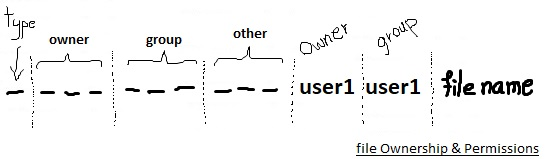
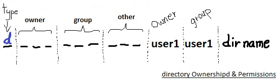
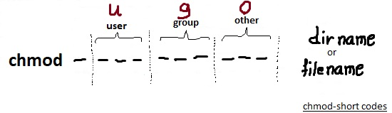
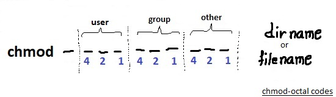
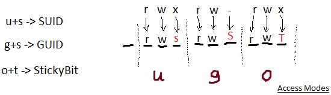
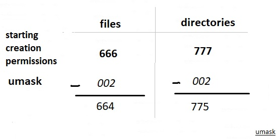

# 104.5. Manage file permissions and ownership

**Weight: **3

**Description:** Candidates should be able to control file access through the proper use of permissions and ownerships.

**Key Knowledge Areas:**

* Manage access permissions on regular and special files as well as directories
* Use access modes such as suid, sgid and the sticky bit to maintain security
* Know how to change the file creation mask
* Use the group field to grant file access to group members

**Terms and Utilities:**

* chmod
* umask
* chown
* chgrp

####  <a href="users-groups-and-file-ownership" id="users-groups-and-file-ownership"></a>

#### Users, groups and file ownership <a href="users-groups-and-file-ownership" id="users-groups-and-file-ownership"></a>

By now, you know that Linux is a multiuser system and that each user belongs to one primary group and possibly additional groups. It is also possible to log in as one user and become another user using the `su`  commands. Ownership of files in Linux and access authority are closely related to user ids and groups.

### User and groups <a href="user-and-groups" id="user-and-groups"></a>

To start, let’s review some basic user and group information via some commands

* whoami : It displays the username of the current user (ubuntu16.04)

```
user1@ubuntu16-1:~/sandbox$ whoami
user1
user1@ubuntu16-1:~/sandbox$ su -
Password: 
root@ubuntu16-1:~# whoami
root
```

* groups: We can find out what groups you are in by using the `groups` command.

```
root@ubuntu16-1:~# groups
root
root@ubuntu16-1:~# exit
logout
user1@ubuntu16-1:~/sandbox$ groups
user1
```

* id :  We can find out both user and group information using the `id` command.

```
user1@ubuntu16-1:~/sandbox$ id
uid=1001(user1) gid=1001(user1) groups=1001(user1)
user1@ubuntu16-1:~/sandbox$ su -
Password: 
root@ubuntu16-1:~# id
uid=0(root) gid=0(root) groups=0(root)
```

> It can show numeric ID’s (UID or group ID) of the current user or any other user in the server.


users and groups information are stored in /etc/passwd and /etc/group along other information.

```
root@ubuntu16-1:~# cat /etc/passwd | grep user1
user1:x:1001:1001::/home/user1:
root@ubuntu16-1:~# cat /etc/group | grep user1
user1:x:1001:
```


#### File ownership and permissions

Every file on a Linux system has one owner and one group associated with it.

 Use the ls -l`ls-l` command to display the owner and group.

```
user1@ubuntu16-1:~/sandbox$ ls -l
total 4
drwxrwxr-x 2 user1 user1 4096 Jan 27 21:49 dir1
-rw-rw-r-- 1 user1 user1    0 Jan 27 21:49 file1
```

> As you can see, the file1 belongs to user1 and a group called user1.

The first character of a long listing describes the type of object. "-" for a regular file, "d" for a directory, "l" for a symbolic link(we will see them).



Permissions are specified separately for the file’s owner, members of the file’s group, and everyone else. 

The Linux permission model has three types of permission for each filesystem object.

The permissions are read (r), write (w), and execute (x). Write permission includes the ability to alter or delete an object.   A `-` indicates that the corresponding permission is not granted. example:

```
root@ubuntu16-1:~# ls -l /sbin/fsck
-rwxr-xr-x 1 root root 44184 May 16  2018 /sbin/fsck
```

As you can see fsck can be read, written and executed by its owner (root) and all  root group members, but others can just read and execute that(probably with limited results )

#### Directories ownership and permissions <a href="directories" id="directories"></a>



Directories use the same permissions flags as regular files, but they are interpreted differently.

* Read permission for a directory allows a user with that permission to list the contents of the directory.
* Write permission means a user with that permission can create or delete files in the directory.
* Execute permission allows the user to enter the directory and access any subdirectories.

Without execute permission on a directory, the filesystem objects inside the directory are not accessible. Without read permission on a directory, the filesystem objects inside the directory are not viewable in a directory listing, but these objects can still be accessed as long as you know the full path to the object on disk. example:

```
root@ubuntu16-1:~# ls -l /home/
total 8
drwxr-xr-x 22 payam payam 4096 Oct 27  2018 payam
drwxr-xr-x 19 user1 user1 4096 Jan 27 21:49 user1
```

The first charcter indicates that this a directory. The owner (user1) has read,write, execute access but other members of user1 group and others have just read and execute access on this directory, (as we mentioned, execute lets them to see files inside it )

#### Changing permissions

### chmod

The command you use to change the  permissions on files is called chmod , which stands for “change mode". There  are to ways to tell this command what you want to do:

* using short codes
* using ocatl codes

**1- using short codes:**  That is easier way. 



```
chmod [reference][operator][mode] file... 
```

reference can be

*  u as user  (file's owner)
* g as group (users who are members of the file's grou)
* o as others (users who are not the file's owner / members of the file's group)
* a as all (All three of the above, same as ugo)

Operator can be

* \+  Adds the specified modes to the specified classes
*  \- Removes the specified modes from the specified classes
* \= The modes specified are to be made the exact modes for the specified classes

obviously modes might be

* r  :Permission to read the file
* w :Permission to write (or delete) the file.
* x : Permission to execute the file, or, in the case of a directory, search it.

```
user1@ubuntu16-1:~/sandbox$ ls -l | grep file1
-rw-rw-r-- 1 user1 user1    0 Jan 27 21:49 file1

user1@ubuntu16-1:~/sandbox$ chmod u+x file1

user1@ubuntu16-1:~/sandbox$ ls -l | grep file1
-rwxrw-r-- 1 user1 user1    0 Jan 27 21:49 file1

user1@ubuntu16-1:~/sandbox$ chmod o-r file1

user1@ubuntu16-1:~/sandbox$ ls -l | grep file1
-rwxrw---- 1 user1 user1    0 Jan 27 21:49 file1
```

>  If we want to set different permissions for user, group, or other, we can separate different expressions by commas —for example, `ug=rwx,o=rx`

```
user1@ubuntu16-1:~/sandbox$ ls -l | grep file1
-rwxrw---- 1 user1 user1    0 Jan 27 21:49 file1

user1@ubuntu16-1:~/sandbox$ chmod u-x,g+x,o+r file1

user1@ubuntu16-1:~/sandbox$ ls -l | grep file1
-rw-rwxr-- 1 user1 user1    0 Jan 27 21:49 file1
```

> using a as ugo with = operator to set exact mode easier

```
user1@ubuntu16-1:~/sandbox$ ls -l | grep file1
-rw-rwxr-- 1 user1 user1    0 Jan 27 21:49 file1
user1@ubuntu16-1:~/sandbox$ chmod a=rw file1
user1@ubuntu16-1:~/sandbox$ ls -l | grep file1
-rw-rw-rw- 1 user1 user1    0 Jan 27 21:49 file1
```

**2- using ocatl codes : **So far we have used symbols (ugoa and rxw) to specify permissions. we can also set permissions using octal numbers instead of symbols.



For using octal codes with chmod we have to create an octal string, and that's is nothing more than a simple sum of numbers:

| Symbolic | note  | Octal |
| -------- | ----- | ----- |
| rwx      | 4+2+1 | 7     |
| rw-      | 4+2   | 6     |
| r-x      | 4+1   | 5     |
| r--      | 4     | 4     |
| -wx      | 2+1   | 3     |
| -w-      | 2     | 2     |
| --x      | 1     | 1     |
| ---      | 0     | 0     |

```
user1@ubuntu16-1:~/sandbox$ ls -l | grep file1
-rw-rw-rw- 1 user1 user1    0 Jan 27 21:49 file1

user1@ubuntu16-1:~/sandbox$ chmod 700 file1

user1@ubuntu16-1:~/sandbox$ ls -l | grep file1
-rwx------ 1 user1 user1    0 Jan 27 21:49 file1

user1@ubuntu16-1:~/sandbox$ chmod 655 file1

user1@ubuntu16-1:~/sandbox$ ls -l | grep file1
-rw-r-xr-x 1 user1 user1    0 Jan 27 21:49 file1
```

To change permissions  recursively on directories and files use `-R` option:

```
user1@ubuntu16-1:~/sandbox$ chmor -R o+r dir1
```

#### Access modes

When  we  log in, the new shell process runs with your user and group IDs. This usually means that you cannot access files belonging to others and cannot write system files. From the other side, users are totally dependent on other programs to perform operations. 

An important example is the /etc/passwd file, which cannot be changed by normal users directly, because write permission is enabled only for root. However, normal users need to be able to modify /etc/passwd somehow:

```
root@ubuntu16-1:~# which passwd
/usr/bin/passwd
root@ubuntu16-1:~# ls -l /usr/bin/passwd
-rwsr-xr-x 1 root root 54256 May 16  2017 /usr/bin/passwd
```

So, if the user is unable to modify this file, how can this be done? What is that "s"?

### suid , guid

The Linux permissions model has two special access modes called suid (set user id) and sgid (set group id). When an executable program has the suid access modes set, it will run as if it had been started by the file’s owner, rather than by the user who really started it. Similarly, with the sgid access modes set, the program will run as if the initiating user belonged to the file’s group rather than to his own group.

> #### Directories and sgid <a href="directories-and-sgid" id="directories-and-sgid"></a>
>
> When a directory has the sgid mode enabled, any files or directories created in it will inherit the group ID of the directory. This is particularly useful for directory trees that are used by a group of people working on the same project.

### sticky bit

We have just seen how anyone with write permission to a directory can delete files in it. This might be acceptable for a group project, but is not desirable for globally shared file space such as the /tmp directory. Fortunately, there is a solution.  That  is called the _sticky_ bit.

If set stickybit for a directory, it permits only the owning user or the superuser (root) to delete or unlink a file. 

Okey lets wrap up what we have learned:

| access mode    | ** on file**                            | **on directory**                             |
| -------------- | --------------------------------------- | -------------------------------------------- |
| **SUID**       | executes with permissions of file owner | nothing                                      |
| **GUID**       | executes with the permissions of group  | new files have group membership of directory |
| **Sticky Bit** | nothing                                 | only owner can delete files                  |

#### How suid, guid and stickybit are implemented?

As there is no more room for setting Access modes, execution character is used. "s" letter is used for both suid and guid but "t" letter is for stickybit. Again we use `+/-` for adding and removing permissions.



> As you have probably noticed, if the file or directory is already executable  **s** and **t ** would be displayed  after setting access modes. 
>
> But if the file or directory hasn't been executable before setting access mode,** S** and **T **would be appear.

As an example for suid consider ping command, as ping needs to access network card it needs root permissions, but an ordinary user can use it:

```
user1@ubuntu16-1:~/sandbox$ which ping
/bin/ping
user1@ubuntu16-1:~/sandbox$ ls -l /bin/ping
-rwsr-xr-x 1 root root 44168 May  7  2014 /bin/ping
user1@ubuntu16-1:~/sandbox$ ping 8.8.8.8 -c2
PING 8.8.8.8 (8.8.8.8) 56(84) bytes of data.
64 bytes from 8.8.8.8: icmp_seq=1 ttl=128 time=39.9 ms
64 bytes from 8.8.8.8: icmp_seq=2 ttl=128 time=39.7 ms

--- 8.8.8.8 ping statistics ---
2 packets transmitted, 2 received, 0% packet loss, time 1001ms
rtt min/avg/max/mdev = 39.793/39.862/39.932/0.211 ms
```

Now we try setting guid on a directory and we will create a file with another user:

```
user1@ubuntu16-1:~/sandbox$ ls -l | grep dir1
drwxrwxrwx 2 user1 user1 4096 Jan 27 21:49 dir1
user1@ubuntu16-1:~/sandbox$ chmod g+s dir1
user1@ubuntu16-1:~/sandbox$ ls -l | grep dir1
drwxrwsrwx 2 user1 user1 4096 Jan 27 21:49 dir1
```

```
user2@ubuntu16-1:~$ whoami
user2
user2@ubuntu16-1:~$ cd /home/user1/sandbox/dir1/
user2@ubuntu16-1:/home/user1/sandbox/dir1$ touch NewFileUser2
user2@ubuntu16-1:/home/user1/sandbox/dir1$ ls -l
total 0
-rw-rw-r-- 1 user2 user1 0 Jan 29 02:02 NewFileUser2
```

And finally lets try how stickybit works on  /tmp:

```
user1@ubuntu16-1:/$ cd /
user1@ubuntu16-1:/$ ls -l | grep tmp
drwxrwxrwt  22 root  root   4096 Jan 29 02:03 tmp
user1@ubuntu16-1:/$ cd tmp/
user1@ubuntu16-1:/tmp$ touch NewFileUser1
user1@ubuntu16-1:/tmp$ ls -l | grep -i newfile
-rw-rw-r-- 1 user1 user1    0 Jan 29 02:04 NewFileUser1
```

```
user2@ubuntu16-1:~$ whoami
user2
user2@ubuntu16-1:~$ cd /tmp/
user2@ubuntu16-1:/tmp$ rm NewFileUser1 
rm: remove write-protected regular empty file 'NewFileUser1'? y
rm: cannot remove 'NewFileUser1': Operation not permitted
```

#### Setting Access Modes via octal codes:

We can also use octal codes to set suid, guid and stickybit:

| Access Mode   | octal |
| ------------- | ----- |
| **SUID**      | 4000  |
| **GUID**      | 2000  |
| **StickyBit** | 1000  |

And again we can use sum of digits.

```
###SUID
user1@ubuntu16-1:~/sandbox$ touch file2
user1@ubuntu16-1:~/sandbox$ ls -l | grep file2
-rw-rw-r-- 1 user1 user1    0 Jan 29 02:32 file2
user1@ubuntu16-1:~/sandbox$ chmod 4470 file2
user1@ubuntu16-1:~/sandbox$ ls -l | grep file2
-r-Srwx--- 1 user1 user1    0 Jan 29 02:32 file2

###GUID
user1@ubuntu16-1:~/sandbox$ mkdir dir2
user1@ubuntu16-1:~/sandbox$ ls -l | grep dir2
drwxrwxr-x 2 user1 user1 4096 Jan 29 02:33 dir2
user1@ubuntu16-1:~/sandbox$ chmod 2770 dir2
user1@ubuntu16-1:~/sandbox$ ls -l | grep dir2
drwxrws--- 2 user1 user1 4096 Jan 29 02:33 dir2

###StickyBit
user1@ubuntu16-1:~/sandbox$ chmod 1770 dir2
user1@ubuntu16-1:~/sandbox$ ls -l | grep dir2
drwxrws--T 2 user1 user1 4096 Jan 29 02:33 dir2
```

### umask

When a new file or directory is created, the creation process specifies the permissions that the new file or directory should have. Where do they come from? They came from the umask.

 We can view your umask setting with the `umask` command:

```
root@ubuntu16-1:~# umask
0022
```

#### How umask work?



 When a new file is created, the creation process specifies the permissions that the new file should have. Often, the mode requested is 0666, which makes the file readable and writable by anyone (but not executable). Directories usually default to 0777. However, this permissive creation is affected by a _umask_ value, which specifies what permissions a user does **not** want to grant automatically to newly created files or directories. The system uses the umask value to reduce the originally requested permissions.

```
user1@ubuntu16-1:~/sandbox$ umask
0002

user1@ubuntu16-1:~/sandbox$ touch newfile

user1@ubuntu16-1:~/sandbox$ ls -l | grep newfile
-rw-rw-r-- 1 user1 user1    0 Jan 28 05:44 newfile

user1@ubuntu16-1:~/sandbox$ mkdir newdir
user1@ubuntu16-1:~/sandbox$ ls -l | grep newdir
drwxrwxr-x 2 user1 user1 4096 Jan 28 05:45 newdir
```

Usually umask  is set system wide (it could be set per user) and we can find its configuration in one of these places (based on your linux distribution): 

> * /etc/profile (usually)
> * /etc/bashrc (usually)
> * /etc/logindefs (ubuntu)

as we are using ubuntu here lets take look at /etc/logindefs:

```
# If USERGROUPS_ENAB is set to "yes", that will modify this UMASK default value
# for private user groups, i. e. the uid is the same as gid, and username is
# the same as the primary group name: for these, the user permissions will be
# used as group permissions, e. g. 022 will become 002.
#
# Prefix these values with "0" to get octal, "0x" to get hexadecimal.
#
ERASECHAR       0177
KILLCHAR        025
UMASK           022
```

it say umask would be 002 if USERGROUPS_ENAB is set, lets check it out:

```
root@ubuntu16-1:~# cat /etc/login.defs | grep -i USERGROUPS_ENAB
# If USERGROUPS_ENAB is set to "yes", that will modify this UMASK default value
USERGROUPS_ENAB yes
```

which is why umask is 002 in our system.

#### Setting file owner and group

All files in Linux belong to an owner and a group.  We can set the owner by using `chown`  command, and the group by the `chgrp `command.

### chown

 The root user can change the ownership of a file using the `chown` command.We can use user name or user ID.

```
chown [OPTION]… [OWNER][:[GROUP]] FILE…
```

The file’s group may be changed at the same time by adding a colon and a group name or ID right after the user name or ID.

```
root@ubuntu16-1:~/sandbox# touch file1
root@ubuntu16-1:~/sandbox# ls -l
total 0
-rw-r--r-- 1 root root 0 Jan 29 03:00 file1
root@ubuntu16-1:~/sandbox# chown user1 file1 
root@ubuntu16-1:~/sandbox# ls -l
total 0
-rw-r--r-- 1 user1 root 0 Jan 29 03:00 file1
```

If only a colon is given, then the user’s default group is used:

```
root@ubuntu16-1:~/sandbox# chown user1: file1
root@ubuntu16-1:~/sandbox# ls -l
total 0
-rw-r--r-- 1 user1 user1 0 Jan 29 03:00 file1
```

 the -R option will apply the change recursively and`  -c  ` Reports when a file change is made. We can also use other file ownership via `--referenece` switch.

### chgrp

 chgrp command in Linux is used to change the group ownership of a file or directory.

```
chgrp [OPTION]… GROUP FILE…
```

**Note1:** We need to have administrator permission to add or delete groups 

```
root@ubuntu16-1:~/sandbox# ls -l
total 0
-rw-r--r-- 1 user1 user1 0 Jan 29 03:00 file1
root@ubuntu16-1:~/sandbox# chgrp user2 file1
root@ubuntu16-1:~/sandbox# ls -l
total 0
-rw-r--r-- 1 user1 user2 0 Jan 29 03:00 file1
root@ubuntu16-1:~/sandbox# chgrp root file1
root@ubuntu16-1:~/sandbox# ls -l
total 0
-rw-r--r-- 1 user1 root 0 Jan 29 03:00 file1
```

**Note2:** the owner of file can always change the group of his/her file or directory to its own group or one of the groups that him/her is a member of.

```
root@ubuntu16-1:~# cd ~user1/

root@ubuntu16-1:/home/user1# cd sandbox/

root@ubuntu16-1:/home/user1/sandbox# ls -l
total 0
-rw-r--r-- 1 root root 0 Jan 29 05:21 file1

root@ubuntu16-1:/home/user1/sandbox# chown user1 file1 
```

```
user1@ubuntu16-1:~/sandbox$ whoami
user1

user1@ubuntu16-1:~/sandbox$ id
uid=1001(user1) gid=1001(user1) groups=1001(user1)

user1@ubuntu16-1:~/sandbox$ ls -l
total 0
-rw-r--r-- 1 user1 root 0 Jan 29 05:21 file1

user1@ubuntu16-1:~/sandbox$ chgrp user1 file1

user1@ubuntu16-1:~/sandbox$ ls -l
total 0
-rw-r--r-- 1 user1 user1 0 Jan 29 05:21 file1
```

As with many of the commands covered in this tutorial, `chgrp` has a `-R` option to allow changes to be applied recursively to all selected files and subdirectories.

\--refrence  Uses the groupname of a reference file to change the group of another file or folder.

.

.

.


**Primary and secondary groups**

There are actually two types of groups — **primary** and **secondary**.

The **primary group** is the one that’s recorded in the **/etc/passwd** file, configured when an account is set up. When a user creates a file, it’s their primary group that is associated with it. 

 **Secondary groups** are those that users might be added to once they already have accounts. Secondary group memberships show up in the /etc/group file.

A user can change his/her **primary group** (**default group**) with `newgrp `command, and after that all file/directories the user creates will have that group.



.

.

.

[https://developer.ibm.com/tutorials/l-lpic1-104-5/](https://developer.ibm.com/tutorials/l-lpic1-104-5/)

[https://jadi.gitbooks.io/lpic1/content/1045\_manage_file_permissions_and_ownership.html](https://jadi.gitbooks.io/lpic1/content/1045\_manage_file_permissions_and_ownership.html)

[https://www.geeksforgeeks.org/chmod-command-linux/](https://www.geeksforgeeks.org/chmod-command-linux/)

[https://www.geeksforgeeks.org/permissions-in-linux/](https://www.geeksforgeeks.org/permissions-in-linux/)

[https://www.geeksforgeeks.org/chown-command-in-linux-with-examples/](https://www.geeksforgeeks.org/chown-command-in-linux-with-examples/)

[https://www.geeksforgeeks.org/chgrp-command-in-linux-with-examples/](https://www.geeksforgeeks.org/chgrp-command-in-linux-with-examples/)

[https://www.networkworld.com/article/3409781/mastering-user-groups-on-linux.html](https://www.networkworld.com/article/3409781/mastering-user-groups-on-linux.html)

.

.

.
