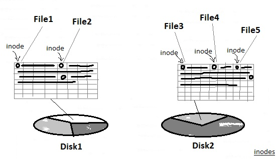
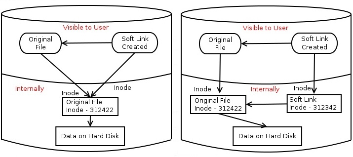

# 104.6. Create and change hard and symbolic links

**Weight: **2

**Description: **Candidates should be able to create and manage hard and symbolic links to a file.

**Key Knowledge Areas:**

* Create links
* Identify hard and/or soft links
* Copying versus linking files
* Use links to support system administration tasks

**Terms and Utilities:**

* ln
* ls


### Introducing links <a href="introducing-links" id="introducing-links"></a>

 On a storage device, a file or directory is stored in a collection of blocks. Information about a file is held in an _inode_, which records information such as the owner, when the file was last accessed, how large it is, whether it is a directory or not, and who can read from or write to it. 

 A _directory entry_ contains a name for a file or directory and a pointer to the inode where the information about the file or directory is stored.



>  The inode number is unique within a particular filesystem.

```
root@ubuntu16-1:~/sandbox# ls -1i
2228290 dir
2228289 file1
```

>  \-i switch print the index number of each file

**Whats is link ? ** A link is simply an additional directory entry for a file or directory, allowing two or more names for the same thing.

#### Creating links

There are two types of links : **Hard Link** and** Soft Link**.

 A **hard link** is a directory entry that points to an inode, while a **soft link** or _symbolic link_ is a directory entry that points to an inode that provides the name of another directory entry.  Symbolic links are also called _symlinks_.



> hard links point to an inode, and inodes are only unique within a particular file system, hard links cannot cross file systems(different partitions or hard disks).

> You can create hard links only for files and not for directories. The exception is the special directory entries in a directory for the directory itself and for its parent (. and ..)

### Hard Links vs Soft Links

| hard link                                                                              | soft link                                                                                                                                             |
| -------------------------------------------------------------------------------------- | ----------------------------------------------------------------------------------------------------------------------------------------------------- |
| have same inodes number.                                                               | have different inodes numbers.                                                                                                                        |
| can’t cross the file system boundaries                                                 | can cross the file system                                                                                                                             |
| can’t link directories                                                                 | allows you to link between directories                                                                                                                |
| Links have actual file contents                                                        | contains the path for original file and not the contents                                                                                              |
| if the original file is removed, the link will still show you the contents of the file | Removing soft link doesn't affect anything but when the original file is removed, the link becomes a 'dangling' link that points to nonexistent file. |
| permissions will be updated if we change the permissions of source file                | permissions will not be updated                                                                                                                       |

#### Creating links

### ln

we can  use ln command to create both hard links and soft links

```
### For  Hard Link 
ln  [original filename] [link name] 

### For  Soft link 
ln  -s [original filename] [link name] 
```

### Hard Links

 Use the `ln` command to create additional hard links to an existing file (but not to a directory, even though the system sets up . and .. as hard links).

```
root@ubuntu16-1:~/sandbox# ls -l
total 4
drwxr-xr-x 2 root root 4096 Jan 29 08:14 dir
-rw-r--r-- 1 root root    0 Jan 29 08:14 file1

### see inodes
root@ubuntu16-1:~/sandbox# ls -1i
2228290 dir
2228289 file1

### creating Hard Link
root@ubuntu16-1:~/sandbox# ln file1 HardLink

### comparing inodes
root@ubuntu16-1:~/sandbox# ls -1i
2228290 dir
2228289 file1
2228291 file2
2228289 HardLink
```

ls -l command shows all the links with the link column showing the number of links:

```
root@ubuntu16-1:~/sandbox# ls -l
total 4
drwxr-xr-x 2 root root 4096 Jan 29 08:14 dir
-rw-r--r-- 2 root root    0 Jan 29 08:14 file1
-rw-r--r-- 2 root root    0 Jan 29 08:14 HardLink
```

look at that"2" infront of file1, it was "1" before creating HardLink.

### Soft Links

 `ln` command with the `-s` option creates soft links. Soft links use file or directory names, which may be relative or absolute. If you are using relative names, you will usually want the current working directory to be the directory where you are creating the link. Otherwise, the link you create will be relative to another point in the file system.

```
root@ubuntu16-1:~/sandbox# touch file2

root@ubuntu16-1:~/sandbox# ls -l
total 4
drwxr-xr-x 2 root root 4096 Jan 29 08:14 dir
-rw-r--r-- 2 root root    0 Jan 29 08:14 file1
-rw-r--r-- 1 root root    0 Jan 29 09:05 file2
-rw-r--r-- 2 root root    0 Jan 29 08:14 HardLink

### see inodes
root@ubuntu16-1:~/sandbox# ls -li
total 4
2228290 drwxr-xr-x 2 root root 4096 Jan 29 08:14 dir
2228289 -rw-r--r-- 2 root root    0 Jan 29 08:14 file1
2228291 -rw-r--r-- 1 root root    0 Jan 29 09:05 file2
2228289 -rw-r--r-- 2 root root    0 Jan 29 08:14 HardLink

### creating soft link using relative path
root@ubuntu16-1:~/sandbox# ln -s  file2 SoftLink

### see inodes
root@ubuntu16-1:~/sandbox# ls -1i
2228290 dir
2228289 file1
2228291 file2
2228289 HardLink
2228292 SoftLink

### creating soft link using absolute path,we have to be in current dir)
root@ubuntu16-1:~/sandbox# ln -s dir/dir2/myconfig SoftLink2myconf

root@ubuntu16-1:~/sandbox# ls -l | grep myconfig
lrwxrwxrwx 1 root root   17 Feb  1 23:59 SoftLink2myconf -> dir/dir2/myconfig


###creating soft link to a directory
root@ubuntu16-1:~/sandbox# ln -s dir/ soft2dir

root@ubuntu16-1:~/sandbox# ls -l | grep soft2dir
lrwxrwxrwx 1 root root    4 Feb  2 00:04 soft2dir -> dir/
```

ls -l command shows all links with second column value 1 and the link points to the original file.

```
drwxr-xr-x 3 root root 4096 Feb  1 23:59 dir
-rw-r--r-- 2 root root    0 Jan 29 08:14 file1
-rw-r--r-- 1 root root    0 Jan 29 09:05 file2
-rw-r--r-- 2 root root    0 Jan 29 08:14 HardLink
lrwxrwxrwx 1 root root    4 Feb  2 00:04 soft2dir -> dir/
lrwxrwxrwx 1 root root    5 Jan 29 09:06 SoftLink -> file2
lrwxrwxrwx 1 root root   17 Feb  1 23:59 SoftLink2myconf -> dir/dir2/myconfig
```

#### Broken symlinks <a href="broken-symlinks" id="broken-symlinks"></a>

Since hard links always point to an inode that represents a file, they are always valid. However, symlinks can be broken for many reasons, including:

* Either the original file or the target of the link did not exist when the link was created
* The target of a link is deleted or renamed.
* Some element in the path to the target is removed or renamed.



**Identifying links via find command**

 To find which files are hard links to a particular inode, use the `find` command and the `-samefile` option with a file name or the `-inum` option with an inode number:

```
root@ubuntu16-1:~/sandbox# ls -1i
2228290 dir
2228289 file1
2228291 file2
2228289 HardLink
2228292 SoftLink

root@ubuntu16-1:~/sandbox# find . -samefile file1
./HardLink
./file1

root@ubuntu16-1:~/sandbox# find . -inum 2228289
./HardLink
./file1
```

We can also use the `find` command to search for symbolic links using the `-type l` find expression:

```
root@ubuntu16-1:~/sandbox# find . -type l 
./SoftLink
```


### Copying versus linking <a href="copying-versus-linking" id="copying-versus-linking"></a>

Depending on what we  want to accomplish, sometimes we  will use links and sometimes it may be better to make a copy of a file. 

* The major difference is that links provide multiple names for a single file, while a copy creates two sets of identical data under two different names. 
* You would certainly use copies for backup and also for test purposes where you want to try out a new program without putting your operational data at risk. 
* You use links when we need an alias for a file (or directory), possibly to provide a more convenient or shorter path. 
* when we  update a file, all the links to it see the update, which is not the case if you copy a file. 


symbolic links can be broken but that subsequent write operations may create a new file. Use links with care.


#### Links and system administration

Links, especially symbolic links, are frequently used in Linux system administration.

1- **Aliasing commands to a particular version**

Commands are often aliased, so the user does not have to know a version number for the current command but can access other versions by longer names if necessary.

```
root@ubuntu16-1:~/sandbox# which python
/usr/bin/python
root@ubuntu16-1:~/sandbox# ls -l /usr/bin/python
lrwxrwxrwx 1 root root 9 Nov 23  2017 /usr/bin/python -> python2.7
```

2-**Command alias examples**

 Other uses come into play when multiple command names use the same underlying code, such as the various commands for stopping and for restarting a system. Sometimes, a new command name, such as `genisoimage`, will replace an older command name, but the old name (mkisofs) is kept as a link to the new command.

```
root@ubuntu16-1:~/sandbox# which halt
/sbin/halt
root@ubuntu16-1:~/sandbox# ls -l /sbin/halt
lrwxrwxrwx 1 root root 14 Nov 27  2018 /sbin/halt -> /bin/systemctl

root@ubuntu16-1:~/sandbox# which mkisofs 
/usr/bin/mkisofs
root@ubuntu16-1:~/sandbox# ls -l /usr/bin/mkisofs
lrwxrwxrwx 1 root root 11 Nov 26  2017 /usr/bin/mkisofs -> genisoimage
```

3- **Library links**

Library names are also managed extensively using symlinks, either to allow programs to link to a general name while getting the current version, or to manage systems such as 64-bit systems that are capable of running 32-bit programs.

```
root@ubuntu16-1:~/sandbox# ls -l /usr/lib/
...
lrwxrwxrwx   1 root root     30 Jul 31  2018 libblas.so.3 -> /etc/alternatives/libblas.so.3
lrwxrwxrwx   1 root root     18 Jul  9  2011 libfsplib.so.0 -> libfsplib.so.0.0.0
-rw-r--r--   1 root root  22808 Jul  9  2011 libfsplib.so.0.0.0
lrwxrwxrwx   1 root root     19 Dec 21  2015 libgdiplus.so -> libgdiplus.so.0.0.0
lrwxrwxrwx   1 root root     19 Dec 21  2015 libgdiplus.so.0 -> libgdiplus.so.0.0.0
-rw-r--r--   1 root root 423928 Dec 21  2015 libgdiplus.so.0.0.0
drwxr-xr-x   2 root root   4096 Dec  1  2018 libmbim
-rw-r--r--   1 root root 241488 Apr 12  2016 libMonoPosixHelper.so
-rw-r--r--   1 root root 133880 Apr 12  2016 libMonoSupportW.so
lrwxrwxrwx   1 root root     17 Nov 26  2017 libnetpbm.so.10 -> libnetpbm.so.10.0
...
```

.

.

.


**remove symbolic links**

  We can** **remove (delete) symbolic links  using the `rm`, `unlink`, and `find` commands. 

_To remove a symlink, you need to have writing permissions on the directory that contains the symlink. Otherwise, you will get “Operation not permitted” error._

**Remove Symbolic Links with `rm`**

 To delete a symlink, invoke the `rm` command followed by the symbolic link name as an argument: `rm symlink_name`

 With `rm` you can delete more than one symbolic links at once. To do that pass the names of the symlinks as arguments, separated by space: `rm symlink1 symlink2  `Try -i to get confirmed.

 If the name of the argument ends with `/`, the `rm` command assumes that the file is a directory. The error happens because, when used without the `-d` or `-r` option, `rm` cannot delete directories.

#### Remove Symbolic Links with `unlink`

The unlink command deletes a given file`!` Unlike rm, unlink accepts only a single argument.

To delete a symbolic link, run the unlink command followed by the symlink name as an argument: `unlink symlink_name`

Do not append the / trailing slash at the end of the symlink name because unlink cannot remove directories`.`

#### Find and Delete Broken Symbolic Links

To find all broken symbolic links under a given directory, run the following command: `find /path/to/directory -xtype l`

 Once you find the broken symlinks, you can either manually remove them with `rm` or `unlink` or use the `-delete` option of the `find` command`: find /path/to/directory -xtype l -delete`

#### Conclusion

To remove a symbolic link, use either the `rm` or `unlink` command followed by the name of the symlink as an argument. When removing a symbolic link that points to a directory do not append a trailing slash to the symlink name.


.

[https://developer.ibm.com/tutorials/l-lpic1-104-6/](https://developer.ibm.com/tutorials/l-lpic1-104-6/)

[http://bambamdeo-linux.blogspot.com/2014/11/soft-link-and-hard-link.html](http://bambamdeo-linux.blogspot.com/2014/11/soft-link-and-hard-link.html)

[https://www.ostechnix.com/explaining-soft-link-and-hard-link-in-linux-with-examples/](https://www.ostechnix.com/explaining-soft-link-and-hard-link-in-linux-with-examples/)

[https://linoxide.com/linux-how-to/difference-soft-link-hard-link/](https://linoxide.com/linux-how-to/difference-soft-link-hard-link/)

[https://www.geeksforgeeks.org/soft-hard-links-unixlinux/](https://www.geeksforgeeks.org/soft-hard-links-unixlinux/)

``[`https://linuxize.com/post/how-to-remove-symbolic-links-in-linux/`](https://linuxize.com/post/how-to-remove-symbolic-links-in-linux/)``

.
