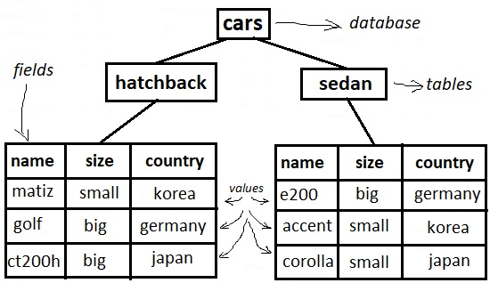

# 105.3. SQL data management

**Weight: **2

**Description: **Candidates should be able to query databases and manipulate data using basic SQL commands. This objective includes performing queries involving joining of 2 tables and/or subselects.

**Key Knowledge Areas:**

* Use of basic SQL commands
* Perform basic data manipulation

**Terms and Utilities:**

* insert
* update
* select
* delete
* from
* where
* group by
* order by
* join

 So far in this series of tutorials, we used flat text files to store data. Flat text files can be suitable for small amounts of data, but they are not good for storing large amounts of data or to querying that data. Over the years, several kinds of databases were developed for that purpose, the most common is now the **relational database**. 

Several relational database systems exist today, including commercial products such as   Oracle Database and IBM DB2®, and open source projects such as MySQL, PostgreSQL SQLite, and MariaDB (a fork of MySQL). Relational databases use SQL as a data definition and query language.


SQL (pronounced "ess-que-el") stands for Structured Query Language. SQL is used to communicate with a database. it is the standard language for relational database management systems. SQL statements are used to perform tasks such as update data on a database, or retrieve data from a database.


### Databases, tables, columns, and rows <a href="databases-tables-columns-and-rows" id="databases-tables-columns-and-rows"></a>

 A relational database consists of a set of _tables_. Think of each _row_ of data in the table as a record, with each _column_ of the table corresponding to the fields in the record for the corresponding row. The data in a column is all of the same _type_— such as character, integer, date, or binary data (such as images).

We are not going to install MySQL or create some databases from zero, our focus is on SQL and we use existing Data Base (ubuntu16.04):



#### MySQL command line

mysql has simple SQL shell command line which we use to ineteractivly connect to a mysql-server. 

```
# mysql -u root -p
Enter password: 
```

it means that I'm going to use `u` ser root and the `p`assword which i will provide. It is also possible to type the password on the command and define which database  i am going to use , which is not a great idea!

```
# mysql -u root -p password cars
```

#### using a database

After connecting to the mysql-server, we should define which database we are going to use. There might too many databases, first we see them via SHOW DATABASES command and then we use use the define which database we are going to use.


Usually MySQL commands are typed with CAPITAL LETTERS and names and values , ... in lower case. There should be a ; at the end of each MySQL command.


```
root@ubuntu16-1:~# mysql -u root -p
Enter password: 
Welcome to the MySQL monitor.  Commands end with ; or \g.
Your MySQL connection id is 239
Server version: 5.7.17-0ubuntu0.16.04.1 (Ubuntu)

Copyright (c) 2000, 2016, Oracle and/or its affiliates. All rights reserved.

Oracle is a registered trademark of Oracle Corporation and/or its
affiliates. Other names may be trademarks of their respective
owners.

Type 'help;' or '\h' for help. Type '\c' to clear the current input statement.

mysql> SHOW DATABASES;
+--------------------+
| Database           |
+--------------------+
| information_schema |
| cars               |
| mysql              |
| performance_schema |
| phpmyadmin         |
| sys                |
+--------------------+
6 rows in set (0.00 sec)

mysql> USE cars;
Reading table information for completion of table and column names
You can turn off this feature to get a quicker startup with -A

Database changed
```

lets see tables:

```
mysql> SHOW TABLES;
+----------------+
| Tables_in_cars |
+----------------+
| hatchback      |
| sedan          |
+----------------+
2 rows in set (0.00 sec)
```

### Exploring tables and columns <a href="exploring-tables-and-columns" id="exploring-tables-and-columns"></a>

### SELECT

 The **select** statement is used to query the database and retrieve selected data. We can select everything in the table using` *` , or we can select from particular columns:

>  SELECT _column1_,_ column2, ..._\
> FROM _table_name_;

```
mysql> SELECT * FROM hatchback;
+--------+-------+---------+
| name   | size  | country |
+--------+-------+---------+
| matiz  | small | korea   |
| golf   | big   | germany |
| ct200h | big   | japan   |
+--------+-------+---------+
3 rows in set (0.05 sec)

mysql> SELECT name FROM hatchback;
+--------+
| name   |
+--------+
| matiz  |
| golf   |
| ct200h |
+--------+
3 rows in set (0.01 sec)
```

### WHERE

 We can choose which data to display by using the `WHERE :`

>  SELECT _column1_,_ column2, ..._\
> FROM _table_name_\
> WHERE _condition_;

```
mysql> SELECT *  FROM hatchback WHERE size = 'big';
+--------+------+---------+
| name   | size | country |
+--------+------+---------+
| golf   | big  | germany |
| ct200h | big  | japan   |
+--------+------+---------+
2 rows in set (0.00 sec)
```

it is also possible to make desired condition via AND and OR when using WHERE:

```
mysql> SELECT *  FROM hatchback WHERE size = 'big' AND country = 'germany';
+------+------+---------+
| name | size | country |
+------+------+---------+
| golf | big  | germany |
+------+------+---------+
1 row in set (0.00 sec)

mysql> SELECT *  FROM hatchback WHERE size = 'big' OR country = 'korea';
+--------+-------+---------+
| name   | size  | country |
+--------+-------+---------+
| matiz  | small | korea   |
| golf   | big   | germany |
| ct200h | big   | japan   |
+--------+-------+---------+
3 rows in set (0.01 sec)
```

### ORDER BY 

ORDERBY is used if we want to sort the data based on one field:

>  SELECT _column1_,_ column2, ..._\
> FROM _table_name_\
> ORDER BY _column1, column2, ..._

```
mysql> SELECT *  FROM hatchback ORDER BY name;
+--------+-------+---------+
| name   | size  | country |
+--------+-------+---------+
| ct200h | big   | japan   |
| matiz  | small | korea   |
| golf   | big   | germany |
+--------+-------+---------+
3 rows in set (0.01 sec)
```

and it can sort results based on any fields:

```
mysql> SELECT *  FROM hatchback ORDER BY country;
+--------+-------+---------+
| name   | size  | country |
+--------+-------+---------+
| golf   | big   | germany |
| ct200h | big   | japan   |
| matiz  | small | korea   |
+--------+-------+---------+
3 rows in set (0.00 sec)
```

### GROUP BY

 Sometimes you want aggregate information from a table. For example, you want to know how many big hatchbacks you have. We can use the `GROUP BY` clause to group your data for this purpose:

>  SELECT _column_name(s)_\
> FROM _table_name_\
> WHERE _condition_\
> GROUP BY _column_name(s)_

```
mysql> SELECT *  FROM hatchback GROUP BY size;                                  +-------+-------+---------+
| name  | size  | country |
+-------+-------+---------+
| golf  | big   | germany |
| matiz | small | korea   |
+-------+-------+---------+
2 rows in set (0.00 sec)
```

it acts like unique command and group the result , to understand how many rows have been grouped by we can use count:

```
mysql> SELECT count(size)  FROM hatchback GROUP BY size;
+-------------+
| count(size) |
+-------------+
|           2 |
|           1 |
+-------------+
2 rows in set (0.04 sec)

mysql> SELECT name,count(size)  FROM hatchback GROUP BY size;
+-------+-------------+
| name  | count(size) |
+-------+-------------+
| golf  |           2 |
| matiz |           1 |
+-------+-------------+
2 rows in set (0.00 sec)
```

### Creating, changing, and deleting data and tables <a href="creating-changing-and-deleting-data-and-tables" id="creating-changing-and-deleting-data-and-tables"></a>

###  INSERT

 `INSERT` command  add one or more rows of data to a table.

>  INSERT INTO _table_name_ (_column1_,_ column2_,_ column3_, ...)\
> VALUES (_value1_,_ value2_,_ value3_, ...);

```
mysql> INSERT INTO hatchback (name,size,country) VALUES ('yaris','small','japan');
Query OK, 1 row affected (0.07 sec)

mysql> SELECT * FROM hatchback;
+--------+-------+---------+
| name   | size  | country |
+--------+-------+---------+
| matiz  | small | korea   |
| golf   | big   | germany |
| ct200h | big   | japan   |
| yaris  | small | japan   |
+--------+-------+---------+
4 rows in set (0.00 sec)
```

> the order is not important and bellow query would have the same result:

> ```
> INSERT INTO hatchback (size,name,country) VALUES ('small','yaris','japan');
> ```

###   UPDATE

`UPDATE` command to fix this mistake . It update row but which row? we should specified that with WHERE command.

>  UPDATE _table_name_\
> SET _column1 _=_ value1_,_ column2 _=_ value2_, ...\
> WHERE _condition_;

```
mysql> UPDATE hatchback SET size= 'big' WHERE name= 'yaris';
Query OK, 1 row affected (0.05 sec)
Rows matched: 1  Changed: 1  Warnings: 0

mysql> SELECT * FROM hatchback;
+--------+-------+---------+
| name   | size  | country |
+--------+-------+---------+
| matiz  | small | korea   |
| golf   | big   | germany |
| ct200h | big   | japan   |
| yaris  | big   | japan   |
+--------+-------+---------+
4 rows in set (0.00 sec)
```

### DELETE

The DELETE statement is used to delete existing records in a table.

>  DELETE FROM _table_name _WHERE _condition_;


Be careful when deleting records in a table! Notice the at  WHERE  in the DELETE statement. The WHERE clause specifies which record(s) should be deleted. If you omit the WHERE clause, all records in the table will be deleted!


```
mysql> DELETE FROM hatchback WHERE name= 'yaris';
Query OK, 1 row affected (0.03 sec)

mysql> SELECT * FROM hatchback;
+--------+-------+---------+
| name   | size  | country |
+--------+-------+---------+
| matiz  | small | korea   |
| golf   | big   | germany |
| ct200h | big   | japan   |
+--------+-------+---------+
3 rows in set (0.00 sec)
```

### JOIN

A JOIN clause is used to combine rows from two or more tables, based on a related column between them. If no related column is given, Every single row from second table (sedan) is copied in front of the first table (hatchback).

```
mysql> SELECT * FROM hatchback;
+--------+-------+---------+
| name   | size  | country |
+--------+-------+---------+
| matiz  | small | korea   |
| golf   | big   | germany |
| ct200h | big   | japan   |
+--------+-------+---------+
3 rows in set (0.00 sec)

mysql> SELECT * FROM sedan;
+---------+-------+---------+
| name    | size  | country |
+---------+-------+---------+
| e200    | big   | germany |
| accent  | small | korea   |
| corolla | small | japan   |
+---------+-------+---------+
3 rows in set (0.00 sec)

mysql> SELECT * FROM hatchback JOIN sedan;
+--------+-------+---------+---------+-------+---------+
| name   | size  | country | name    | size  | country |
+--------+-------+---------+---------+-------+---------+
| matiz  | small | korea   | e200    | big   | germany |
| golf   | big   | germany | e200    | big   | germany |
| ct200h | big   | japan   | e200    | big   | germany |
| matiz  | small | korea   | accent  | small | korea   |
| golf   | big   | germany | accent  | small | korea   |
| ct200h | big   | japan   | accent  | small | korea   |
| matiz  | small | korea   | corolla | small | japan   |
| golf   | big   | germany | corolla | small | japan   |
| ct200h | big   | japan   | corolla | small | japan   |
+--------+-------+---------+---------+-------+---------+
9 rows in set (0.01 sec)
```

and if we give  JOIN a common field to JOIN the tables based on that, the magic happens:

```
mysql> SELECT * FROM hatchback JOIN sedan ON  hatchback.country = sedan.country; 
+--------+-------+---------+---------+-------+---------+
| name   | size  | country | name    | size  | country |
+--------+-------+---------+---------+-------+---------+
| golf   | big   | germany | e200    | big   | germany |
| matiz  | small | korea   | accent  | small | korea   |
| ct200h | big   | japan   | corolla | small | japan   |
+--------+-------+---------+---------+-------+---------+
3 rows in set (0.01 sec)


mysql> SELECT * FROM hatchback JOIN sedan ON  hatchback.size = sedan.size;
+--------+-------+---------+---------+-------+---------+
| name   | size  | country | name    | size  | country |
+--------+-------+---------+---------+-------+---------+
| golf   | big   | germany | e200    | big   | germany |
| ct200h | big   | japan   | e200    | big   | germany |
| matiz  | small | korea   | accent  | small | korea   |
| matiz  | small | korea   | corolla | small | japan   |
+--------+-------+---------+---------+-------+---------+
4 rows in set (0.00 sec)

```


### Different Types of SQL JOINs

Here are the different types of the JOINs in SQL:

* **(INNER) JOIN**: Returns records that have matching values in both tables
* **LEFT (OUTER) JOIN**: Returns all records from the left table, and the matched records from the right table
* **RIGHT (OUTER) JOIN**: Returns all records from the right table, and the matched records from the left table
* **FULL (OUTER) JOIN**: Returns all records when there is a match in either left or right table



finally use quit command to get out of MySQL command line.

```
mysql> quit
Bye
root@ubuntu16-1:~# 
```

that's all!

.

.

.

.

[https://developer.ibm.com/tutorials/l-lpic1-105-3/](https://developer.ibm.com/tutorials/l-lpic1-105-3/)

[http://www.sqlcourse.com/intro.html](http://www.sqlcourse.com/intro.html)

[https://dev.mysql.com/doc/refman/8.0/en/mysql.html](https://dev.mysql.com/doc/refman/8.0/en/mysql.html)

[https://jadi.gitbooks.io/lpic1/content/1053\_sql_data_management.html](https://jadi.gitbooks.io/lpic1/content/1053\_sql_data_management.html)

``[`https://www.w3schools.com/sql/sql_select.asp`](https://www.w3schools.com/sql/sql_select.asp)``

[https://tableplus.com/blog/2018/08/mysql-how-to-turn-off-only-full-group-by.html](https://tableplus.com/blog/2018/08/mysql-how-to-turn-off-only-full-group-by.html)

.
