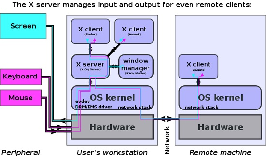

# 106.1. Install and configure X11

## **106.1 Install and configure X11**

**Weight:** 2

**Description: **Candidates should be able to install and configure X11.

**Key Knowledge Areas:**

* Verify that the video card and monitor are supported by an X server
* Awareness of the X font server
* Basic understanding and knowledge of the X Window configuration file

**Terms and Utilities:**

* /etc/X11/xorg.conf
* xhost
* DISPLAY
* xwininfo
* xdpyinfo
* X

In the days of very expensive computers that were shared among many users, X terminals provided a low cost way for many users to share the resources of a single computer. Nowadays computers have become as much powerful  that no one doesn't think about sharing resources, but there are some history lessons which should know about!

### X

The X Window System, often known as X, is a windowing system for graphics workstations developed at MIT. It is based on a client/server model : The client/server model in X system works in reverse to typical client/server model, where the client runs on the local machine and asks for services from the server. In X system, the server runs on the local machine and provides its display and services to the client programs. The client programs may be local or remotely exist over different networks, but X serverc appear transparently.



Beside  displaying  the windows for the clients(applications ) The **X server also **handles input devices such as keyboards, mice, and touchscreens


**XOrg** Server was the free and open-source implementation of the display server for the X Window System managed by the X.Org Foundation. The X11 name points to X Windows version 11.


In many modern linux distributions , the Display manager server still exists, but X Window has been replaced by new solutions like wayland. 

### /etc/X11/xorg.conf

The file xorg.conf is a file used for configuring the X.Org Server. xorg.conf usually is located in /etc/X11/xorg.conf but that does not exist any more on modern linux distributions , so we use a sample xorg.conf to explain that. 

The xorg.conf configuration file is  organized into sections which may be specified in any order. The general section format is

> Section "SectionName" 
>
>        SectionEntry ... 
>
> EndSection

Lets take a quick look at most important ones:

* Files - pathnames for files such as fontpath

```
Section "Files"
	FontPath	"/usr/share/X11/fonts/misc"
	FontPath	"/usr/share/X11/fonts/100dpi/:unscaled"
	FontPath	"/usr/share/X11/fonts/75dpi/:unscaled"
	FontPath	"/usr/share/X11/fonts/Type1"
	FontPath	"/usr/share/X11/fonts/100dpi"
	FontPath	"/usr/share/X11/fonts/75dpi"
	FontPath	"/var/lib/defoma/x-ttcidfont-conf.d/dirs/TrueType"
EndSection
```

* Module - which modules to load

```
Section "Module"
	Load	"bitmap"
	Load	"ddc"
	Load	"dri"
	Load	"extmod"
	Load	"freetype"
	Load	"glx"
	Load	"int10"
	Load	"type1"
	Load	"vbe"
EndSection
```

For example `glx` takes care of 3d graphical effects.

* InputDevice - keyboard and pointer (mouse)

```
Section "InputDevice"
	Identifier	"Generic Keyboard"
	Driver		"kbd"
	Option		"CoreKeyboard"
	Option		"XkbRules"	"xorg"
	Option		"XkbModel"	"pc105"
	Option		"XkbLayout"	"us"
EndSection

Section "InputDevice"
	Identifier	"Configured Mouse"
	Driver		"mouse"
	Option		"CorePointer"
	Option		"Device"		"/dev/input/mice"
	Option		"Protocol"		"ImPS/2"
	Option		"Emulate3Buttons"	"true"
	Option		"ZAxisMapping"		"4 5"
EndSection

Section "InputDevice"
        Identifier      "Synaptics Touchpad"
        Driver          "synaptics"
        Option          "SendCoreEvents"        "true"
        Option          "Device"                "/dev/psaux"
        Option          "Protocol"              "auto-dev"
        Option		"RightEdge"		"5000"
EndSection
```

These InputDevice sections are configured for any input devices, such as touchpads, mice, keyboards, that you may have plugged in to your system.

* Monitor - display device description

```
Section "Monitor"
	Identifier	"Generic Monitor"
	Option		"DPMS"
EndSection
```

* Device - video card description/information

```
Section "Device"
	Identifier	"ATI Technologies, Inc. Radeon Mobility 7500 (M7 LW)"
	Driver		"radeon"
	BusID		"PCI:1:0:0"
	Option		"DynamicClocks"	"on"

	Option		"CRT2HSync"	"30-80"
	Option		"CRT2VRefresh"	"59-75"

  	Option		"MetaModes"	"1024x768 800x600 640x480 1024x768+1280x1024"

    Option  "XAANoOffscreenPixmaps"	"true"
EndSection

```

* Screen - binds a video adapter to a monitor

```
Section "Screen"
    Identifier    "Screen0"
    Device        "Screen0 ATI Technologies, Inc. Radeon Mobility 7500 (M7 LW)"
    Monitor        "Generic Monitor"
    DefaultDepth    24
    SubSection "Display"
        Depth        1
        Modes        "1024x768"
    EndSubSection
    SubSection "Display"
        Depth        4
        Modes        "1024x768"
    EndSubSection
    SubSection "Display"
        Depth        8
        Modes        "1024x768"
    EndSubSection
    SubSection "Display"
        Depth        15
        Modes        "1024x768"
    EndSubSection
    SubSection "Display"
        Depth        16
        Modes        "1024x768"
    EndSubSection
    SubSection "Display"
        Depth        24
        Modes        "1024x768"
    EndSubSection
EndSection
```

* ServerLayout - binds one or more screens with one or more input devices

```
Section "ServerLayout"
	Identifier	"DefaultLayout"
	Screen		"Default Screen"
	InputDevice	"Generic Keyboard"
	InputDevice	"Configured Mouse"
	InputDevice	"Synaptics Touchpad"
EndSection
```

### xwininfo

There may be situations where-in we need to fetch detailed information about an application window on our Linux system. For example, we might need to get the size and position of the window. 

xwininfo is the tool that'll help us in this case. It's basically a window information utility for X (or X-Windows system). It gives Various information about that window depending on which options are selected. Information like size, position, color, depth, … .

```
root@ubuntu16-1:~# xwininfo

xwininfo: Please select the window about which you
          would like information by clicking the
          mouse in that window.

xwininfo: Window id: 0x320000a "root@ubuntu16-1: ~"

  Absolute upper-left X:  65
  Absolute upper-left Y:  52
  Relative upper-left X:  0
  Relative upper-left Y:  0
  Width: 732
  Height: 410
  Depth: 32
  Visual: 0x2a0
  Visual Class: TrueColor
  Border width: 0
  Class: InputOutput
  Colormap: 0x3200009 (not installed)
  Bit Gravity State: NorthWestGravity
  Window Gravity State: NorthWestGravity
  Backing Store State: NotUseful
  Save Under State: no
  Map State: IsViewable
  Override Redirect State: no
  Corners:  +65+52  -3+52  -3-138  +65-138
  -geometry 80x24--7+14
```

### xdpyinfo

Xdpyinfo is a utility for displaying information about an X server.

```
root@ubuntu16-1:~# xdpyinfo 
name of display:    :0
version number:    11.0
vendor string:    The X.Org Foundation
vendor release number:    11906000
X.Org version: 1.19.6
maximum request size:  16777212 bytes
motion buffer size:  256
bitmap unit, bit order, padding:    32, LSBFirst, 32
image byte order:    LSBFirst
number of supported pixmap formats:    7
supported pixmap formats:
    depth 1, bits_per_pixel 1, scanline_pad 32
    depth 4, bits_per_pixel 8, scanline_pad 32
    depth 8, bits_per_pixel 8, scanline_pad 32
    depth 15, bits_per_pixel 16, scanline_pad 32
    depth 16, bits_per_pixel 16, scanline_pad 32
    depth 24, bits_per_pixel 32, scanline_pad 32
    depth 32, bits_per_pixel 32, scanline_pad 32
keycode range:    minimum 8, maximum 255
focus:  window 0x320000b, revert to Parent
number of extensions:    29
    BIG-REQUESTS
    Composite
    DAMAGE
...
```

### xhost

As we said **X** is designed to be network transparent, so that an X server can display windows from local or networked application sources.

The primary command for executing these network activities is xhost — the server access control program for X. Typically, remote access will be disabled, as it poses a security risk. But, if you need to run a GUI application on a remote computer, and have the GUI show up on your own screen, XHOST can be used to allow the remote computer. let get started:

* xhost with no option tells us the access status:

```
root@ubuntu16-1:~# xhost
access control enabled, only authorized clients can connect
SI:localuser:user1
```

* xhost + : Turns off access control (all remote hosts will have access to X server)
*  xhost - : Turns access control back on.

```
root@ubuntu16-1:~# xhost +
access control disabled, clients can connect from any host
root@ubuntu16-1:~# xhost -
access control enabled, only authorized clients can connect
```

* xhost + hostname: Adds hostname to X server access control list. 
* xhost - hostname: Removes hostname from X server access control list.

```
root@ubuntu16-1:~# xhost +172.16.43.136
172.16.43.136 being added to access control list

root@ubuntu16-1:~# xhost 
access control enabled, only authorized clients can connect
INET:172.16.43.136	(no nameserver response within 5 seconds)
SI:localuser:user1

root@ubuntu16-1:~# xhost -172.16.43.136
172.16.43.136 being removed from access control list
```

The xhost program is used to add and delete  user names to the list allowed to make connections to the X server:

* xhost +si:localuser:some_user Grants "some_user" access to the "localuser" X, (localuser refers to the user who is currently logged in.)
*  xhost -si:localuser:some_user Revokes access of "some_user".

```
root@ubuntu16-1:~# xhost +si:localuser:payam
localuser:payam being added to access control list

root@ubuntu16-1:~# xhost
access control disabled, clients can connect from any host
SI:localuser:payam
SI:localuser:user1

root@ubuntu16-1:~# xhost -si:localuser:payam
localuser:payam being removed from access control list
```

### DISPLAY

The magic word in the X window system is DISPLAY. A display consists (simplified) of:

* a keyboard, 
* a mouse
* and a screen. 

A DISPLAY is managed by X server program. The server serves displaying capabilities to other programs that connect to it. The remote server knows where it have to redirect the X network traffic via the definition of the DISPLAY environment variable which generally points to an X Display server located on your local computer.

```
root@ubuntu16-1:~# echo $DISPLAY
:0
```

The value of the display environment variable is: **`hostname:D.S`**

where: 

* **hostname** is the name of the computer where the X server runs. An omitted hostname means the localhost. 
* **D** is a sequence number (usually 0). It can be varied if there are multiple displays connected to one computer. 
* **S** is the screen number. A display can actually have multiple screens. Usually there's only one screen though where 0 is the default.

> :0.0 means that we are talking about the first screen attached to your first display in your local host

We can  change the DISPLAY environment and connect my graphical output to another machine.

```
root@ubuntu16-1:~# export DISPLAY=172.16.43.136:0
root@ubuntu16-1:~# xeyes 
```

 In this case if  a graphical program is run , its output (windows) will be shown on another machine

> When using the OpenSSH ssh command on Linux, the -X option can be used to specify X11 forwarding.

.

.

.

[https://developer.ibm.com/tutorials/l-lpic1-106-1/](https://developer.ibm.com/tutorials/l-lpic1-106-1/)

[https://kb.iu.edu/d/adnu](https://kb.iu.edu/d/adnu)

[https://commons.wikimedia.org/wiki/File:X11\_display_server_protocol.svg](https://commons.wikimedia.org/wiki/File:X11\_display_server_protocol.svg)

[https://en.wikipedia.org/wiki/X.Org_Server](https://en.wikipedia.org/wiki/X.Org_Server)

[https://mg.pov.lt/xorg.conf](https://mg.pov.lt/xorg.conf)

[https://www.faqforge.com/linux/fetch-detailed-information-application-window-linux/](https://www.faqforge.com/linux/fetch-detailed-information-application-window-linux/) [https://www.x.org/releases/X11R7.7/doc/man/man1/xwininfo.1.xhtml](https://www.x.org/releases/X11R7.7/doc/man/man1/xwininfo.1.xhtml) [https://linux.die.net/man/1/xdpyinfo](https://linux.die.net/man/1/xdpyinfo) [https://www.x.org/releases/X11R7.7/doc/man/man1/xdpyinfo.1.xhtml](https://www.x.org/releases/X11R7.7/doc/man/man1/xdpyinfo.1.xhtml) [https://www.lifewire.com/linux-command-xhost-4093456](https://www.lifewire.com/linux-command-xhost-4093456) [https://beamtic.com/xhost-linux](https://beamtic.com/xhost-linux) [https://linux.die.net/man/1/xhost](https://linux.die.net/man/1/xhost) [https://askubuntu.com/questions/432255/what-is-the-display-environment-variable](https://askubuntu.com/questions/432255/what-is-the-display-environment-variable)

.
