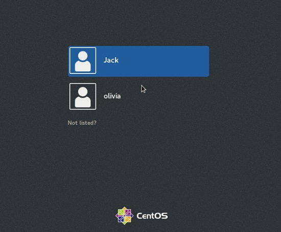
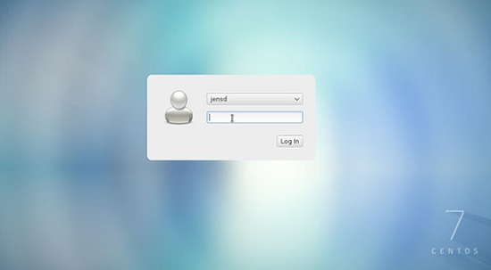
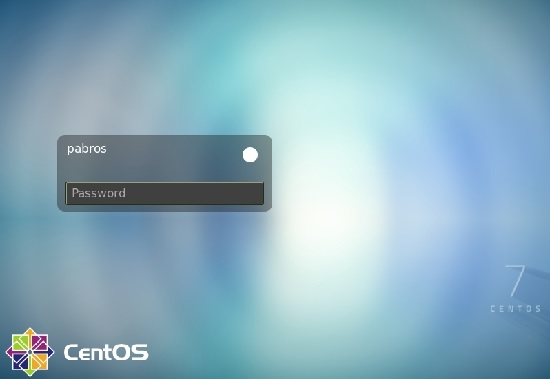

# 106.2. Setup a display manager

**Weight: **1

**Description: **Candidates should be able to describe the basic features and configuration of the LightDM display manager. This objective covers awareness of the display managers XDM (X Display Manger), GDM (Gnome Display Manager) and KDM (KDE Display Manager).

**Key Knowledge Areas**:

* Basic configuration of LightDM
* Turn the display manager on or off
* Change the display manager greeting
* Awareness of XDM, KDM and GDM

**Terms and Utilities:**

* lightdm
* /etc/lightdm/


A Linux desktop environment is a collection of applications designed to work well with each other and provide a consistent user experience. A desktop environment is usually paired with a login manager. The login manager also known as a greeter or display manager

#### What is Display Manager ?

The display manager is a bit of code that provides the GUI login screen for your Linux desktop. After you log in to a GUI desktop, the display manager turns control over to the window manager.

> Kernel -> X -> DisplayManager -> Desktop

 When you log out of the desktop, the display manager is given control again to display the login screen and wait for another login.



There are several display managers—some are provided with their respective desktops while some others not. 

 Any of the display managers can be used for your login screen regardless of which desktop you are using. Such is the flexibility of Linux and well-written, modular code.

| Desktop | Display Manager | notes                                                |
| ------- | --------------- | ---------------------------------------------------- |
| GNOME   | GDM             | GNOME Display Manager                                |
| KDE     | KDM             | KDE Display Manager (up through Fedora 20)           |
| KDE     | SDDM            | Simple Desktop Display Manager (Fedora 21 and above) |
| LXDE    | LXDM            | LXDE Display Manager                                 |
|         | XDM             | Default X Window System Display Manager              |
|         | LightDM         | Lightweight Display Manage                           |

to get the default display manager you can try :` `

```
cat /etc/X11/default-display-manager 
###OR
systemctl status display-manager
```


#### installing and switching to lightdm

In this lesson we use CentOS7 which uses gdm display manager by default. Lets switch to lightdm using bellow commands and check it:

```
yum install -y epel-release 
yum search lightdm
yum install -y lightdm.x86_64 
vim /etc/lightdm/lightdm.conf ### change enabled=true 
systemctl disable gdm.service 
systemctl enable lightdm.service 
reboot
```

if you reboot the service your system will be crashed.




### LightDM

LightDM is a free and open-source X display manager that aims to be lightweight, fast, extensible and multi-desktop.

>  **LightDM** is the display manager running in Ubuntu up to version 16.04 LTS. While it has been replaced by GDM in later Ubuntu releases

### /etc/lightdm

LightDM configuration is located in /etc/lightdm directory:

```
[root@centos7-1 ~]# ls -l /etc/lightdm/
total 20
-rw-r--r-- 1 root root   40 Nov 27  2017 keys.conf
-rw-r--r-- 1 root root 7009 Feb 10 01:16 lightdm.conf
drwxr-xr-x 2 root root    6 Nov 27  2017 lightdm.conf.d
-rw-r--r-- 1 root root 1325 Aug  4  2015 lightdm-gtk-greeter.conf
-rw-r--r-- 1 root root  452 Nov 27  2017 users.conf
```

lets see some confiurations inside /etc/lightdm/lightdm.conf :

```
...
[Seat:*]

#autologin-user=
#allow-user-switching=true
#allow-guest=true
#greeter-session=example-gtk-gnome
#user-session=default

...
```

In some distributions (ubuntu )configuration files are located inside lightdm.conf.d directory:

```
[root@centos7-1 ~]# ls -l /etc/lightdm/lightdm.conf.d/
total 0
```

#### changing greeter session:

For instance lets install another greeter session for lightdm and test it

```
[root@centos7-1 lightdm]# yum search lightdm | grep greeter
lightdm-autologin-greeter.noarch : Autologin greeter using LightDM
slick-greeter.x86_64 : A slick-looking LightDM greeter

[root@centos7-1 lightdm]# yum install -y slick-greeter.x86_64

[root@centos7-1 lightdm]# ls -lrth
total 24K
-rw-r--r-- 1 root root 1.3K Aug  4  2015 lightdm-gtk-greeter.conf
-rw-r--r-- 1 root root  452 Nov 27  2017 users.conf
-rw-r--r-- 1 root root   40 Nov 27  2017 keys.conf
drwxr-xr-x 2 root root    6 Nov 27  2017 lightdm.conf.d
-rw-r--r-- 1 root root 1.2K Dec 29  2017 slick-greeter.conf
-rw-r--r-- 1 root root 6.9K Feb 10 01:16 lightdm.conf

```

next we need to edit lightdm.conf and change line bellow:

```
greeter-session=slick-greeter
```

restart lightdm using `systemctl restart lightdm` and see the result:



#### Controlling Display managers

Installing and switching between different Display Managers is pretty easy , as we have seen in CentOS, we can install new DM via `yum /apt` commands. Next some modifications in configuration files might be needed example `/etc/lightdm/lightdm.conf` .And finally  we should enable previous DM and enable the new one with `systemctl enable/disable lightdm` commands and `reboot`.

For disabling Display Manager ang going to text mode it depends on your distribution! We can either use `telinit` command or  set default target via `systemctl set-default` command.


.

.

.

[https://developer.ibm.com/tutorials/l-lpic1-106-2/](https://developer.ibm.com/tutorials/l-lpic1-106-2/)

[https://opensource.com/article/16/12/yearbook-best-couple-2016-display-manager-and-window-manager](https://opensource.com/article/16/12/yearbook-best-couple-2016-display-manager-and-window-manager)

[https://en.wikipedia.org/wiki/LightDM](https://en.wikipedia.org/wiki/LightDM)

[https://wiki.ubuntu.com/LightDM](https://wiki.ubuntu.com/LightDM)

.
