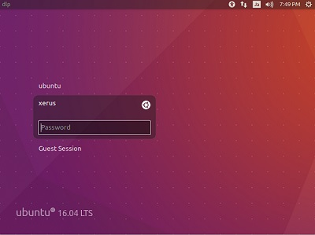

# 106.2. Setup a display manager

**Weight:** 1

**Description:** Candidates should be able to describe the basic features and configuration of the LightDM display manager. This objective covers awareness of the display managers XDM \(X Display Manger\), GDM \(Gnome Display Manager\) and KDM \(KDE Display Manager\).

**Key Knowledge Areas**:

* Basic configuration of LightDM
* Turn the display manager on or off
* Change the display manager greeting
* Awareness of XDM, KDM and GDM

**Terms and Utilities:**

* lightdm
* /etc/lightdm/


A Linux desktop environment is a collection of applications designed to work well with each other and provide a consistent user experience. A desktop environment is usually paired with a login manager. The login manager also known as a greeter or display manager

#### What is Display Manager ?

The display manager is a bit of code that provides the GUI login screen for your Linux desktop. After you log in to a GUI desktop, the display manager turns control over to the window manager. When you log out of the desktop, the display manager is given control again to display the login screen and wait for another login.



There are several display managers—some are provided with their respective desktops while some others not. 

 Any of the display managers can be used for your login screen regardless of which desktop you are using. Such is the flexibility of Linux and well-written, modular code.

| Desktop | Display Manager | notes |
| :--- | :--- | :--- |
| GNOME | GDM | GNOME Display Manager |
| KDE | KDM | KDE Display Manager \(up through Fedora 20\) |
| KDE | SDDM | Simple Desktop Display Manager \(Fedora 21 and above\) |
| LXDE | LXDM | LXDE Display Manager |
|  | XDM | Default X Window System Display Manager |
|  | LightDM | Lightweight Display Manage |

to get the default display manager you can try : ``

```text
cat /etc/X11/default-display-manager 
###OR
systemctl status display-manager commands.
```

### LightDM

LightDM is a free and open-source X display manager that aims to be lightweight, fast, extensible and multi-desktop.

> **LightDM** is the display manager running in Ubuntu up to version 16.04 LTS. While it has been replaced by GDM in later Ubuntu releases

### /etc/lightdm

LightDM configuration is located in /etc/lightdm directory:

```text
root@ubuntu16-1:~# ls -l /etc/lightdm/
total 8
drwxr-xr-x 2 root root 4096 Mar 31  2017 lightdm.conf.d
-rw-r--r-- 1 root root  452 Mar 31  2017 users.conf
```

In some distributions configuration files are located inside lightdm.conf.d directory:

```text
root@ubuntu16-1:~# ls -l /etc/lightdm/lightdm.conf.d/
total 0
```

#### installing lightdm


.

.

.

[https://developer.ibm.com/tutorials/l-lpic1-106-2/](https://developer.ibm.com/tutorials/l-lpic1-106-2/)

[https://opensource.com/article/16/12/yearbook-best-couple-2016-display-manager-and-window-manager](https://opensource.com/article/16/12/yearbook-best-couple-2016-display-manager-and-window-manager)

[https://en.wikipedia.org/wiki/LightDM](https://en.wikipedia.org/wiki/LightDM)

[https://wiki.ubuntu.com/LightDM](https://wiki.ubuntu.com/LightDM)

.

