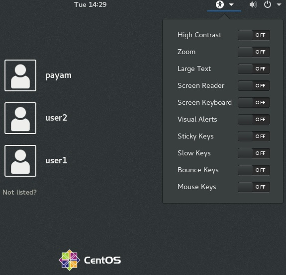

# 106.3. Accessibility

**Weight:** 1

**Description:** Demonstrate knowledge and awareness of accessibility technologies.

**Key Knowledge Areas:**

* Basic knowledge of keyboard accessibility settings (AccessX)
* Basic knowledge of visual settings and themes
* Basic knowledge of assistive technology (ATs)

**Terms and Utilities:**

* Sticky/Repeat Keys
* Slow/Bounce/Toggle Keys
* Mouse Keys
* High Contrast/Large Print Desktop Themes
* Screen Reader
* Braille Display
* Screen Magnifier
* On-Screen Keyboard
* Gestures (used at login, for example GDM)
* Orca
* GOK
* emacspeak

There are some people with disabilities .  A disability is any condition that makes it more difficult for a person to do certain activities or interact with the world around them. People with disabilities might like to work with Linux too . The good news is that Linux distributions provide great advantages over proprietary alternatives for people with disabilities! 

#### What is Accessibility?

Accessibility , means making software usable by disabled people. That includes blind people of course, but also people who have low vision, are deaf, colorblind, have only one hand, can move only a few fingers, or even only the eyes. 

These options are available in display managers (login screen) and in major desktops (like gnome, kde, xfce, ...). Its logo is a human stretching its hands a legs.

> In Gnome the config is located at Settings \~ Universal Access.

Linux provides accessibility in 3 sections:

1. **AccessX  :**_ _**AccessX** or the **Keyboard Accessibility** preference tool allows you to set  some options for people who have difficulty with keyboard . 
2. ** Visual Settings : **Visual Settings help people with vision problems:
3. **Assistive Technologies : **things like text-to-speech (tts)

### AccessX

* **Sticky keys**: Helps users who have trouble pressing multiple keys at once, and users who have use of only one hand
* **Slow keys** allows the user to specify the duration for which one must press-and-hold a **key** before the system accepts the keypress.
* **BounceKeys:** Requires a delay between keystrokes before accepting the next keypress .
* **MouseKeys:** Enables a group of  keys to emulate a mouse. Pressing keys in this group will move a pointer around the screen and perform mouse button actions.
* **RepeatKeys:** Enables the user who has trouble releasing keys quickly once they press to slow down how fast keys start repeating once they're pressed.
* **Hover Click: ** Enable **click **or drag simply by **hovering** **mouse** pointer over a control or object on the screen.

### Visual Settings

* **High-contrast** : Helps users who have trouble seeing text unless contrast is corrected, such as white text on a black background, or vice versa.
* **zoom (Magnifier)** : Helps users with visual impairments who need larger text and images.
* **Large Text**: Make reading text easier by using larger fonts in menus.
* **On screen keyboard**: Helps users who cannot type at all, but who can use a mouse.


**GOK **is the _Gnome On-Screen Keyboard_. As the title implies, it is a keyboard that appears on the display as an alternative for those who are not able to use a regular keyboard.


* **Visual alerts**: Replace system sounds with visual cues(like flashing th e screen)
* **Screen reader**: A text-to-speech system to read what's on the screen

### Text to speech 

There are some Text to speech software in Linux which read dialog boxes for us .  Software like **orca  **and  **emac speak** .

.

.

.

[https://lwn.net/Articles/302159/](https://lwn.net/Articles/302159/)

[https://opensource.com/life/15/5/accessibility-linux](https://opensource.com/life/15/5/accessibility-linux)[https://accessibility.linuxfoundation.org/a11yweb/presentations/2005f2f/johnson-20050124-accessx.html](https://accessibility.linuxfoundation.org/a11yweb/presentations/2005f2f/johnson-20050124-accessx.html)

[https://wiki.ubuntu.com/Accessibility/Reviews/GOK](https://wiki.ubuntu.com/Accessibility/Reviews/GOK)

[https://jadi.gitbooks.io/lpic1/content/1063\_accessibility.html](https://jadi.gitbooks.io/lpic1/content/1063\_accessibility.html)

.
