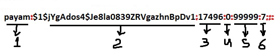
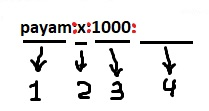

# 107.1. Manage user and group accounts and related system files

## **107.1 Manage user and group accounts and related system files**

**Weight:** 5

**Description:** Candidates should be able to add, remove, suspend and change user accounts.

**Key Knowledge Areas:**

* Add, modify and remove users and groups
* Manage user/group info in password/group databases
* Create and manage special purpose and limited accounts

**Terms and Utilities:**

* /etc/passwd
* /etc/shadow
* /etc/group
* /etc/skel/
* chage
* getent
* groupadd
* groupdel
* groupmod
* passwd
* useradd
* userdel
* usermod

## Users and Groups

We have  learned  that Linux is a multiuser system.Recall that we can log in as one user and become another user by using the su or sudo commands. 

Linux also has the concept of groups . 

* each user belongs to one primary group and possibly to additional groups. 
* Each file belongs to one user and one group

We learn how to create, delete, and manage users and groups.

## Managing users

### useradd

 We add a user to a Linux system with the `useradd` command.

```text
 useradd <options> <username_or_login>
```

| switch | description |
| :--- | :--- |
| -d | home directory of the new account |
| -m | create the user's home directory |
| -s | login shell of the new account |
| -G | Additional Groups  |
| -c | comment |

In most distributions  useradd creates home directory for the new user but we can make sure using -m switch. example\(ubunru 16\):

```text
root@ubuntu16-1:~# useradd -m -d /home/user3 -c "Dear user3" -s /bin/bash user3
```

### /etc/skel


#### The home directory skeleton

When you create a new user and a new home directory is created, the directory is populated with several files and subdirectories that, by default, are copied from /etc/skel.


### usermod <a id="the-home-directory-skeleton"></a>

 We can use the `usermod` command to modify a user account. we can use most of the options that you use with `useradd`, except that you cannot create or populate a new home directory for the user.

```text
usermod <options> <username_or_login>
```

| switch | description |
| :--- | :--- |
| -L | lock the user account |
| -U | unlock the user account |
| -g | force use GROUP as new primary group |
| -G | new list of Additional GROUPS \( user will be  removed from all previous Additional groups \) |
| -aG | append the user to the Additional  GROUPS\(without removing him/her from other groups\) |

```text
root@ubuntu16-1:~# id user3
uid=1003(user3) gid=1003(user3) groups=1003(user3)

root@ubuntu16-1:~# usermod -g user1 user3
root@ubuntu16-1:~# id user3
uid=1003(user3) gid=1001(user1) groups=1001(user1),1003(user3)

root@ubuntu16-1:~# usermod -G user2 user3
root@ubuntu16-1:~# id user3
uid=1003(user3) gid=1001(user1) groups=1001(user1),1002(user2)

root@ubuntu16-1:~# usermod -aG payam user3
root@ubuntu16-1:~# id user3
uid=1003(user3) gid=1001(user1) groups=1001(user1),1000(payam),1002(user2)

###lets turn back to the deafult settings
root@ubuntu16-1:~# usermod -g user3 -G user3 user3
root@ubuntu16-1:~# id user3
uid=1003(user3) gid=1003(user3) groups=1003(user3)
```

### userdel

 We can delete a user with the `userdel` command.

```text
userdel <options> <username_or_login>
```

| switch | description |
| :--- | :--- |
| -f | force removal of files |
| -r | remove home directory and mail spool |

```text
root@ubuntu16-1:~# userdel -f -r user3
userdel: user3 mail spool (/var/mail/user3) not found
```

### Managing Groups

 Similarly, we can add or delete groups with the `groupadd` and `groupdel` commands.

### groupadd 

```text
groupadd [options] group
```

| switch | description |
| :--- | :--- |
| -g | use GID for the new group |
| -f | exit successfully if the group already exists, and cancel -g if the GID is already used |
| -p  | use this encrypted password for the new group |

```text
root@ubuntu16-1:~# groupadd -g 666  group1
root@ubuntu16-1:~# groupadd -g 666  group1
groupadd: group 'group1' already exists
root@ubuntu16-1:~# echo $?
9
root@ubuntu16-1:~# groupadd -f -g 666  group1
root@ubuntu16-1:~# echo $?
0

```

### groupmod

 When you need to modify group information, use the `groupmod` command.

```text
groupmod [options] GROUP
```

| switch | description |
| :--- | :--- |
| -n | change the group name |
| -g | change the group ID  |

```text
root@ubuntu16-1:~# groupmod -n newgroup1 group1
root@ubuntu16-1:~# groupmod -g 888 newgroup1 
```

### groupdel

  In fact, the `groupdel` command to delete a group requires only the group name; it has no options. You cannot delete any group that is the primary group of a user.

```text
root@ubuntu16-1:~# groupdel newgroup1
```

> Note: If root deletes a group with members, people wont be deleted! They will just wont be the members of that group anymore.


When we run ‘**useradd**‘ command in Linux terminal, it performs following major things:

1. It edits /etc/passwd, /etc/shadow, /etc/group and /etc/gshadow files for the newly created User account.
2. Creates and populate a home directory for the new user.
3. Sets permissions and ownerships to home directory.

What are those files?

### /etc/passwd

 /etc/passwd is the _password_ file containing basic information about users.

```text
root@ubuntu16-1:~# tail /etc/passwd
pulse:x:117:124:PulseAudio daemon,,,:/var/run/pulse:/bin/false
rtkit:x:118:126:RealtimeKit,,,:/proc:/bin/false
saned:x:119:127::/var/lib/saned:/bin/false
usbmux:x:120:46:usbmux daemon,,,:/var/lib/usbmux:/bin/false
payam:x:1000:1000:ubuntu16.04.3-1,,,:/home/payam:/bin/bash
user1:x:1001:1001::/home/user1:
sshd:x:121:65534::/var/run/sshd:/usr/sbin/nologin
mysql:x:122:129:MySQL Server,,,:/nonexistent:/bin/false
user2:x:1002:1002::/home/user2:
postfix:x:123:130::/var/spool/postfix:/bin/false
```

it has one line for each user in the system. the format of it is :

```text
username:password:userid:primary group id:Name and comments:home dir:shell
```

There are some users with /bin/false shell, They are actually system accounts that run a service and no one can interactively login using them. 

Every user should have read access to /etc/passwd  :

```text
root@ubuntu16-1:~# ls -l /etc/passwd
-rw-r--r-- 1 root root 2469 Feb 12 02:53 /etc/passwd
```

In old days there was a place that  all users information even the user's password, and it is not so hard thick about security issue that it caused. To solve the problem /etc/shadow was invented. x inside /etc/passwd means go look at /etc/shadow for password.

### /etc/shadow

The /etc/shadow file contains encrypted passwords, along with password- and account-expiration information.

```text
root@ubuntu16-1:~# ls -l /etc/shadow
-rw-r----- 1 root shadow 1609 Feb 12 02:53 /etc/shadow
```

Lets see what's inside that:

```text
root@ubuntu16-1:~# tail /etc/shadow
pulse:*:17379:0:99999:7:::
rtkit:*:17379:0:99999:7:::
saned:*:17379:0:99999:7:::
usbmux:*:17379:0:99999:7:::
payam:$1$jYgAdos4$Je8la0839ZRVgazhnBpDv1:17496:0:99999:7:::
user1:$6$c9PN.175$.t.CG0E0Gtr/trq4pqquSe1BemMjB6Zc3E0ExUOVufuTkPNe3BSRv3DyUuXFHPiAbEujzuSMCeMsCbpg8cV2j.:17749:0:99999:7:::
sshd:*:17749:0:99999:7:::
mysql:!:17867:0:99999:7:::
user2:$6$kN2DNYrP$XmM/3ONRnrTCuTTBxCwVBlVW9E4tVRc02JbRHPhwj128Q6aUIcUq4gxw2r74gopOs2J0HqNxuiBiqgAlkmuwV1:18290:0:99999:7:::
postfix:*:18300:0:99999:7:::
```

> Note: ! means no password

Passwords can be encrypted with one of several encryption algorithms. Older systems used DES or MD5, but modern systems typically use Blowfish, SHA-256, or SHA-512, or possibly MD5. Regardless of encryption algorithm, passwords are _salted_ so that two otherwise identical passwords do not generate the same encrypted value.



1. **Username** : It is your login name. 
2. **Password** : It is your encrypted password. The password should be minimum 8-12 characters long including special characters, digits, lower case alphabetic and more. Usually password format is set to `$id$salt$hashed`, _The $id is the algorithm used On GNU/Linux as follows: $1$ is MD5 $2a$ is Blowfish $2y$ is Blowfish $5$ is SHA-256 $6$ is SHA-512_ 
3. **Last password change \(lastchanged\)** : Days since Jan 1, 1970 that password was last changed 
4. **Minimum** : The minimum number of days required between password changes i.e. the number of days left before the user is allowed to change his/her password
5. **Maximum** : The maximum number of days the password is valid \(after that user is forced to change his/her password\)
6.  **Warn** : The number of days before password is to expire that user is warned that his/her password must be changed 
7. **Inactive** : The number of days after password expires that account is disabled 
8. **Expire** : days since Jan 1, 1970 that account is disabled i.e. an absolute date specifying when the login may no longer be used.

The last 6 fields provides password aging and account lockout features. You need to use the chage command to setup password aging.


**epoch time**

Unix time is a system for describing a point in time. It is the number of seconds that have elapsed since the Unix epoch, that is the time 00:00:00 UTC on 1 January 1970, minus leap seconds.


### chage

 **chage** command is used to view and change the user password expiry information. This command is used when the login is to be provided for a user for limited amount of time or when it is necessary to change the login password time to time.

```text
chage [options] LOGIN
```

```text
Options:
  -d, --lastday LAST_DAY        set date of last password change to LAST_DAY
  -E, --expiredate EXPIRE_DATE  set account expiration date to EXPIRE_DATE
  -h, --help                    display this help message and exit
  -I, --inactive INACTIVE       set password inactive after expiration
                                to INACTIVE
  -l, --list                    show account aging information
  -m, --mindays MIN_DAYS        set minimum number of days before password
                                change to MIN_DAYS
  -M, --maxdays MAX_DAYS        set maximim number of days before password
                                change to MAX_DAYS
  -R, --root CHROOT_DIR         directory to chroot into
  -W, --warndays WARN_DAYS      set expiration warning days to WARN_DAYS

```

lets try -l option on user1:

```text
root@ubuntu16-1:~# chage -l user1
Last password change					: Aug 06, 2018
Password expires					: never
Password inactive					: never
Account expires						: never
Minimum number of days between password change		: 0
Maximum number of days between password change		: 99999
Number of days of warning before password expires	: 7
```

> `chage -d 0 user-name` will force user to change his password in next login.

### /etc/group

 /etc/group is the _group_ file containing basic information about groups and which users belong to them. The /etc/group file contains one line for each group in the system.

```text
root@ubuntu16-1:~# tail /etc/group
rtkit:x:126:
saned:x:127:
payam:x:1000:
sambashare:x:128:payam
user1:x:1001:
mysql:x:129:
user2:x:1002:
postfix:x:130:
postdrop:x:131:
mysecuregroup:x:1003:
```



1. **group\_name**: It is the name of group. If you run ls -l command, you will see this name printed in the group field. 
2. **Password**: Generally password is not used, hence it is empty/blank. It can store encrypted password. This is useful to implement privileged groups. 
3. **Group ID \(GID\)**: Each user must be assigned a group ID. You can see this number in your /etc/passwd file. 
4. **Group List**: It is a list of user names of users who are members of the group. The user names, must be separated by commas.

```text
root@ubuntu16-1:~# ls -l /etc/group
-rw-r--r-- 1 root root 1077 Feb 12 03:58 /etc/group
```

Like /etc/passwd file, /etc/group is shadowed for security reasons and must be world readable, but encrypted passwords should not be world readable.

groups password are stored in /etc/gshadow file which is readable only by root.

```text
root@ubuntu16-1:~# ls -l /etc/gshadow
-rw-r----- 1 root shadow 902 Feb 12 03:58 /etc/gshadow

root@ubuntu16-1:~# tail /etc/gshadow
rtkit:!::
saned:!::
payam:!::
sambashare:!::payam
user1:!::
mysql:!::
user2:!::
postfix:!::
postdrop:!::
mysecuregroup:Aa12345::
```

> ! :groups can have passwords but it have never been used in any distribution!

### getent

 **getent** is a Linux command that helps the user to get the entries in a number of important text files called databases.

```text
getent database [key ...]
```

we use the getent command for processing groups and user information, instead of manually reading /etc/passwd, /etc/groups.

```text
root@ubuntu16-1:~# getent passwd payam
payam:x:1000:1000:ubuntu16.04.3-1,,,:/home/payam:/bin/bash

root@ubuntu16-1:~# getent group payam
payam:x:1000:
```


.

.

.

[https://developer.ibm.com/technologies/linux/tutorials/l-lpic1-map/](https://developer.ibm.com/technologies/linux/tutorials/l-lpic1-map/)

[https://askubuntu.com/questions/639990/what-is-the-group-id-of-this-group-name](https://askubuntu.com/questions/639990/what-is-the-group-id-of-this-group-name)

[https://www.cyberciti.biz/faq/understanding-etcshadow-file/](https://www.cyberciti.biz/faq/understanding-etcshadow-file/)

[https://en.wikipedia.org/wiki/Unix\_time](https://en.wikipedia.org/wiki/Unix_time)

[https://www.geeksforgeeks.org/chage-command-in-linux-with-examples/](https://www.geeksforgeeks.org/chage-command-in-linux-with-examples/)

.

