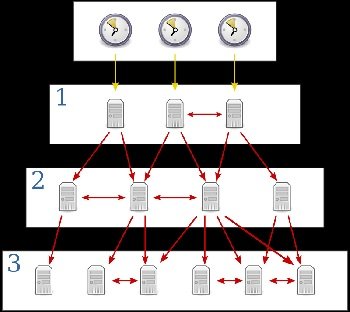

# 108.1. Maintain system time

## **108.1 Maintain system time**

**Weight: **3

**Description: **Candidates should be able to properly maintain the system time and synchronize the clock via NTP.

**Key Knowledge Areas:**

* Set the system date and time
* Set the hardware clock to the correct time in UTC
* Configure the correct timezone
* Basic NTP configuration
* Knowledge of using the pool.ntp.org service
* Awareness of the ntpq command

**Terms and Utilities:**

* /usr/share/zoneinfo/
* /etc/timezone
* /etc/localtime
* /etc/ntp.conf
* date
* hwclock
* ntpd
* ntpdate
* pool.ntp.org

When we install a Linux® system graphically, we set the clock and choose a time zone suitable for our needs ,we can also choose to use the Network Time Protocol (NTP) to set your clock automatically. In this lesson we show  how to go below the graphical interfaces and configure the various time-related aspects of Linux system.

#### How Linux keep tack of time

 there are 2 clocks in each computer. The first is the Hardware Clock. This is the clock on a motherboard chip that keeps time even when the machine is powered off. 

The other clock is the virtual System Clock. Linux asks the Hardware Clock chip what time it is on power up and then keeps track of the time itself with software. 

Hardware clock can be the localtime (your computers timezone) or UTC time (standard time). 

> We can determine which one is set by checking /etc/adjtime . This file is empty unless the  Hardware has been set manually.

Usually the hardware clock is set on UTC , so when ever system boots up, Software clock reads Hardware clock and then calculates the difference based on our timezone.

#### Setting The System Clock

### date

 **date **command is used to display the system date and time.  By default the date command displays the date in  local time, even if your hardware clock keeps UTC. Use the `-u` option to display UTC. 

```
root@ubuntu16-1:~# date
Mon Feb 17 19:17:52 +0330 2020
```

Use the `-u` option to display UTC:

```
root@ubuntu16-1:~# date -u
Mon Feb 17 15:50:20 UTC 2020
```

date command is also used to set date and time of the system ( Automatic Adjustment (ntp) should not be enabled, otherwise it won't work):

```
root@ubuntu16-1:~# date
Mon Feb 17 19:37:30 +0330 2020
root@ubuntu16-1:~# date --set="20170413 21:14:00"
Thu Apr 13 21:14:00 +0430 2017
root@ubuntu16-1:~# date
Thu Apr 13 21:14:02 +0430 2017
```

 Although we can set time using date command, the big problem with this idea is that time change will only last until the next reboot. Unless we somehow set  the system time to the hardware clock.

### Setting The Hardware Clock <a href="_setting_the_hardware_clock" id="_setting_the_hardware_clock"></a>

### hwclock

To change the Hardware Clock, you can use the motherboard’s BIOS utility at startup, but if you miss that opportunity, there is still hope. The "hwclock" command.

 `hwclock` is a utility for accessing the hardware clock, also referred to as the Real Time Clock (RTC). As we mentioned it  is independent of the operating system you use and works even when the machine is shut down.

```
root@ubuntu16-1:~# hwclock
Mon 17 Feb 2020 08:53:26 PM +0330  .972851 seconds
root@ubuntu16-1:~# date
Mon Feb 17 20:53:33 +0330 2020
```

>  hwclock date shows the date in the localtime (time after adding the timezone to the UTC time) , even when the hardware clock is set on UTC!

hwclock syntax : `hwclock [function] [option...]` where :

```
 ### Functioms:
 -r, --show           read hardware clock and print result
     --get            read hardware clock and print drift corrected result
     --set            set the RTC to the time given with --date
 -s, --hctosys        set the system time from the hardware clock
 -w, --systohc        set the hardware clock from the current system time
     --systz          set the system time based on the current timezone
### Options:
--localtime            the hardware clock is kept local time
  -u, --utc            the hardware clock is kept in UTC
```

lets do some examples:

```
### lets set hardware clock in utc
root@ubuntu16-1:~# hwclock --set --date="01/02/1999 10:20:30"
root@ubuntu16-1:~# hwclock
Sat 02 Jan 1999 10:20:34 AM +0330  .274999 seconds
root@ubuntu16-1:~# cat /etc/adjtime 
0.000000 915259830 0.000000
915259830
UTC
root@ubuntu16-1:~# hwclock 
Sat 02 Jan 1999 10:21:48 AM +0330  .259334 seconds
root@ubuntu16-1:~# date
Mon Feb 17 21:36:41 +0330 2020


### lets fix it by setting local time to hardware clock

root@ubuntu16-1:~# hwclock 
Sat 02 Jan 1999 10:31:10 AM +0330  .009381 seconds
root@ubuntu16-1:~# date
Mon Feb 17 21:39:56 +0330 2020
root@ubuntu16-1:~# hwclock --localtime --set --date="02/17/2020 21:40:00"
root@ubuntu16-1:~# cat /etc/adjtime 
0.000000 1581963000 0.000000
1581963000
LOCAL
root@ubuntu16-1:~# hwclock 
Mon 17 Feb 2020 09:40:08 PM +0330  .290810 seconds
root@ubuntu16-1:~# date
Mon Feb 17 21:40:55 +0330 2020

```

the hwclock --localtime  -w would do the same thing , but setting  hardware clock to your local time is not a good idea, so use hwclock -u -w instead. 

### NTP

**Network Time Protocol (NTP)** is an application layer protocol used for clock synchronization between hosts on a TCP/IP network. The goal of NTP is to ensure that all computers on a network agree on the time, since even a small difference can create problems.

 NTP uses a hierarchical system of time sources. At the top of the structure are highly accurate time sources – typically atomic or GPS clocks. These clocks are known as **stratum 0** servers. **Stratum 1** servers are directly linked to stratum 0 servers and computers run NTP servers that deliver the time to **stratum 2** servers, and so on (image source: Wikipedia):



> NTP uses a client-server architecture; one host is configured as the NTP server and all other hosts on the network are configured as NTP clients.

### pool.ntp.org

The pool.ntp.org project is a big virtual cluster of timeservers providing reliable easy to use NTP service for millions of clients.

The pool is being used by hundreds of millions of systems around the world. It's the default "time server" for most of the major Linux distributions and many networked appliances

### ntpdate

 **ntpdate** sets the local date and time by polling the Network Time Protocol (NTP) **server**(s) given as the server arguments to determine the correct time. It must be run as root on the local host. (you might need to install it). `-v` : verbose 

```
root@ubuntu16-1:~# ntpdate -v pool.ntp.org
17 Feb 22:59:34 ntpdate[4365]: ntpdate 4.2.8p4@1.3265-o Tue Jan  7 15:08:24 UTC 2020 (1)
17 Feb 22:59:46 ntpdate[4365]: adjust time server 194.225.150.25 offset -0.005153 sec
```

After this, we need to set the hwclock to the just corrected system time by sudo `hwclock -w` or` hwclock -u -w` to make sure you are setting that on utc .

> \-q switch will query for time and just show the result with out setting that.

### ntpd

Instead of manually setting the time each time, we can use a linux service called ntp.  The `ntpd` utility is an operating system daemon which sets and maintains the system time of day in synchronism with Internet standard time servers.

```
root@ubuntu16-1:~# apt install ntp
root@ubuntu16-1:~# systemctl start ntp
root@ubuntu16-1:~# systemctl enable ntp
```

Fun fact: we can not use natpdate while ntp service is running:

```
root@ubuntu16-1:~# ntpdate pool.ntp.org
17 Feb 23:15:34 ntpdate[5740]: the NTP socket is in use, exiting
```

### /etc/ntp.cpnf

 The ntpd configuration file is located at **/etc/ntp.conf**. It is read at initial startup by the ntpd daemon in order to specify the appropriate  synchronization sources:

```
root@ubuntu16-1:~# cat /etc/ntp.conf 
# /etc/ntp.conf, configuration for ntpd; see ntp.conf(5) for help

driftfile /var/lib/ntp/ntp.drift

# Enable this if you want statistics to be logged.
#statsdir /var/log/ntpstats/

statistics loopstats peerstats clockstats
filegen loopstats file loopstats type day enable
filegen peerstats file peerstats type day enable
filegen clockstats file clockstats type day enable

# Specify one or more NTP servers.

# Use servers from the NTP Pool Project. Approved by Ubuntu Technical Board
# on 2011-02-08 (LP: #104525). See http://www.pool.ntp.org/join.html for
# more information.
pool 0.ubuntu.pool.ntp.org iburst
pool 1.ubuntu.pool.ntp.org iburst
pool 2.ubuntu.pool.ntp.org iburst
pool 3.ubuntu.pool.ntp.org iburst

# Use Ubuntu's ntp server as a fallback.
pool ntp.ubuntu.com

# Access control configuration; see /usr/share/doc/ntp-doc/html/accopt.html for
# details.  The web page <http://support.ntp.org/bin/view/Support/AccessRestrictions>
# might also be helpful.
#
# Note that "restrict" applies to both servers and clients, so a configuration
# that might be intended to block requests from certain clients could also end
# up blocking replies from your own upstream servers.

# By default, exchange time with everybody, but don't allow configuration.
restrict -4 default kod notrap nomodify nopeer noquery limited
restrict -6 default kod notrap nomodify nopeer noquery limited

# Local users may interrogate the ntp server more closely.
restrict 127.0.0.1
restrict ::1

# Needed for adding pool entries
restrict source notrap nomodify noquery

# Clients from this (example!) subnet have unlimited access, but only if
# cryptographically authenticated.
#restrict 192.168.123.0 mask 255.255.255.0 notrust


# If you want to provide time to your local subnet, change the next line.
# (Again, the address is an example only.)
#broadcast 192.168.123.255

# If you want to listen to time broadcasts on your local subnet, de-comment the
# next lines.  Please do this only if you trust everybody on the network!
#disable auth
#broadcastclient

#Changes recquired to use pps synchonisation as explained in documentation:
#http://www.ntp.org/ntpfaq/NTP-s-config-adv.htm#AEN3918

#server 127.127.8.1 mode 135 prefer    # Meinberg GPS167 with PPS
#fudge 127.127.8.1 time1 0.0042        # relative to PPS for my hardware

#server 127.127.22.1                   # ATOM(PPS)
#fudge 127.127.22.1 flag3 1            # enable PPS API
```

You can change the ntp servers to the ntp server(s) you want. Do not forget to restart the service after any modifications.

### ntpq

 The **ntpq** utility program is used to monitor NTP daemon **ntpd** operations and determine performance.

 **`-p :`**Print a list of the peers known to the server as well as a summary of their state.

```
root@ubuntu16-1:~# ntpq -p
     remote           refid      st t when poll reach   delay   offset  jitter
==============================================================================
 0.ubuntu.pool.n .POOL.          16 p    -   64    0    0.000    0.000   0.000
 1.ubuntu.pool.n .POOL.          16 p    -   64    0    0.000    0.000   0.000
 2.ubuntu.pool.n .POOL.          16 p    -   64    0    0.000    0.000   0.000
 3.ubuntu.pool.n .POOL.          16 p    -   64    0    0.000    0.000   0.000
 ntp.ubuntu.com  .POOL.          16 p    -   64    0    0.000    0.000   0.000
-77.104.104.100  37.156.28.13     3 u   20   64  345    5.641  -40.539  13.503
+77.104.70.70    194.225.150.25   3 u   25   64  377    4.835   11.343   7.680
-5-144-132-2.sta 119.28.183.184   3 u   28   64  377    4.803   -7.711  14.597
+ntp5.mobinnet.n 62.12.173.12     2 u   46   64  377    4.920  -11.823   6.280
*golem.canonical 17.253.34.251    2 u   59   64  377   85.408   11.230   8.712
```

 **-n** : Output all host addresses in dotted-quad numeric format rather than converting to the canonical host names.

```
root@ubuntu16-1:~# ntpq -pn
     remote           refid      st t when poll reach   delay   offset  jitter
==============================================================================
 0.ubuntu.pool.n .POOL.          16 p    -   64    0    0.000    0.000   0.000
 1.ubuntu.pool.n .POOL.          16 p    -   64    0    0.000    0.000   0.000
 2.ubuntu.pool.n .POOL.          16 p    -   64    0    0.000    0.000   0.000
 3.ubuntu.pool.n .POOL.          16 p    -   64    0    0.000    0.000   0.000
 ntp.ubuntu.com  .POOL.          16 p    -   64    0    0.000    0.000   0.000
-77.104.104.100  37.156.28.13     3 u    8   64  313    4.862  -20.085  13.553
+77.104.70.70    194.225.150.25   3 u    8   64  377    4.835   11.343   6.174
-5.144.132.2     119.28.183.184   3 u    6   64  377    5.062    3.365   5.087
+37.156.28.13    62.12.173.12     2 u   13   64  377    4.920  -11.823   4.775
*91.189.89.199   17.253.34.251    2 u   18   64  377   85.408   11.230   6.346
```

the meaning :

```
* Synchronized to this peer
# Almost synchronized to this peer
+ Peer selected for possible synchronization
– Peer is a candidate for selection
~ Peer is statically configured
```

tha's all.

.

.

.

[https://developer.ibm.com/tutorials/l-lpic1-108-1/](https://developer.ibm.com/tutorials/l-lpic1-108-1/)

[http://xed.ch/help/time.html](http://xed.ch/help/time.html)

[https://www.geeksforgeeks.org/date-command-linux-examples/](https://www.geeksforgeeks.org/date-command-linux-examples/)

[https://jadi.gitbooks.io/lpic1/content/1081\_maintain_system_time.html](https://jadi.gitbooks.io/lpic1/content/1081\_maintain_system_time.html)

[https://access.redhat.com/documentation/en-us/red_hat_enterprise_linux/7/html/system_administrators_guide/sect-configuring_the_date_and_time-hwclock](https://access.redhat.com/documentation/en-us/red_hat_enterprise_linux/7/html/system_administrators_guide/sect-configuring_the_date_and_time-hwclock)

[https://www.geeksforgeeks.org/hwclock-command-in-linux-with-examples/](https://www.geeksforgeeks.org/hwclock-command-in-linux-with-examples/)

[https://geek-university.com/ccna/network-time-protocol/](https://geek-university.com/ccna/network-time-protocol/)

[https://www.ntppool.org/en/](https://www.ntppool.org/en/)

[https://linux.die.net/man/8/ntpdate](https://linux.die.net/man/8/ntpdate)

[https://docs.ntpsec.org/latest/ntpd.html](https://docs.ntpsec.org/latest/ntpd.html)

[https://detailed.wordpress.com/2017/10/22/understanding-ntpq-output/](https://detailed.wordpress.com/2017/10/22/understanding-ntpq-output/)

.
