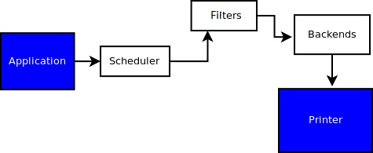
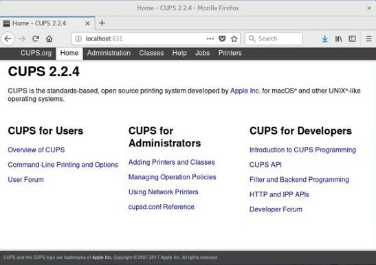

# 108.4. Manage printers and printing

**Weight:** 2

**Description:** Candidates should be able to manage print queues and user print jobs using CUPS and the LPD compatibility interface.

**Key Knowledge Areas:**

* Basic CUPS configuration (for local and remote printers)
* Manage user print queues
* Troubleshoot general printing problems
* Add and remove jobs from configured printer queues

**Terms and Utilities:**

* CUPS configuration files, tools and utilities
* /etc/cups/
* lpd legacy interface (lpr, lprm, lpq)

Although much of our communication today is electronic and paperless, we still have considerable need to print material from our computers.

### cups

CUPS is the standards-based, open source printing system developed by Apple Inc. for macOS® and other UNIX®-like operating systems.It stands  for Common UNIX Printing System. The CUPS system can act as a printer server for a local machine or a network of machines.

CUPS consists of:

* Print spooler/scheduler: Lines up printing jobs to be sent to the printer.
* Filter system: Converts data so that the attached printer can understand and format the data being printed.
* Backend system: Transports data from filters to printer.




>  At the heart of the CUPS printing system is the `cupsd` print server which runs as a daemon process.

#### cups web interface

 There are different interfaces for cups like gui , web interfaces and even traditional command line interfaces. Here we show  the CUPS web administration tool (`http://localhost:631 or http://127.0.0.1:631`) to search for or add printers.



> If you are asked for a username and password when accessing the CUPS web interface (localhost:631), use your login name and password. 
>
> Obviously adding printer requires root access.(in ubuntu members of cups admin group are accepted too)

```
### cups tree of menus:
-Home
-Administration ---> For Adding printers, managing jobs,
                     and configuring the CUPS works as server.
-classes
-Help
-Jobs ---> to check the jobs the CUPS is handling
-Printers ---> shopw the orinters
```


We need to know what driver to use for your printer. Not all printers are fully supported on Linux and some may not work at all, or only with limitations. Check  the printer manufacturer’s website or take a look at OpenPrinting.org.


### /etc/cups

The /etc/cups directory contains other configuration files related to CUPS (Fedora 30).

```
[root@earth ~]# ls -l /etc/cups
total 100
-rw-------  1 root lp     128 Dec  9 15:01 classes.conf
-rw-r-----  1 root lp     128 Dec  9 14:47 classes.conf.O
-rw-r--r--. 1 root lp       0 Nov  9  2018 client.conf
-rw-r--r--. 1 root root 27075 Apr 25  2018 cups-browsed.conf
-rw-r-----. 1 root lp    6278 Nov  9  2018 cupsd.conf
-rw-r-----. 1 root lp    6278 Nov  9  2018 cupsd.conf.default
-rw-r-----. 1 root lp    3000 Dec  4  2018 cups-files.conf
-rw-r-----. 1 root lp    3000 Nov  9  2018 cups-files.conf.default
-rw-r--r--. 1 root lp       0 Nov  9  2018 lpoptions
drwxr-xr-x. 2 root lp    4096 Dec  9 14:56 ppd
-rw-------  1 root lp     646 Jan  1 14:55 printers.conf
-rw-------  1 root lp     596 Jan  1 14:30 printers.conf.O
-rw-r--r--. 1 root lp     142 Nov  9  2018 snmp.conf
-rw-r-----. 1 root lp     142 Nov  9  2018 snmp.conf.default
drwx------. 2 root lp    4096 Nov  9  2018 ssl
-rw-r-----  1 root lp     421 Feb 19 17:39 subscriptions.conf
-rw-r-----  1 root lp     421 Feb 19 16:41 subscriptions.conf.O
-rw-r--r--. 1 root root    91 Dec  8  2018 thnuclnt.convs
-rw-r--r--. 1 root root    75 Dec  8  2018 thnuclnt.types
```

The CUPS configuration file is normally located in /etc/cups/cupsd.conf

```
MaxLogSize 0
#
# Configuration file for the CUPS scheduler.  See "man cupsd.conf" for a
# complete description of this file.
#

# Log general information in error_log - change "warn" to "debug"
# for troubleshooting...
LogLevel warn


# Only listen for connections from the local machine.
Listen localhost:631
Listen /var/run/cups/cups.sock

# Show shared printers on the local network.
Browsing On
BrowseLocalProtocols dnssd

# Default authentication type, when authentication is required...
DefaultAuthType Basic

# Web interface setting...
WebInterface Yes

# Restrict access to the server...
<Location />
  Order allow,deny
</Location>

# Restrict access to the admin pages...
<Location /admin>
  Order allow,deny
</Location>

# Restrict access to configuration files...
<Location /admin/conf>
  AuthType Default
  Require user @SYSTEM
  Order allow,deny
</Location>

# Restrict access to log files...
<Location /admin/log>
  AuthType Default
  Require user @SYSTEM
  Order allow,deny
</Location>

# Set the default printer/job policies...
...
```

> note1:The default CUPS configuration limits administration to the local machine.
>
> note2: Most of the settings are accessible from the web interface and it is not recommended to edit this file.

If any printer has been configured, the setting are stored in etc/cups/printers.conf 

```
# Printer configuration file for CUPS v2.2.6
# Written by cupsd on 2020-01-01 14:55
# DO NOT EDIT THIS FILE WHEN CUPSD IS RUNNING
<DefaultPrinter HP-LaserJet-p2055d>
UUID urn:uuid:b55fdcb1-be5e-30a4-6fc5-d6e237a3c41a
AuthInfoRequired username,password
Info HP LaserJet p2055d
MakeModel HP LaserJet p2055d pcl3, hpcups 3.18.6
DeviceURI smb://172.16.130.2/HP%20LaserJet%20P2050%20Series%20PCL6
State Stopped
StateMessage Rendering completed
StateTime 1577877637
ConfigTime 1575890776
Reason paused
Type 36892
Accepting Yes
Shared No
JobSheets none none
QuotaPeriod 0
PageLimit 0
KLimit 0
OpPolicy default
ErrorPolicy stop-printer
</DefaultPrinter>

```

> `DO NOT EDIT THIS FILE WHEN CUPSD IS RUNNING!`

### lpd legacy interface 

In UNIX and Linux systems, printing initially used the Berkeley Software Distribution (BSD) printing subsystem, consisting of a line printer daemon (lpd) running as a server, and client commands such as lpr to submit jobs for printing.

Nowadays many of these legacy tools still exist to keep backward compatibility.

| command    | usage                |
| ---------- | -------------------- |
| lpr        | send file to printer |
| lpq        | show print jobs      |
| lprm       | remove print jobs    |
| lpc status | show printer status  |

** lpq : q **stands for** queue **and it is use full when we want to see printer jobs

* `-P` : show the jobs of specific printer
* `-a` : show jobs of all printers.

```
[root@earth ~]# lpq -PHP-LaserJet-p2055d
HP-LaserJet-p2055d is not ready
Rank    Owner   Job     File(s)                         Total Size
1st     payam    15      Untitled Document 1             13312 bytes
2nd     payam    16      MOP template.docx               16384 bytes
```

> There should be no space between -P and Printer's name! `-Pprintername`

**lpr : ** The simplest way to print any file is to use the `lpr` command and provide the file name. Again use `-P` to specify printer:

```
[root@earth ~]#  lpr -PHP-LaserJet-p2055d minicom.log 
[root@earth ~]# lpq
HP-LaserJet-p2055d is not ready
Rank    Owner   Job     File(s)                         Total Size
1st     payam   15      Untitled Document 1             13312 bytes
2nd     payam   16      MOP template.docx               16384 bytes
3rd     root    17      minicom.log                     2048 bytes

```

**lprm : **lprm  removes job(s) from the printer's queue. We need to define Job ID for this command, if no Job ID is specified the older job is removed.

```
[root@earth ~]# lpq
HP-LaserJet-p2055d is not ready
Rank    Owner   Job     File(s)                         Total Size
1st     payam   15      Untitled Document 1             13312 bytes
2nd     payam   16      MOP template.docx               16384 bytes
3rd     root    17      minicom.log                     2048 bytes
[root@earth ~]# lprm 15
[root@earth ~]# lpq
HP-LaserJet-p2055d is not ready
Rank    Owner   Job     File(s)                         Total Size
1st     payam   16      MOP template.docx               16384 bytes
2nd     root    17      minicom.log                     2048 bytes
[root@earth ~]# lprm
[root@earth ~]# lpq
HP-LaserJet-p2055d is not ready
Rank    Owner   Job     File(s)                         Total Size
1st     root    17      minicom.log                     2048 bytes
[root@earth ~]# 
```

> again -P can be used to specify the printer. Also we can use `lprm -Pprintername - `to remove all printer's jobs. And`  lprm -  `will remove all jobs from the default printer.
>
> Each user can remove his/her own jobs, but root can do any thing!

**lpc**  : we can use lpc status command in order to check the printer health and troubleshoot (become root for better results!).

```
[root@earth ~]# lpc status
HP-LaserJet-p2055d:
	printer is on device 'smb' speed -1
	queuing is enabled
	printing is disabled
	1 entries
	daemon present
```

where 

* **queuing is enabled**: it means that printer will accept new jobs, if it was disabled it won't accept any new job even if the printer was ok.
* **printing is disabled**: means that printer can not actually print on the paper. That happens if the printer is out of ink or paper or experiencing a paper jam.

In my case, my printer is out of paper. But there are some other cups command which might be helpful specially when a problem occurs: 

| command         | describe                                         |
| --------------- | ------------------------------------------------ |
| **cupsaccept**  | tells the printer queue to accept new jobs       |
| **cupsreject**  | tells the printer to reject any new job          |
| **cupsenable**  | enables the actual/physical printing of the jobs |
| **cupsdisable** | disables the physical printing of the jobs       |

 with all commands we can specify printer's name without -P switch !

```
[root@earth ~]# lpc status
HP-LaserJet-p2055d:
	printer is on device 'smb' speed -1
	queuing is enabled
	printing is disabled
	1 entries
	daemon present
```

Adding some papers :

```
[root@earth ~]# cupsenable HP-LaserJet-p2055d

[root@earth ~]# lpc status
HP-LaserJet-p2055d:
	printer is on device 'smb' speed -1
	queuing is enabled
	printing is enabled
	1 entries
	daemon present
```

And if we want to disable a printer intentionally, we can mention the reason with -r switch:

```
[root@earth ~]# cupsreject HP-LaserJet-p2055d -r "Adding more paper"
[root@earth ~]# lpc status
HP-LaserJet-p2055d:
	printer is on device 'smb' speed -1
	queuing is disabled
	printing is enabled
	1 entries
	daemon present
```

that's all!

.

.

.

[https://developer.ibm.com/tutorials/l-lpic1-108-4/](https://developer.ibm.com/tutorials/l-lpic1-108-4/)

[https://wiki.archlinux.org/index.php/CUPS](https://wiki.archlinux.org/index.php/CUPS)

[https://www.linux.com/tutorials/linux-101-printing/](https://www.linux.com/tutorials/linux-101-printing/)

[https://jadi.gitbooks.io/lpic1/content/1084\_manage_printers_and_printing.html](https://jadi.gitbooks.io/lpic1/content/1084\_manage_printers_and_printing.html)

[https://www.cups.org/](https://www.cups.org/faq.html)

.


