# 109.1. Fundamentals of internet protocols

## **109.1 Fundamentals of internet protocols**

**Weight:** 4

**Description:** Candidates should demonstrate a proper understanding of TCP/IP network fundamentals.

**Key Knowledge Areas:**

* Demonstrate an understanding of network masks and CIDR notation
* Knowledge of the differences between private and public “dotted quad” IP addresses
* Knowledge about common TCP and UDP ports and services (20, 21, 22, 23, 25, 53, 80, 110, 123, 139, 143, 161, 162, 389, 443, 465, 514, 636, 993, 995)
* Knowledge about the differences and major features of UDP, TCP and ICMP
* Knowledge of the major differences between IPv4 and IPv6
* Knowledge of the basic features of IPv6

**Terms and Utilities:**

* /etc/services
* IPv4, IPv6
* Subnetting
* TCP, UDP, ICMP

#### IP&#x20;

The IP (Internet Protocol) is the fundamental protocol for communications on the Internet. It specifies the way information is packetized, addressed, transferred, routed, and received by networked devices.

#### IP Address

&#x20;An **IP address** is a number identifying of a computer or another device on the Internet. It is similar to a mailing address, which identifies where postal mail comes from and where it should be delivered. IP addresses uniquely identify the source and destination of data transmitted with the Internet Protocol.

### IPv4

IPv4 addresses are 32 bits long (four bytes). An example of an IPv4 address is 216.58.216.164, which is the front page of Google.com.


&#x20;**IP v4 address breakdown**

The address is made up of 32 binary bits.

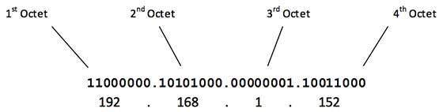

The 32 binary bits are broken into four octets (1 octet = 8 bits). Each octet is converted to decimal and separated by a period (dot). For this reason, an IP address is said to be expressed in dotted decimal format.

**Here is how binary octets convert to decimal:** The right most bit, or least significant bit, of an octet holds a value of 2^0. The bit just to the left of that holds a value of 2^1. This continues until the left-most bit, or most significant bit, which holds a value of 2^7. So if all binary bits are a one, the decimal equivalent would be 255 as shown here:

> ```
>     1  1  1  1 1 1 1 1
>   128 64 32 16 8 4 2 1 (128+64+32+16+8+4+2+1=255)
> ```

Here is a sample octet conversion when not all of the bits are set to 1.

> ```
>   0  1 0 0 0 0 0 1
>   0 64 0 0 0 0 0 1 (0+64+0+0+0+0+0+1=65)
> ```

And this sample shows an IP address represented in both binary and decimal.

> ```
>         10.       1.      23.      19 (decimal)
>   00001010.00000001.00010111.00010011 (binary)
> ```


The maximum value of a 32-bit number is 232, or 4,294,967,296. So the maximum number of IPv4 addresses, which is called its address space, is about 4.3 billion. In the 1980s, this was sufficient to address every networked device, but scientists knew that this space would quickly become exhausted.&#x20;

> Technologies such as NAT have delayed the problem by allowing many devices to use a single IP address, but a larger address space is needed to serve the modern Internet.

### IPv6

A major advantage of IPv6 is that it uses 128 bits of data to store an address, permitting 2128 unique addresses, or 340,282,366,920,938,463,463,374,607,431,768,211,456. The size of IPv6's address space — 340 duodecillion — is much, much larger than IPv4.

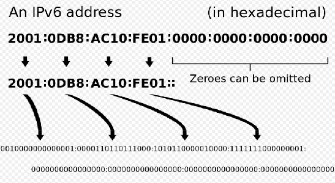

#### IP address classes

With an IPv4 IP address, there are five classes of available IP ranges: Class A, Class B, Class C, Class D and Class E, while only A, B, and C are commonly used.

#### subnetmask

Within an Internet Protocol or IP network, every connected host must have both an IP host address and a subnet mask to operate properly. Any device using the IP protocol can refer to itself with the IP address 127.0.0.1 and subnet mask 255.0.0.0, but to communicate with other devices on the network, each device must have  a (private or public) IP address and subnet mask.

&#x20;netmask  is a 32-bit binary which bounds that IP class to have prefixed number of Networks and prefixed number of Hosts per network.

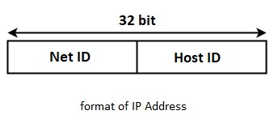

* Netid: The part of an IP address that identifies the network.&#x20;
* Hostid: The part of an IP address that identifies a host in a network.

The netid and hostid are of varying lengths, depending on the class of the address.

&#x20;Each IP class is equipped with its own default subnet mask (netmask) and  allows for a range of valid IP addresses, shown in the following table:

| Class       | Address range                | subnetmask    | Supports                                                       |
| ----------- | ---------------------------- | ------------- | -------------------------------------------------------------- |
| **Class A** | 1.0.0.1 to 126.255.255.254   | 255.0.0.0     | Supports 16 million hosts on each of 127 networks.             |
| **Class B** | 128.1.0.1 to 191.255.255.254 | 255.255.0.0   | Supports 65,000 hosts on each of 16,000 networks.              |
| **Class C** | 192.0.1.1 to 223.255.254.254 | 255.255.255.0 | Supports 254 hosts on each of 2 million networks.              |
| **Class D** | 224.0.0.0 to 239.255.255.255 | N/A           | Reserved for multicast groups.                                 |
| **Class E** | 240.0.0.0 to 254.255.255.254 | N/A           | Reserved for future use, or research and development purposes. |

> &#x20;Ranges 127.x.x.x are reserved for the loopback or localhost, for example, **127.0.0.1** is the loopback address. Range **255.255.255.255** broadcasts to all hosts on the local network.


**Private  IPs**

The Internet Assigned Numbers Authority (IANA) has assigned several address ranges to be used by private networks.

Address ranges to be use by private networks are:

* Class A: `10.0.0.0` to `10.255.255.255`
* Class B: `172.16.0.0` to `172.31.255.255`
* Class C: `192.168.0.0` to `192.168.255.255`

Any private network that needs to use IP addresses internally can use any address within these ranges without any coordination. Addresses within this private address space are only unique within a given private network.


Classful IP addressing does not provide any flexibility of having less number of Hosts per Network or more Networks per IP Class, where subnetting comes to play.

### subnetting

The process of  deviding an IP Class into  smaller blocks, or groups of IPs, known as subnetting.&#x20;

Subnetting can improve security and help to balance overall network traffic.&#x20;


**CIDR**

CIDR **** or **Classless Inter Domain Routing** is based on subnetting concept.CIDR and subnetting are virtually the same thing. The term Subnetting is generally used when you use it at the organizational level. CIDR is generally used when you it at the ISP level or higher.


**How subnetting works ?**subnetting is a bitwise operation on a network of ip addresses which take place using netmask (subnetmask).

&#x20;it provides the flexibility of borrowing bits of Host part of the IP address and using them as Network in Network, called Subnet. By using subnetting, one single Class A IP address can be used to have smaller sub-networks which provides better network management capabilities.

*   **Class A Subnets**

    In Class A, only the first octet is used as Network identifier and rest of three octets are used to be assigned to Hosts (i.e. 16777214 Hosts per Network). To make more subnet in Class A, bits from Host part are borrowed and the subnet mask is changed accordingly.

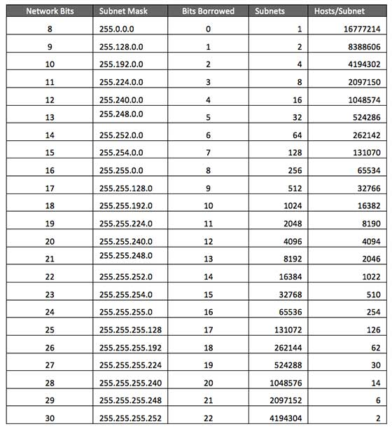

*   **Class B Subnets**

    By default, using Classful Networking, 14 bits are used as Network bits providing (2^14) 16384 Networks and ((2^16)-2) 65534 Hosts. Class B IP Addresses can be subnetted the same way as Class A addresses, by borrowing bits from Host bits. Below is given all possible combination of Class B subnetting.

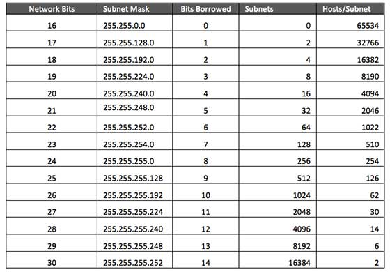

*   **Class C Subnets**

    Class C IP addresses are normally assigned to a very small size network because it can only have 254 hosts in a network. Given below is a list of all possible combination of subnetted Class B IP address

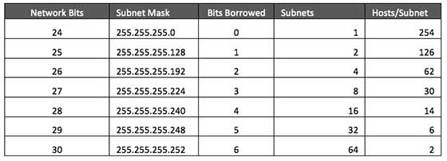

## Communication Protocols

A network protocol defines the rules and procedures in which data communication occurs between devices over a network. Without predefined rules or procedures, the messages traversing a network would be without any particular formatting and may not be meaningful to the receipt device.


**OSI model :**OSI (Open Systems Interconnection) model was created by the International Organization for Standardization (ISO), an international standard-setting body. It was designed to be a reference model for describing the functions of a communication system. The OSI model has seven layers.

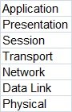

**TCP/IP model :**The TCP/IP model was created in the 1970s by the Defense Advance Research Project Agency (DARPA) as an open, vendor-neutral, public networking model. Just like the OSI model, it describes general guidelines for designing and implementing computer protocols. It consists of four layers.


comparison between the TCP/IP model and OSI model:

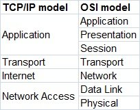


let’s discuss some of the popular protocols (ITCP/UDP/ICMP) and their respective port numbers :

### TCP

&#x20;Transmission Control Protocol (TCP)  is a **connection-oriented** protocol which operates are the Transport Layer of both the (OSI) reference model and the (TCP/IP) protocol stack. It is designed to provide reliable transportation of the datagrams over a network. It provides reassurance by initializing a 3-way handshake before communicating data between the sender the receiver.

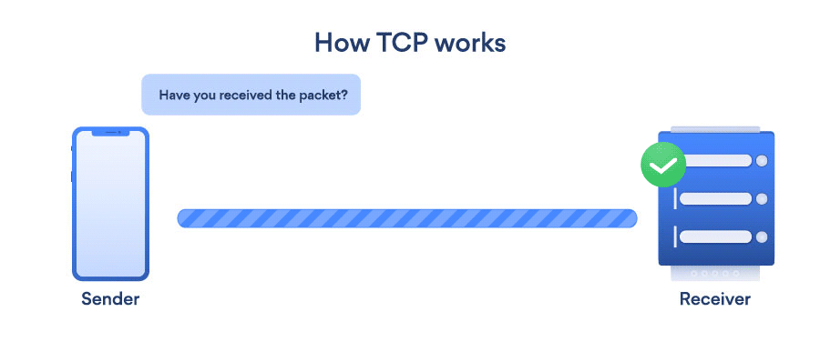

### UPD

&#x20;User Datagram Protocol (UDP),  is a connectionless protocol. This protocol also operates at the Transport Layer of both the (OSI) reference model and the (TCP/IP) protocol stack. However, unlike Transmission Control Protocol (TCP), the User Datagram Protocol (UDP) does not provide any guarantee or reassurance of the delivery of datagrams across a network. Not all protocols at the Application Layer uses TCP, there are many Layer 7 protocols which uses the User Datagram Protocol (UDP).

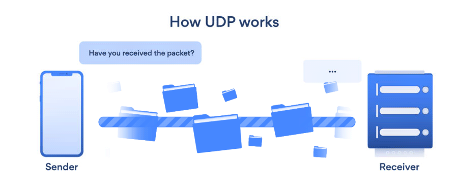

#### Comparison of TCP and UDP

| tcp                                                              | UDP                                                                       |
| ---------------------------------------------------------------- | ------------------------------------------------------------------------- |
| Reliable                                                         | Very fast in delivery of data                                             |
| Uses Acknowledgments to confirm receipt of data                  | Very low overhead on the network                                          |
| Re-sends data of any of the packets are lost during transmission | Does not require any acknowledgment packets                               |
| Delivers the data in sequential order and handles reassembly     | If packets are lost during transmission, it does not resend any lost data |
| Applications: HTTP, FTP, SMTP, Telnet.                           | Applications: DHCP, DNS, SNMP, TFTP, VoIP, IPTV.                          |

### ICMP

On a network, whether on a Local Area Network (LAN) or a Wide Area Network (WAN), host devices will be communicating to exchange data and information between each other and sometimes an error can occur.

&#x20;Internet Control Message Protocol (ICMP)  is typically used to provide error reporting on a network. There are many types of Internet Control Message Protocol (ICMP) messages which provide different actions and give feedback if an error occurs, and also the issue which exists. A good example of  using ICMP Protocol is ping command:

```
root@ubuntu16-1:~# ping google.com -c 3
PING google.com (172.217.18.142) 56(84) bytes of data.
64 bytes from arn02s05-in-f142.1e100.net (172.217.18.142): icmp_seq=1 ttl=128 time=141 ms
64 bytes from arn02s05-in-f142.1e100.net (172.217.18.142): icmp_seq=2 ttl=128 time=95.8 ms
64 bytes from arn02s05-in-f142.1e100.net (172.217.18.142): icmp_seq=3 ttl=128 time=95.7 ms

--- google.com ping statistics ---
3 packets transmitted, 3 received, 0% packet loss, time 6251ms
rtt min/avg/max/mdev = 95.746/110.869/141.042/21.337 ms
```

#### Ports

As we said on a TCP/IP network every device must have an IP address.The IP address identifies the device e.g. computer. However an IP address alone is not sufficient for running network applications, as a computer can run multiple applications and/or services.

Just as the IP address identifies the computer, The network port identifies the application or service running on the computer. The use of ports allow computers/devices to run multiple services/applications.

The diagram below shows a computer to computer connection and identifies the IP addresses and ports:

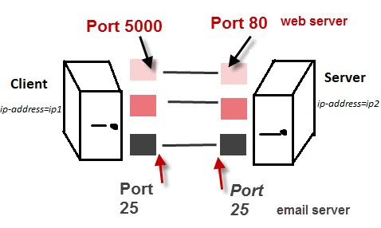

The default port of some protocols are as follow. These are very important and most admins know them:

| port    | usage                       |
| ------- | --------------------------- |
| 20,21   | FTP (One data, one control) |
| 22      | ssh                         |
| 23      | telnet                      |
| 25      | SMTP                        |
| 53      | DNS                         |
| 80      | HTTP                        |
| 110     | POP3                        |
| 123     | ntp                         |
| 139     | NetBIOS                     |
| 143     | IMAP                        |
| 161,162 | SNMP                        |
| 389     | ldap                        |
| 443     | https                       |
| 465     | SMTPS                       |
| 636     | ldaps                       |
| 993     | IMAPS                       |
| 995     | POP3S                       |

> all ports above 400 ends with S, which stands for Secure

### /etc/services

The /etc/services file contains information regarding the known services available in the  Internet. For each service, a single line should be present with the following information:&#x20;

`official_service_name   port_number/protocol_name    aliases`

```
root@ubuntu16-1:~# cat  /etc/services 
# Network services, Internet style
#
# Note that it is presently the policy of IANA to assign a single well-known
# port number for both TCP and UDP; hence, officially ports have two entries
# even if the protocol doesn't support UDP operations.
#
# Updated from http://www.iana.org/assignments/port-numbers and other
# sources like http://www.freebsd.org/cgi/cvsweb.cgi/src/etc/services .
# New ports will be added on request if they have been officially assigned
# by IANA and used in the real-world or are needed by a debian package.
# If you need a huge list of used numbers please install the nmap package.

tcpmux		1/tcp				# TCP port service multiplexer
echo		7/tcp
echo		7/udp
discard		9/tcp		sink null
discard		9/udp		sink null
systat		11/tcp		users
daytime		13/tcp
daytime		13/udp
netstat		15/tcp
qotd		17/tcp		quote
msp		18/tcp				# message send protocol
msp		18/udp
chargen		19/tcp		ttytst source
chargen		19/udp		ttytst source
ftp-data	20/tcp
ftp		21/tcp
fsp		21/udp		fspd
ssh		22/tcp				# SSH Remote Login Protocol
ssh		22/udp
telnet		23/tcp
smtp		25/tcp		mail
...
```

and so on .... .&#x20;

.

.

.

[https://www.computerhope.com/jargon/i/ip.htm](https://www.computerhope.com/jargon/i/ip.htm)

[https://www.cisco.com/c/en/us/support/docs/ip/routing-information-protocol-rip/13788-3.html](https://www.cisco.com/c/en/us/support/docs/ip/routing-information-protocol-rip/13788-3.html)

[https://itstillworks.com/calculate-host-id-7542379.html](https://itstillworks.com/calculate-host-id-7542379.html)

[https://www.computerhope.com/jargon/n/netmask.htm](https://www.computerhope.com/jargon/n/netmask.htm)

[http://compunetworx.blogspot.com/2013/01/difference-between-hostid-and-netid-in.html](http://compunetworx.blogspot.com/2013/01/difference-between-hostid-and-netid-in.html)

[https://www.computerhope.com/jargon/s/subnetma.htm](https://www.computerhope.com/jargon/s/subnetma.htm)

[https://www.ibm.com/support/knowledgecenter/en/SSSHRK\_4.2.0/disco/concept/dsc\_private\_addr\_ranges.html](https://www.ibm.com/support/knowledgecenter/en/SSSHRK\_4.2.0/disco/concept/dsc\_private\_addr\_ranges.html)

[https://en.wikipedia.org/wiki/IPv6\_address#/media/File:Ipv6\_address\_leading\_zeros.svg](https://en.wikipedia.org/wiki/IPv6\_address#/media/File:Ipv6\_address\_leading\_zeros.svg)

[https://www.tutorialspoint.com/ipv4/ipv4\_subnetting.htm](https://www.tutorialspoint.com/ipv4/ipv4\_subnetting.htm)

[http://www.itgeared.com/articles/1347-cidr-and-subnetting-tutorial/](http://www.itgeared.com/articles/1347-cidr-and-subnetting-tutorial/)

[http://www.steves-internet-guide.com/tcpip-ports-sockets/](http://www.steves-internet-guide.com/tcpip-ports-sockets/)

[https://hub.packtpub.com/understanding-network-port-numbers-tcp-udp-and-icmp-on-an-operating-system/](https://hub.packtpub.com/understanding-network-port-numbers-tcp-udp-and-icmp-on-an-operating-system/)

[https://study-ccna.com/osi-tcp-ip-models/](https://study-ccna.com/osi-tcp-ip-models/)

[https://www.inetdaemon.com/tutorials/internet/tcp/3-way\_handshake.shtml](https://www.inetdaemon.com/tutorials/internet/tcp/3-way\_handshake.shtml)

[https://nordvpn.com/blog/tcp-or-udp-which-is-better/](https://nordvpn.com/blog/tcp-or-udp-which-is-better/)

[http://www.qnx.com/developers/docs/6.5.0/index.jsp?topic=%2Fcom.qnx.doc.neutrino\_utilities%2Fs%2Fservices.html](http://www.qnx.com/developers/docs/6.5.0/index.jsp?topic=%2Fcom.qnx.doc.neutrino\_utilities%2Fs%2Fservices.html)

Cisco got you here? [https://www.pcwdld.com/cisco-commands-cheat-sheet](https://www.pcwdld.com/cisco-commands-cheat-sheet)

.
