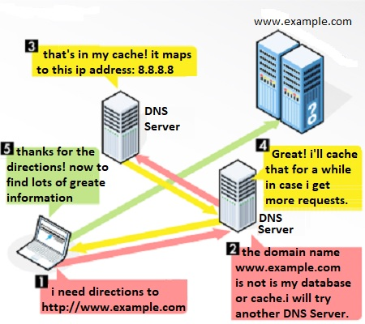

# 109.4. Configure client side DNS

**Weight**: 2

**Description:** Candidates should be able to configure DNS on a client host.

**Key Knowledge Areas:**

* Query remote DNS servers
* Configure local name resolution and use remote DNS servers
* Modify the order in which name resolution is done

**Terms and Utilities:**

* /etc/hosts
* /etc/resolv.conf
* /etc/nsswitch.conf
* host
* dig
* getent

We have seen all of these topics in previous lessons, so in this lesson first  we take a quick look at them and then we will talk about steps of Name Resolution on client side.

#### DNS

The DNS (Domain Name System) resolves the names of internet sites with their underlying IP addresses .



#### Query remote DNS servers

### dig

Dig (Domain Information Groper) is a powerful command-line tool for querying DNS name servers. It is the most commonly used tool among system administrators for troubleshooting DNS problems because of its flexibility and ease of use.

In its simplest form, when used to query a single host (domain) without any additional options, the `dig` command is pretty verbose.

```
root@ubuntu16-1:~# dig lpi.org

; <<>> DiG 9.10.3-P4-Ubuntu <<>> lpi.org
;; global options: +cmd
;; Got answer:
;; ->>HEADER<<- opcode: QUERY, status: NOERROR, id: 23520
;; flags: qr rd ra; QUERY: 1, ANSWER: 1, AUTHORITY: 0, ADDITIONAL: 1

;; OPT PSEUDOSECTION:
; EDNS: version: 0, flags:; udp: 512
;; QUESTION SECTION:
;lpi.org.			IN	A

;; ANSWER SECTION:
lpi.org.		599	IN	A	65.39.134.165

;; Query time: 501 msec
;; SERVER: 8.8.8.8#53(8.8.8.8)
;; WHEN: Sat Feb 29 17:16:01 +0330 2020
;; MSG SIZE  rcvd: 52
```

> don't forget, by default, dig sends the DNS query to name servers listed in the resolver(/etc/resolv.conf), how ever, we can query different DNS server usnig @.

### host

the host command is a DNS lookup utility, finding the IP address of a domain name. It also performs reverse lookups, finding the domain name associated with an IP address.

```
root@ubuntu16-1:~# host yahoo.com
yahoo.com has address 72.30.35.10
yahoo.com has address 98.137.246.7
yahoo.com has address 98.138.219.231
yahoo.com has address 98.138.219.232
yahoo.com has address 98.137.246.8
yahoo.com has address 72.30.35.9
yahoo.com has IPv6 address 2001:4998:c:1023::4
yahoo.com has IPv6 address 2001:4998:58:1836::10
yahoo.com has IPv6 address 2001:4998:44:41d::4
yahoo.com has IPv6 address 2001:4998:58:1836::11
yahoo.com has IPv6 address 2001:4998:44:41d::3
yahoo.com has IPv6 address 2001:4998:c:1023::5
yahoo.com mail is handled by 1 mta6.am0.yahoodns.net.
yahoo.com mail is handled by 1 mta7.am0.yahoodns.net.
yahoo.com mail is handled by 1 mta5.am0.yahoodns.net.
```

 And vica-versa To find out the hostname of the host with the IP address**:**

```
root@ubuntu16-1:~# host 72.30.35.10
10.35.30.72.in-addr.arpa domain name pointer media-router-fp2.prod1.media.vip.bf1.yahoo.com.
```

> If no arguments or options are given, _host_ prints a short summary of its command line arguments and options:

#### Client Name Resolution 

When client  wants to access any other computers in the  network, first it needs to know about target  ip address. There are different places inside os which keeps information, lets review them togther :

### /etc/host

If we  don’t want to use a DNS server for name resolution, we  can use the **/etc/hosts** file for the purpose of name resolution. This is a simple text file that contains IP addresses to hostnames mappings. Each line consists of an IP address, followed by one or more hostnames(ubuntu16):

```
root@ubuntu16-1:~# cat /etc/hosts
127.0.0.1	localhost
127.0.1.1	ybyntu16-1

# The following lines are desirable for IPv6 capable hosts
::1     ip6-localhost ip6-loopback
fe00::0 ip6-localnet
ff00::0 ip6-mcastprefix
ff02::1 ip6-allnodes
ff02::2 ip6-allrouters
```

you can see the typical default content of the **hosts** file that contains entries for the loopback addresses. To set up our own mappings, add the entries in the form of **`IP_ADDRESS HOSTNAME `**:

```
root@ubuntu16-1:~# ping thisismyexample.com
ping: unknown host thisismyexample.com

root@ubuntu16-1:~# vim /etc/hosts
root@ubuntu16-1:~# 
root@ubuntu16-1:~# cat /etc/hosts
127.0.0.1	localhost
127.0.1.1	ybyntu16-1

# The following lines are desirable for IPv6 capable hosts
::1     ip6-localhost ip6-loopback
fe00::0 ip6-localnet
ff00::0 ip6-mcastprefix
ff02::1 ip6-allnodes
ff02::2 ip6-allrouters

# this is my example:
172.217.164.238 thisismyexample
```

The line **`172.217.164.238 thisismyexample.com` ** will map the IP address of **172.217.164.238** to the **thisismyexample.com** hostname . We can now use the **thisismyexample** hostname to communicate with the remote machine:

```
root@ubuntu16-1:~# ping thisismyexample -c3
PING thisismyexample (172.217.164.238) 56(84) bytes of data.
64 bytes from thisismyexample (172.217.164.238): icmp_seq=1 ttl=63 time=281 ms
64 bytes from thisismyexample (172.217.164.238): icmp_seq=2 ttl=63 time=324 ms
64 bytes from thisismyexample (172.217.164.238): icmp_seq=3 ttl=63 time=262 ms

--- thisismyexample ping statistics ---
3 packets transmitted, 3 received, 0% packet loss, time 2002ms
rtt min/avg/max/mdev = 262.673/289.474/324.462/25.881 ms

```

### /etc/resolv.conf

/etc/resolv.conf contain information about current system DNS  server. Altough we can manually modify it  but don't forget our settings would not be permanent in last until next reboot. 

```
root@ubuntu16-1:~# cat /etc/resolv.conf 
# Dynamic resolv.conf(5) file for glibc resolver(3) generated by resolvconf(8)
#     DO NOT EDIT THIS FILE BY HAND -- YOUR CHANGES WILL BE OVERWRITTEN
nameserver 8.8.8.8
nameserver 4.2.2.4
search mydomain.local
```

### /etc/nsswitch

The /etc/nsswitch.conf file defines the order in which to contact different name services. For Internet use, it is important that _dns_ shows up in the "hosts" line:

```
root@ubuntu16-1:~# cat /etc/nsswitch.conf | grep hosts
hosts:          files mdns4_minimal [NOTFOUND=return] dns
```

The hosts  line specifies the order in which various name resolution services will be tried. The default is to:

* `files` reads `/etc/hosts`
* `mdns4_minimal` resolves IPv4 addresses with multicast DNS ONLY if the requested hostname ends with `.local`.
* `[NOTFOUND=return]` stops the resolving process if that `.local` hostname was not found
* `dns` probably does DNS resolution

> you can change the the order of name resolution here.

### getent

As we said  **getent** is a Linux command that helps the user to get the entries in a number of important text files called databases. This includes the _passwd _and _the group _of databases which stores the user information. The fact is that The **getent** command displays entries from databases supported by the Name Service Switch libraries, which are configured in /etc/nsswitch.conf. 

```
root@ubuntu16-1:~# getent hosts thisismyexample
172.217.164.238 thisismyexample
```

.

.

.

[https://www.networkworld.com/article/3268449/what-is-dns-and-how-does-it-work.html](https://www.networkworld.com/article/3268449/what-is-dns-and-how-does-it-work.html)

[https://computer.howstuffworks.com/dns3.htm](https://computer.howstuffworks.com/dns3.htm)

[https://linuxize.com/post/how-to-use-dig-command-to-query-dns-in-linux/](https://linuxize.com/post/how-to-use-dig-command-to-query-dns-in-linux/)

****[https://www.computerhope.com/unix/host.htm](https://www.computerhope.com/unix/host.htm)

[https://www.geeksforgeeks.org/host-command-in-linux-with-examples/](https://www.geeksforgeeks.org/host-command-in-linux-with-examples/)

[https://geek-university.com/linux/etc-hosts-file/](https://geek-university.com/linux/etc-hosts-file/)

[https://www.shellhacks.com/setup-dns-resolution-resolvconf-example/](https://www.shellhacks.com/setup-dns-resolution-resolvconf-example/)[https://www.linuxtopia.org/online_books/introduction_to_linux/linux\_\_etc_nsswitch.conf.html](https://www.linuxtopia.org/online_books/introduction_to_linux/linux\_\_etc_nsswitch.conf.html)[https://www.reddit.com/r/linuxquestions/comments/co02ui/hosts_and_mdns_configuration_in_etcnsswitchconf/](https://www.reddit.com/r/linuxquestions/comments/co02ui/hosts_and_mdns_configuration_in_etcnsswitchconf/)

[https://ubuntuforums.org/showthread.php?t=971693](https://ubuntuforums.org/showthread.php?t=971693)

[https://www.geeksforgeeks.org/getent-command-in-linux-with-examples/](https://www.geeksforgeeks.org/getent-command-in-linux-with-examples/)

[https://linux.die.net/man/1/getent](https://linux.die.net/man/1/getent)

.
