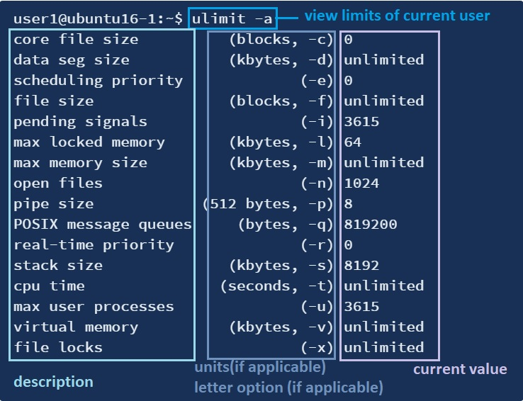

# 110.1. Perform security administration tasks

## **110.1 Perform security administration tasks**

**Weight:** 3

**Description: **Candidates should know how to review system configuration to ensure host security in accordance with local security policies.

**Key Knowledge Areas:**

* Audit a system to find files with the suid/sgid bit set
* Set or change user passwords and password aging information
* Being able to use nmap and netstat to discover open ports on a system
* Set up limits on user logins, processes and memory usage
* Determine which users have logged in to the system or are currently logged in
* Basic sudo configuration and usage

**Terms and Utilities:**

* find
* passwd
* fuser
* lsof
* nmap
* chage
* netstat
* sudo
* /etc/sudoers
* su
* usermod
* ulimit
* who, w, last

In this lesson we just take a look at basic security audits. First we review several commands we have learned from the  security perspective and then get introduced to some other new commands.

## find suid/guid 

We have learned about suid/guid  when we talked about managing file permissions and owner ship, as a quick review see table bellow:

| access mode    | ** on file**                            | **on directory**                             |
| -------------- | --------------------------------------- | -------------------------------------------- |
| **SUID**       | executes with permissions of file owner | nothing                                      |
| **GUID**       | executes with the permissions of group  | new files have group membership of directory |
| **Sticky Bit** | nothing                                 | only owner can delete files                  |

There are some  security concerns while using suid/guid  such as, what will happen if a destructive program has suid/guid permission set on it?  Why should dangerous programs such as rm has suid permission? To search for all suid/guid files we use find command:

> sudo find / -perm -u+s
>
> sudo find / -perm -g+s

```
root@ubuntu16-1:~# find / -perm -u+s
/bin/ping
/bin/fusermount
/bin/ping6
/bin/mount
/bin/su
/bin/ntfs-3g
/bin/umount
find: ‘/run/user/1001/gvfs’: Permission denied
/usr/bin/chsh
/usr/bin/passwd
/usr/bin/gpasswd
/usr/bin/pkexec
/usr/bin/newgrp
/usr/bin/sudo
/usr/bin/chfn
/usr/lib/x86_64-linux-gnu/oxide-qt/chrome-sandbox
/usr/lib/snapd/snap-confine
/usr/lib/policykit-1/polkit-agent-helper-1
/usr/lib/eject/dmcrypt-get-device
/usr/lib/vmware-tools/bin64/vmware-user-suid-wrapper
/usr/lib/vmware-tools/bin32/vmware-user-suid-wrapper
/usr/lib/dbus-1.0/dbus-daemon-launch-helper
/usr/lib/openssh/ssh-keysign
/usr/lib/xorg/Xorg.wrap
/usr/sbin/pppd
...

root@ubuntu16-1:~# find / -perm -g+s
find: ‘/run/user/1001/gvfs’: Permission denied
/run/log/journal
/run/log/journal/b4f9fc6cf1ca4724b56e6e4235c77155
/usr/bin/wall
/usr/bin/crontab
/usr/bin/bsd-write
/usr/bin/chage
/usr/bin/expiry
/usr/bin/ssh-agent
/usr/bin/mlocate
/usr/share/ppd/custom
...
```

obviously going to each of these files and finding out what they do is beyond the scope of this course, but we should keep our eyes open to find if any of these don't make sense, like thing might be find in home directory of users. It is recommended to save this list for future  comparing and detecting new changes.

## looking for open ports

It is important to verify which ports are listening on the server’s network interfaces. Below are the different categories of ports:

1. **0-1023** – the Well Known Ports, also referred to as System Ports.
2. **1024-49151** – the Registered Ports, also known as User Ports.
3. **49152-65535** – the Dynamic Ports, also referred to as the Private Ports.

 We need to pay attention to open ports to detect an intrusion. Apart from an intrusion, for troubleshooting purposes, it may be necessary to check if a port is already in use by a different application on our servers. For example, we may install Apache and Nginx server on the same system!

 This section provides steps to use the netstat, lsof and nmap command to check the ports in use and view the application that is utilizing the port.

### netstat

 One of **netstat** command line tool usage is  for monitoring network  incoming and outgoing connections. By default, netstat displays a list of open sockets which is not very usefull so we usually use it along with `-tuna` switches.

| netstat switch | usage                                                                                     |
| -------------- | ----------------------------------------------------------------------------------------- |
| -t             | show tcp ports                                                                            |
| -u             | show udp ports                                                                            |
| -n             | Show numerical addresses instead of trying to determine symbolic host, port or user names |
| -a             | Show both listening and non-listening (for TCP this means established connections)        |

```
root@ubuntu16-1:~# netstat -tuna
Active Internet connections (servers and established)
Proto Recv-Q Send-Q Local Address           Foreign Address         State      
tcp        0      0 127.0.1.1:53            0.0.0.0:*               LISTEN     
tcp        0      0 0.0.0.0:22              0.0.0.0:*               LISTEN     
tcp        0      0 127.0.0.1:631           0.0.0.0:*               LISTEN     
tcp        0      0 0.0.0.0:445             0.0.0.0:*               LISTEN     
tcp        0      0 127.0.0.1:3306          0.0.0.0:*               LISTEN     
tcp        0      0 0.0.0.0:139             0.0.0.0:*               LISTEN     
tcp        0      0 192.168.52.144:41270    172.217.0.227:80        ESTABLISHED
tcp        0      0 192.168.52.144:43418    72.21.91.29:80          TIME_WAIT  
tcp        0      0 192.168.52.144:43416    72.21.91.29:80          TIME_WAIT  
tcp        0      0 127.0.0.1:631           127.0.0.1:52720         ESTABLISHED
...
udp        0      0 0.0.0.0:45821           0.0.0.0:*                          
udp    14400      0 0.0.0.0:51238           0.0.0.0:*                          
udp    11520      0 127.0.1.1:53            0.0.0.0:*                          
udp    10880      0 0.0.0.0:68              0.0.0.0:*                          
udp        0      0 0.0.0.0:631             0.0.0.0:*                          
udp    24576      0 192.168.52.255:137      0.0.0.0:*                          
udp        0      0 192.168.52.144:137      0.0.0.0:*                          
udp    52224      0 0.0.0.0:137             0.0.0.0:*                          
udp    34560      0 192.168.52.255:138      0.0.0.0:*                          
udp        0      0 192.168.52.144:138      0.0.0.0:*                          
udp     7680      0 0.0.0.0:138             0.0.0.0:*                          
udp     6144      0 0.0.0.0:5353            0.0.0.0:*                          
...
```

 Before a TCP connection can be opened, we need to have a **server** with a listener. The listener will listen on incoming connections on a specific port, This state is represented as` LISTEN`.  If everything worked properly,  the connection is marked as `ESTABLISHED `on both end-point.  In these tables `0.0.0.0` dictates _any address_ or _any interface_.

### lsof

 **lsof** meaning **‘LiSt Open Files’** is used to find out which files are open by which process. As we know, in Linux everything is a file, so we can even check the files that are opened by some network connections in the system using lsof command with -i switch, -i list all network connections:

```
root@ubuntu16-1:~# lsof -i
COMMAND     PID   USER   FD   TYPE DEVICE SIZE/OFF NODE NAME
avahi-dae   791  avahi   12u  IPv4  24139      0t0  UDP *:mdns 
avahi-dae   791  avahi   13u  IPv6  24140      0t0  UDP *:mdns 
avahi-dae   791  avahi   14u  IPv4  24141      0t0  UDP *:45821 
avahi-dae   791  avahi   15u  IPv6  24142      0t0  UDP *:57596 
mysqld      967  mysql   27u  IPv4  27331      0t0  TCP localhost:mysql (LISTEN)
sshd        979   root    3u  IPv4 468063      0t0  TCP *:ssh (LISTEN)
sshd        979   root    4u  IPv6 468070      0t0  TCP *:ssh (LISTEN)
nmbd       1745   root   16u  IPv4  31466      0t0  UDP *:netbios-ns 
nmbd       1745   root   17u  IPv4  31467      0t0  UDP *:netbios-dgm 
nmbd       1745   root   21u  IPv4 468314      0t0  UDP 192.168.52.136:netbios-ns 
nmbd       1745   root   24u  IPv4 468315      0t0  UDP 192.168.52.255:netbios-ns 
nmbd       1745   root   25u  IPv4 468316      0t0  UDP 192.168.52.136:netbios-dgm 
nmbd       1745   root   26u  IPv4 468317      0t0  UDP 192.168.52.255:netbios-dgm 
smbd       1761   root   34u  IPv6  31629      0t0  TCP *:microsoft-ds (LISTEN)
smbd       1761   root   35u  IPv6  31630      0t0  TCP *:netbios-ssn (LISTEN)
smbd       1761   root   36u  IPv4  31631      0t0  TCP *:microsoft-ds (LISTEN)
smbd       1761   root   37u  IPv4  31632      0t0  TCP *:netbios-ssn (LISTEN)
cupsd      3683   root   10u  IPv6  41942      0t0  TCP ip6-localhost:ipp (LISTEN)
cupsd      3683   root   11u  IPv4  41943      0t0  TCP localhost:ipp (LISTEN)
cups-brow  3685   root    8u  IPv4  41958      0t0  UDP *:ipp 
gvfsd-smb 14071  user1   13u  IPv4 465267      0t0  TCP 192.168.52.144:60122->192.168.52.144:netbios-ssn (ESTABLISHED)
gvfsd-smb 14071  user1   14u  IPv4 465449      0t0  TCP 192.168.52.144:60124->192.168.52.144:netbios-ssn (ESTABLISHED)
dnsmasq   14148 nobody    4u  IPv4 466564      0t0  UDP ubuntu:domain 
dnsmasq   14148 nobody    5u  IPv4 466565      0t0  TCP ubuntu:domain (LISTEN)
dnsmasq   14148 nobody   11u  IPv4 466600      0t0  UDP *:44999 
dhclient  14166   root    6u  IPv4 466685      0t0  UDP *:bootpc 
```

this command shows the command, PID, user running it and source and destination IP and tells of if this is a LISTENING or STABLISHED connection.

| lsof switch      | usage                                                 |
| ---------------- | ----------------------------------------------------- |
| -iTCP _or_ -iUDP | just show TCP or UDP Connections                      |
| -i 4 _or_ -i 6   | you can have IPv4 and IPv6 files displayed separately |
| -n               | Do not use DNS name                                   |
| -P               | do not convert port numbers to port names             |

 If we want  to check which process is using specific port , we can grep the output of any above commands or simply use the `fuser` command.

### fuser

The fuser command is a very smart utility used to find which process is using a file, a directory or a socket. 

The following command creates a tcp listener on port 8080:

```
root@ubuntu16-1:~# nc -l -p 8080

```

Since a tcp server is listening on port 8080, the fuser utility can be used to find the process which is using the server’s socket. The `-v `option is used to put the fuser utility in verbose mode and the `-n `option is used to select the tcp protocol as a name space:

```
root@ubuntu16-1:~# fuser -v -n tcp 8080
                     USER        PID ACCESS COMMAND
8080/tcp:            root      15663 F.... nc
```

By default, the fuser tool will look in both IPv6 and IPv4 sockets, but the default option can be changed with the -4 and -6 options. 

### nmap  

 The **Nmap** aka **Network Mapper** is an open source and a very versatile tool for Linux system/network administrators. **Nmap** is used for **exploring networks**, **perform security scans**, **network audit** and **finding open ports** on local or  remote machine.


Please note that scanning websites from Nmap is not legal, in some cases if you are trying to too much in deep then you will need written permissions from the owner of the website and the IP holder.


```
root@ubuntu16-1:~# nmap localhost

Starting Nmap 7.01 ( https://nmap.org ) at 2020-03-18 00:47 +0330
Nmap scan report for localhost (127.0.0.1)
Host is up (0.000025s latency).
Not shown: 995 closed ports
PORT     STATE SERVICE
22/tcp   open  ssh
139/tcp  open  netbios-ssn
445/tcp  open  microsoft-ds
631/tcp  open  ipp
3306/tcp open  mysql

Nmap done: 1 IP address (1 host up) scanned in 1.62 seconds
```

By **default**, **Nmap** scans the most common 1,000 ports for each protocol. 

| nmap Target selection     | Description                   |
| ------------------------- | ----------------------------- |
| nmap 192.168.10.151       | scan a single IP              |
| nmap scanme.nmap.org      | scan a host                   |
| nmap 192.168.10.150-155   | scan a range of IPs           |
| nmap 192.168.10.0/24      | scan a subnet                 |
| nmap -iL myserverlist.txt | scan targets from a text file |
| nmap -6 \[IP-V6-HERE]     | enables IP v6 scanning        |

nmap has lots of switches to gain more information about hosts.

| nmap switch   | usage                                          |
| ------------- | ---------------------------------------------- |
| -v            |  gives more detailed information               |
| -p_ \<port#>_ | scan for information regarding a specific port |
| -A            | discover the operating system information      |
| -O            | reveal further operating system information    |

## examine sudo configuration 

#### su vs sudo

sudo and su, the very important and mostly used commands in Linux. It is very important for a Linux user to understand these two to increase security and prevent unexpected things that a user may have to go through. Firstly we will see what these commands do then we’ll know the difference between both of them. So let’s get started.


before beginning, in some distributions like ubuntu the default root password is not set by default when you install a fresh os, so  set it using`sudo passwd root`command first.


### su

The Linux command ‘su’ is used to switch from one account to another. User will be prompted for the password of the user switching to.

```
user1@ubuntu16-1:~$ su payam
Password: 
payam@ubuntu16-1:/home/user1$ 
```

Users can also use su to switch to root account. If user types only ‘su’ without any option then It will be considered as root and user will be prompted to enter root user password.

```
payam@ubuntu16-1:/home/user1$ su 
Password: 
root@ubuntu16-1:/home/user1# pwd
/home/user1
root@ubuntu16-1:/home/user1# exit
exit
payam@ubuntu16-1:
```


**what's the difference between 'su' and 'su -' ? **

Well, difference is  environment variables. su - change environment, su don't. the su keeps the environment of the old/original user even after the switch to root has been made, while the su - creates a new environment (as dictated by the \~/.bashrc of the root user), similar to the case when you explicitly log in as root user from the log-in screen.

```
payam@ubuntu16-1:/home/user1$ su -
Password: 
root@ubuntu16-1:~# pwd
/root
```

plaese note that `-, -l, --login`switches are all the same.


### sudo

As we all know, Linux in many ways protects users’ computer being used for bad purposes by some nasty people around us. Using sudo is one of those good ways. Whenever a user tries to install, remove and change any piece of software, the user has to have the root privileges to perform such tasks. sudo, linux command is used to give such permissions to any particular command that a user wants to execute. sudo requires the user to enter user password to give system based permissions. For example user wants to update the operating system by passing command:

```
payam@ubuntu16-1:~$ apt-get update
Reading package lists... Done
W: chmod 0700 of directory /var/lib/apt/lists/partial failed - SetupAPTPartialDirectory (1: Operation not permitted)
E: Could not open lock file /var/lib/apt/lists/lock - open (13: Permission denied)
E: Unable to lock directory /var/lib/apt/lists/
W: Problem unlinking the file /var/cache/apt/pkgcache.bin - RemoveCaches (13: Permission denied)
W: Problem unlinking the file /var/cache/apt/srcpkgcache.bin - RemoveCaches (13: Permission denied)
```

This error is due to not having root privileges to the user ‘payam’. The root privileges can be required by passing sudo at the very beginning, like below:

```
payam@ubuntu16-1:~$ sudo apt-get update
[sudo] password for payam: 
Hit:1 http://ppa.launchpad.net/peek-developers/stable/ubuntu xenial InRelease                         
Hit:2 http://archive.ubuntu.com/ubuntu xenial InRelease
Get:3 http://archive.ubuntu.com/ubuntu xenial-updates InRelease [109 kB]
Get:4 http://archive.ubuntu.com/ubuntu xenial-backports InRelease [107 kB]
Get:5 http://archive.ubuntu.com/ubuntu xenial-security InRelease [109 kB]
0% [5 InRelease 240 B/109 kB 0%]
...
```

### /etc/sudoers

but how sudo knows who should has root permission? which command could be run under root privilages? sudo keeps its configurations in /etc/sudoers file:

```
root@ubuntu16-1:~# cat /etc/sudoers
#
# This file MUST be edited with the 'visudo' command as root.
#
# Please consider adding local content in /etc/sudoers.d/ instead of
# directly modifying this file.
#
# See the man page for details on how to write a sudoers file.
#
Defaults	env_reset
Defaults	mail_badpass
Defaults	secure_path="/usr/local/sbin:/usr/local/bin:/usr/sbin:/usr/bin:/sbin:/bin:/snap/bin"

# Host alias specification

# User alias specification

# Cmnd alias specification

# User privilege specification
root	ALL=(ALL:ALL) ALL

# Members of the admin group may gain root privileges
%admin ALL=(ALL) ALL

# Allow members of group sudo to execute any command
%sudo	ALL=(ALL:ALL) ALL

# See sudoers(5) for more information on "#include" directives:

#includedir /etc/sudoers.d
```

 The syntax specification for a rule in the `sudoers` file is:

> user (host)=(user:group) commands

the 3 important lines:  

* (root ALL=(ALL) ALL) just lets root do everything on any machine as any user. 
*  (%admin ALL=(ALL) ALL) lets anybody in the admin group run anything as any user. 
* %sudo ALL=(ALL:ALL) ALL all users in the sudo group have the privileges to run any command

> note:  In CentOS, the _**wheel **_**group **is often found instead of _**sudo **_**group**.


#### The difference between_ wheel/sudo_ group and _sudo_ user

In CentOS and Debian, a user belonging to the _wheel /sudo _group can execute _**su**_ and directly ascend to _root_. Meanwhile, a _sudo _user would have use the _sudo su _first. Essentially, there is no real difference except for the syntax used to _**become root**_, and users belonging to both groups can use the _sudo _command.


**How to edit `/etc/sudors` file ?** If you use a plain editor, mess up the syntax, and save... `sudo` will (probably) stop working, and, since `/etc/sudoers` is only modifiable by `root`, you're stuck! so we use **visudo **instead. **visudo** edits the `sudoers `file in a safe fashion, by doing two things:

* **visudo **checks the file syntax _before_ actually overwriting the `sudoers` file. 
* Additionally, **visudo** locks the`sudoers` file against multiple simultaneous edits. This locking is important if you need to ensure nobody else can mess up your carefully considered config changes.

## Managing system resources

Linux operating systems have the ability to limit the amount of various system resources available to a user process. These limitations include how many files a process can have open, how large of a file the user can create, and how much memory can be used by the different components of the process. **ulimit** is the command used to accomplish this.

### ulimit

The ulimit command provides control over the resources available to the shell and/or to processes started by it.

```
user1@ubuntu16-1:~$ ulimit 
unlimited
```

To get the report in details, add the “-a” flag at the end. This will print all the resource limits for the current user.



To set ulimit value on a parameter use the below command:

`ulimit -<letter Option> <NewValue>`

as an example lets put limits on file size in the current shell:

```
user1@ubuntu16-1:~$ ulimit -f 0

user1@ubuntu16-1:~$ ulimit -a | grep file
core file size          (blocks, -c) 0
file size               (blocks, -f) 0
open files                      (-n) 1024
file locks                      (-x) unlimited

user1@ubuntu16-1:~$ vim new.txt 
Vim: Caught deadly signal XFSZ
Vim: Finished.


File size limit exceeded (core dumped)
```

 For the ulimits to persists across reboots we need to set the ulimit values in the configuration file **/etc/security/limits.conf**. it is also used for system wide limits:

```
root@ubuntu16-1:~# cat /etc/security/limits.conf 
# /etc/security/limits.conf
#
#Each line describes a limit for a user in the form:
#
#<domain>        <type>  <item>  <value>
#
#Where:
#<domain> can be:
#        - a user name
#        - a group name, with @group syntax
#        - the wildcard *, for default entry
#        - the wildcard %, can be also used with %group syntax,
#                 for maxlogin limit
#        - NOTE: group and wildcard limits are not applied to root.
#          To apply a limit to the root user, <domain> must be
#          the literal username root.
#
#<type> can have the two values:
#        - "soft" for enforcing the soft limits
#        - "hard" for enforcing hard limits
#
#<item> can be one of the following:
#        - core - limits the core file size (KB)
#        - data - max data size (KB)
#        - fsize - maximum filesize (KB)
#        - memlock - max locked-in-memory address space (KB)
#        - nofile - max number of open files
#        - rss - max resident set size (KB)
#        - stack - max stack size (KB)
#        - cpu - max CPU time (MIN)
#        - nproc - max number of processes
#        - as - address space limit (KB)
#        - maxlogins - max number of logins for this user
#        - maxsyslogins - max number of logins on the system
#        - priority - the priority to run user process with
#        - locks - max number of file locks the user can hold
#        - sigpending - max number of pending signals
#        - msgqueue - max memory used by POSIX message queues (bytes)
#        - nice - max nice priority allowed to raise to values: [-20, 19]
#        - rtprio - max realtime priority
#        - chroot - change root to directory (Debian-specific)
#
#<domain>      <type>  <item>         <value>
#

#*               soft    core            0
#root            hard    core            100000
#*               hard    rss             10000
#@student        hard    nproc           20
#@faculty        soft    nproc           20
#@faculty        hard    nproc           50
#ftp             hard    nproc           0
#ftp             -       chroot          /ftp
#@student        -       maxlogins       4

# End of file
```

There are two types of limits: A **soft limit** is like a warning and **hard limit** is a real max limit. For example, following will prevent anyone in the faculty group from having more than 50 processes, and a warning will be given at 20 processes. 

note: soft limit cannot be higher than the hard limit.

> ulimits is a part of  pluggable authentication module(PAM) system  which will be discussed in lpic-2 book.

## checking the users in the system

As a system administrator, you may want to know who is on the system at any give point in time. You may also want to know what they are doing. In this article let us review 3 different methods to identify who is on your Linux system.

### w

 **w** command in Linux is used to show who is logged on and what they are doing. This command shows the information about the users currently on the machine and their processes.

```
root@ubuntu16-1:~# w
 01:24:45 up  4:33,  4 users,  load average: 0.00, 0.00, 0.00
USER     TTY      FROM             LOGIN@   IDLE   JCPU   PCPU WHAT
user1    tty7     :0               15:11   10:13m 40.45s  0.27s /sbin/upstart -
payam    pts/19   127.0.0.1        01:11   12:47   0.04s  0.04s -bash
user2    pts/21   127.0.0.1        01:24   13.00s  0.04s  0.04s -bash
root     pts/22   192.168.52.133   01:16    3:41   0.03s  0.03s -bash
```

The output of the w command contains the following columns:

1. The header shows, in this order, the current time, how long the system has been running, how many users are currently logged on, and the system load averages for the past 1, 5, and 15 minutes. 
2. The following entries are displayed for each user:

* `Name of the user`
* `User’s machine number or tty number`
* `Remote machine address`
* `User’s Login time`
* `Idle time (not usable time)`
* `Time used by all processes attached to the tty (JCPU time)`
* `Time used by the current process (PCPU time)`
* `Command currently getting executed by the users`

`w` has some options, try `w --help` to see them.

### who

The who command is used to get information about currently logged in user on to system.

```
root@ubuntu16-1:~# who
user1    tty7         2020-03-22 15:11 (:0)
payam    pts/19       2020-03-23 01:11 (127.0.0.1)
user2    pts/21       2020-03-23 01:24 (127.0.0.1)
root     pts/22       2020-03-23 01:16 (192.168.52.133)
```

The who command displays the following information for each user currently logged in to the system if no option is provided :

1. `Login name of the users`
2. `Terminal line numbers`
3. `Login time of the users in to system`
4. `Remote host name of the user`

who has lots of option try `who --help`.


w and who reads their information from /var/run/utmp file. This file contains information about the users who are currently logged onto the system.


so we need another command to get information about logged out people, and that is `last` .

### last

 The **last** command in Linux is used to display the list of all the users **logged in and out**.

```
root@ubuntu16-1:~# last
user2    pts/21       127.0.0.1        Mon Mar 23 01:24   still logged in
root     pts/22       192.168.52.133   Mon Mar 23 01:16   still logged in
user2    pts/21       127.0.0.1        Mon Mar 23 01:13 - 01:21  (00:08)
payam    pts/19       127.0.0.1        Mon Mar 23 01:11   still logged in

wtmp begins Mon Mar 23 01:11:58 2020
```

The output of this command contains the following columns:

1. `User name`
2. `Tty device number`
3. `Login date and time`
4. `Logout time`
5. `Total working time`


the last command uses /var/log/wtmp file to display listing of last logged in users. This file is like history for utmp file, i.e. it maintains the logs of all logged in and logged out users (in the past).



/var/log/btmp keeps track of failed login attempts. So try `last -f /var/log/btmp` to check last failed logins .


`last `also gives us information about latest system reboots, do not forget to take a look at `last --help`.

.

.

.

[https://www.cyberciti.biz/faq/unix-linux-check-if-port-is-in-use-command/](https://www.cyberciti.biz/faq/unix-linux-check-if-port-is-in-use-command/)

[https://www.tecmint.com/find-open-ports-in-linux/](https://www.tecmint.com/find-open-ports-in-linux/)

[https://blog.confirm.ch/tcp-connection-states/](https://blog.confirm.ch/tcp-connection-states/) (tcp 3-way handshake)

[https://jadi.gitbooks.io/lpic1/content/1101\_perform_security_administration_tasks.html](https://jadi.gitbooks.io/lpic1/content/1101\_perform_security_administration_tasks.html)

[https://www.geeksforgeeks.org/lsof-command-in-linux-with-examples/](https://www.geeksforgeeks.org/lsof-command-in-linux-with-examples/)

[https://www.cyberciti.biz/faq/how-to-check-open-ports-in-linux-using-the-cli/](https://www.cyberciti.biz/faq/how-to-check-open-ports-in-linux-using-the-cli/)

[https://linux.die.net/man/8/lsof](https://linux.die.net/man/8/lsof)

[https://www.digitalocean.com/community/tutorials/how-to-use-the-linux-fuser-command](https://www.digitalocean.com/community/tutorials/how-to-use-the-linux-fuser-command)

[https://www.tecmint.com/nmap-command-examples/](https://www.tecmint.com/nmap-command-examples/)

[https://www.tecmint.com/nmap-command-examples/](https://www.tecmint.com/nmap-command-examples/)

[https://phoenixnap.com/kb/nmap-command-linux-examples](https://phoenixnap.com/kb/nmap-command-linux-examples)

[https://www.linux.com/training-tutorials/how-use-sudo-and-su-commands-linux-introduction/](https://www.linux.com/training-tutorials/how-use-sudo-and-su-commands-linux-introduction/)

[https://superuser.com/questions/580568/any-differences-between-su-vs-su-beside-the-pathing](https://superuser.com/questions/580568/any-differences-between-su-vs-su-beside-the-pathing)

[https://www.howtoforge.com/tutorial/sudo-vs-su/](https://www.howtoforge.com/tutorial/sudo-vs-su/)

[https://help.ubuntu.com/community/Sudoers](https://help.ubuntu.com/community/Sudoers)

[https://www.hostinger.com/tutorials/sudo-and-the-sudoers-file/](https://www.hostinger.com/tutorials/sudo-and-the-sudoers-file/)

[https://support.hostway.com/hc/en-us/articles/115001509750-How-To-Install-and-Configure-Sudo](https://support.hostway.com/hc/en-us/articles/115001509750-How-To-Install-and-Configure-Sudo)

[https://unix.stackexchange.com/questions/27594/why-do-we-need-to-use-visudo-instead-of-directly-modifying-the-sudoers-file](https://unix.stackexchange.com/questions/27594/why-do-we-need-to-use-visudo-instead-of-directly-modifying-the-sudoers-file)

[https://www.computerhope.com/unix/visudo.htm](https://www.computerhope.com/unix/visudo.htm)

[https://www.thegeekdiary.com/understanding-etc-security-limits-conf-file-to-set-ulimit/](https://www.thegeekdiary.com/understanding-etc-security-limits-conf-file-to-set-ulimit/)

[http://geekswing.com/geek/quickie-tutorial-ulimit-soft-limits-hard-limits-soft-stack-hard-stack/](http://geekswing.com/geek/quickie-tutorial-ulimit-soft-limits-hard-limits-soft-stack-hard-stack/)

[https://gerardnico.com/os/linux/limits.conf](https://gerardnico.com/os/linux/limits.conf)

[https://www.thegeekstuff.com/2009/03/4-ways-to-identify-who-is-logged-in-on-your-linux-system/](https://www.thegeekstuff.com/2009/03/4-ways-to-identify-who-is-logged-in-on-your-linux-system/)

[https://www.geeksforgeeks.org/w-command-in-linux-with-examples/](https://www.geeksforgeeks.org/w-command-in-linux-with-examples/)

[https://www.geeksforgeeks.org/who-command-in-linux/](https://www.geeksforgeeks.org/who-command-in-linux/)

[https://www.geeksforgeeks.org/last-command-in-linux-with-examples/](https://www.geeksforgeeks.org/last-command-in-linux-with-examples/)

.
