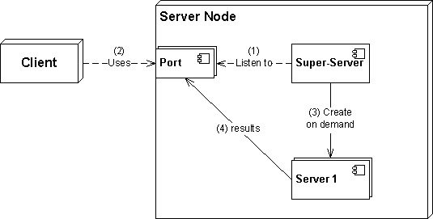

# 110.2. Setup host security

**Weight: **3

**Description: **Candidates should know how to set up a basic level of host security.

**Key Knowledge Areas:**

* Awareness of shadow passwords and how they work
* Turn off network services not in use
* Understand the role of TCP wrappers

**Terms and Utilities:**

* /etc/nologin
* /etc/passwd
* /etc/shadow
* /etc/xinetd.d/
* /etc/xinetd.conf
* /etc/inetd.d/
* /etc/inetd.conf
* /etc/inittab
* /etc/init.d/
* /etc/hosts.allow
* /etc/hosts.deny

We have previously talked about /etc/passwd , /etc/nologin and /etc/shadow. So lets review them quickly:

### /etc/passwd

 **/etc/passwd** file stores essential information, which required during login. In other words, it stores user account information. The /etc/passwd is a plain text file.

```
root@ubuntu16-1:~# tail /etc/passwd
pulse:x:117:124:PulseAudio daemon,,,:/var/run/pulse:/bin/false
rtkit:x:118:126:RealtimeKit,,,:/proc:/bin/false
saned:x:119:127::/var/lib/saned:/bin/false
usbmux:x:120:46:usbmux daemon,,,:/var/lib/usbmux:/bin/false
payam:x:1000:1000:ubuntu16.04.3-1,,,:/home/payam:/bin/bash
user1:x:1001:1001::/home/user1:/bin/bash
sshd:x:121:65534::/var/run/sshd:/usr/sbin/nologin
mysql:x:122:129:MySQL Server,,,:/nonexistent:/bin/false
user3:x:1003:1003::/home/user3:
user2:x:1004:1004::/home/user2:/bin/bash
```

 Each line in /etc/passwd file represents an individual user account and contains following seven fields separated by colons (**:**)

1. Username or login name
2. Encrypted password
3. User ID
4. Group ID
5. User description
6. User’s home directory
7. User’s login shell

The /etc/passwd file should have general read permission as many command utilities use it to map user IDs to user names. However, write access to the /etc/passwd must only limit for the superuser/root account.

```
root@ubuntu16-1:~# ls -l /etc/passwd
-rw-r--r-- 1 root root 2470 Mar 23 01:24 /etc/passwd
```

as we said, in old days /etc/passwd  was a place that  all users information even the user's password, and it caused security issues . To solve the problem /etc/shadow was invented.  An x character indicates that encrypted password is stored in /etc/shadow file.

### /etc/shadow

The /etc/shadow file contains encrypted passwords, along with password- and account-expiration information.

```
root@ubuntu16-1:~# tail -5 /etc/shadow
user1:$6$c9PN.175$.t.CG0E0Gtr/trq4pqquSe1BemMjB6Zc3E0ExUOVufuTkPNe3BSRv3DyUuXFHPiAbEujzuSMCeMsCbpg8cV2j.:17749:0:99999:7:::
sshd:*:17749:0:99999:7:::
mysql:!:17867:0:99999:7:::
user3:$6$LPhxz61y$V0/HsC6SF6olabfoKuDKj3Gfm.wRVvbUI.GXWGJ2Icejs91ZQDgZHIAc153x4VYrJcg.oetNlwq.X7xxJIRDR0:18343:0:99999:7:::
user2:$6$sd2T1NDd$ihaP8mO7/rhSUFDccY3evqQqM/VwDVDYSQwZJstV6Dnjy3Me83faro6pk/Nb1GuvRqy8J66ZBHIGqIpIrzl5a0:18343:0:99999:7:::
```

 Each line in **/etc/shadow** file represents an individual user account and contains following nine fields separated by colons (**:**)

1. Username
2. Encrypted password
3. Date of last password change
4. Minimum required days between password changes
5. Maximum allowed days between password changes
6. Number of days in advance to display password expiration message
7. Number of days after password expiration to disable the account
8. Account expiration date
9. Reserve field

 Unlike **/etc/passwd** file, the **/etc/shadow** file is not world readable. It is readable only by the root user or super user. 

```
root@ubuntu16-1:~# ls -l /etc/shadow
-rw-r----- 1 root shadow 1704 Mar 23 01:23 /etc/shadow
```

### /etc/nologin

```
root@ubuntu16-1:~# cat /etc/nologin
cat: /etc/nologin: No such file or directory
```

 If the file /etc/nologin exists and is readable, login will allow access only to root. Other users will be shown the contents of this file and their logins will be refused. Delete this file and the users will be able to login again.

> /etc/nologin removed during reboot by shutdown script.

### turn off network services

 As an system administrator it is our task to find unnecessary running services and disable them in order to minimize security risks. Previously we learned different linux distributions use different initialization solutions when system boots up, so use appropriate commands based on your  service manager for disabling services:

| Linux Distro                        | service manager | command                                                                                                                                                |
| ----------------------------------- | --------------- | ------------------------------------------------------------------------------------------------------------------------------------------------------ |
| older linux systems (pre 2006)      | SysV            | <p><strong>chkconfig </strong><em>ServiceName</em> <strong>off</strong><br><strong>sysv-rc-conf</strong> <em>ServiceName</em> <strong>off</strong></p> |
| Ubuntu(2006-2019),CentOS(2011-2020) | Upstart         | **update-rc.d** _ServiceName _**remove**                                                                                                               |
| ubuntu(2015-????),CentOS(2014-????) | systemd         | **systemctl disable** _ServiceName_                                                                                                                    |

 Please note that these commands prevent the service from starting on system boot. But the package is still installed on the machine and we can run it if we need.

### super servers

In most other Unix systems, networking services are implemented as daemons. Each networking daemon responds to requests on a particular port. The Telnet service, for example, operates on port 23. For networking services to function properly, some process must be alive and listening on each corresponding port. There are two ways to offer TCP/IP services: 

* by running server applications standalone as a daemon 
* or by using the Internet **super server**

This **super-server** is a special daemon that listens to the ports of all the enabled networking services. When a request comes in from a particular port, the corresponding networking daemon is started, and the request is passed on to it for service.



There are two main benefits to this scheme. First, only the minimal set of needed daemons is active at all times, and therefore, no system resources are wasted. Second, there is a centralized mechanism for managing and monitoring network services.

The Disadvantages of Super Server is that Starting of the super server is time consuming, which increases the reaction time according to the availability of network service.


super servers are not being used anymore and most distributions use standalone services running on them.


### inetd , xinetd

There are two main internet super-servers available for Linux, inetd and xinetd. Though inetd used to be the standard super-server for most Linux distributions, it is gradually being replaced by xinetd, which contains more features. But because inetd contains fewer features than xinetd, it is also smaller and may be better for an embedded Linux system.

#### inetd configuration files

### /etc/inetd.conf

 The **/etc/inetd.conf** file is the default configuration file for the inetd daemon. This file enables you to specify the daemons to start by default and supply the arguments that correspond to the desired style of functioning for each daemon. Let's have a look at an example line from inetd.conf:

```
# File Transfer Protocol (FTP) server:
ftp     stream  tcp     nowait  root    /usr/sbin/tcpd  proftpd
```

### /etc/inetd.d/

/etc/inet.d directory contains the configuration files for each service managed by `inetd` and the names of the files correlate to the service.

#### xinetd configuration files

### /etc/xinetd.conf

 The `/etc/xinetd.conf` file contains general configuration settings which effect every service under `xinetd`'s control. It is read once when the `xinetd` service is started, so for configuration changes to take effect, the administrator must restart the `xinetd` service.  The following is a sample `/etc/xinetd.conf` file:

```
defaults
{
        instances               = 60
        log_type                = SYSLOG authpriv
        log_on_success          = HOST PID
        log_on_failure          = HOST
        cps                     = 25 30
}
includedir /etc/xinetd.d
```

### /etc/xinetd.d/

 The `/etc/xinetd.d/` directory contains the configuration files for each service managed by `xinetd` and the names of the files correlate to the service. As with `xinetd.conf`, this directory is read only when the `xinetd` service is started. To gain an understanding of how these files are structured, consider the `/etc/xinetd.d/telnet` file:

```
service telnet
{
        flags           = REUSE
        socket_type     = stream
        wait            = no
        user            = root
        server          = /usr/sbin/in.telnetd
        log_on_failure  += USERID
        disable         = yes
}
```

 For any changes to take effect, the administrator must restart the `xinetd` service.


 `/etc/services` file contains list of network services and ports mapped to them. `inetd` or `xinetd` looks at these details so that it can call particular program when packet hits respective port and demand for service.


### tcp wrappers

 As you can see in /etc/inetd.conf connections for most protocols are made through **tcpd**, instead of directly passing the connection to a service program. For example:

```
# File Transfer Protocol (FTP) server:
ftp     stream  tcp     nowait  root    /usr/sbin/tcpd  proftpd
```

 In this example ftp connections are passed through **tcpd**. **tcpd** logs the connection through syslog and allows for additional checks. One of the most used features of **tcpd** is host-based access control. A TCP Wrapper is a host-based networking access control list (ACL) system and used to filter network access to Internet.

### /etc/host.allow , /etc/host.deny

   When a network request reaches your server, TCP wrappers uses `hosts.allow` and `hosts.deny` (in that order) to determine if the client should be allowed to use a given service.

By default, these files are empty, all commented out, or do not exist. Thus, everything is allowed through the TCP wrappers layer and your system is left to rely on the firewall for full protection.

```
root@ubuntu16-1:~# cat /etc/hosts.allow 
# /etc/hosts.allow: list of hosts that are allowed to access the system.
#                   See the manual pages hosts_access(5) and hosts_options(5).
#
# Example:    ALL: LOCAL @some_netgroup
#             ALL: .foobar.edu EXCEPT terminalserver.foobar.edu
#
# If you're going to protect the portmapper use the name "rpcbind" for the
# daemon name. See rpcbind(8) and rpc.mountd(8) for further information.
#
```

```
root@ubuntu16-1:~# cat /etc/hosts.deny 
# /etc/hosts.deny: list of hosts that are _not_ allowed to access the system.
#                  See the manual pages hosts_access(5) and hosts_options(5).
#
# Example:    ALL: some.host.name, .some.domain
#             ALL EXCEPT in.fingerd: other.host.name, .other.domain
#
# If you're going to protect the portmapper use the name "rpcbind" for the
# daemon name. See rpcbind(8) and rpc.mountd(8) for further information.
#
# The PARANOID wildcard matches any host whose name does not match its
# address.
#
# You may wish to enable this to ensure any programs that don't
# validate looked up hostnames still leave understandable logs. In past
# versions of Debian this has been the default.
# ALL: PARANOID
```

Both files have one rule on each line of the following form:`service: hosts`

Hosts can be specified by hostname or IP address. The ALL keyword specifies all hosts or all services.

For  example, adding `  telnet 192.168.  `to `/etc/hosts.allow`  causes only  telnet connections  from 192.168.x.x ip range  accepted.

Adding the same line to `/etc/hosts.deny` causes telnet connections from 192.168.x.x ip range denied , but telnet connetions would be accepted from any other addresses.

> after changing these files, xinetd should be restarted

that's all.

.

.

.

.

[https://www.cyberciti.biz/faq/understanding-etcpasswd-file-format/](https://www.cyberciti.biz/faq/understanding-etcpasswd-file-format/)

[https://www.computernetworkingnotes.com/rhce-study-guide/etc-passwd-file-in-linux-explained-with-examples.html](https://www.computernetworkingnotes.com/rhce-study-guide/etc-passwd-file-in-linux-explained-with-examples.html)

[https://www.cyberciti.biz/faq/understanding-etcshadow-file/](https://www.cyberciti.biz/faq/understanding-etcshadow-file/)

[https://www.computernetworkingnotes.com/rhce-study-guide/etc-shadow-file-in-linux-explained-with-examples.html](https://www.computernetworkingnotes.com/rhce-study-guide/etc-shadow-file-in-linux-explained-with-examples.html)

[https://linux.die.net/man/5/nologin](https://linux.die.net/man/5/nologin)

[https://jadi.gitbooks.io/lpic1/content/1102\_setup_host_security.html](https://jadi.gitbooks.io/lpic1/content/1102\_setup_host_security.html)

[http://etutorials.org/Linux+systems/embedded+linux+systems/Chapter+10.+Setting+Up+Networking+Services/10.1+The+Internet+Super-Server/](http://etutorials.org/Linux+systems/embedded+linux+systems/Chapter+10.+Setting+Up+Networking+Services/10.1+The+Internet+Super-Server/)

[https://en.wikipedia.org/wiki/Super-server](https://en.wikipedia.org/wiki/Super-server)

[https://thecustomizewindows.com/2011/11/super-server-what-is-it-how-it-works/](https://thecustomizewindows.com/2011/11/super-server-what-is-it-how-it-works/)

[https://www.ibm.com/support/knowledgecenter/ssw_aix\_72/filesreference/inetd.conf.html](https://www.ibm.com/support/knowledgecenter/ssw_aix\_72/filesreference/inetd.conf.html)

[https://book.huihoo.com/slackware-linux-basics/html/inetd.html](https://book.huihoo.com/slackware-linux-basics/html/inetd.html)

[https://access.redhat.com/documentation/en-us/red_hat_enterprise_linux/4/html/reference_guide/s1-tcpwrappers-xinetd-config](https://access.redhat.com/documentation/en-us/red_hat_enterprise_linux/4/html/reference_guide/s1-tcpwrappers-xinetd-config)

[https://access.redhat.com/documentation/en-us/red_hat_enterprise_linux/4/html/reference_guide/s2-tcpwrappers-xinetd-config-files](https://access.redhat.com/documentation/en-us/red_hat_enterprise_linux/4/html/reference_guide/s2-tcpwrappers-xinetd-config-files)

[https://kerneltalks.com/linux/understanding-etc-services-file-in-linux/](https://kerneltalks.com/linux/understanding-etc-services-file-in-linux/)

[https://www.tecmint.com/secure-linux-tcp-wrappers-hosts-allow-deny-restrict-access/](https://www.tecmint.com/secure-linux-tcp-wrappers-hosts-allow-deny-restrict-access/)

.
