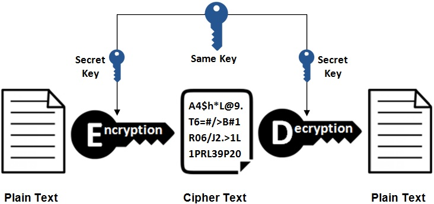
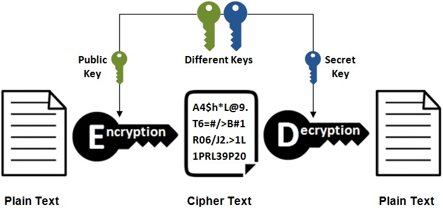
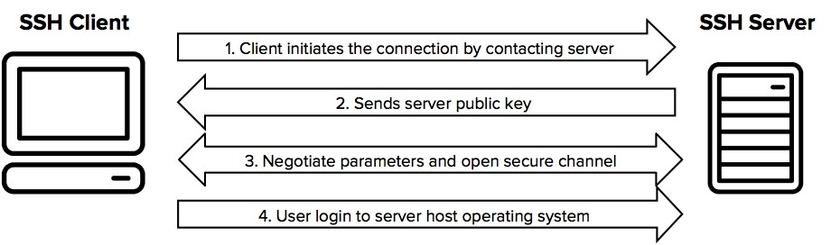
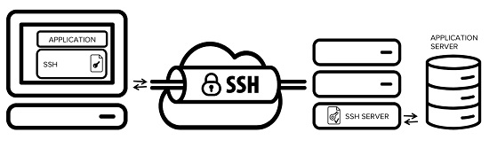
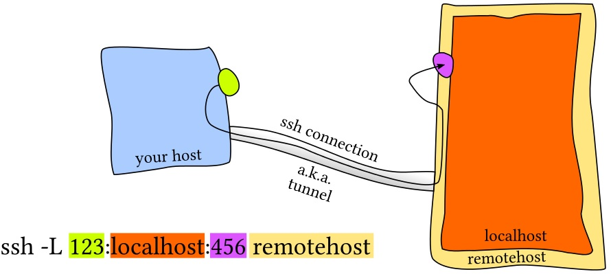
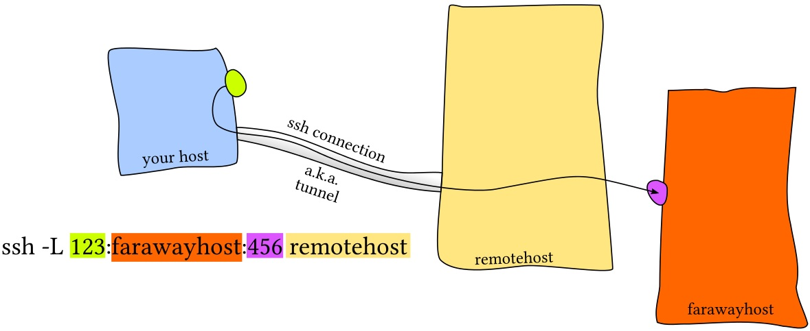
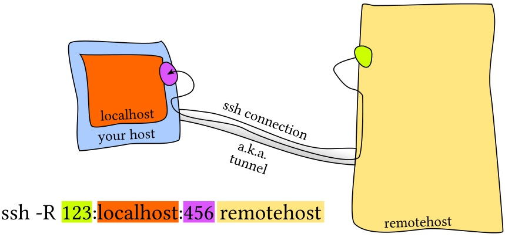
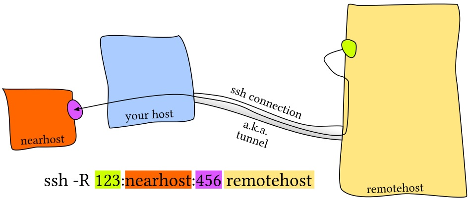

# 110.3. Securing data with encryption

**Weight:** 3

**Description:** The candidate should be able to use public key techniques to secure data and communication.

**Key Knowledge Areas:**

* Perform basic OpenSSH 2 client configuration and usage
* Understand the role of OpenSSH 2 server host keys
* Perform basic GnuPG configuration, usage and revocation
* Understand SSH port tunnels (including X11 tunnels)

**Terms and Utilities:**

* ssh
* ssh-keygen
* ssh-agent
* ssh-add
* \~/.ssh/id\_rsa and id\_rsa.pub
* \~/.ssh/id\_dsa and id\_dsa.pub
* /etc/ssh/ssh\_host\_rsa\_key and ssh\_host\_rsa\_key.pub
* /etc/ssh/ssh\_host\_dsa\_key and ssh\_host\_dsa\_key.pub
* \~/.ssh/authorized\_keys
* ssh\_known\_hosts
* gpg
* \~/.gnupg/

First lets start about some concepts.

## Cryptography

&#x20;Cryptography is a method of using advanced mathematical principles in storing and transmitting data in a particular form so that only those whom it is intended can read and process it. Encryption is a key concept in cryptography

* **Encryption** :In cryptography, encryption is the process of encoding a message or information in such a way that only authorized parties can access it and those who are not authorized cannot.
* **Decryption**: The conversion of encrypted data into its original form is called Decryption. It is generally a reverse process of encryption.

### Symmetric vs. asymmetric encryption

Encryption algorithms are often divided into two categories, known as symmetric and asymmetric encryption.

#### Symmetric Encryption



Symmetric encryption is the oldest and best-known technique. A secret key, which can be a number, a word, or just a string of random letters, is applied to the text of a message to change the content in a particular way. This might be as simple as shifting each letter by a number of places in the alphabet. As long as both sender and recipient know the secret key, they can encrypt and decrypt all messages that use this key.

#### Asymmetric Encryption

The problem with secret keys is exchanging them over the Internet or a large network while preventing them from falling into the wrong hands. Anyone who knows the secret key can decrypt the message. One answer is asymmetric encryption, in which there are two related keys--a key pair. A public key is made freely available to anyone who might want to send you a message. A second, private key is kept secret, so that only you know it.



Any message (text, binary files, or documents) that are encrypted by using the public key can only be decrypted by applying the same algorithm, but by using the matching private key. Any message that is encrypted by using the private key can only be decrypted by using the matching public key.\
\
This means that you do not have to worry about passing public keys over the Internet (the keys are supposed to be public).

> A problem with asymmetric encryption, however, is that it is slower than symmetric encryption. It requires far more processing power to both encrypt and decrypt the content of the message.


**encryption vs signing**

When encrypting, you use **their public key** to write a message and they use **their private key** to read it.

When signing, you use **your private key** to write message's signature, and they use **your public key** to check if it's really yours.



#### Whats is a key server?

Key server (cryptographic), a server on which public keys are stored for others to use


With that introduction lets talk about SSH.

## Whats is SSH?

The SSH protocol (also referred to as Secure Shell) is a method for secure remote login from one computer to another. It provides several alternative options for strong authentication, and it protects the communications security and integrity with strong encryption. It is a secure alternative to the non-protected login protocols (such as telnet, rlogin) and insecure file transfer methods (such as FTP).

Typical uses of the SSH protocol are:

* providing secure access for users and automated processes
* interactive and automated file transfers
* issuing remote commands
* managing network infrastructure and other mission-critical system components.

### How does the ssh protocol work?

The way SSH works is by making use of a client-server model to allow for authentication of two remote systems and encryption of the data that passes between them.

SSH operates on TCP port 22 by default (though this can be changed if needed). The host (server) listens on port 22 (or any other SSH assigned port) for incoming connections.

SSH provides multiple mechanisms for authenticating the server and the client. Two of the commonly used authentication mechanism are password based, and key based authentication. Although password based authentication is also secure, its advisable to use key based authentication instead.



the connection is established by the SSH client connecting to the SSH server. The SSH client drives the connection setup process and uses public key cryptography to verify the identity of the SSH server. After the setup phase the SSH protocol uses strong symmetric encryption and hashing algorithms to ensure the privacy and integrity of the data that is exchanged between the client and server.

### What is OpenSSH?

OpenSSH is a free, open source implementation of the SSH (Secure Shell) protocols. Open OpenSSH is so popular among system administrators because of its multi-platform capability and very useful nice features.


All communications and user credentials using OpenSSH are encrypted, they are also protected from man in the middle attacks. If a third party tries to intercept our connection, OpenSSH detects it and informs us about that.


We use Ubuntu16-1 as ssh server and Ubuntu16-2 as client.


#### /etc/ssh

OpenSSH has two different sets of configuration files: one for client programs (ssh, scp, and sftp) and one for the server daemon (sshd).

```
root@ubuntu16-1:~# ls -1 /etc/ssh
moduli
ssh_config
sshd_config
ssh_host_dsa_key
ssh_host_dsa_key.pub
ssh_host_ecdsa_key
ssh_host_ecdsa_key.pub
ssh_host_ed25519_key
ssh_host_ed25519_key.pub
ssh_host_rsa_key
ssh_host_rsa_key.pub
ssh_import_id
```

The`sshd_config`is the ssh **daemon**(or ssh server process) configuration file, Whereas, the `ssh_config` file is the ssh client configuration file. The client configuration file only has bearing on when you use the ssh command to connect to another ssh host . As you can see there are public keys and private keys here with different algorithems and they can be used by SSH to encrypt the session.

## ssh client configurations

Till now we have understood how ssh works. As we mentioned when ssh connection is started, the public key of ssh server is tranfered to the client(stored in ./ssh/known\_hosts) and the client will use it to continue negotiation with the server and user will be required to get authenticated by sending username and password.

Lets start by connecting toUbuntu16-1 from Ubuntu16-2 and see the keys:

```
user1@ubuntu16-2:~$ ssh user1@192.168.52.146
The authenticity of host '192.168.52.146 (192.168.52.146)' can't be established.
ECDSA key fingerprint is SHA256:GV/PpX9YGvMZTAbuz6w3zBDreokesZHhVSM1zrXmHLw.
Are you sure you want to continue connecting (yes/no)? yes
Warning: Permanently added '192.168.52.146' (ECDSA) to the list of known hosts.
user1@192.168.52.146's password: 
Welcome to Ubuntu 16.04.5 LTS (GNU/Linux 4.15.0-39-generic x86_64)

 * Documentation:  https://help.ubuntu.com
 * Management:     https://landscape.canonical.com
 * Support:        https://ubuntu.com/advantage

445 packages can be updated.
365 updates are security updates.

New release '18.04.4 LTS' available.
Run 'do-release-upgrade' to upgrade to it.

Last login: Fri Mar 27 15:51:55 2020 from 192.168.52.133
user1@ubuntu16-1:~$ 
```


**What is fingerprint ?** a public key fingerprint is a short sequence of bytes used to identify a longer public key. Fingerprints are created by applying a cryptographic hash function to a public key. Since fingerprints are shorter than the keys they refer to, they can be used to simplify certain key management tasks.


now lets compare the keys in server and client:

```
### server
user1@ubuntu16-1:~$ cat /etc/ssh/ssh_host_ecdsa_key.pub 
ecdsa-sha2-nistp256 AAAAE2VjZHNhLXNoYTItbmlzdHAyNTYAAAAIbmlzdHAyNTYAAABBBIjnKq9Wr0C2faQCf4+gcqPN4bOMFyx1nywTjLS/mh/S30V0r/mvy9cvfWvA2LY/y7zqxg+/gMvELQznikQiaTo= root@server1
```

```
### client
user1@ubuntu16-2:~$ tree .ssh/
.ssh/
└── known_hosts

0 directories, 1 file
user1@ubuntu16-2:~$ cat .ssh/known_hosts 
|1|gD2R1tW6jKBSyL1A0XpynmG8Vok=|1X2nzVcwHLQGT5T8FOUxeCejtvQ= ecdsa-sha2-nistp256 AAAAE2VjZHNhLXNoYTItbmlzdHAyNTYAAAAIbmlzdHAyNTYAAABBBIjnKq9Wr0C2faQCf4+gcqPN4bOMFyx1nywTjLS/mh/S30V0r/mvy9cvfWvA2LY/y7zqxg+/gMvELQznikQiaTo=
```

### Configuring SSH Key Based authentication

Its possible to omit entring user name and password and get connected to the ssh server using client public and private key.


Now lets generate public and private keys for client and copy client public key to the server.

### ssh-keygen

ssh-keygen - creates a key pair for public key authentication:

```
user1@ubuntu16-2:~$ ssh-keygen 
Generating public/private rsa key pair.
Enter file in which to save the key (/home/user1/.ssh/id_rsa): 
Enter passphrase (empty for no passphrase): 
Enter same passphrase again: 
Your identification has been saved in /home/user1/.ssh/id_rsa.
Your public key has been saved in /home/user1/.ssh/id_rsa.pub.
The key fingerprint is:
SHA256:rer76yQU+8Mmrg33xCA51RtnpTUVHT1cVMX7kB2+aUI user1@ubuntu16-2
The key's randomart image is:
+---[RSA 2048]----+
|            +.+*@|
|       .   + . ++|
|      o o +   .o+|
|     o o *   Eoo.|
|    + + S . .  .+|
|     + = .   . +.|
|    . + X     o  |
|     = O .       |
|    .o*+=.       |
+----[SHA256]-----+
user1@ubuntu16-2:~$ 
user1@ubuntu16-2:~$ tree .ssh
.ssh
├── id_rsa
├── id_rsa.pub
└── known_hosts

0 directories, 3 files
user1@ubuntu16-2:~$ cat .ssh/id_rsa.pub 
ssh-rsa AAAAB3NzaC1yc2EAAAADAQABAAABAQC818rxUXbwnwwxtFhUKvgtZV+Ygao1nUEHcaBvYEsXsBa4hQcV0+ITPEMHfk0zUag3sKyQZWckKmREK+lpiF+7Nrw83eKxjgHdwZC0ibxPTenklZNSBEMZMBDeq8H3bKoAfuyczX0IfVDA2Iyebsg2KYIIZQ/Otw7hAm2IH3perUqzeYliLhIYb0Gd3jyOpl4VMaPb2p+f5+fG87MnzjDplyorruhZyUcv8CMUc6XZ3dJjeiSsNNCRKLEb6Cm6msQxuCUq+Xz1n0+ay6fsaJbbhzFwNvbRH2YSzBg5BmtBXVt68U6XM3SzynWAqQaDS44Cuv3M1q88baTlOTjRkFRZ user1@ubuntu16-2
user1@ubuntu16-2:~$ 


```

We haven't set passphrase in our demonstration but if we set we would be asked to enter it when we copy it to the server.&#x20;

### ssh-copy-id

we use ssh-copy-id - configures a public key as authorized on a server&#x20;

```
user1@ubuntu16-2:~$ ssh-copy-id -i .ssh/id_rsa.pub user1@192.168.52.146
/usr/bin/ssh-copy-id: INFO: Source of key(s) to be installed: ".ssh/id_rsa.pub"
/usr/bin/ssh-copy-id: INFO: attempting to log in with the new key(s), to filter out any that are already installed
/usr/bin/ssh-copy-id: INFO: 1 key(s) remain to be installed -- if you are prompted now it is to install the new keys
user1@192.168.52.146's password: 

Number of key(s) added: 1

Now try logging into the machine, with:   "ssh 'user1@192.168.52.146'"
and check to make sure that only the key(s) you wanted were added.
```

Now lets take a look the server side:

```
user1@ubuntu16-1:~$ cat .ssh/authorized_keys 
ssh-rsa AAAAB3NzaC1yc2EAAAADAQABAAABAQC818rxUXbwnwwxtFhUKvgtZV+Ygao1nUEHcaBvYEsXsBa4hQcV0+ITPEMHfk0zUag3sKyQZWckKmREK+lpiF+7Nrw83eKxjgHdwZC0ibxPTenklZNSBEMZMBDeq8H3bKoAfuyczX0IfVDA2Iyebsg2KYIIZQ/Otw7hAm2IH3perUqzeYliLhIYb0Gd3jyOpl4VMaPb2p+f5+fG87MnzjDplyorruhZyUcv8CMUc6XZ3dJjeiSsNNCRKLEb6Cm6msQxuCUq+Xz1n0+ay6fsaJbbhzFwNvbRH2YSzBg5BmtBXVt68U6XM3SzynWAqQaDS44Cuv3M1q88baTlOTjRkFRZ user1@ubuntu16-2
```

now lets check the result from the client:

```
user1@ubuntu16-2:~$ ssh user1@192.168.52.146
Welcome to Ubuntu 16.04.5 LTS (GNU/Linux 4.15.0-39-generic x86_64)

 * Documentation:  https://help.ubuntu.com
 * Management:     https://landscape.canonical.com
 * Support:        https://ubuntu.com/advantage

445 packages can be updated.
365 updates are security updates.

New release '18.04.4 LTS' available.
Run 'do-release-upgrade' to upgrade to it.

Last login: Fri Mar 27 15:57:29 2020 from 192.168.52.133
user1@ubuntu16-1:~$ 

```

and it seems okey.We can copy and paste the keys for other users if you like, but do not forget that these keys give power to users to login with out the password.

#### Why use passphrase? Why it is for?

We have configured a password less ssh connection using key based authentication. But what would happened if our system compromised? An evil hacker would be able to get connected to other servers using key based authentication without knowning the passwords.

Passphrase can help us to avoid this kinds of security issues by requiring a passphrase at the beginning of every ssh key-based authentication. So let clear previous authorized\_key, and start:

```
user1@ubuntu16-1:~$ 
user1@ubuntu16-1:~$ vim .ssh/authorized_keys 
user1@ubuntu16-1:~$ cat .ssh/authorized_keys 
user1@ubuntu16-1:~$ exit
logout
Connection to 192.168.52.146 closed.
```

Now generate a new key pairs with passphrase on the client (Let it over write current private and public key):

```
user1@ubuntu16-2:~$ ssh-keygen 
Generating public/private rsa key pair.
Enter file in which to save the key (/home/user1/.ssh/id_rsa): 
/home/user1/.ssh/id_rsa already exists.
Overwrite (y/n)? y
Enter passphrase (empty for no passphrase): 
Enter same passphrase again: 
Your identification has been saved in /home/user1/.ssh/id_rsa.
Your public key has been saved in /home/user1/.ssh/id_rsa.pub.
The key fingerprint is:
SHA256:NYUt7TiSY2pBH7jtmZqGDdV545CRZxTFvOg3KJ3trxo user1@ubuntu16-2
The key's randomart image is:
+---[RSA 2048]----+
|       . ooOo    |
|      o + =.=    |
|     . = Oo= .   |
|      + %.*.o    |
|     . =S@ *     |
|    . o = * +    |
|     = o .Eo .   |
|    . =    ..    |
|     .    ...o.  |
+----[SHA256]-----+
user1@ubuntu16-2:~$ 
user1@ubuntu16-2:~$ tree .ssh/
.ssh/
├── id_rsa
├── id_rsa.pub
└── known_hosts

0 directories, 3 files
user1@ubuntu16-2:~$ cat .ssh/id_rsa.pub 
ssh-rsa AAAAB3NzaC1yc2EAAAADAQABAAABAQDjF4K2XDLQIysT9QvwQKFFvJ6LeBN3XsmEO9cTZfnRPhPjKOpcwvyCPaFJwXpiSXLE+RUjy2lwghZ6sOIXezGG9+oqkVegBOJ9RonQfvg5nUCr/Khx+dT/5ZV8JEjJVYqWnrgxKiKgzFHfzInE3qKG4kN2yuanomqIPFGQs0Mk/ShmYCPEEDIxyapRWkSJMa1OeS4/Elk1gGcna0TwgNVF8zmGkg5JO3ruwia2uSbdDWxA2vVtae2qA02lFh0Gb/LJO8vR24MAwlyMMHU2UdszA4eWqQBrZtpKmQ0A4plT8EUkh2cZHgaUeMVloWDmFRyiU2LIFgC5AacnwRIFTtTD user1@ubuntu16-2
user1@ubuntu16-2:~$ 
```

Now lets tranfer our new public key to the server:

```
user1@ubuntu16-2:~$ ssh-copy-id -i .ssh/id_rsa.pub user1@192.168.52.146
/usr/bin/ssh-copy-id: INFO: Source of key(s) to be installed: ".ssh/id_rsa.pub"
/usr/bin/ssh-copy-id: INFO: attempting to log in with the new key(s), to filter out any that are already installed
/usr/bin/ssh-copy-id: INFO: 1 key(s) remain to be installed -- if you are prompted now it is to install the new keys
user1@192.168.52.146's password: 

Number of key(s) added: 1

Now try logging into the machine, with:   "ssh 'user1@192.168.52.146'"
and check to make sure that only the key(s) you wanted were added.
```

Lets check the key we have copied on the server:

```
user1@ubuntu16-1:~$ cat .ssh/authorized_keys 
ssh-rsa AAAAB3NzaC1yc2EAAAADAQABAAABAQDjF4K2XDLQIysT9QvwQKFFvJ6LeBN3XsmEO9cTZfnRPhPjKOpcwvyCPaFJwXpiSXLE+RUjy2lwghZ6sOIXezGG9+oqkVegBOJ9RonQfvg5nUCr/Khx+dT/5ZV8JEjJVYqWnrgxKiKgzFHfzInE3qKG4kN2yuanomqIPFGQs0Mk/ShmYCPEEDIxyapRWkSJMa1OeS4/Elk1gGcna0TwgNVF8zmGkg5JO3ruwia2uSbdDWxA2vVtae2qA02lFh0Gb/LJO8vR24MAwlyMMHU2UdszA4eWqQBrZtpKmQ0A4plT8EUkh2cZHgaUeMVloWDmFRyiU2LIFgC5AacnwRIFTtTD user1@ubuntu16-2
```

Now when we ssh to the remote server (ubuntu16-1) from our client(ubuntu16-2), we are asked to enter our local key passphrase intead of remote user account password:

```
user1@ubuntu16-2:~$ ssh user1@192.168.52.146
Enter passphrase for key '/home/user1/.ssh/id_rsa': 
Welcome to Ubuntu 16.04.5 LTS (GNU/Linux 4.15.0-39-generic x86_64)

 * Documentation:  https://help.ubuntu.com
 * Management:     https://landscape.canonical.com
 * Support:        https://ubuntu.com/advantage

445 packages can be updated.
365 updates are security updates.

New release '18.04.4 LTS' available.
Run 'do-release-upgrade' to upgrade to it.

Last login: Fri Mar 27 16:19:57 2020 from 192.168.52.133

```

lets exit and ssh again and again:

```
user1@ubuntu16-1:~$ exit
logout
Connection to 192.168.52.146 closed.

user1@ubuntu16-2:~$ ssh user1@192.168.52.146
Enter passphrase for key '/home/user1/.ssh/id_rsa': 
Welcome to Ubuntu 16.04.5 LTS (GNU/Linux 4.15.0-39-generic x86_64)

 * Documentation:  https://help.ubuntu.com
 * Management:     https://landscape.canonical.com
 * Support:        https://ubuntu.com/advantage

445 packages can be updated.
365 updates are security updates.

New release '18.04.4 LTS' available.
Run 'do-release-upgrade' to upgrade to it.

Last login: Fri Mar 27 16:30:00 2020 from 192.168.52.133
user1@ubuntu16-1:~$ exit
logout
Connection to 192.168.52.146 closed.

```

as you can see each time we are asked to enter passphrase and that was what we were seeking for inorder to stop a hacker if our system get compromised. There is way to stick passphrase to the current user session and keept if for next ssh connections inorder to avoid entering passphrase again and again.

### ssh-agent

&#x20;The **ssh**-**agent** is a helper program that keeps track of user's identity keys and their passphrases. The **agent** can then use the keys to log into other servers without having the user type in a password or passphrase again. This implements a form of single sign-on (SSO). The SSH agent is used for SSH public key authentication.

```
user1@ubuntu16-2:~$ ssh-agent
SSH_AUTH_SOCK=/tmp/ssh-7dlnU2k64PSA/agent.65150; export SSH_AUTH_SOCK;
SSH_AGENT_PID=65151; export SSH_AGENT_PID;
echo Agent pid 65151;
```

> if you got an error try ssh-agent /bin/bash first.

### ssh-add

By default, the agent uses SSH keys stored in the `.ssh` directory under the user's home directory. The **ssh-add** command is used for adding identities to the agent. In the simplest form, just run if without argument to add the default files `~/.ssh/id_rsa`, `.ssh/id_dsa`, `~/.ssh/id_ecdsa`, `~/.ssh/id_ed25519`, and `~/.ssh/identity`. Otherwise, give it the name of the private key file to add as an argument.

```
user1@ubuntu16-2:~$ ssh-add 
Enter passphrase for /home/user1/.ssh/id_rsa: 
Identity added: /home/user1/.ssh/id_rsa (/home/user1/.ssh/id_rsa)

user1@ubuntu16-2:~$ ssh-add -l
2048 SHA256:NYUt7TiSY2pBH7jtmZqGDdV545CRZxTFvOg3KJ3trxo /home/user1/.ssh/id_rsa (RSA)
user1@ubuntu16-2:~$ 
```

`-l`  will list private keys currently accessible to the agent,&#x20;

`-D`Deletes all identities from the agent, if you like!

And then we can login to OpenSSH server (ubuntu16-1) without any password or passphrase again and again:

```
user1@ubuntu16-2:~$ ssh user1@192.168.52.146
Welcome to Ubuntu 16.04.5 LTS (GNU/Linux 4.15.0-39-generic x86_64)

 * Documentation:  https://help.ubuntu.com
 * Management:     https://landscape.canonical.com
 * Support:        https://ubuntu.com/advantage

445 packages can be updated.
365 updates are security updates.

New release '18.04.4 LTS' available.
Run 'do-release-upgrade' to upgrade to it.

Last login: Fri Mar 27 16:31:26 2020 from 192.168.52.133
user1@ubuntu16-1:~$ exit
logout

```

Until we exit from the bash that uses associated key with that, then we would need to enter passphrase again.

#### What is SSH Tunneling ?

SSH tunneling is a method of transporting arbitrary networking data over an encrypted SSH connection. It can be used to add encryption to legacy applications. It can also be used to implement VPNs (Virtual Private Networks) and access intranet services across firewalls.

SSH is a standard for secure remote logins and file transfers over untrusted networks. It also provides a way to secure the data traffic of any given application using port forwarding, basically tunneling any TCP/IP port over SSH. This means that the application data traffic is directed to flow inside an encrypted SSH connection so that it cannot be eavesdropped or intercepted while it is in transit. SSH tunneling enables adding network security to legacy applications that do not natively support encryption.



#### what is ssh port forwarding?

&#x20;SSH port forwarding is a mechanism in SSH for tunneling application ports from the client machine to the server machine, or vice versa. some system administrators and IT professionals use it for opening backdoors into the internal network from their home machines. It can also be abused by hackers and malware to open access from the Internet to the internal network.

There are three types of SSH port forwarding:

* **Local port forwarding** - connections from an SSH client are forwarded, via the SSH server, to a destination server.





* **Remote port forwarding** - connections from an SSH server are forwarded, via the SSH client, to a destination server





* **Dynamic port forwarding** - connections from various programs are forwarded, via the SSH client to an SSH server, and finally to several destination servers.

### ssh

Like other command ssh has also some options.Lets take a look at most usefull switches:

| SSH commands                             | Description                                                                                                       |
| ---------------------------------------- | ----------------------------------------------------------------------------------------------------------------- |
| ssh -V                                   | Shows ssh client version                                                                                          |
| ssh user1@server1.example.com            | Connect to the remote host, add "-v" for verbose mode                                                             |
| ssh -l login\_name server1.example.com   | Specifies the user to log in as on the remote machine.                                                            |
| ssh user1@server1.example.com \<command> | Running \<command> on the remote host over ssh                                                                    |
| ssh -X user@server1.example.com          | Enable Xforwarding on the clients side,  X11Forwarding should be enabled on the server side in sshd\_config file. |

## data encryption

&#x20;Encryption **is important** because it allows you to securely protect data that you don't want anyone else to have access to.&#x20;

### gpg

GnuPG (more commonly known as GPG) is an implementation of a standard known as PGP (Pretty Good Privacy). It uses a system of "public" and "private" keys for the encryption and signing of messages or data.

for demonstration, we use  two users on ubuntu16, user1 and user2.


okey, lets login via user1 and start creating keypairs using `gpg --gen-key` command:

```
user1@ubuntu16-1:~$ gpg --gen-key 
gpg (GnuPG) 1.4.20; Copyright (C) 2015 Free Software Foundation, Inc.
This is free software: you are free to change and redistribute it.
There is NO WARRANTY, to the extent permitted by law.

gpg: keyring `/home/user1/.gnupg/secring.gpg' created
Please select what kind of key you want:
   (1) RSA and RSA (default)
   (2) DSA and Elgamal
   (3) DSA (sign only)
   (4) RSA (sign only)
Your selection? 1
RSA keys may be between 1024 and 4096 bits long.
What keysize do you want? (2048) 
Requested keysize is 2048 bits
Please specify how long the key should be valid.
         0 = key does not expire
      <n>  = key expires in n days
      <n>w = key expires in n weeks
      <n>m = key expires in n months
      <n>y = key expires in n years
Key is valid for? (0) 
Key does not expire at all
Is this correct? (y/N) y

You need a user ID to identify your key; the software constructs the user ID
from the Real Name, Comment and Email Address in this form:
    "Heinrich Heine (Der Dichter) <heinrichh@duesseldorf.de>"

Real name: RealUser1
Email address: user1@localhost
Comment: created by user1
You selected this USER-ID:
    "RealUser1 (created by user1) <user1@localhost>"

Change (N)ame, (C)omment, (E)mail or (O)kay/(Q)uit? o
You need a Passphrase to protect your secret key.

We need to generate a lot of random bytes. It is a good idea to perform
some other action (type on the keyboard, move the mouse, utilize the
disks) during the prime generation; this gives the random number
generator a better chance to gain enough entropy.
.+++++
+++++
We need to generate a lot of random bytes. It is a good idea to perform
some other action (type on the keyboard, move the mouse, utilize the
disks) during the prime generation; this gives the random number
generator a better chance to gain enough entropy.

Not enough random bytes available.  Please do some other work to give
the OS a chance to collect more entropy! (Need 74 more bytes)
....+++++

gpg: key 6D187851 marked as ultimately trusted
public and secret key created and signed.

gpg: checking the trustdb
gpg: 3 marginal(s) needed, 1 complete(s) needed, PGP trust model
gpg: depth: 0  valid:   1  signed:   0  trust: 0-, 0q, 0n, 0m, 0f, 1u
pub   2048R/6D187851 2020-03-28
      Key fingerprint = 8772 5C1E 3F2F 88DB DBB7  7F37 E06C 3317 6D18 7851
uid                  RealUser1 (created by user1) <user1@localhost>
sub   2048R/F00A0A74 2020-03-28
```

> it create keys inside \~/.gupg directory.

lets see the created key-pair using `gpg --list-key` commmand:

```
user1@ubuntu16-1:~$ gpg --list-key
/home/user1/.gnupg/pubring.gpg
------------------------------
pub   2048R/6D187851 2020-03-28
uid                  RealUser1 (created by user1) <user1@localhost>
sub   2048R/F00A0A74 2020-03-28
```

Then we need to share our public key to other people. To export our public key file we need to run:

```
user1@ubuntu16-1:~$ gpg --export RealUser1 > user1.pub
```

lets put in /tmp directory for user2:

```
user1@ubuntu16-1:~$ mv user1.pub /tmp/
```

now login as user2 and import user1 public key via `gpg --import` :

```
user2@ubuntu16-1:~$ gpg --import /tmp/user1.pub 
gpg: directory `/home/user2/.gnupg' created
gpg: new configuration file `/home/user2/.gnupg/gpg.conf' created
gpg: WARNING: options in `/home/user2/.gnupg/gpg.conf' are not yet active during this run
gpg: keyring `/home/user2/.gnupg/secring.gpg' created
gpg: keyring `/home/user2/.gnupg/pubring.gpg' created
gpg: /home/user2/.gnupg/trustdb.gpg: trustdb created
gpg: key 6D187851: public key "RealUser1 (created by user1) <user1@localhost>" imported
gpg: Total number processed: 1
gpg:               imported: 1  (RSA: 1)
```

next create a sample file for encrypting:

```
user2@ubuntu16-1:~$ vim user2file 
user2@ubuntu16-1:~$ cat user2file 
water boils at 100 degrees celsius!
```

every thing is ready for encrypting user2 file:

```
### list keys
user2@ubuntu16-1:~$ gpg --list-key
/home/user2/.gnupg/pubring.gpg
------------------------------
pub   2048R/6D187851 2020-03-28
uid                  RealUser1 (created by user1) <user1@localhost>
sub   2048R/F00A0A74 2020-03-28
```

```
### encrypt
user2@ubuntu16-1:~$ gpg --output user2secret --recipient Realuser1 --encrypt user2file
gpg: F00A0A74: There is no assurance this key belongs to the named user

pub  2048R/F00A0A74 2020-03-28 RealUser1 (created by user1) <user1@localhost>
 Primary key fingerprint: 8772 5C1E 3F2F 88DB DBB7  7F37 E06C 3317 6D18 7851
      Subkey fingerprint: 28DD 00C2 443C EA3B CD1A  9D5F 901E 5A02 F00A 0A74

It is NOT certain that the key belongs to the person named
in the user ID.  If you *really* know what you are doing,
you may answer the next question with yes.

Use this key anyway? (y/N) y
```

```
### take a look at inside encrypted file!
user2@ubuntu16-1:~$ cat user2secret 
�
  �Z�

t�}�D?�Y���Ky
               ��Ƹ�TB$+��!�M�z�(�s}jc�_�#,$u�z��]�K�Kܮ�H�g���m˚�o���^;J��IvI������ �&(���W��Y'Y�Mm,���*���F)��-��$vj�U򳶜m����M���(Xr�����I�+H�ko�%k^��Lߍ5h�7�s�[�N.2 o�fe�d ���Ż�[Dӿ�'�^�fⳐKn{AS&#,��̊ښ��}�5�!01e;Ē�h�j1������Jkt��VY6���k�H�߳�rt�-nA
      ?gzȬ��#j1)]
(�
  L�1Ey���CJ�Ĭ�cуk��QP�
                             I2y_���8G�›user2@ubuntu16-1:~$ 
```

time to send user 2 secret to user1:

```
user2@ubuntu16-1:~$ mv user2secret /tmp/
```

Log in as user1 and try to decrypt  user2 secret:

```
user1@ubuntu16-1:~$ gpg --out from_user2 --decrypt /tmp/user2secret 

You need a passphrase to unlock the secret key for
user: "RealUser1 (created by user1) <user1@localhost>"
2048-bit RSA key, ID F00A0A74, created 2020-03-28 (main key ID 6D187851)

gpg: encrypted with 2048-bit RSA key, ID F00A0A74, created 2020-03-28
      "RealUser1 (created by user1) <user1@localhost>"
```

lets see what is user2 secret information?

```
user1@ubuntu16-1:~$ cat from_user2 
water boils at 100 degrees celsius!
```

### Generating a Revocation Certificate

If your private key becomes known to others, you will need to disassociate the old keys from your identity, so that you can generate new ones. To do this, you will require a revocation certificate. We’ll do this now and store it somewhere safe.

```
user1@ubuntu16-1:~$ gpg --output revoke_User1.crt --gen-revoke user1@localhost

sec  2048R/6D187851 2020-03-28 RealUser1 (created by user1) <user1@localhost>

Create a revocation certificate for this key? (y/N) y
Please select the reason for the revocation:
  0 = No reason specified
  1 = Key has been compromised
  2 = Key is superseded
  3 = Key is no longer used
  Q = Cancel
(Probably you want to select 1 here)
Your decision? 0
Enter an optional description; end it with an empty line:
> 
Reason for revocation: No reason specified
(No description given)
Is this okay? (y/N) y

You need a passphrase to unlock the secret key for
user: "RealUser1 (created by user1) <user1@localhost>"
2048-bit RSA key, ID 6D187851, created 2020-03-28

ASCII armored output forced.
Revocation certificate created.

Please move it to a medium which you can hide away; if Mallory gets
access to this certificate he can use it to make your key unusable.
It is smart to print this certificate and store it away, just in case
your media become unreadable.  But have some caution:  The print system of
your machine might store the data and make it available to others!
```

The `--output` option must be followed by the filename of the certificate you wish to create. The `--gen-revoke` option causes `gpg` to generate a revocation certificate. You must provide the email address that you used when the keys were generated.

```
user1@ubuntu16-1:~$ cat revoke_User1.crt 
-----BEGIN PGP PUBLIC KEY BLOCK-----
Version: GnuPG v1
Comment: A revocation certificate should follow

iQEfBCABAgAJBQJef1iqAh0AAAoJEOBsMxdtGHhRuU0H/RHrxodSkniRE+iD15PW
dfcWcPZVAv9m2SWzmPN0vU/ywgUE5G60pNsOC6bxWbtmxbxm/PutCA+ipC/KPTcZ
RwZvU8ge0PLulrQ5km9xea2295b2dOBEPCzOkgv6BTeAMADrBmi2shhLqUWeoRRr
7H6oTC6RFr76o1jPb9UUMVDh840ttMlpYPAlir6JqCvwSL2ZJE58vWSuC/rou1ds
4Z1Q0EFjpMQ5S1TmukVF4h4xxGsiZpgoubKJb++1CtYfqoPgCV/yiQFjaSGdiQbL
0uqjfEERjOUUc5FKAY9fmvfAjmRzUBhit1U9wWiQ7O+JBxzMUDda3eas5OzpweeK
0Lw=
=z2hv
-----END PGP PUBLIC KEY BLOCK-----
```

## signing&#x20;

&#x20;By encrypting a document using your private key, you let everyone to try to open it using your public key and if they succeed, they will be sure that you have signed it using YOUR private key! `gpg` has a specific command to sign documents:

```
user1@ubuntu16-1:~$ vim notice
user1@ubuntu16-1:~$ cat notice 
Lets start learning LPIC-2!
user1@ubuntu16-1:~$ 
user1@ubuntu16-1:~$ gpg --clearsign notice

You need a passphrase to unlock the secret key for
user: "RealUser1 (created by user1) <user1@localhost>"
2048-bit RSA key, ID 6D187851, created 2020-03-28
```

here the --clearsign tells the gpg to include the clear text message in the output file too. The output file will be `originalfile.asc` :

```
user1@ubuntu16-1:~$ cat notice.asc 
-----BEGIN PGP SIGNED MESSAGE-----
Hash: SHA1

Lets start learning LPIC-2!
-----BEGIN PGP SIGNATURE-----
Version: GnuPG v1

iQEcBAEBAgAGBQJef2DyAAoJEOBsMxdtGHhReQoH/j33csnEJUlS6IqdlzeIDyw3
D6HVli8TaywfdZLTCXhSRHNM7NISCIsPdULHVs1J8vwYKLqshNOlx7F+HNAmkYtv
WqHlNL03x2TOEca+qr31iUFdtpRKrMsQ3mpai2aaI8MoILO1gRYGMZ717O31YGGh
yQ5Teft6q2QorWXpbACN0JlWcKs5OiFCgcCOOp2RHnjM4NtCJEmI+ZGBuqVJL98P
Aa/fP5AteexMuj4GwRfC542f9Tsaw03je4SlAcgq7cJ+iwpy5vHGwN0sPwbRoqbS
ABL1zaTA2TZmnS5Jx5ii8IyndObuVHtDUEGROaqxiVWZ/JrMAAfAjtv/mnL79HQ=
=W+EU
-----END PGP SIGNATURE-----
```

copy notice.asc file to /tmp and other users can verify that a document is singed correctly:

```
user2@ubuntu16-1:~$ gpg --verify /tmp/notice.asc 
gpg: Signature made Sat 28 Mar 2020 07:06:34 PM +0430 using RSA key ID 6D187851
gpg: Good signature from "RealUser1 (created by user1) <user1@localhost>"
gpg: WARNING: This key is not certified with a trusted signature!
gpg:          There is no indication that the signature belongs to the owner.
Primary key fingerprint: 8772 5C1E 3F2F 88DB DBB7  7F37 E06C 3317 6D18 7851
user2@ubuntu16-1:~$ 
```

and that's all folks!

## Congratulation we have done lpic1-102 !!! do not forget to give a [star](https://github.com/Borosan) and [donate](http://linuxcert.ir/donation.html) :-)

## You can start studying my LPIC-2 book: [https://borosan.gitbook.io/lpic2-exam-guide/](https://borosan.gitbook.io/lpic2-exam-guide/)

.

.

.

[https://www.ssl2buy.com/wiki/symmetric-vs-asymmetric-encryption-what-are-differences](https://www.ssl2buy.com/wiki/symmetric-vs-asymmetric-encryption-what-are-differences)

[https://hackernoon.com/symmetric-and-asymmetric-encryption-5122f9ec65b1](https://hackernoon.com/symmetric-and-asymmetric-encryption-5122f9ec65b1)

[https://economictimes.indiatimes.com/definition/decryption](https://economictimes.indiatimes.com/definition/decryption)

[https://support.microsoft.com/en-us/help/246071/description-of-symmetric-and-asymmetric-encryption](https://support.microsoft.com/en-us/help/246071/description-of-symmetric-and-asymmetric-encryption)

[https://stackoverflow.com/questions/454048/what-is-the-difference-between-encrypting-and-signing-in-asymmetric-encryption](https://stackoverflow.com/questions/454048/what-is-the-difference-between-encrypting-and-signing-in-asymmetric-encryption)

[https://en.wikipedia.org/wiki/Key\_server](https://en.wikipedia.org/wiki/Key\_server)

[https://www.ssh.com/ssh/protocol](https://www.ssh.com/ssh/protocol)

[https://www.hivelocity.net/kb/what-is-openssh/](https://www.hivelocity.net/kb/what-is-openssh/)

[https://www.ssh.com/ssh/agent](https://www.ssh.com/ssh/agent)

[https://www.ssh.com/ssh/tunneling](https://www.ssh.com/ssh/tunneling)

[https://www.ssh.com/ssh/tunneling/example](https://www.ssh.com/ssh/tunneling/example)

[https://unix.stackexchange.com/questions/115897/whats-ssh-port-forwarding-and-whats-the-difference-between-ssh-local-and-remot](https://unix.stackexchange.com/questions/115897/whats-ssh-port-forwarding-and-whats-the-difference-between-ssh-local-and-remot)

[https://www.ssh.com/ssh/command](https://www.ssh.com/ssh/command)

[https://www.taoeffect.com/espionage/EspionageHelp/pages/faq-encryption.html](https://www.taoeffect.com/espionage/EspionageHelp/pages/faq-encryption.html)

[https://www.privex.io/articles/what-is-gpg/](https://www.privex.io/articles/what-is-gpg/)

[https://www.howtogeek.com/427982/how-to-encrypt-and-decrypt-files-with-gpg-on-linux/](https://www.howtogeek.com/427982/how-to-encrypt-and-decrypt-files-with-gpg-on-linux/)

[https://jadi.gitbooks.io/lpic1/content/1103\_securing\_data\_with\_encryption.html](https://jadi.gitbooks.io/lpic1/content/1103\_securing\_data\_with\_encryption.html)

.
